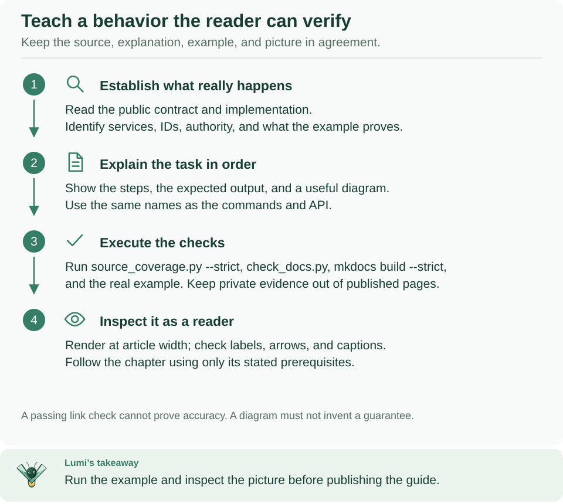

<!--
Copyright 2026 Firefly Software Foundation.

Licensed under the Apache License, Version 2.0 (the "License");
you may not use this file except in compliance with the License.
You may obtain a copy of the License at

    http://www.apache.org/licenses/LICENSE-2.0

Unless required by applicable law or agreed to in writing, software
distributed under the License is distributed on an "AS IS" BASIS,
WITHOUT WARRANTIES OR CONDITIONS OF ANY KIND, either express or implied.
See the License for the specific language governing permissions and
limitations under the License.
Author: Firefly Software Foundation
SPDX-License-Identifier: Apache-2.0
-->

# Contributing

Firefly Weave is an alpha Python project built on PyFly, with an Angular Studio
in `studio/` and a Tauri desktop shell in `desktop/`. Read the
[documentation index](docs/README.md), [architecture](docs/architecture.md), and
[source documentation and attribution policy](docs/contributing/source-documentation.md)
before changing public contracts or runtime behavior.

Use Python 3.12+ and the locked dependencies. The [Makefile](Makefile) is the
source of truth for current checks. From the repository root:

```sh
# Install locked tooling and rebuild Weave from this checkout.
uv sync --locked --no-editable --reinstall-package firefly-weave --all-extras --group dev --group docs
# Run the complete local gate against the current installed package.
make check
```

The check targets reinstall Weave so a cached wheel cannot hide source edits,
and they keep dependencies locked. `make check` runs, in order: strict source
inventory and header checks, documentation link and SVG checks, a strict MkDocs
site build, Ruff lint and format checks, strict mypy, unit and contract tests,
and release package preparation with installed-artifact verification.

Expected: the last line is `All requested checks passed.` A failing stage stops
the run, which then prints `Checks failed; inspect private evidence.`; each
stage's log and a `checks.json` summary are in a new `build/checks-…` directory.
For a focused change, first run
its relevant suite; the integrated delivery must still pass the full gate. Do not
update lock or upstream framework provenance casually to resolve an unrelated
failure.

**Studio and desktop changes need their own checks.** Python-only contributors do
not need Node.js. Use Node 24 LTS; CI pins 24.15.0. Check `node --version`
before installing dependencies so local builds and browser tests use the same
major version as CI. If you change `studio/`, run the same steps as the Studio CI
job. Many unit and browser tests run Weave's Python code, including the real
Studio host, from the repository's `.venv`, so run the `uv sync` command above
first.

```sh
# Install the locked Studio dependencies.
cd studio && npm ci
# Type-check, check formatting, run unit tests, and build the production bundle.
npm run check && npm run format:check && npm test && npm run build
# Install the Chromium build Playwright uses, then run the browser tests.
# On Linux, add --with-deps to also install the system libraries Chromium needs.
npx playwright install chromium && npm run test:browser
```

Expected: each command exits without errors. `make studio-check` runs `npm ci`,
the type check, unit tests, and browser tests in one step; it skips the format
check and the production build, and it does not install Chromium. For the
desktop shell, follow [build from source](docs/guides/desktop.md#build-from-source).

## A first documentation change



**How to read this diagram:** Follow the four numbered steps from top to bottom
for every documentation change. A green link check is only step 3; whether the
commands work and the page reads clearly needs steps 1 and 4.

[Open diagram at full size](docs/diagrams/documentation-contribution.svg)

Choose the guide for the user's task and read its linked source/example before
editing. Explain the prerequisite IDs, ordered steps, expected result, and where
to inspect a failure. Keep lookup tables in reference pages and link to a runnable
guide rather than repeat its entire deployment procedure.

Follow the writing conventions in
[build and maintain the documentation website](docs/contributing/documentation-site.md),
which also shows how to preview the site. From the repository root, run:

```sh
# Check links, heading anchors, reachable pages, and diagram structure.
python3 scripts/check_docs.py
# Check license headers and the source inventory.
python3 scripts/source_coverage.py --strict
# Build the website; any warning fails the build.
make docs
```

Expected: the first command prints a JSON report with an empty `errors` list, the
second ends with `0 issues`, and the build ends with `Documentation built in …`.
A successful check does not execute a documented command. Run new offline examples
with the matching project environment and inspect rendered Markdown separately.
Provider setup examples must distinguish locally checked contracts from live
account or delivery verification. Preserve historical changelog facts and existing
Apache/Foundation headers.

## Backend and end-to-end checks

`make check-integration` and `make check-e2e` require explicitly configured owned
PostgreSQL, identity, broker and/or container resources appropriate to their tests.
For example, the integration suite fails at once unless `WEAVE_TEST_DATABASE_URL`
points to a test database you own. `make check-release` includes all gates, runs
only on an owned release environment with its Docker context and secrets set,
and must fail when a required dependency is absent. Inspect fixture
prerequisites and use distinct resources/evidence paths; do not run against
production or reset retained services to make tests pass.

[Local runtime setup](docs/reference/local-runtime.md) explains provisioning.
End-to-end fixtures exercise installed wheels, admitted images, identities and
external-effect receivers; they are acceptance tooling rather than the introductory
compiler quickstart. Do not copy another checkout's private env files or immutable
image IDs. Keep failures and corrected reruns distinguishable.

## Acceptance journeys

Acceptance journeys prove the product against real services: a Docker platform
from `weave platform up`, its real Keycloak, the Acme API fixture and the real
Studio host. [The acceptance guide](tests/acceptance/README.md) explains the
stages, the evidence, and how to enable a journey step when the capability it needs lands.

## Review and hygiene

Preserve canonical wire names, diagnostic codes, revision/idempotency semantics,
scoped authority and pure-import boundaries. Add focused regression tests for
changed behavior and document public contracts and non-obvious invariants.
Every new first-party source file follows the existing Apache/Author/SPDX policy;
strict JSON and immutable fixtures use the exact licensing inventory mechanism.

Keep credentials, `.env` files, `.superpowers`, `.secrets`, `.local`, dependency
directories, local databases, logs and disposable builds/renders out of publication.
Review actual package and public-tree inventories rather than relying only on
ignore rules. Requested editable SVG diagrams are source deliverables. Follow the
[visual assets guide](docs/visual-assets.md); preserve the approved logo/banner identity.

Report security concerns through the [security policy](SECURITY.md), not an issue
containing credentials or exploit details. Contribution does not imply a response
SLA, stable API guarantee or production support commitment.
