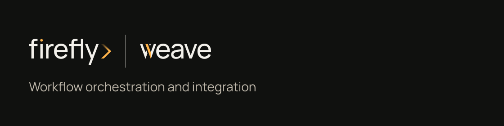
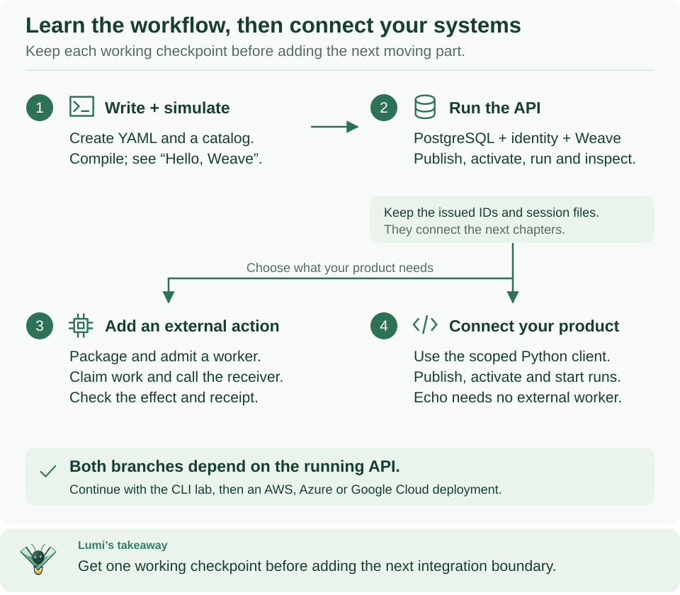

<!--
Copyright 2026 Firefly Software Foundation.

Licensed under the Apache License, Version 2.0 (the "License");
you may not use this file except in compliance with the License.
You may obtain a copy of the License at

    http://www.apache.org/licenses/LICENSE-2.0

Unless required by applicable law or agreed to in writing, software
distributed under the License is distributed on an "AS IS" BASIS,
WITHOUT WARRANTIES OR CONDITIONS OF ANY KIND, either express or implied.
See the License for the specific language governing permissions and
limitations under the License.
Author: Firefly Software Foundation
SPDX-License-Identifier: Apache-2.0
-->



# Firefly Weave

**Define a business process, connect its steps to other systems and to people, and follow every case.**

[](https://github.com/fireflyframework/firefly-weave/releases)
[](https://github.com/fireflyframework/firefly-weave/actions/workflows/ci.yml)
[](https://github.com/fireflyframework/firefly-weave/actions/workflows/docs.yml)
[](pyproject.toml)
[](https://github.com/fireflyframework/fireflyframework-pyfly)
[](LICENSE)
[](docs/capabilities.md)

[Read the documentation](https://fireflyframework.github.io/firefly-weave/) ·
[Start the platform](https://fireflyframework.github.io/firefly-weave/guides/platform-overview/) ·
[CLI reference](https://fireflyframework.github.io/firefly-weave/reference/cli/) ·
[Meet Lumi](#meet-lumi)

Weave is a durable workflow orchestration and integration platform with human
tasks, built on [PyFly](https://github.com/fireflyframework/fireflyframework-pyfly).
You describe a business process once, as a **workflow**: draw it in Studio, or
write it in YAML, JSON, or the Python SDK. Weave checks the definition, runs each
case of it, stores its progress in PostgreSQL, and keeps the history of every
step.

For example, your product accepts an order. Weave asks another system to check
the customer, waits for a manager's approval, and sends a notification. It
remembers where each order is, even when an approval takes days or the server
restarts. Your product starts the process and reads its status through an API.

**Coming from a BPM suite?** Weave covers the core of business process
management, but it is not a BPMN engine. [Coming from BPM/BPMN](docs/concepts.md#coming-from-bpmbpmn)
maps service tasks, user tasks, gateways, and timers to Weave steps.

## What you get

The **v0.1.0a14 alpha** release provides the **API, CLI, Python SDK, and Studio**
visual workspace, with human-task inboxes, email conversations, execution
management, and administration of people and access. Run Weave as a standalone
service or embed it in another product.

**New in 0.1.0a11:** configure AI provider connections, Lumi, and workflow AI
profiles through guided setup with review before saving. Explicitly select
earlier AI results as [shared context within one execution](docs/guides/shared-ai-context.md).
See the illustrated [AI workflow guide](docs/guides/ai-workers.md) and
[Lumi guide](docs/guides/lumi.md).

**Included capabilities:**

- **Files across workflows.** Upload through the API, CLI, Python SDK or Studio,
  pass verified references between steps, and attach documents to human tasks.
  File workers connect FTP/FTPS/SFTP, SharePoint/OneDrive and Google Drive.
- **Decision rules and AI tasks.** Versioned decision tables and workflow model
  profiles use the same compiler and durable task protocol. An independent
  Firefly Agentic worker executes the configured provider, model and pattern.
- **Lumi in Studio.** Ask for help with a workflow, run or simulation; choose
  what context to share, review proposed source and explicitly apply it to a
  local draft. Lumi uses its own model configuration.
- **A clearer editor.** Decision and parallel lanes, immediate valid edits with
  Undo, guided human tasks, and action version selection keep changes visible.

Read the [capability matrix](docs/capabilities.md) for tested boundaries and
live-provider checks that remain environment-specific.

Studio runs in your browser from the [installed CLI](docs/guides/studio.md#install-the-alpha14-browser-application)
or as a [desktop app](docs/guides/desktop.md). The macOS desktop bundles
are ad-hoc signed, not Developer ID signed or notarized, so macOS may ask you to
approve them; do not use the alpha5 macOS installers, which were damaged. The
browser installation is the fallback on every system.



Start at step 1 and keep each working checkpoint before you add the next part.
After the platform runs (step 2) and you have signed in once, choose step 3 to
call another system, without code or with your own connector or worker, or step 4
to connect your product. **Your team already runs a platform?** Skip step 2 and
connect with `weave auth setup` and its server address.

[Open diagram at full size](docs/diagrams/tutorial-route.svg)

## Choose your starting point

You do not need a platform to try the workflow language. Choose the row that
matches what you want to do today:

| I want to… | Start here | What I will have at the end |
| --- | --- | --- |
| **Try a workflow on my laptop** | [Install the CLI](docs/installation.md), then [write your first workflow](docs/quickstart.md) | A validated workflow and a successful local simulation; no server or Docker |
| **Draw a process and work on approvals** | [Studio](docs/guides/studio.md), then [human tasks](docs/guides/human-tasks.md) | A visual workflow and, once connected, assigned tasks and recorded decisions |
| **Use my team's Weave platform** | [Install the CLI](docs/installation.md), then [connect the CLI](docs/guides/connect-to-api.md) or [Studio](docs/guides/studio.md#connect-to-a-platform) with its server address | A saved platform, your own sign-in, and a workspace that the CLI and Studio share |
| **Run the platform myself** | [Start a local platform](docs/guides/local-platform.md) | PostgreSQL, a local identity provider, a running API, and a saved run |
| **Call a REST API from a workflow** | [Call a REST API without code](docs/connectors/http-without-code.md) | A published Action on the built-in HTTP connector, run from a workflow |
| **Give people access** | [People and access](docs/guides/people-and-access.md) | People linked to their sign-in accounts, with scoped Weave roles |

Installing the CLI gives you a client. Running a platform adds the services that
store and execute workflows. A worker adds a process that runs your own
integration code. Each has its own guide, so you can stop at the result you need.
[Start here](docs/guides/learning-path.md) gives an ordered path for each role.

## Install and discover the CLI

On macOS, Linux, or WSL, install **Python 3.12 or newer** with `venv` support,
then run this block in Bash or Zsh. It installs the pinned **v0.1.0a14 alpha**
into your user account without `sudo`, Git, or Docker:

```sh
(
  # Stop if downloading the installer fails.
  set -o pipefail
  curl --proto '=https' --tlsv1.2 -fsSL \
    https://github.com/fireflyframework/firefly-weave/releases/download/v0.1.0a14/install.sh \
    | sh -s -- --version v0.1.0a14
)
```

Expected: `Installed Firefly Weave 0.1.0a14:` followed by the command's path. Then
make the default command directory available in this terminal and look around:

```sh
# Make the installed command available in this terminal.
export PATH="$HOME/.local/bin:$PATH"
# Show the version and the command overview.
weave --version
weave
# Read the help of one command family, and find the platform guide.
weave help workflow
weave docs platform
```

Expected: `Firefly Weave 0.1.0a14`, the command overview, the `workflow`
commands, and the address of the platform guide. You do not need to learn every
command first: help explains each family and its next steps. The
[installation guide](docs/installation.md) covers choosing Python, a permanent
`PATH`, upgrades, removal, and troubleshooting. The installation includes the API
client, OpenAPI import, and the Studio host; it starts no platform and does not
download Studio's browser application.

### Create a working example

Choose a new directory and run:

```sh
# Create an offline starter project, then simulate its workflow.
weave init hello-weave
cd hello-weave
weave workflow simulate simulation.json --output json
```

Expected: `status: "succeeded"` and the output `{"message": "Hello from Firefly
Weave!"}`. The generated `README.md` explains each file and how to validate,
compile, and simulate again after you edit. `weave init` never overwrites
existing files and starts no services. The
[first-workflow tutorial](docs/quickstart.md) explains a definition line by line.

### Start your own local platform

You also need `uv`, a running local Docker engine with Compose 2.30 or newer, and
a source checkout that matches your CLI, because it holds the platform's
Compose files and setup helpers. Clone the tag that matches the CLI:

```sh
# Keep the platform files at the same version as the CLI.
git clone --branch v0.1.0a14 --single-branch https://github.com/fireflyframework/firefly-weave.git
cd firefly-weave

# Check prerequisites, then start a persistent Docker platform and a sign-in account.
weave platform doctor
weave platform up --username developer

# Confirm readiness and copy the printed sign-in command.
weave platform status
```

Expected: the API and Keycloak are ready, the example workflow succeeded, and
`up` prints a generated password once. Docker keeps the API running after you
close the terminal. Follow the printed `weave auth setup` command, sign in with
your new account, then run `weave studio`.

The [Docker development guide](docs/guides/docker-development.md) explains each
step, the architecture, stopping and resuming, and administrator roles. Existing
foreground installations continue to use `weave platform start`; see the
[individual setup steps](docs/guides/local-platform.md). For a shared
installation, start with [the deployment map](docs/operations/remote-deployment.md).

## Continue when you need more

- **Call another system:** [call a REST API without code](docs/connectors/http-without-code.md),
  [build a custom integration](docs/guides/custom-connectors-tutorial.md), or
  [run an integration worker](docs/operations/deployment.md) for your own code.
- **Add workflows to your product:** follow the [host integration guide](docs/guides/host-integration.md).
- **Deploy beyond your laptop:** follow [cloud deployment](docs/operations/cloud-deployment.md),
  then the setup for [AWS](docs/operations/aws.md), [Azure](docs/operations/azure.md),
  or [Google Cloud](docs/operations/gcp.md), and the shared [Kubernetes walkthrough](docs/operations/kubernetes.md).
- **Find a specific task or diagram:** open the [documentation home](docs/README.md)
  or the [visual guide](docs/visual-guide.md).

## What can I build with it?

- **Business processes:** versioned workflows with typed inputs and outputs,
  decisions, parallel branches, timers, signals, schedules, and human approvals.
- **Integrations:** REST calls without code on the built-in HTTP connector,
  webhooks, PostgreSQL, Kafka, and packaged connectors. The
  [OpenAPI importer](docs/connectors/metadata-import.md) turns supported
  operations into Actions or connector packages that you review and publish.
- **Messaging and email workflows:** Teams personal-bot text, WhatsApp Cloud API
  text, templates, and statuses, Telegram webhook text, and email conversations.
- **Product features:** manage definitions and runs from your own product
  through Weave's API or Python SDK.
- **Operations:** inspect run history, simulate with mocks, resolve incidents,
  and manage workers, identity, retention, backup, and restore.

The [capability matrix](docs/capabilities.md) gives the precise scope. Salesforce,
SAP, and Oracle have no bundled named adapters; you can call their supported HTTP
interfaces through reviewed HTTP Actions or connector packages.

## How the pieces fit together


Read the top row first: your product or tool sends requests, the offline compiler
checks workflows, and the identity provider issues the tokens the API verifies.
Everything then passes through the Weave API, which stores state in PostgreSQL
and reaches external systems through connectors or remote workers.

[Open diagram at full size](docs/diagrams/system-context.svg)

Your application sends requests to the **Weave API**. Your **identity provider**
signs people and applications in; Weave verifies their tokens and uses its own
grants to decide what each caller may do. **PostgreSQL** keeps workflow versions,
runs, and task state. Built-in connectors run inside the platform's executor;
your own integration code runs in **workers**, separate processes that ask Weave
for a task, perform it, and report the result without database credentials.

Use your organization's compatible OIDC or CIAM provider by configuring its
issuer, signing keys, audience, and access-token claims. **Keycloak is included
for local development; it is not a production requirement.** Your platform can
publish its non-secret sign-in settings, so people connect the CLI, Studio, or the
desktop app by typing only the server address; their tokens stay in each
computer's credential store. Follow
[identity provider setup](docs/operations/identity-and-secrets.md#use-your-own-identity-provider)
for configuration, published sign-in settings, identity linking, and scoped roles.

Native PyFly controllers and services implement the API. See
[architecture](docs/architecture.md) for the components, a narrated execution
path, and the detailed diagrams.

## Current release and limits

The recommended installation is **v0.1.0a14**, an **alpha** release. Download
packages and checksums from
[GitHub Releases](https://github.com/fireflyframework/firefly-weave/releases).
The documentation on a branch describes the source on that branch; a release tag
preserves the documentation and code of that release.

External work is delivered at least once. If a worker crashes after another
system accepted a request, that effect may already have happened. Use that
system's idempotency support or an explicit reconciliation process; the
[worker guide](docs/guides/workers.md) explains this with an example.

Messaging integrations have local protocol and backend verification; live account
setup and delivery still need validation in your environment. Sign-in from the
CLI, and from Studio in an opt-in browser test, has been verified end to end only
against the local platform's Keycloak 26.7.4, and sign-in with a code from a
locally built macOS desktop app against the same platform; browser sign-in from
the desktop app and the DMG have not been verified. Credential storage on
Windows and Linux is not verified.

Azure preproduction checks on alpha10 verified Microsoft Entra ID application
tokens for a host application and an independent Agentic worker. An Azure OpenAI
workflow completed through that worker with consistent replay, and Lumi returned
a response through its separate gateway. An HTTP workflow also completed after
the alpha10 deployment, and five existing run states were unchanged. These checks
do not verify Entra browser or device-code sign-in for people, other identity providers, or general
provider availability. See the [capability matrix](docs/capabilities.md) for the
verified scope.

## Meet Lumi


**Lumi is Weave's firefly guide.** Translucent mint wings, a forest-green
body, and a warm amber lantern bring Weave's colors to life. The lantern
represents a clear next step through a complex process.

You will find Lumi throughout the documentation and in Studio. Open the
**Ask Lumi** panel for assistance, and [configure its model](docs/guides/lumi.md)
separately from workflow AI tasks. In diagrams,
**Lumi's takeaway** highlights the main idea to remember before moving on.
Start with the [visual guide](docs/visual-guide.md) to explore the platform together.

## Contribute and learn more

- [Documentation](docs/README.md) and [architecture](docs/architecture.md).
- [Contributing](CONTRIBUTING.md), [source attribution](docs/contributing/source-documentation.md),
  and [visual assets](docs/visual-assets.md).
- [Security reporting](SECURITY.md) and [changelog](CHANGELOG.md).

Firefly Weave is part of the [Firefly Framework](https://github.com/fireflyframework)
ecosystem and is licensed under [Apache License 2.0](LICENSE).
See [NOTICE](NOTICE) for attribution and dependency boundaries.
