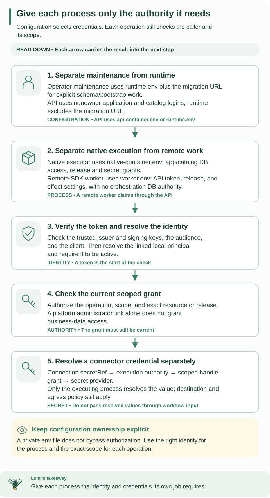

<!--
Copyright 2026 Firefly Software Foundation.

Licensed under the Apache License, Version 2.0 (the "License");
you may not use this file except in compliance with the License.
You may obtain a copy of the License at

    http://www.apache.org/licenses/LICENSE-2.0

Unless required by applicable law or agreed to in writing, software
distributed under the License is distributed on an "AS IS" BASIS,
WITHOUT WARRANTIES OR CONDITIONS OF ANY KIND, either express or implied.
See the License for the specific language governing permissions and
limitations under the License.
Author: Firefly Software Foundation
SPDX-License-Identifier: Apache-2.0
-->

# Kubernetes deployment templates

Follow the [Kubernetes deployment recipe](../../docs/operations/kubernetes.md)
to render these templates, supply protected configuration, migrate explicitly,
and verify an authorized workflow. Begin with the [cloud overview](../../docs/operations/cloud-deployment.md)
for AWS EKS, Azure AKS and Google GKE prerequisites.

Read the matrix before assigning a Secret: the migration Job receives owner
authority, the API receives application/catalog authority, and the remote worker
receives only its six API/identity/effect settings.

[Open diagram at full size](../../docs/diagrams/operations-authority.svg)

| Template | What it creates | Required replacement / configuration |
| --- | --- | --- |
| [migrate.yaml](migrate.yaml) | One explicit, nonretrying migration Job | `__WEAVE_SERVER_IMAGE__`, unique `__WEAVE_MIGRATION_JOB__`, `weave-migration` Secret |
| [api.yaml](api.yaml) | One API Deployment and ClusterIP Service | `__WEAVE_SERVER_IMAGE__`, `weave-api-runtime` Secret |
| [worker.yaml](worker.yaml) | Optional remote worker Deployment with zero replicas | `__WEAVE_WORKER_IMAGE__`, admitted release/current grants and `weave-worker-runtime` Secret |

The image placeholders require actual registry digest references. Do not apply
the unrendered directory. Apply the migration, API and optional worker separately
in the documented order; do not bulk-apply all three files as a startup script.
The worker stays at zero replicas until explicitly scaled after admission checks.

All containers run as UID/GID 65532 with a read-only root filesystem, bounded
writable `/tmp`, dropped capabilities and no mounted Kubernetes API token.
Resource values are examples to measure and tune. The templates do not create
cloud infrastructure, database roles, provider identities, ingress, cloud IAM,
secret synchronization, network policies or registry pull credentials. Successful
managed-database migration rehearsal is a prerequisite, not an assumption.

No deployment or live cluster validation is implied by these files. Use the
guide's server dry run and acceptance checks in your selected environment.
