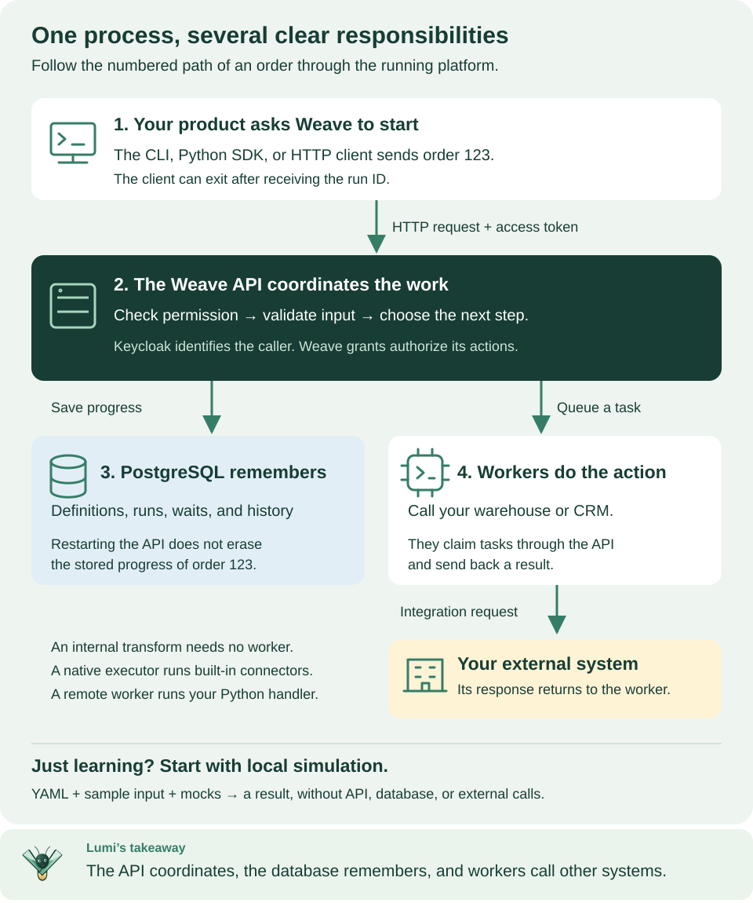

<!--
Copyright 2026 Firefly Software Foundation.

Licensed under the Apache License, Version 2.0 (the "License");
you may not use this file except in compliance with the License.
You may obtain a copy of the License at

    http://www.apache.org/licenses/LICENSE-2.0

Unless required by applicable law or agreed to in writing, software
distributed under the License is distributed on an "AS IS" BASIS,
WITHOUT WARRANTIES OR CONDITIONS OF ANY KIND, either express or implied.
See the License for the specific language governing permissions and
limitations under the License.
Author: Firefly Software Foundation
SPDX-License-Identifier: Apache-2.0
-->

# Learn and use Firefly Weave

{ .lumi-guide }

Meet **Lumi**, your guide through Firefly Weave. Start small: create a workflow,
see how it runs, then connect it to your systems and your people.
[Meet the mascot](visual-assets.md#meet-lumi).

Firefly Weave is a durable workflow orchestration and integration platform with
human tasks. You describe a business process once, as a **workflow**. Weave runs
each case of it, waits for people and events, calls your systems, and keeps the
history of every step. You can draw workflows in Studio, write them as YAML, or
manage them from the CLI, the Python SDK, or your own product.

**New to Weave? Read [Start here](guides/learning-path.md).** It explains the
four pieces of the platform and gives you an ordered path for your role.
**Coming from a BPM suite?** [Coming from BPM/BPMN](concepts.md#coming-from-bpmbpmn)
translates BPMN tasks, gateways, and events into Weave steps.

## Choose your path

Each path is an ordered list of guides; [Start here](guides/learning-path.md#2-choose-the-path-for-your-role)
gives the steps and what you finish with.

| You are… | You want to… | Start with | Then |
| --- | --- | --- | --- |
| A process designer or business analyst | Draw processes, add approvals and API calls, and run them | [Concepts](concepts.md) and [your first workflow](quickstart.md) | [Studio](guides/studio.md), a [local platform](guides/local-platform.md) or your team's, the [step reference](guides/studio-step-reference.md), [human tasks](guides/human-tasks.md), and [REST calls from a step](guides/studio.md#call-a-rest-api-from-a-step) |
| An integration developer | Call APIs and systems, and build connectors and workers | [Connect the CLI to a platform](guides/connect-to-api.md) | [Workflow authoring](guides/workflow-authoring.md), [publish and run with the CLI](guides/cli-tutorial.md), [REST calls without code](connectors/http-without-code.md), the [SDK](guides/sdk-tutorial.md), [a custom integration](guides/custom-connectors-tutorial.md), and [workers](guides/workers.md) |
| An administrator | Install the platform, configure sign-in, and give people access | [Start a local platform](guides/local-platform.md) | [Identity and secrets](operations/identity-and-secrets.md), [remote deployment](operations/remote-deployment.md), [people and access](guides/people-and-access.md), and [configuration](operations/configuration.md) |
| An operator | Keep runs healthy, fix incidents, upgrade, and back up | [Connect the CLI](guides/connect-to-api.md), then [manage runs](guides/execution-management.md) | [Incidents](reference/incident-operations.md), [troubleshooting](operations/troubleshooting.md), [observability](operations/observability.md), [upgrades](operations/upgrades.md), [backup](operations/backup-restore.md), and [debug-session retention](operations/retention.md) |

Start each path by [installing the CLI](installation.md) from the v0.1.0a13
release.

[Who does what](guides/roles-and-lifecycle.md) explains these roles with an
order-approval example, and which Weave permissions each one needs.

## Files, decisions, and AI

- [Work with files](guides/files.md): upload documents, pass references through workflows, and transfer content from workers.
- [Decision tables](reference/decision-tables.md): put reusable business rules behind a versioned decision step.
- [Run AI steps](guides/ai-workers.md): configure workflow model profiles and operate an Agentic worker.
- [Configure Lumi](guides/lumi.md): give Studio its own assistant configuration, separately from workflow AI.

## Choose your next task

| Your goal | Start here | You will finish with… |
| --- | --- | --- |
| Try a workflow without running any service | [Install the CLI](installation.md) → [first workflow](quickstart.md) | A successful local simulation |
| Draw and edit a workflow | [Studio](guides/studio.md) | A visual editor that works locally and publishes to a connected platform |
| Start your own platform | [Start a local platform](guides/local-platform.md) | An API, database, identity service, a saved run, and a person who can sign in |
| Connect to a platform your team runs | [Connect the CLI](guides/connect-to-api.md) or [connect Studio](guides/studio.md#connect-to-a-platform) | A saved platform with your sign-in and chosen workspace |
| Configure each kind of step | [Studio step reference](guides/studio-step-reference.md) | The right properties, expressions, and bindings for each step |
| Ask a person for a decision | [Human tasks](guides/human-tasks.md) | An assigned, durable approval task |
| Call a REST API from a step | [Call a REST API without code](connectors/http-without-code.md) | An Action on the built-in HTTP connector, run from a workflow |
| Build your own integration | [Build a custom integration](guides/custom-connectors-tutorial.md) | A custom action or an incoming webhook workflow |
| Implement and run a task handler | [Worker walkthrough](guides/workers.md) → [worker deployment](operations/deployment.md) | An admitted handler that claims and completes work |
| Add Weave to a Python product | [Python SDK tutorial](guides/sdk-tutorial.md) | A workflow published and run from Python |
| Try API requests in a browser | [API playground](guides/api-playground.md) | Swagger connected to your platform |
| Process an email conversation | [Email](connectors/email.md) | Incoming messages and replies linked to a thread |
| Use your organization's identity provider | [Identity provider setup](operations/identity-and-secrets.md#use-your-own-identity-provider) | Verified tokens, published sign-in settings, identity links, and scoped grants |
| Give people access | [People and access](guides/people-and-access.md) | People linked to their accounts, with scoped Weave roles |
| Deploy on your own infrastructure | [Remote deployment](operations/remote-deployment.md) | An ordered path through AWS, Azure, or Google Cloud |

## The first three things to understand

1. **Installing the CLI gives you a client.** It can write, validate, compile,
   and simulate workflows without any service, open Studio, and call a running
   platform.
2. **Starting a platform gives you durable runs.** The API keeps workflows and
   runs in PostgreSQL and accepts people who sign in through your identity
   provider, as long as Weave grants them access.
3. **Integrations connect external systems.** The built-in HTTP connector calls
   JSON APIs with no code; your own workers run custom integration code. A
   Transform step needs neither.

Follow the numbered boxes from a client's request through the API and the
database to the integration code that calls your systems.
[Open diagram at full size](diagrams/platform-in-plain-english.svg)

## Read a tutorial one step at a time

Run one command block, check its **Expected** result, then continue. Comments
inside code blocks explain why each command is there. When a terminal shows
server logs, keep it open and use a second terminal for client commands.

The guides pin the **v0.1.0a13 alpha** release, a preview, which includes every
feature they describe, such as saved platforms, REST calls without code, and the
Studio editor. When a guide shows how to work with an alpha6 or earlier client
or server, it says so.
[Capabilities and limits](capabilities.md) separates what is implemented, what
was checked locally, and what you must still verify with your own providers.

## Find an exact interface

| Interface | Reference |
| --- | --- |
| Every API operation, request, response, and schema | [Full API reference](reference/api-explorer.md) |
| Authentication, errors, revisions, and idempotency | [API behavior](reference/api.md) |
| CLI commands and file formats | [CLI reference](reference/cli.md) |
| Python clients and builders | [SDK reference](reference/sdk.md) |
| Workflow language and expressions | [Definition contracts](contracts.md) and [compiler](reference/compiler.md) |
| Worker execution | [Worker protocol](reference/worker-protocol.md) |
| Server and client settings | [Configuration](operations/configuration.md) |

The **API and SDKs** tab holds the browser playground, the Python tutorial, every
HTTP operation and schema, and the SDK reference. You can browse the public
reference without installing anything; Swagger on your running platform lets you
send authorized requests to it.

## Go deeper after the first successful run

- [Concepts](concepts.md): the vocabulary, a BPM translation table, and a glossary.
- [Architecture](architecture.md): follow one run and see which module owns each responsibility.
- [Visual guide](visual-guide.md): find the diagram for the question you are answering.
- [CLI lifecycle tutorial](guides/cli-tutorial.md): author, publish, activate, run, and inspect.
- [Connector authoring](connectors/authoring.md): package and extend an integration.
- [Troubleshooting](operations/troubleshooting.md): work from a symptom to the right check.
- [Deploy a worker locally](operations/deployment.md): workers and container execution in detail.
- [Contribute](../CONTRIBUTING.md), [security](../SECURITY.md), [changelog](../CHANGELOG.md), and [website maintenance](contributing/documentation-site.md).
