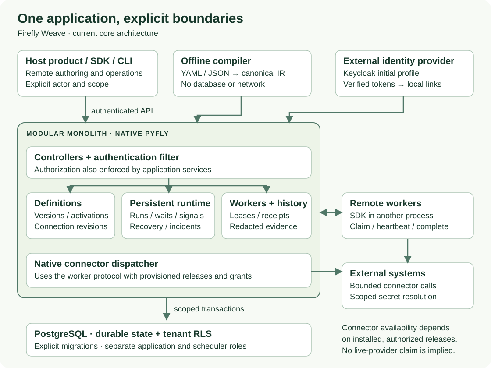
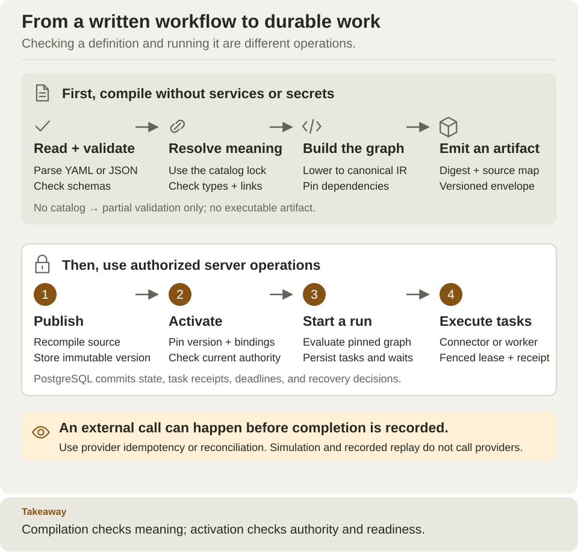
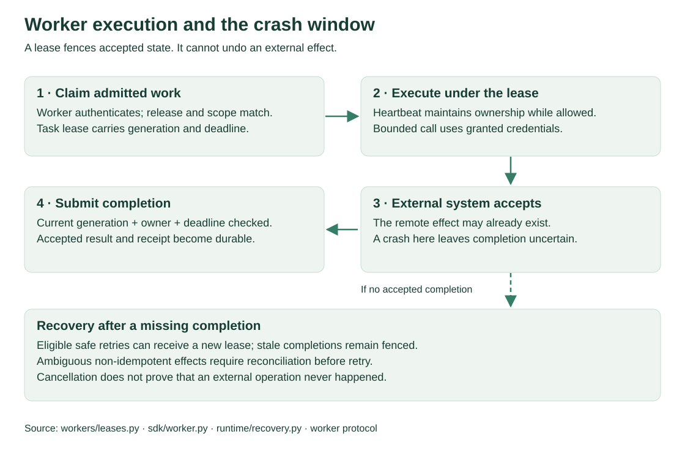
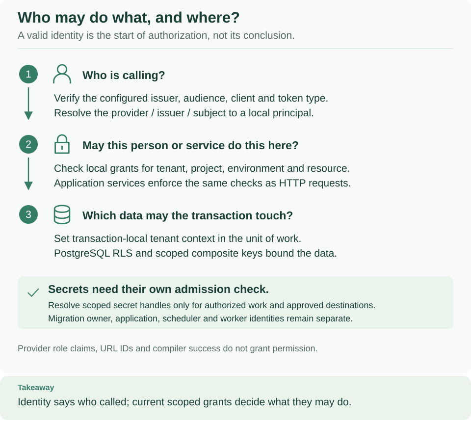
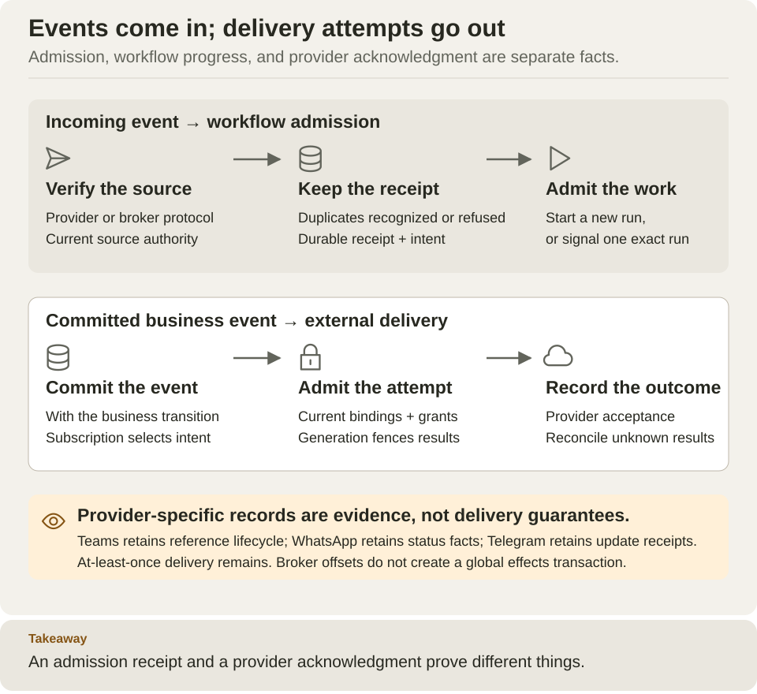
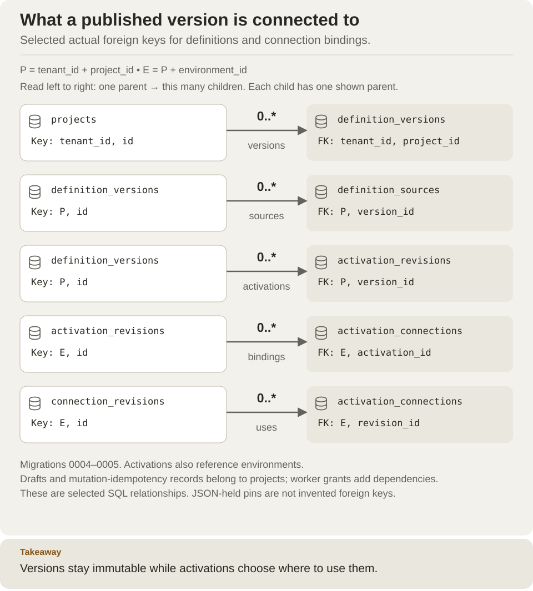
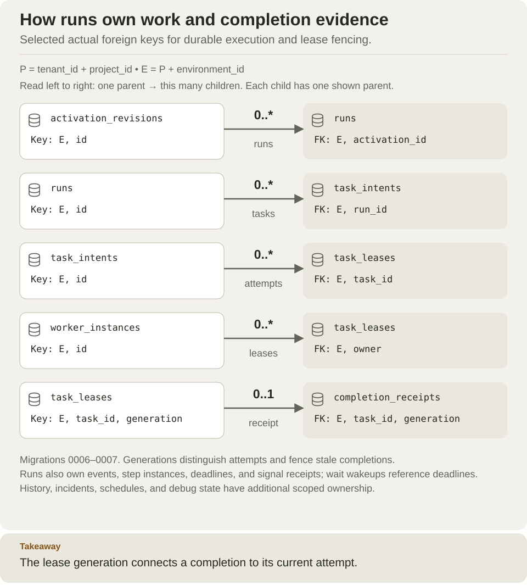
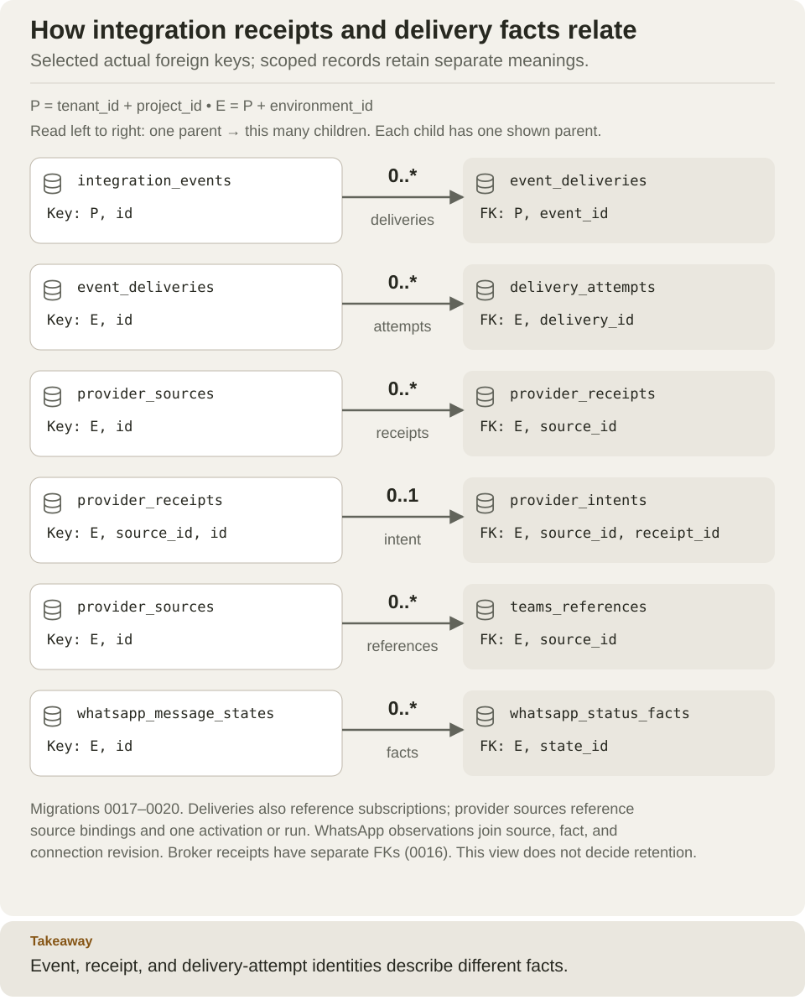

<!--
Copyright 2026 Firefly Software Foundation.

Licensed under the Apache License, Version 2.0 (the "License");
you may not use this file except in compliance with the License.
You may obtain a copy of the License at

    http://www.apache.org/licenses/LICENSE-2.0

Unless required by applicable law or agreed to in writing, software
distributed under the License is distributed on an "AS IS" BASIS,
WITHOUT WARRANTIES OR CONDITIONS OF ANY KIND, either express or implied.
See the License for the specific language governing permissions and
limitations under the License.
Author: Firefly Software Foundation
SPDX-License-Identifier: Apache-2.0
-->

# Architecture

Firefly Weave is a modular monolith built with native PyFly dependency injection,
controllers and request filters. Its pure compiler can be used independently.
Hosts can integrate through the typed SDK and authenticated API, or embed services
with explicit actor, scope, audit and transaction context.

## System and component boundaries

The [composition root](../src/firefly_weave/app.py) registers controllers and
constructor-injected services; the [ASGI factory](../src/firefly_weave/main.py)
loads settings explicitly. Importing the compiler does not initialize that graph.
The [authentication filter](../src/firefly_weave/access/authentication.py) verifies
configured providers and resolves explicit local identity links. Services enforce
scoped authorization even when invoked without HTTP. Keycloak is the initial
identity profile; provider-neutral verifier/resolver interfaces do not by
themselves establish live compatibility with another provider.

The [unit of work](../src/firefly_weave/persistence/uow.py) binds tenant context
inside a PostgreSQL transaction. Repositories use that transaction; business data
is protected by tenant RLS. Startup checks database roles and schema state;
[migrations](../src/firefly_weave/persistence/migrations.py) are an explicit
operator action. Identity/platform authorization state is distinct from tenant
business data.

The [native dispatcher](../src/firefly_weave/connectors/dispatcher.py) uses the
[worker SDK](../src/firefly_weave/sdk/worker.py), provisioned releases and local
grants. Remote workers live in other processes but use the same lease/completion
contract. [Connector execution](../src/firefly_weave/connectors/execution.py)
resolves scoped credentials only after admission. This is a security boundary,
not permission to let a definition select arbitrary network destinations.

## Compile, publish, activate, execute

The [compiler API](../src/firefly_weave/compiler/api.py) bounds parsing, validates
schemas, analyzes expressions and dependencies against an immutable catalog,
and lowers to versioned IR. Canonical executable bytes determine the digest;
source maps and diagnostics preserve authoring context. Without a catalog,
validation is partial and returns no executable artifact.

The [definition service](../src/firefly_weave/definitions/service.py) owns immutable
publication and scoped activation. Complete compilation proves static validity;
activation separately checks the authority and resources needed for execution.
A run pins its activation/artifact instead of silently adopting later revisions.

The [runtime kernel](../src/firefly_weave/runtime/kernel.py) computes deterministic
transitions. The [runtime service](../src/firefly_weave/runtime/service.py) and
repositories persist those transitions, task intent and evidence. Worker
[leases](../src/firefly_weave/workers/leases.py) fence accepted completions;
[recovery](../src/firefly_weave/runtime/recovery.py), waits, deadlines and signals
advance durable state under explicit ownership.

A lease fence does not roll back a provider's side effect. A worker can complete an
external call and fail before its receipt is accepted; retries therefore need
provider idempotency or reconciliation where supported. Cancellation can also
leave an external effect in flight. Simulation is mock-based, and recorded replay
checks available evidence without executing providers.

## Worker and security boundaries

The [task service](../src/firefly_weave/workers/leases.py) owns lease and completion
fences; the [worker SDK](../src/firefly_weave/sdk/worker.py) preserves the public
contract. The [recovery service](../src/firefly_weave/runtime/recovery.py) advances
due durable work. Recovery batch limits count selected runs and bounded due
timeout/elapsed decisions, not a universal maximum of mutated database rows.

Read [identity and secrets](operations/identity-and-secrets.md) for provider-neutral
ports, Keycloak setup and the limit of Entra claim-profile support. Public worker
credentials and URL scope alone never grant standing provider-reference authority.

## Connector ingress and outbound events

[Provider ingress](../src/firefly_weave/providers/service.py) records source-local
facts and intent; [dispatch](../src/firefly_weave/providers/dispatcher.py) performs
authorized workflow admission. [Outbox delivery](../src/firefly_weave/operations/outbox.py)
and [delivery attempts](../src/firefly_weave/operations/event_delivery.py) have their
own transaction/lease/acknowledgment boundaries. Kafka offsets are not global
transactions with every downstream external effect. See [provider sources](reference/provider-sources.md),
[integration events](reference/integration-events.md) and [Kafka](connectors/kafka.md).

Teams, WhatsApp and Telegram are integrated and locally accepted. Their durable
reference/status/receipt semantics do not certify live installation or delivery.
The [offline OpenAPI importer](connectors/metadata-import.md) generates Connector,
Action, and package candidates for review. Publication and activation apply the
same catalog and authority checks as hand-authored definitions. Approved
[HTTP profiles](connectors/http-profiles.md) execute through the native HTTP adapter;
the imported specification cannot grant destination trust or credential access.
Operators explicitly configure connection, network, and secret policies.

## Durable state and relationships

These are selected ER views of actual foreign keys, not a complete schema export.
`P` means tenant/project scope and `E` adds environment. Each arrow points from
parent to child, with the number of children allowed per parent. Keys marked in
the views retain actual composite scope; JSON-held artifact/release pins are not
invented foreign keys. A full retention scan must also account for those logical
references and receipt guarantees.

Grounded in [definition migration](../migrations/versions/0004_definitions.py) and
[connection migration](../migrations/versions/0005_connections.py), with behavior
in [definition service](../src/firefly_weave/definitions/service.py) and
[connection service](../src/firefly_weave/connections/service.py). Draft revisions,
retirements, worker grants and idempotency records are additional dependencies;
the compact view does not imply they are disposable.

Grounded in [runtime migration](../migrations/versions/0006_runtime.py),
[workers](../migrations/versions/0007_workers.py), [waits](../migrations/versions/0008_waits.py)
and [history evidence](../migrations/versions/0014_history.py). Events, step instances,
deadlines, signals, incidents, schedules and debug state retain their own ownership
and completeness contracts. See [history/replay](reference/history-and-replay.md).

Grounded in migrations [0016](../migrations/versions/0016_broker_receipts.py),
[0017](../migrations/versions/0017_outbox.py), [0018](../migrations/versions/0018_provider_inbox.py),
[0019](../migrations/versions/0019_teams_references.py), and
[0020](../migrations/versions/0020_whatsapp_status.py). Outbox deliveries also reference
subscriptions; provider sources reference source bindings and exactly one activation
or run target. WhatsApp observations link facts, sources and connection revisions;
Teams lifecycle events and command receipts preserve reference fencing history.
Do not treat this diagram as an authorization to purge those records.

## Verification and deployment boundary

The application remains a modular monolith even when API, native execution and
remote worker processes are deployed separately. The current Compose/Docker
layout is described in [deployment](operations/deployment.md) and
[configuration](operations/configuration.md). The worker image has its own
installed dependency closure; API and native executor processes share the server
artifact with separate authority. PostgreSQL owns durable orchestration state.
See [observability](operations/observability.md), [retention](operations/retention.md),
[upgrades](operations/upgrades.md), and [backup and restore](operations/backup-restore.md)
for operating that state. External effects require idempotency or reconciliation;
lease fencing cannot undo a request already accepted by another system.

The SVG files are editable source. See [visual assets](visual-assets.md) for render
commands and accessibility/display guidance, and [capabilities](capabilities.md)
for the current implementation and verification matrix.
