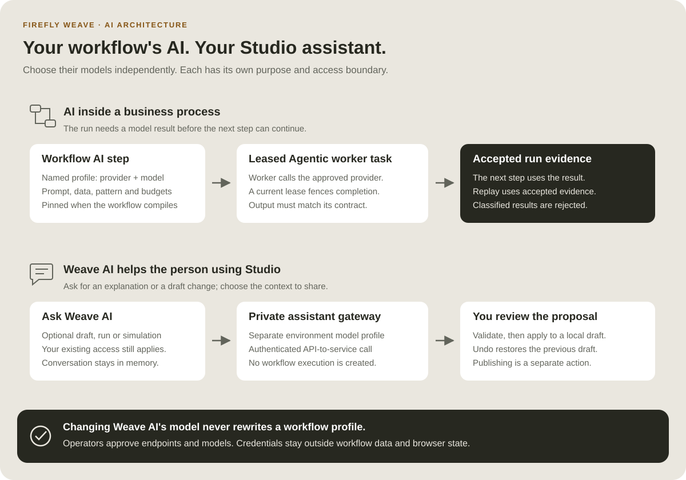

<!--
Copyright 2026 Firefly Software Foundation.

Licensed under the Apache License, Version 2.0 (the "License");
you may not use this file except in compliance with the License.
You may obtain a copy of the License at

    http://www.apache.org/licenses/LICENSE-2.0

Unless required by applicable law or agreed to in writing, software
distributed under the License is distributed on an "AS IS" BASIS,
WITHOUT WARRANTIES OR CONDITIONS OF ANY KIND, either express or implied.
See the License for the specific language governing permissions and
limitations under the License.
Author: Firefly Software Foundation
SPDX-License-Identifier: Apache-2.0
-->

# Architecture: follow one run through Weave

This page explains how Firefly Weave is built. You follow one run from the
client's request to its durable result, then see which component, source module,
and database table owns each responsibility. It is written for integration
developers, administrators, and operators who need to reason about failures and
trust boundaries, and for contributors who change the code. Reading it takes
about 20 minutes. You do not run any command, and you do not need a platform.

**Before you read.** You should know what a workflow, a run, an action, a
connector, an integration connection, and an activation are. The
[concepts page](concepts.md) explains them with one example; the
[plain-language overview](guides/learning-path.md) is a gentler start.

**Some components on this page are new in 0.1.0a7:** the public sign-in
settings endpoint, saved platforms shared by the CLI, Studio, and the desktop
app, Action configuration checks at publication, and the no-code tools for the
built-in `weave-http@2.0.0` connector. An alpha6 or earlier platform does not
have them.

## The big picture


**How to read this diagram:** Follow the numbers. Your product asks the API to
start a run (1). The API checks permission and coordinates the work (2), saves
progress in PostgreSQL (3), and queues tasks that a built-in connector or your
worker performs against your external systems (4). The note at the bottom is the local simulation path, which
needs none of these services.

[Open diagram at full size](diagrams/platform-in-plain-english.svg)

Five terms appear throughout this page:

| Term | What it means here |
| --- | --- |
| Platform | A running Weave API with its PostgreSQL database, its native executor, and any remote workers your team operates |
| Pure component | Code that computes only from its inputs: it opens no database, resolves no secret, and calls no provider. The compiler and the runtime kernel are pure; the services around them add authorization and persistence |
| Native executor | The server-side component that runs the connectors installed and enabled on the server, such as the built-in `weave-http@2.0.0`, under the same lease and completion contract as a remote worker |
| Lease fence | A generation number on a task claim. The API rejects a result from an attempt that is no longer current |
| Unit of work | One PostgreSQL transaction that carries the tenant scope; row-level security (RLS) limits what it can read and write |

## Workflow AI and the Studio assistant



Read each lane from left to right. The upper lane is part of a durable business
process: the compiler pins the workflow's model profile, an Agentic worker claims
a task, and the runtime checks its result before continuing. The lower lane helps
a person author or understand a process. Lumi uses a separate environment
configuration and an authenticated private gateway. It does not create an
execution or publish a definition. The person reviews and applies a proposed
change to a local draft.

The [AI worker guide](guides/ai-workers.md) explains deployment and profile
budgets; the [Lumi guide](guides/lumi.md) explains separate configuration and
context sharing. [Files](guides/files.md) follow a third boundary: PostgreSQL
stores their chunks separately, while workflows and workers pass verified file
references with current scope and task authority checks.

## Follow one run through the system

**The example.** A published `customer-check` workflow has one step that calls an
HTTP Action. Before the request below, the platform already has:

- a tenant, project, and environment where your account holds a grant with the
  `run.start` capability. The [local platform walkthrough](guides/local-platform.md) creates them
  for you; the [manual setup](guides/standalone.md) shows each underlying operation;
- a connector release the native executor may use. On the local platform,
  `weave platform integrations enable` prepares the built-in HTTP connector;
  elsewhere an operator follows the
  [operator steps](connectors/http-without-code.md#prepare-an-environment-once-operator)
  or the [worker setup](guides/workers.md);
- an activation of the workflow version. It pins the compiled artifact, the
  integration connection revision for each connection slot, and the connector
  release. Keep the activation's `id`: a published definition version is not a
  run, and a run always starts from an activation.

The client sends `POST /api/v1/tenants/{tenant}/projects/{project}/environments/{environment}/runs`
with a bearer token, an `Idempotency-Key` header (1 to 200 characters), and this
body:

```json
{"activation_id":"00000000-0000-4000-8000-000000000001","input":{"customerId":"123"}}
```

The UUID and the business input are illustrative: use your activation's `id` and
an input that matches its schema. The table follows the request through six
stages; the sections after it explain each component in more detail.

| Stage | Component and what it does | What is durable afterward, or where the boundary is |
| --- | --- | --- |
| 1. Authenticate | The authentication filter verifies the token against the configured identity providers and resolves the local principal linked to it. The URL supplies the requested scope | A valid token alone grants no right to run anything in the project |
| 2. Admit | The run controller parses the request; the runtime and definition services check the current `run.start` grant, the activation's readiness, its pins, and the input | A rejection creates no run. A missing `Idempotency-Key`, or one reused with a different body, is refused |
| 3. Decide | The pure runtime kernel evaluates the pinned workflow from the accepted start and returns the new state plus commands | It records what to do next; it does not call the HTTP destination |
| 4. Commit | One unit of work stores the run, the accepted event, the task intent, and its evidence | HTTP 201 returns the run `id`. The Action may still be queued |
| 5. Execute | The native executor claims the task with a fenced lease, resolves the connection's authorized settings and secrets, and calls the provider outside the claim transaction | The provider may accept the request before Weave records completion |
| 6. Settle | The executor reports its result with the lease generation; the runtime accepts a current result and advances the run in one transaction | The run's state and history now show the accepted completion |

**Why stages 5 and 6 are separate.** A lease fence rejects results from an attempt
that is no longer current, but it cannot undo stage 5. If the process stops after
the provider accepted the call and before stage 6, recovery needs an idempotent
operation or an explicit reconciliation decision. Weave records external effects
and accepted runtime facts separately instead of pretending that one HTTP request
is a transaction across systems.

### Where to look when a run does not finish

| What you see | Where it stopped | Where to look |
| --- | --- | --- |
| The start request fails with an error such as 401, 403, 409, or 422 | Stage 1 or 2: identity, grant, idempotency, or input | [API errors](reference/api.md#when-a-request-fails) and [identity failures](operations/identity-and-secrets.md#troubleshoot-sign-in-and-access) |
| The run exists, but its Action stays queued | Stage 5: no admitted executor or worker is running or has capacity | [Workers](guides/workers.md) and the run's [history](reference/history-and-replay.md) |
| The run is suspended | A step needs an operator decision | [Incident operations](reference/incident-operations.md) |
| The external system shows the effect, but the run did not complete | Between stages 5 and 6 | [History](reference/history-and-replay.md), then reconcile through [incident operations](reference/incident-operations.md) |
| A webhook or provider event was acknowledged, but no run started | Provider admission, a separate boundary | [Provider sources](reference/provider-sources.md) |

The [troubleshooting guide](operations/troubleshooting.md#match-the-symptom-to-its-boundary)
matches more symptoms to their boundary.

## Clients, Studio, and sign-in

### How clients connect and sign in

The CLI, the Python SDK, Studio, and the desktop app are all clients of the same
authenticated API. The CLI, Studio, and the desktop app share one list of saved
platforms, `profiles.json`, in your per-user configuration directory. A saved
platform holds the server address, the reviewed sign-in settings, and the chosen
workspace; it never holds a token.


**How to read this diagram:** Follow the numbered arrows from your computer (left)
to the Weave API (middle) and the identity provider (right). Steps 2 and 7 are
the only calls to the API: the first reads public settings without a token, the
second asks who you are with one. The footer covers renewal and sign-out.

[Open diagram at full size](diagrams/connect-and-sign-in.svg)

The administrator decides what clients see. `WEAVE_OIDC_PROVIDERS` tells the API
which issuers and clients it trusts when it verifies a token.
`WEAVE_CLIENT_SIGN_IN` publishes the identity provider and public login client
that people should use, and the optional `WEAVE_DISPLAY_NAME` names the platform
while they connect. `GET /api/v1/client-configuration` returns those settings to
anyone, with no token and no secret, because a person needs them before signing
in. Clients treat them as a proposal: the person reviews the issuer once, and the
saved platform pins it. See
[what clients read from the server](operations/identity-and-secrets.md#what-clients-read-from-the-server)
for the full contract and [connect the CLI to a platform](guides/connect-to-api.md)
for the steps.

### Visual authoring, people, and email

[Studio](guides/studio.md) runs on your computer. Its Angular page talks only to
a small Python host on `127.0.0.1`. In a browser, you pair the page with that host
by entering a one-time code from the terminal; the desktop app pairs itself.
Pairing grants nothing on any platform. The host reads the saved platforms, keeps
tokens in the operating system's credential store (or in the private credential
file that a platform saved with the CLI names), and forwards only supported
operations to the active platform. The browser page never receives a token.

Without an active platform, Studio works locally: the host validates workflows
with the same compiler the CLI uses. Closing Studio does not stop a workflow,
because execution state belongs to the platform's PostgreSQL database.


**How to read this diagram:** Everything inside the dashed box runs on your
computer: the Studio page (1), its host (2), the CLI, the saved platforms, and the
credential store. The page never calls your platform itself: the host, like the
CLI, calls your platform's API (3) over HTTPS, or over plain HTTP only when that
platform runs on your own computer. You sign in at the identity provider on the
right. The three boxes at the bottom happen on the platform and keep going after
you close Studio.

[Open diagram at full size](diagrams/studio-and-runtime.svg)

A [human task](guides/human-tasks.md) records an assignment and a form in the
database. A person claims the task and submits a decision through the
authenticated API, and the runtime validates that decision before the process
continues. An operator pause is different: it holds the whole run until an
authorized resume.

[Email](connectors/email.md) supplies SMTP delivery and IMAP ingestion. Messages
belong to conversations, and replies are matched by message identifiers and scoped
correlation rules. Receiving an email never approves a human task by itself.
Design the workflow to decide which incoming message starts a run or satisfies a
wait, and require an authenticated task decision wherever approval is needed.

## Inside the platform


**How to read this diagram:** Read from the top. Your product or tool, the
offline compiler, and the identity provider all feed the large API box below them.
The API keeps durable state in PostgreSQL below it and exchanges tasks with remote
workers on the right, while built-in connectors run in its native executor.
External systems are reached only at admitted destinations, with granted
credentials.

[Open diagram at full size](diagrams/system-context.svg)

Weave is a native [PyFly](https://github.com/fireflyframework/fireflyframework-pyfly)
application: dependency injection, controllers, and request filters come from the
framework. The [composition root](../src/firefly_weave/app.py) registers controllers
and constructor-injected services, and the [ASGI factory](../src/firefly_weave/main.py)
loads settings explicitly. Importing the compiler does not start that graph, so
you can embed the compiler on its own. Host products can also call the typed SDK
and the authenticated API, or [embed services](reference/embedding.md) with an
explicit actor, scope, audit context, and transaction.

**Identity.** The [authentication filter](../src/firefly_weave/access/authentication.py)
verifies tokens from the configured providers and resolves explicit local identity
links. A few paths need no bearer token: the published sign-in settings, the
health probes, signed webhooks and provider ingress endpoints (which verify the
sender by their own rules), and the interactive API documentation when it is
enabled. Services enforce scoped authorization even when they are called without
HTTP. The local platform uses Keycloak; a deployment can trust another OIDC
provider through `WEAVE_OIDC_PROVIDERS`. Real-provider checks cover local
Keycloak sign-in and Microsoft Entra ID application tokens in Azure
preproduction. Entra browser and device-code sign-in for people remain
[unverified](operations/identity-and-secrets.md#microsoft-entra-id-human-sign-in-not-verified).

**Persistence.** The [unit of work](../src/firefly_weave/persistence/uow.py) binds
the tenant context inside a PostgreSQL transaction. Repositories use that
transaction, and tenant RLS protects business data. Startup checks database roles
and schema state, but [migrations](../src/firefly_weave/persistence/migrations.py)
run only when an operator applies them. Identity and platform authorization state
is kept apart from tenant business data.

**Execution.** The [native dispatcher](../src/firefly_weave/connectors/dispatcher.py)
uses the [worker SDK](../src/firefly_weave/sdk/worker.py), provisioned releases,
and local grants. Remote workers live in other processes but follow the same lease
and completion contract. [Connector execution](../src/firefly_weave/connectors/execution.py)
resolves scoped credentials only after admission. That is a security boundary: a
definition can never choose an arbitrary network destination or secret.

## Compile, publish, activate, execute


**How to read this diagram:** The top band runs on any computer, without services
or secrets. The bottom band needs an authorized platform. Read each band from left
to right; the warning at the bottom is the one gap that no check can close.

[Open diagram at full size](diagrams/compiler-execution.svg)

The [compiler API](../src/firefly_weave/compiler/api.py) parses within fixed
bounds, validates schemas, analyzes expressions and dependencies against an
immutable catalog, and lowers the workflow to a versioned intermediate
representation (IR). The canonical executable bytes determine the artifact's
digest; source maps and diagnostics keep the authoring context. Without a catalog,
validation is partial and returns no executable artifact.

The [definition service](../src/firefly_weave/definitions/service.py) owns
immutable publication and scoped activation. Whenever it compiles a definition,
including at publication, it also runs the Action configuration checks that
installed connectors supply, keyed by the exact digest of each connector's
manifest. That is how an Action on the built-in `weave-http@2.0.0` connector is
checked against its method, side effect, and schemas before it is stored, with a
pointer to the field to fix. Tenant data can never select or replace such a
check.

Compilation proves that a definition is valid. Activation separately checks the
authority and resources needed to execute it. The activation request names the
version, its artifact digest, and the environment. It binds each connection slot
to a connection revision, each connector version to a release, worker-backed
Actions to worker releases, and human-task assignments to their bindings. The
resulting activation records connector execution pins with the Action,
connector, and capability digests. A run uses its activation's pins; it never
silently adopts a later revision.

The [runtime kernel](../src/firefly_weave/runtime/kernel.py) computes deterministic
transitions. The [runtime service](../src/firefly_weave/runtime/service.py) and its
repositories persist those transitions, task intents, and evidence. Worker
[leases](../src/firefly_weave/workers/leases.py) fence accepted completions, and the
[recovery service](../src/firefly_weave/runtime/recovery.py) advances waits,
deadlines, and signals under explicit ownership.

[Simulation](reference/simulation.md) uses mocks, and recorded
[replay](reference/history-and-replay.md) checks the available evidence; neither
calls a provider.

## Worker and security boundaries


**How to read this diagram:** Read the four steps from top to bottom. Step 3 is
highlighted because it is the crash window: the external system has accepted the
call, but Weave has not yet recorded completion. The box below explains how
recovery depends on the kind of effect.

[Open diagram at full size](diagrams/worker-recovery.svg)

The task service in [leases](../src/firefly_weave/workers/leases.py) owns lease and
completion fences, and the [worker SDK](../src/firefly_weave/sdk/worker.py) keeps
the public contract. A worker can complete an external call and stop before its
result is accepted, so retries need provider idempotency or reconciliation.
Cancellation can also leave an external effect in flight. Recovery batch limits
count the runs selected and the due timeout decisions in each pass; they are not a
maximum number of changed database rows.


**How to read this diagram:** Each numbered question must pass before the next
one is asked: who is calling, what they may do in this scope, and which data the
transaction may touch. The green box adds a separate admission check for secrets.

[Open diagram at full size](diagrams/security-boundaries.svg)

Identity says who called; current scoped grants decide what they may do. Provider
role claims, IDs in the URL, a worker's credentials, and a successful compilation
grant nothing on their own. Read [identity, authorization and secrets](operations/identity-and-secrets.md)
to configure the trusted providers, sign-in settings, and grants.

## Connector ingress and outbound events


**How to read this diagram:** The top band is incoming work: a provider or broker
event is verified, recorded, and turned into a run or a signal. The bottom band is
outgoing delivery of a committed business event. Each box records its own fact,
so an admission receipt and a provider acknowledgment prove different things.

[Open diagram at full size](diagrams/integration-delivery.svg)

[Provider ingress](../src/firefly_weave/providers/service.py) records facts and
intent for each source, and its [dispatcher](../src/firefly_weave/providers/dispatcher.py)
performs the authorized workflow admission. [Outbox delivery](../src/firefly_weave/operations/outbox.py)
and [delivery attempts](../src/firefly_weave/operations/event_delivery.py) have
their own transaction, lease, and acknowledgment boundaries. Kafka offsets are not
global transactions that include every downstream effect. See
[provider sources](reference/provider-sources.md),
[integration events](reference/integration-events.md), and [Kafka](connectors/kafka.md).

Teams, WhatsApp, and Telegram connectors are implemented and tested locally. Their
durable references, status facts, and receipts do not prove a live installation or
delivery; the [capability matrix](capabilities.md) lists what has been verified.

To call a REST API, you do not need to write a connector. An Action on the
built-in `weave-http@2.0.0` connector describes one HTTPS operation, and its fixed
first-party code runs in the native executor. You can build that Action from flags
with `weave connector http-action`, import it from an OpenAPI document with
`weave connector import-openapi --target builtin`, or use Studio's
[API action builder](guides/studio.md#call-a-rest-api-from-a-step), which runs
the same builder and importer.
[Call a REST API without code](connectors/http-without-code.md) walks through the
command-line route. The importer's default target, `package`, generates a
connector package for review instead. Whatever you author, the destination and
credentials come only from the integration connection and the operator's network
and secret policy: an imported specification cannot grant destination trust or
secret access.
[HTTP profiles](connectors/http-profiles.md) define the exact request and response
rules, and [how the call stays safe](connectors/http-without-code.md#how-the-call-stays-safe)
lists the egress limits.

## Durable state and relationships

The three diagrams below are selected views of real foreign keys, not a complete
schema export. Read each row from left to right: one parent table (white) has the
shown number of child rows (green). `P` stands for the tenant and project columns,
and `E` adds the environment. Keys keep their composite scope. Pins held in JSON
columns, such as artifact and release pins, are logical references, not foreign
keys, so a retention plan must account for them and for receipt guarantees too.


**How to read this diagram:** A published version belongs to a project, keeps its
source, and can have several activations; each activation binds connection
revisions. Versions never change, while activations decide where they are used.

[Open diagram at full size](diagrams/data-model-definitions.svg)

These relationships come from the [definition migration](../migrations/versions/0004_definitions.py)
and the [connection migration](../migrations/versions/0005_connections.py); the
behavior lives in the [definition service](../src/firefly_weave/definitions/service.py)
and the [connection service](../src/firefly_weave/connections/service.py). Draft
revisions, retirements, worker grants, and idempotency records add further
dependencies; leaving them out of the view does not make them disposable.


**How to read this diagram:** A run belongs to one activation and owns its task
intents. Each attempt at a task is a lease with a generation, and at most one
completion receipt matches a lease generation.

[Open diagram at full size](diagrams/data-model-runtime.svg)

These relationships come from the [runtime](../migrations/versions/0006_runtime.py),
[workers](../migrations/versions/0007_workers.py), [waits](../migrations/versions/0008_waits.py),
and [history evidence](../migrations/versions/0014_history.py) migrations. Events,
step instances, deadlines, signals, incidents, schedules, and debug state keep
their own ownership and completeness rules. See
[history and replay](reference/history-and-replay.md).


**How to read this diagram:** Outgoing events (top two rows) and incoming provider
records (the rows below) are separate families. A delivery attempt, a provider
receipt, and a status fact each describe a different event.

[Open diagram at full size](diagrams/data-model-integrations.svg)

These relationships come from migrations
[0016](../migrations/versions/0016_broker_receipts.py),
[0017](../migrations/versions/0017_outbox.py),
[0018](../migrations/versions/0018_provider_inbox.py),
[0019](../migrations/versions/0019_teams_references.py), and
[0020](../migrations/versions/0020_whatsapp_status.py). Outbox deliveries also
reference subscriptions. Provider sources reference source bindings and exactly
one activation or run target. WhatsApp observations link facts, sources, and
connection revisions, and Teams lifecycle events and command receipts keep the
history of reference fencing. Do not read this diagram as permission to purge
those records; follow [retention](operations/retention.md).

## Deployment and verification boundary

The API, the native executor, and remote workers can run in separate processes;
PostgreSQL owns the durable orchestration state they share. The API and the
native executor run the same server artifact with separate authority, while the
worker image has its own installed dependencies. The current container layout is
described in [deployment](operations/deployment.md) and
[configuration](operations/configuration.md). To operate that state, read
[observability](operations/observability.md), [retention](operations/retention.md),
[upgrades](operations/upgrades.md), and [backup and restore](operations/backup-restore.md).

External effects always need idempotency or reconciliation: lease fencing cannot
undo a request that another system has already accepted.

## Find the code for each responsibility

| Responsibility | Start in | Guide |
| --- | --- | --- |
| Settings, composition, HTTP controllers | [`settings.py`](../src/firefly_weave/settings.py), [`app.py`](../src/firefly_weave/app.py), [`api/`](../src/firefly_weave/api/) | [Configuration](operations/configuration.md) |
| Token verification, published sign-in settings | [`access/authentication.py`](../src/firefly_weave/access/authentication.py), [`access/client_configuration.py`](../src/firefly_weave/access/client_configuration.py) | [Identity, authorization and secrets](operations/identity-and-secrets.md) |
| Compiler (pure) | [`compiler/api.py`](../src/firefly_weave/compiler/api.py) | [Compiler](reference/compiler.md) |
| Publication and activation | [`definitions/service.py`](../src/firefly_weave/definitions/service.py) | [Definition contracts](contracts.md) |
| Runs, waits, signals, recovery | [`runtime/`](../src/firefly_weave/runtime/) | [Execution management](guides/execution-management.md) |
| Leases and completion | [`workers/leases.py`](../src/firefly_weave/workers/leases.py), [`sdk/worker.py`](../src/firefly_weave/sdk/worker.py) | [Worker protocol](reference/worker-protocol.md) |
| Native executor and built-in HTTP connector | [`connectors/dispatcher.py`](../src/firefly_weave/connectors/dispatcher.py), [`connectors/http_profiles.py`](../src/firefly_weave/connectors/http_profiles.py) | [HTTP profiles](connectors/http-profiles.md) |
| Integration connections and installed connectors | [`connections/`](../src/firefly_weave/connections/) | [Author a connector](connectors/authoring.md) |
| Human tasks and email | [`human_tasks/`](../src/firefly_weave/human_tasks/), [`email/`](../src/firefly_weave/email/) | [Human tasks](guides/human-tasks.md) |
| Incoming provider events, outgoing deliveries | [`providers/`](../src/firefly_weave/providers/), [`operations/`](../src/firefly_weave/operations/) | [Provider sources](reference/provider-sources.md) |
| Transactions and migrations | [`persistence/`](../src/firefly_weave/persistence/), [`migrations/versions/`](../migrations/versions/) | [Local runtime](reference/local-runtime.md) |
| Client SDK, saved platforms, sign-in | [`sdk/client.py`](../src/firefly_weave/sdk/client.py), [`sdk/profiles.py`](../src/firefly_weave/sdk/profiles.py), [`sdk/sign_in.py`](../src/firefly_weave/sdk/sign_in.py) | [SDK reference](reference/sdk.md) |
| CLI | [`cli/`](../src/firefly_weave/cli/) | [CLI reference](reference/cli.md) |
| Studio host and desktop sidecar | [`studio/`](../src/firefly_weave/studio/) | [Studio](guides/studio.md) and [desktop](guides/desktop.md) |
| Studio page and desktop shell | [`studio/src/app/`](../studio/src/app/), [`desktop/src-tauri/`](../desktop/src-tauri/) | [Contributing](../CONTRIBUTING.md) |

## Next steps

- **Integration developers:** [call a REST API without code](connectors/http-without-code.md),
  then [build workers](guides/workers.md) for anything a built-in connector cannot do.
- **Administrators:** [choose your identity provider and grants](operations/identity-and-secrets.md),
  then [give people the right access](guides/people-and-access.md).
- **Operators:** [manage executions](guides/execution-management.md) and
  [match a symptom to its boundary](operations/troubleshooting.md).
- **Contributors:** read [contributing](../CONTRIBUTING.md). The diagrams on this
  page are editable SVG; [visual assets](visual-assets.md) explains how to change
  and check them, and the [capability matrix](capabilities.md) lists what has
  been verified.
