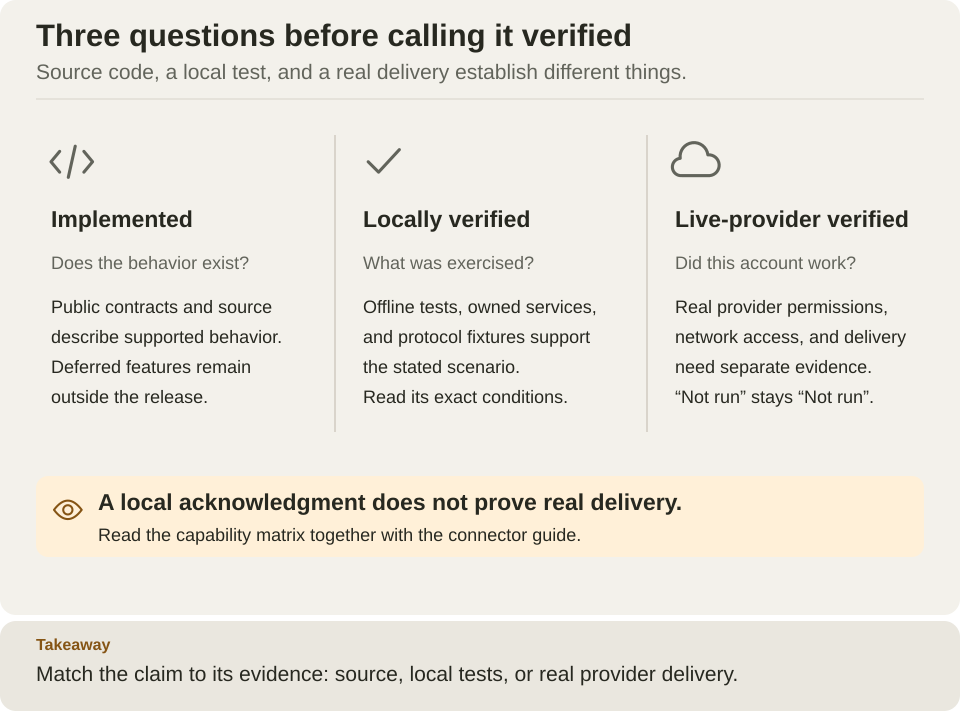

<!--
Copyright 2026 Firefly Software Foundation.

Licensed under the Apache License, Version 2.0 (the "License");
you may not use this file except in compliance with the License.
You may obtain a copy of the License at

    http://www.apache.org/licenses/LICENSE-2.0

Unless required by applicable law or agreed to in writing, software
distributed under the License is distributed on an "AS IS" BASIS,
WITHOUT WARRANTIES OR CONDITIONS OF ANY KIND, either express or implied.
See the License for the specific language governing permissions and
limitations under the License.
Author: Firefly Software Foundation
SPDX-License-Identifier: Apache-2.0
-->

# Capabilities and verification

Read these as independent evidence categories. The matrix below states which
category is supported for each capability.

[Open diagram at full size](diagrams/capability-evidence.svg)

## How to use this matrix

Read each row from left to right. **Implemented** means code exists for the stated
scope. **Local verification** names the kind of evidence exercised against fixtures
or owned infrastructure. **Live-provider verification** concerns a real external
account/service and is a separate claim. **Deferred** means the capability is not
part of this delivery. "Not applicable" does not mean every possible destination
or customer deployment has been tested.

For example, the Telegram row supports planning a text integration using its
listed local evidence, but bot registration, chat permissions and actual delivery
still need verification in your deployment. The OpenAPI row supports selected
operations in the documented subset; it does not certify an arbitrary commercial
API. Follow the linked guide for prerequisites and supported shapes before
choosing a capability. Start with [standalone setup](guides/standalone.md) when you
need a runnable environment rather than an implementation inventory.

Firefly Weave is an alpha workflow and integration platform. This page describes
version `0.1.0a3`. Published artifacts are listed in
[GitHub Releases](https://github.com/fireflyframework/firefly-weave/releases).
The integration catalog includes Teams, WhatsApp, and Telegram with
PyFly 26.9.15 and schema revision `0021_operations`.

Implementation, local verification, and live-provider verification are separate.
Local verification includes offline contracts, owned PostgreSQL/Keycloak services,
and synthetic HTTP/TLS protocol fixtures as applicable. It does not establish
production availability, provider account provisioning, or actual message delivery.

| Capability | Implementation | Local verification | Live-provider verification | Main boundary |
| --- | --- | --- | --- | --- |
| [Compiler and schemas](reference/compiler.md) | Implemented | Compiler, schema, expression and canonical-artifact suites | Not applicable | Validation without a catalog is partial and emits no executable |
| [Definition lifecycle](reference/api.md) | Implemented | Publication, activation, revision and scoped API suites | Not applicable | Compilation is separate from authorization and admission |
| [Durable runtime](reference/schedules-and-timers.md) | Implemented | PostgreSQL, lease, wait, signal, schedule and recovery scenarios | Not applicable | External effects can be repeated after a crash |
| [Workers](reference/worker-protocol.md) | Implemented | Native and remote worker protocol scenarios | Not applicable | Release identity and scope grants must be provisioned |
| [Simulation](reference/simulation.md), [history/replay](reference/history-and-replay.md), [incidents](reference/incident-operations.md) | Implemented | Mock simulation and durable evidence/control scenarios | Not applicable | Replay can report incomplete evidence; simulation does not call providers |
| [HTTP and webhooks](reference/http-and-webhooks.md) | Implemented | Bounded transport, signed ingress and owned endpoint scenarios | Not applicable to arbitrary destinations | Egress and scoped credential policy apply |
| [PostgreSQL](connectors/postgresql.md) | Implemented | Owned PostgreSQL connector scenarios | No customer database certification | Explicit SQL policy and typed parameters |
| [Kafka](connectors/kafka.md) | Implemented | Owned broker/database delivery and recovery scenarios | No hosted-broker certification | Database receipts and broker acknowledgments have different boundaries |
| [Integration events/outbox](reference/integration-events.md) | Implemented | Transactional delivery and recovery scenarios | No arbitrary subscriber certification | At-least-once delivery requires receiver idempotency |
| [Connector authoring](connectors/authoring.md), [provider sources](reference/provider-sources.md) | Implemented | Package/conformance, source authority and inbox scenarios | Not applicable to third-party packages | Trusted code installation is separate from metadata validation |
| [Teams personal bot](connectors/teams.md) | Implemented | Wire fixtures and owned PostgreSQL; composed provider gate passed | Not run | Personal text scope; provider acceptance is not delivery |
| [WhatsApp Cloud API](connectors/whatsapp.md) | Implemented | Wire fixtures, status history and owned PostgreSQL; composed provider gate passed | Not run | Account policies, templates and live delivery require separate verification |
| [Telegram webhook text](connectors/telegram.md) | Implemented | Local TLS fixtures and owned PostgreSQL; composed provider gate passed | Not run | Source-local deduplication; bot/group permissions remain provider prerequisites |
| [Keycloak identity](operations/identity-and-secrets.md) | Implemented | Owned Keycloak tokens, delegated login and local authorization scenarios | No customer realm certification | Explicit identity links and local grants remain required |
| Generic OIDC / Entra claim profiles | Provider-neutral ports and claim mapping present | Local contract coverage | Entra/other CIAM not live verified | No automatic provisioning, group-overage expansion or provider portability guarantee |
| [OpenAPI import](connectors/metadata-import.md) and [HTTP profiles](connectors/http-profiles.md) | Implemented | Offline importer, generated package, and owned TLS integration scenarios | Not run | Do not infer arbitrary OpenAPI execution |
| [Operational limits](operations/configuration.md), [telemetry](operations/observability.md), [retention](operations/retention.md) and [compatibility](operations/upgrades.md) | Implemented | Policy, accounting, contention, telemetry, retention and upgrade suites | Not applicable | Logical accounting is separate from physical storage; compatibility checks gate readiness |
| [Deployment](operations/deployment.md), [backup/restore](operations/backup-restore.md) and distribution | Implemented | Installed-package, container, process recovery, restore and queue suites | Not applicable | Restore ownership, grants, schema compatibility and external systems must be verified in each environment |
| [AWS/Azure/GCP deployment recipes](operations/cloud-deployment.md) | Reference guides and Kubernetes manifests | Source review and offline Kubernetes object-shape validation | Not run | Operator-provisioned infrastructure; target database migrations, identity, networking, and recovery require acceptance |
| Slack and Salesforce | Deferred | Not run | Not run | Not included in this delivery |

SAP and Oracle are not advertised as executable named adapters. Integrating an
external system through a generic supported connector does not certify that
system's authentication, schema, rate limits or business semantics.

See the [documentation index](README.md), [architecture](architecture.md), and
[security policy](../SECURITY.md). Use the corresponding operation and deployment guides for configuration and
execution prerequisites.
