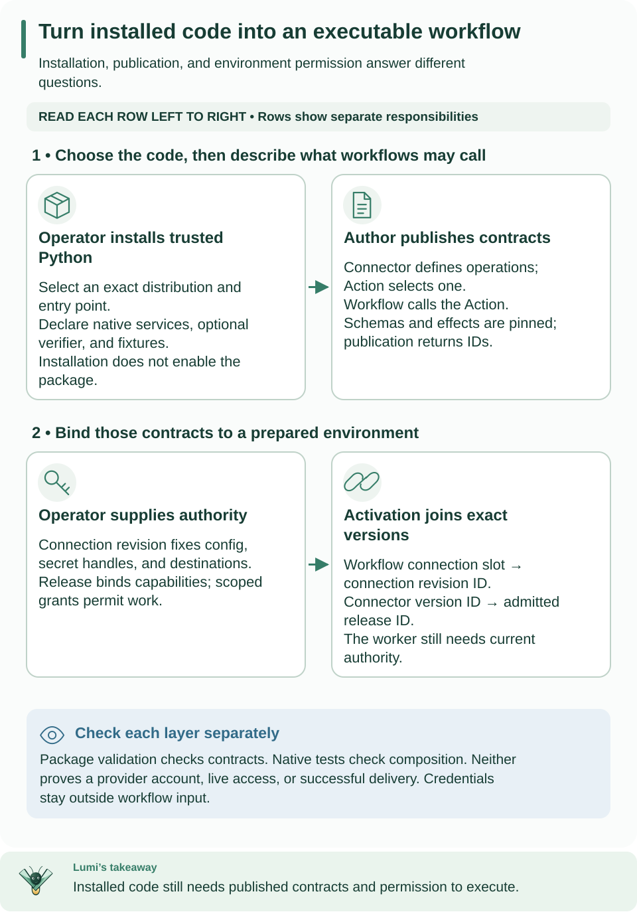

<!--
Copyright 2026 Firefly Software Foundation.

Licensed under the Apache License, Version 2.0 (the "License");
you may not use this file except in compliance with the License.
You may obtain a copy of the License at

    http://www.apache.org/licenses/LICENSE-2.0

Unless required by applicable law or agreed to in writing, software
distributed under the License is distributed on an "AS IS" BASIS,
WITHOUT WARRANTIES OR CONDITIONS OF ANY KIND, either express or implied.
See the License for the specific language governing permissions and
limitations under the License.
Author: Firefly Software Foundation
SPDX-License-Identifier: Apache-2.0
-->

# Authoring trusted connector packages



**How to read this diagram:** Read the three columns as separate responsibilities, then follow their pins into activation. Use the returned connection revision and release IDs; an installed package alone cannot execute a tenant Workflow.

## What you will build

This guide creates a trusted Python package that adds an executable connector to
Weave. Use [OpenAPI import](metadata-import.md) when a reviewed HTTP API description
can generate the package; write an adapter when the protocol needs custom code.
A commercial product name alone does not imply a supported connector.

There are three separate layers:

| Layer | What it supplies | Who creates it |
| --- | --- | --- |
| Installed package | Python services and a Connector manifest describing operations | Package author and deployment operator |
| Published Connector and Action | Immutable contracts; an Action selects one operation and its fixed configuration | Project author |
| Connection and activation | Environment credentials/destinations and exact versions/releases used by a workflow | Scoped deployer and operator |

The first two commands below run locally without a server. Before enabling the
result in a running environment, complete [standalone setup](../guides/standalone.md),
then [worker admission](../guides/workers.md). An installed package is not yet a
published Connector, and a published Connector is not yet an executable activation.

## From package to an executable workflow

After the local build/test steps below, deploy in this order:

1. Allowlist the installed package's exact identity on the server/native executor.
2. Publish `package.descriptor.manifest` through the project's Connector publication
   API. Save the returned version `id`; it is `connector_version_id` in a connection.
3. Register a native worker release using the descriptor's exact capabilities and
   connector bindings. Save its `id`. Grant the worker its scoped release/task
   authority and the release's credential capability for the connection revision.
4. Create the environment connection with `name`, `connector_version_id`, `config`,
   `secretRef` (handles, never values), and `allowed_destinations`. Save its returned
   `id`, which is the **connection revision ID**, not the Connector version ID.
5. Publish an Action selecting the Connector's `name@version`, action name, schemas,
   effect and fixed config. Publish a Workflow using that Action and a connection slot.
6. Activate the Workflow with `connection_revision_ids` mapping slot names to
   connection revision IDs and `connector_release_ids` mapping Connector version
   UUIDs to release UUIDs. Save the activation `id` for run/trigger requests.
7. Start a run, inspect its state and history, and inspect any incidents before
   retrying an external effect.

[`examples/admit_native.py`](../../examples/admit_native.py) demonstrates the full
publication/release/grant/connection/activation sequence for HTTP. Its `read`
capability and local receiver are example-specific; use your descriptor's actual
capability and approved destination. [HTTP execution](../reference/http-and-webhooks.md)
explains native executor configuration; [host integration](../guides/host-integration.md)
explains embedding the API in a product.


A connector package is an operator-installed Python distribution. It exports a
`ConnectorPackage` declaration through `firefly_weave.connectors`; the declaration
names native PyFly `@service` classes. Tenant definitions cannot install packages,
choose import paths, or construct services. Package validation checks authoring
and composition contracts; it does not certify a remote provider.

## Create and validate

```sh
weave connector init ./acme-echo --name acme-echo --output json
weave connector validate ./acme-echo/connector.json --output json
```

The target must be absent or empty, and may not be a symlink. Names are lowercase
letters, digits, and hyphens; `weave-` identities are reserved for the product.
The scaffold includes a native echo service, immutable metadata, an Action
example, an installed fixture suite, pytest tests, and a fail-closed provider
verifier design example. The latter is deliberately excluded from service
registration: implement the provider admission port before advertising ingress.

`validate` reads at most 1 MiB of local JSON. It does not import the named module,
execute Python, install dependencies, query entry points, or fetch schemas.
It uses the existing compiler, schema reference policy, and resource budgets.
Malformed schemas and remote references fail. The generated Action compiles
against the generated Connector and its published capabilities.

The manifest remains the executable authority. Every action has exactly one
capability binding; adapter, implementation version, manifest digest, input and
output schemas, side-effect classification, and timeout must agree. Metadata
cannot weaken those contracts. `PackageMetadata` owns canonical bytes and returns
independent model/data copies. Event schemas use the same canonical schema
validator and require an exact optional verifier service declaration.

## Build and install

Edit the declaration in `connector.json` and its packaged copy under
`src/acme_echo/connector.json` together. Review changes before installation.

```sh
weave connector package ./acme-echo --directory ./acme-echo-dist --output json
```

`package` requires the Python `build` tool in the authoring environment. It checks
the root and packaged declaration digests and the project's name, version, and
entry point before executing the explicitly selected local build backend. The
output directory must be absent or empty. This command executes trusted build
code and may install isolated build requirements; it is not a sandbox or a tenant
API. Use an isolated build environment and the reviewed Weave wheel. The template
pins PyFly 26.9.15 to its exact published wheel and SHA-256, matching this release.

Install the generated wheel and its declared dependencies into a separate
operator-controlled environment. Installing a wheel does not enable it. Keep
wheel hashes and the metadata/manifest digests with the deployment record.

The [provider-inbox test package](../../tests/fixtures/e2-provider/README.md)
shows a bounded echo adapter and a separate test-only ingress verifier. Use it to
understand fixture responsibilities, not as a production provider implementation.

## Test the installed package

```sh
pytest ./acme-echo/tests/test_conformance.py
weave connector test 'acme-echo:acme-echo:acme_echo:package' --output json
weave connector test 'acme-echo:acme-echo:acme_echo:package' --mode native --output json
```

The default `fixtures` mode requires a declared asynchronous conformance hook,
starts a native context, resolves the singleton service, invokes its installed
fixture suite, and stops the context. Its output records
`installed-fixture-contract`, the exact selected identity, metadata and manifest
digests, and `live_provider_verification: false`. `--mode native` records
`installed-native-contract` and only verifies native composition. Neither mode
changes the package's declared verification status. These commands execute
operator-selected trusted Python, including lifecycle hooks: inspect the package
and its fixtures first. A fixture suite is not an isolation boundary.

The echo fixture suite checks independent output values, read-only effect,
deadlines, request/response bounds, cancellation propagation, and classified
input rejection without credential access or network calls. It has no transport
headers or uncertain external effects. A real transport package must add fixtures
for protected headers, destination admission, credential redaction, response
limits, transport cancellation, and effect-specific failures. Preserve
`ConnectorFailure.outcome`: use `not_started` only before an external operation,
`failed` when failure is known, and `unknown` when delivery cannot be determined.
Never describe an unknown outcome as a safe retry or claim exactly-once delivery.
Run real provider tests only with explicit authorization and test destinations.

Verification metadata is a declaration with operation-specific evidence, not an
independently established certification. Allowed statuses are `implemented`,
`contract-tested`, `local-integration-verified`, and `live-verified`. Any status
beyond `implemented` requires explicit evidence references.

## Enable native composition

Set the operator-owned environment configuration:

```sh
export WEAVE_CONNECTOR_PACKAGES='["acme-echo:acme-echo:acme_echo:package"]'
```

The identity is exact `distribution:entry-point-name:module:attribute`, using the
installed distribution metadata. All requested identities are matched before any
entry point loads; missing, ambiguous, or repeated identities fail. Unselected
entry points never load. A selected package with a missing optional dependency
fails startup clearly. Its distribution, exact installed version, and adapter must match the
installed metadata. `version` remains the adapter implementation SemVer used by
connector bindings. Optional `distribution_version` pins the exact bounded ASCII
distribution version (including PEP 440 prereleases such as `0.1.0a1`); omitted
metadata retains the legacy `version` comparison. No normalization or ordering
is inferred. Build-project validation uses that same installed distribution pin. Reserved adapters and duplicate declarations fail.

The app scans an explicit list of core connector modules, then registers the
selected service types before PyFly startup and resolves them with
`context.get_bean` afterward. No package factory constructs an adapter. Exact
native singleton `@service` types are required; constructor dependencies must be
provided by the host's native configuration. The host's context remains the owner
of initialization, shutdown, and injected dependencies. Verifier service metadata
is consumed by the [provider inbox](../reference/provider-sources.md); package
validation alone does not dispatch provider events.

Existing `ConnectorRegistry.register_trusted(reference, adapter)` remains an
explicit operator/test seam. The old zero-argument entry-point factory form is
rejected with migration guidance: export a `ConnectorPackage` object containing
`PackageMetadata` and the exact service class instead. No existing shipped
connector uses the old factory form; built-in connectors remain native services.
`ConnectorPackage.validate_connection` preserves the trusted descriptor callback for
profile-specific connection checks; offline validation does not execute it.
`ConnectorDescriptor` remains importable from `connectors.manifest`; authors can
import its pure definition from `connectors.descriptor` without infrastructure.

## Errors and optional dependencies

All commands support `--output text|json`. Success exits 0, a rejected declaration,
fixture, dependency, or build exits 1 with `WV-CONNECTOR-INVALID`, and malformed CLI
usage exits 2 with `WV-CLI-USAGE`. CLI errors do not echo arbitrary package
exceptions or credential material. SDK functions raise exceptions for host tools.
Build backends control their own output; use only reviewed local projects.

Core/compiler/base installs need no PyFly, SQLAlchemy, PostgreSQL client, HTTP
client, Kafka driver, or provider SDK to scaffold and validate. Native testing and
server composition require their explicitly selected optional dependencies.
No new HTTP route is introduced by these local deployment operations; there is
no tenant package-installation API to mirror in OpenAPI.


Provider declarations may set `dispatch_event_kinds` to a nonempty unique subset of `event_schemas` keys. Omitted means all event kinds. Source creation validates its mapping against every dispatchable schema; lifecycle-only kinds must normalize to `ignore` and still satisfy their own schema and secret policy. Compute source pins with the pure `firefly_weave.contracts.providers.provider_schema_digest(event_schemas, dispatch_event_kinds)` helper, which includes the sorted effective dispatch capability as well as schemas. Capability changes therefore invalidate old source pins.
