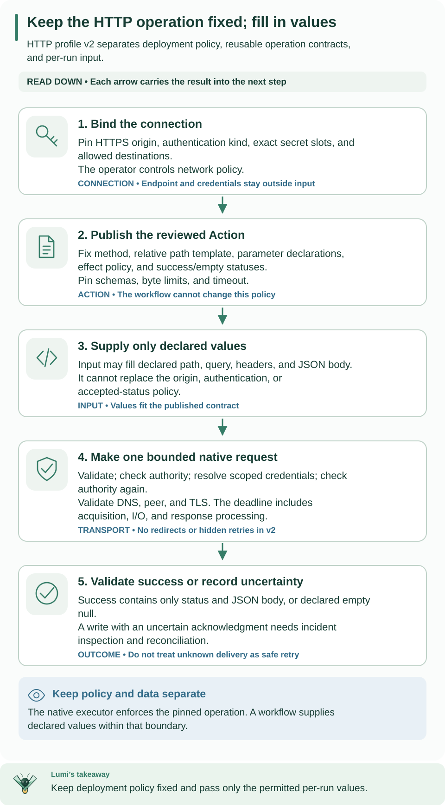

<!--
Copyright 2026 Firefly Software Foundation.

Licensed under the Apache License, Version 2.0 (the "License");
you may not use this file except in compliance with the License.
You may obtain a copy of the License at

    http://www.apache.org/licenses/LICENSE-2.0

Unless required by applicable law or agreed to in writing, software
distributed under the License is distributed on an "AS IS" BASIS,
WITHOUT WARRANTIES OR CONDITIONS OF ANY KIND, either express or implied.
See the License for the specific language governing permissions and
limitations under the License.
Author: Firefly Software Foundation
SPDX-License-Identifier: Apache-2.0
-->

# Call a REST API without code

Use this guide when a workflow step must call one operation of a JSON API over
HTTPS, such as reading a customer record or creating a ticket. You describe the
request (method, path, typed parameters, and the shape of the JSON body and
response) and Weave turns it into a reviewable Action on the built-in
`weave-http@2.0.0` connector. You do not write, build, or install Python.

- **Who it is for:** integration developers and process designers who author the
  call, and the operator or administrator who prepares the environment once.
- **What you need:** the [0.1.0a7 CLI](../installation.md) or later,
  a platform you can sign in to (the [local platform](../guides/local-platform.md)
  is enough), and, for the operator steps, the rights described in
  [Prepare an environment once](#prepare-an-environment-once-operator).
- **How long:** about 20 minutes for the example once the environment is prepared.
- **Prefer a visual editor?** Studio builds the same Actions; see
  [Call a REST API from a step](../guides/studio.md#call-a-rest-api-from-a-step).

**These commands are new in 0.1.0a7.** An alpha6 or earlier CLI has no `weave
connector http-action`, guided `weave connections create` flags, `import-openapi
--target builtin`, or `weave platform integrations` and `secret` commands. Run
`weave connector --help` to check: it lists `http-action` when they are available.

**What was verified end to end.** On macOS, with a local Docker engine, the
[local platform](../guides/local-platform.md) ran the CLI example below from
start to finish: the Action was built with `weave connector http-action`,
published, bound to a guided connection, granted, and activated with connector
release pins, and the run ended `succeeded` with the item from
`https://jsonplaceholder.typicode.com`. The same `GET /todos/{id}` call, built
with Studio's **New API action** builder on that platform, also ran to
`succeeded`. The shared-platform
operator steps are described from the code and its tests; they were not run
against a deployed platform. No commercial API account was contacted.


Read the three columns from left to right: you describe and publish the Action,
your environment allows it with a connection and a grant, and you activate and
run a workflow that uses it. The shaded card in the middle is the operator's
one-time preparation. Boxes 1 to 3 are step 2 of the example below, and boxes 4
to 9 are steps 3 to 8. The band at the bottom is the trust boundary every call
stays inside.

[Open diagram at full size](../diagrams/no-code-integration.svg)

## Words used on this page

| Term | Meaning here |
| --- | --- |
| Action | The published, versioned description of one API call, such as `get-todo@1.0.0`. A workflow step calls it |
| Connector | The trusted code that sends the request. Here it is always the built-in `weave-http@2.0.0` |
| Integration connection | An environment resource holding the API origin, the authentication kind, the allowed destinations, and secret **handles** (names of secrets, never values). Each change creates a new revision with its own ID |
| Connection slot | A named requirement in the workflow, such as `todos`, bound to a connection revision when you activate |
| Executor release | The registered build of the platform code that runs connector Actions, pinned at activation |
| Activation | A published workflow version pinned to one environment with its connections and releases |

The [glossary](../concepts.md#glossary) defines the rest of Weave's vocabulary.

## Choose this path or another

| Your situation | Use | Start here |
| --- | --- | --- |
| One JSON-over-HTTPS operation at a fixed origin, from the command line | The built-in profile | [Build the Action from flags](#2-describe-the-request) |
| The same, in a visual editor | Studio's API action builder | [Call a REST API from a step](../guides/studio.md#call-a-rest-api-from-a-step) |
| An OpenAPI document that describes the operations | The importer's built-in target | [Import from OpenAPI](#import-operations-from-an-openapi-document) |
| A request or response the profile cannot express | A trusted connector package or a worker | [When you still need code](#when-you-still-need-a-package-or-a-worker) |
| A database, a message broker, email, or a chat app | A dedicated connector | [PostgreSQL](postgresql.md), [Kafka](kafka.md), [email](email.md), [Teams](teams.md), [WhatsApp](whatsapp.md), [Telegram](telegram.md) |
| Only learning the HTTP profile's exact rules | The reference | [HTTP profile v2 reference](http-profiles.md) |

## What the built-in profile supports

The built-in connector runs a fixed, first-party executor. An Action selects one
operation inside its profile; it never selects code. These rules come from the
profile's own validation, so anything outside them is rejected when you build or
publish the Action, not at run time.

**Supported:**

- **Methods.** `GET` and `HEAD` become the `read` action with side effect
  `read_only`. `POST`, `PUT`, `PATCH`, and `DELETE` become the `write` action with
  side effect `non_idempotent` and exactly one attempt (`retry.maxAttempts: 1`).
  You cannot choose the side effect or add retries.
- **Origin.** Each connection fixes one origin (`baseUrl`, without a path),
  `https://` or `http://`. A base path such as `/v1` belongs in the Action's
  path template. An `http://` origin is not encrypted: requests, including any
  API key, password, or token, travel in plain text, so the CLI and Studio show
  a "Not encrypted" warning for it. Use `https://` whenever the API offers it.
- **Path template.** An absolute path of at most 4096 characters. Placeholders
  fill a whole segment, such as `/v1/pets/{petId}`; names start with a letter or
  underscore and continue with letters, digits, `_`, or `-` (at most 128). No query
  string, fragment, percent-encoding, backslash, or `.`/`..` segment.
- **Parameters.** At most 64, typed `string`, `integer`, or `boolean`:
    - `path`: always required, one value per placeholder;
    - `query`: a value or an array sent as repeated keys (`--param` defaults the
        array to 20 items; the executor accepts at most 100);
    - `header`: one value, never a protected header (see below) or the
        connection's API-key header.
- **Request body.** JSON only, for write methods. The executor sends canonical
  JSON with `Content-Type: application/json`. `--optional-body` lets a workflow
  omit it.
- **Responses.** Up to 20 accepted `2xx` statuses. A normal status must return a
  non-empty `application/json` body. An empty status returns a `null` body; `204`,
  `205`, and every `HEAD` status are always empty.
- **Output.** `{"status": <code>, "body": <JSON or null>}`, validated against the
  Action's output schema.
- **Authentication.** `none`, `api-key` (in a header you name), `basic`, `bearer`,
  and `machine-token` (OAuth 2.0 client credentials, `client_secret_post` by default
  or `client_secret_basic`).
- **Limits.** Request at most 1 MiB counting URL, headers, and body; headers at
  most 32 KiB; URL at most 16 KiB; response at most 1 MiB; timeout 1–30 seconds.
  Every request sends `Accept: application/json`.

**Not supported:**

- Destinations that resolve to private, loopback, or CGNAT addresses, over
  HTTPS or HTTP, unless the platform's private-origin policy approves that
  origin (on the local platform, `weave platform up --allow-private-origin`
  when you create the installation; see
  [Docker development](../guides/docker-development.md)) or the operator lists
  the range in the legacy `WEAVE_HTTP_PRIVATE_NETWORKS` (see
  [Configuration](../operations/configuration.md)). Link-local addresses, cloud
  metadata hosts (including `100.100.100.200`), and Kubernetes service names are
  always refused.
- Redirects. Any `3xx` answer fails; no redirect is followed.
- Error answers as results. A `4xx` or `5xx` status fails the task, and its body
  is never returned.
- Response headers, such as pagination `Link` headers or `ETag`.
- Non-JSON content: form encoding, multipart, file upload or download, XML, or
  plain text, in either direction.
- Cookies and the protected headers `authorization`, `proxy-authorization`,
  `host`, `cookie`, `set-cookie`, `content-length`, `content-type`, `accept`,
  `connection`, `transfer-encoding`, `te`, `trailer`, `upgrade`, `forwarded`,
  `via`, and any header starting with `proxy-` or `x-forwarded-`.
- Other authentication: API keys in the query string, OAuth flows that act for a
  signed-in person, refresh tokens, client certificates, or request signing.
- Floating-point or object parameters, header arrays, and arrays outside the query.
- A URL, method, or header chosen by workflow input at run time.
- Retried writes or idempotency claims, and loops such as pagination inside one
  Action. Express a loop with workflow steps instead.

## Prepare an environment once (operator)

Every Action on `weave-http@2.0.0` needs four things in its environment:

1. the published Connector;
2. an executor release with the connector's bindings;
3. a worker grant for that executor;
4. for connections that use secrets, secret handles and a credential grant per
    connection.

The operator does items 1 to 3 once per environment. Item 4 follows each new
connection that names secret handles.

### On the local platform

Run these steps with the API running and the demo workspace created (steps 1 to 4
of [the local platform guide](../guides/local-platform.md)). Run every `weave
platform` command from the directory where you set the platform up, so it finds
its installation.

1. **Enable the built-in connector.** One command performs items 1 to 3:

    ```sh
    # Publish the built-in connector, register this runtime as its release, and grant its executor.
    weave platform integrations enable
    ```

    Expected: the connector and its version ID, the local release ID, and the
    `connector_release_ids` map that activations must pin, followed by the next
    commands to run. Behind the scenes it publishes the installed manifest unchanged,
    registers the runtime's local build identity as a release with the
    descriptor's own capabilities and bindings, creates a dedicated native
    principal once, grants it the `worker` role for that release and task types,
    and saves `integrations.json`. Repeating it reuses everything.

2. **Store each API credential behind a handle.** Skip this step for APIs that
    need no credentials. The hidden prompt is the safest way; standard input works
    for a value kept in a file:

    ```sh
    # Type the value at a hidden, confirmed prompt; it is never echoed or printed.
    weave platform secret set --handle pets-api-key
    # Or read it from a private file; a terminal is refused because it would show the value.
    weave platform secret set --handle pets-api-key --value-stdin < /absolute/path/to/pets-api-key.txt
    ```

    Expected: `Handle: pets-api-key` and a message asking you to restart the API.
    Handles are 1 to 64 characters: lowercase letters, digits, `.`, `_`, or `-`,
    starting with a letter or digit. Values are non-empty UTF-8 text of at most
    65536 bytes without NUL; one trailing newline is removed.
    `weave platform secret list` shows handle names only.

3. **Restart the API so it applies both changes.** Press Ctrl-C in the API
    terminal, then run `weave platform start` again.

    Expected: the startup notices include `Connector actions: enabled in the demo
    environment (built-in HTTP connector, local development build).` and, when you
    stored secrets, `Secret handles granted to the demo environment:` followed by
    their names. A new handle applies after the next `start`; replacing the value
    of an existing handle applies at its next use.

The per-connection credential grant (item 4) comes after the author creates a
connection; see [step 5](#5-grant-the-executor-the-connection).

**The local platform runs only this connector.** Its executor accepts only the
built-in HTTP connector, so PostgreSQL, Kafka, messaging, and custom packages need
a deployed platform; see
[Local development build](../reference/http-and-webhooks.md#local-development-build).

### On a shared platform

This sequence follows the code paths `integrations enable` uses; it was not run
against a deployed platform. Each step needs the authority named in
[connector authoring](authoring.md#from-package-to-an-executable-workflow).

1. **Publish the installed manifest.** `weave connector descriptor weave-http-v2
    --output json` asks the selected platform for its installed descriptor. Publish
    its `source` field unchanged with `weave definitions publish --collection
    connectors`, wrapped as `{"format": "json", "source": ...}` like the Action in
    [step 3](#3-publish-the-action). Read the descriptor again:
    `published_version_id` is the Connector version ID that connections use.
2. **Register the executor release.** `weave workers releases create --request
    FILE` with the server image's actual `image_digest`, the descriptor's
    `capabilities`, and its `bindings` as `connector_bindings`, as described in
    [native dispatcher setup](../reference/http-and-webhooks.md#built-native-dispatcher-setup).
    List both capabilities in `credential_capabilities` when connections will
    use secrets. Save the release `id`: authors pin it as
    `{"CONNECTOR_VERSION_ID": "RELEASE_ID"}` in `connector_release_ids`.
3. **Configure and grant the executor.** Set `WEAVE_NATIVE_EXECUTORS` and
    `WEAVE_NATIVE_IMAGE_DIGEST` on the API, and grant the executor's principal the
    `worker` role for the release and both task types
    (`weave-connector-http-read@2.0.0`, `weave-connector-http-write@2.0.0`).
4. **Grant secret handles.** Add each handle to `WEAVE_SECRET_GRANTS` for the
    environment. The handle names the secret; the value stays in your secret
    provider.
5. **Grant each connection that uses secrets.** `weave workers grant --request
    FILE` with `{"release_id": ..., "connection_revision_id": ..., "capability":
    "weave-connector-http-read@2.0.0"}`, and again with the write capability when
    the connection serves write Actions. This needs `connection.manage`.

### Roles the author needs

| Task | Capability | Role |
| --- | --- | --- |
| Publish Actions and workflows | `definition.publish` | `developer` |
| Create and test connections | `connection.manage` | `tenant_admin` |
| Activate with connection and release pins | `release.activate`, `connection.bind` | `deployer` |
| Start runs | `run.start` | `operator` |
| Read runs | `run.read` | `viewer` |

On the local platform, the default `weave platform user` roles cannot create
connections. Create your person with `tenant_admin` and the other roles at once,
as shown in [create a person](../guides/local-platform.md#5-create-a-person-who-can-sign-in):
`--role` replaces the defaults, and an existing username is never changed. If
your person already exists without it, create another one and sign in as it with
`weave auth login --switch-account`.
On a shared platform, an administrator grants these roles; see
[Give people the right access](../guides/people-and-access.md).

## Call an API: the verified example

This example reads one item from `https://jsonplaceholder.typicode.com`, a public
demo API that needs no account. The commands, flags, and request bodies below
match the verified run on the local platform. IDs, ports, and digests in the
expected output vary on every installation.

You will go through eight steps:

| Step | You do | You get |
| --- | --- | --- |
| 1 | Sign in and check your workspace | A saved platform the commands use |
| 2 | Describe the request | A checked Action file |
| 3 | Publish the Action | An immutable `get-todo@1.0.0` |
| 4 | Create the connection | A connection revision ID |
| 5 | Grant the executor the connection (only with secrets) | Permission to read the connection's secrets |
| 6 | Publish a workflow with a connection slot | A workflow version |
| 7 | Activate with connection and release pins | An activation ID |
| 8 | Run it | The API's answer as the run output |

### 1. Sign in and choose a working directory

Every remote command below uses your saved platform and workspace, so you sign in
once. Run `weave auth setup` against your platform and choose the workspace where
the operator prepared the connector; on the local platform that is the demo
workspace, and the [local platform guide](../guides/local-platform.md#6-sign-in-from-the-cli)
shows the exact command. [Connect the CLI to a platform](../guides/connect-to-api.md)
explains each question `weave auth setup` asks.

On the local platform, work from the directory where you run `weave platform`,
so its commands still find their installation; on a shared platform any
directory works. Keep this example's files in one subdirectory:

```sh
# Keep the example files together; nothing here is secret.
mkdir -p .local/todo-demo
# Check that you are signed in and a workspace is selected.
weave auth status
```

Expected: a `Sign-in:` line that starts with `signed in as` and a `Workspace:`
line naming a tenant, project, and environment. If it says `signed out`, run
`weave auth login`.

### 2. Describe the request

The Action fixes the method, path, parameters, and response shape, so a workflow
can only fill in values. Save one real response as a sample. Only its types are
used; its values never enter the Action:

```sh
# A response sample: field names and types are inferred, values are discarded.
printf '%s' '{"userId": 1, "id": 1, "title": "delectus aut autem", "completed": false}' \
  > .local/todo-demo/todo.json
# Build and check a GET Action for /todos/{id}; nothing is sent to the API.
weave connector http-action --name get-todo --method get --path '/todos/{id}' \
  --param path:id:integer:required --response-sample .local/todo-demo/todo.json \
  --description "Read one demo to-do item" --output-dir .local/todo-demo
```

Expected:

```text
HTTP action get-todo@1.0.0 is valid on weave-http@2.0.0.
Wrote .local/todo-demo/get-todo.action.json. Review it, then publish it with weave definitions publish.
warning WV-COMP-UNKNOWN_COMPATIBILITY /spec/outputSchema: Schema containment is unproved; runtime validation is required.
```

The warning is expected: the compiler cannot prove that the inferred output
schema fits the connector's generic output, so each response is validated against
it at run time. The file holds the reviewed operation. Its key parts are:

```json
{
  "kind": "Action",
  "metadata": {"name": "get-todo", "version": "1.0.0"},
  "spec": {
    "connection": {"connector": "weave-http@2.0.0"},
    "implementation": {
      "kind": "connector", "uses": "weave-http@2.0.0", "action": "read",
      "config": {
        "profileVersion": "2.0.0", "method": "GET", "path": "/todos/{id}",
        "sideEffect": "read_only", "statuses": [200], "emptyStatuses": [],
        "parameters": [{"name": "id", "location": "path", "type": "integer", "required": true, "array": false}]
      }
    },
    "sideEffect": "read_only",
    "timeoutSeconds": 30
  }
}
```

The generated `inputSchema` requires `{"path": {"id": <integer>}}`. The
`outputSchema` accepts `{"status": 200, "body": {...}}` where `body` has the four
sample fields with their types.

**Review the inferred schema before you publish.** Inference follows three rules:

- An object whose keys are identifier-like keeps them as property names, all
  required.
- When any key looks like data instead, such as a UUID, an email address, or a
  number, the whole object becomes a map of values.
- A field that is `null` in the sample is typed `null` only.

When the sample does not represent every response, pass a JSON Schema with
`--response-schema` instead.

**Other options.** `--param` takes `LOCATION:NAME[:TYPE][:required]`: for example
`query:tag:string[]` is an optional query array, and `header:X-Request-Id:string`
an optional header. Other options are `--status` and `--empty-status` (repeatable,
`2xx`), `--timeout` (1–30), `--string-max-length` (default 256, at most 4096),
`--body-sample` or `--body-schema` for writes, `--auth-header` to reject the
connection's API-key header as a parameter, and `--output json`. `--output-dir`
never overwrites an existing file. A rejected request exits 1 and writes nothing.

### 3. Publish the Action

Publishing records an immutable version that workflows can call. Wrap the file in
a publication request and publish it:

```sh
# Build the publication request from the reviewed file.
python3 - <<'PY'
import json
from pathlib import Path
source = Path('.local/todo-demo/get-todo.action.json').read_text()
Path('.local/todo-demo/publish-action.json').write_text(json.dumps({'format': 'json', 'source': source}))
PY
# Publish it; the platform runs the same profile checks before recording the version.
weave definitions publish --collection actions --request .local/todo-demo/publish-action.json \
  --idempotency-key todo-action-1 --output json
```

Expected: one JSON object with `"kind": "Action"`, `"name": "get-todo"`,
`"version": "1.0.0"`, and its `id` and `digest`.

Publication refuses an Action outside the profile with `WV-COMPILE` and a pointer
into the document. For example, an edited copy that keeps the `read` action but
sends `POST` returned `WV-COMP-CONFIG_CONTRACT` at
`/spec/implementation/config/method`: "The read action sends only GET or HEAD
requests; use the write action for POST." Regenerate the Action rather than
editing its operation by hand.

### 4. Create the connection

A connection fixes the origin, the authentication, and the allowed destinations
for one environment, so the Action never carries an address or a credential. The
guided flags build and check the request locally first, then look up the
published `weave-http@2.0.0` version in your project:

```sh
# The public demo API needs no credentials.
weave connections create --name todos --api-url https://jsonplaceholder.typicode.com \
  --auth none --output json > .local/todo-demo/connection.json
```

Expected: a JSON connection revision with `"connector": "weave-http@2.0.0"`,
`"adapter": "weave-http-v2"`, `"config": {"auth": {"kind": "none"}, "baseUrl":
"https://jsonplaceholder.typicode.com"}`, `"allowed_destinations":
["https://jsonplaceholder.typicode.com"]`, and an `id`. That `id` is the
**connection revision ID**, not the Connector version ID.

For an API that needs a key, name the header and map the slot to the operator's
handle. This illustrative command uses a placeholder origin:

```sh
# Reference the secret by handle; the value never appears in the request.
weave connections create --name pets --api-url https://api.example.com \
  --auth api-key --auth-header X-API-Key --secret api_key=pets-api-key --output json
```

Expected: the same JSON shape, with `"auth": {"header": "X-API-Key", "kind":
"api-key"}` and `"secretRef": {"api_key": "pets-api-key"}`. Until the operator
grants that handle to your environment, the platform refuses the connection with
`WV-CONNECTION` and a `WV-CONNECTION-SECRET` diagnostic at `/secretRef/api_key`.

| `--auth` | Other flags | `--secret` slots |
| --- | --- | --- |
| `none` | — | none |
| `api-key` | `--auth-header` | `api_key` |
| `basic` | — | `username`, `password` |
| `bearer` | — | `token` |
| `machine-token` | `--client-id`, `--token-endpoint`, `--scope` (repeatable) | `client_secret` |

The API origin, and a machine-token endpoint's origin, are added to
`allowed_destinations` automatically; `--allow` adds another literal HTTPS or
HTTP origin. `--connector-version-id` skips the lookup. `--request FILE` sends a
raw `ConnectionRequest` instead, and cannot be combined with the guided flags;
use it for `client_secret_basic` machine tokens. `weave connections test ID`
checks a saved revision's configuration without sending a request to the API.

An `http://` API address works too, with or without credentials. The command
creates the connection and prints one line on standard error after the JSON
result:

```text
Not encrypted: requests to http://api.example.com travel in plain text.
```

`weave connections read ID` and `weave connections test ID` print the same line
for that connection, and the test's JSON answer has `"encrypted": false`. A
public address needs nothing more; a private one needs the approval described
under **Not supported**.

### 5. Grant the executor the connection

The executor may read a connection's secrets only after an explicit grant, so a
leaked connection ID alone never exposes a credential. A connection whose
`secretRef` names handles needs this grant for the executor release. On the local
platform:

```sh
# Show the connection revision ID, then type or paste it at the prompt.
python3 -c 'import json; print(json.load(open(".local/todo-demo/connection.json"))["id"])'
printf 'Connection revision ID: '; read -r CONNECTION_REVISION_ID
# Grant read access to the local release.
weave platform integrations grant --connection "$CONNECTION_REVISION_ID" --access read
```

Expected: `Granted the local release access to connection revision ...` followed
by `weave-connector-http-read@2.0.0`. Add `--access write` only for connections
that serve write Actions. A connection without secrets, like `todos`, needs no
grant; the verified run granted it anyway, which is harmless. On a shared
platform, use `weave workers grant` as in
[the operator steps](#on-a-shared-platform).

### 6. Publish a workflow with a connection slot

A workflow declares a named connection slot for the connector, and the step names
that slot. The slot is not a credential: activation maps it to a connection
revision in each environment, so the same version runs against test and
production connections.

```sh
# Write the workflow: one step calls get-todo@1.0.0 through the "todos" slot.
cat > .local/todo-demo/todo-reader.workflow.json <<'JSON'
{
  "apiVersion": "weave/v1alpha1",
  "kind": "Workflow",
  "metadata": {"name": "todo-reader", "version": "1.0.0"},
  "spec": {
    "connections": {"todos": {"connector": "weave-http@2.0.0"}},
    "inputSchema": {"type": "object", "additionalProperties": false},
    "outputSchema": {},
    "steps": [
      {
        "id": "read",
        "kind": "action",
        "uses": "get-todo@1.0.0",
        "connection": "todos",
        "with": {"object": {"path": {"object": {"id": {"literal": 1}}}}}
      }
    ],
    "output": {"ref": "/steps/read/output/body"}
  }
}
JSON
# Wrap and publish it like the Action.
python3 - <<'PY'
import json
from pathlib import Path
source = Path('.local/todo-demo/todo-reader.workflow.json').read_text()
Path('.local/todo-demo/publish-workflow.json').write_text(json.dumps({'format': 'json', 'source': source}))
PY
weave definitions publish --collection workflows --request .local/todo-demo/publish-workflow.json \
  --idempotency-key todo-workflow-1 --output json > .local/todo-demo/version.json
```

Expected: `version.json` holds `"kind": "Workflow"`, `"name": "todo-reader"`,
`"version": "1.0.0"`, an `id`, and a `digest`.

### 7. Activate with connection and release pins

An activation pins the connection revision for each slot and, for every Connector
the workflow uses, the executor release that runs it. Pins make every run of this
activation use exactly the reviewed connection and code. On the local platform the
release map is in `weave platform status`:

```sh
# Save this platform's connector release map and your selected workspace.
weave platform status --output json > .local/todo-demo/platform.json
weave auth status --output json > .local/todo-demo/auth.json
# Build the activation request from the real IDs.
python3 - <<'PY'
import json
from pathlib import Path
root = Path('.local/todo-demo')
version = json.loads((root / 'version.json').read_text())
connection = json.loads((root / 'connection.json').read_text())
releases = json.loads((root / 'platform.json').read_text())['connector_release_ids']
workspace = json.loads((root / 'auth.json').read_text())['workspace']
request = {
    'version_id': version['id'],
    'artifact_digest': version['digest'],
    'scope': {key: workspace[key] for key in ('tenant_id', 'project_id', 'environment_id')},
    'connection_revision_ids': {'todos': connection['id']},
    'connector_release_ids': releases,
}
(root / 'activation-request.json').write_text(json.dumps(request))
PY
weave definitions activations create --request .local/todo-demo/activation-request.json \
  --idempotency-key todo-activate-1 --output json > .local/todo-demo/activation.json
```

Expected: an activation with its own `id` and `connector_execution_pins` that
include `"adapter": "weave-http-v2"`, `"action": "read"`, and `"task_reference":
"weave-connector-http-read@2.0.0"`. If `platform.json` has no
`connector_release_ids`, the integrations are not enabled for the current demo
workspace: run `weave platform integrations enable` and restart the API.

**On a shared platform**, skip `weave platform status`. Ask the operator for the
`connector_release_ids` map (Connector version ID to release ID), and replace
the `releases = ...` line with that map, for example
`releases = {"CONNECTOR_VERSION_ID": "RELEASE_ID"}`.

### 8. Run it

```sh
# Start one run of the activation with an empty input.
python3 - <<'PY'
import json
from pathlib import Path
root = Path('.local/todo-demo')
activation = json.loads((root / 'activation.json').read_text())
(root / 'run-request.json').write_text(json.dumps({'activation_id': activation['id'], 'input': {}}))
PY
weave runs start --request .local/todo-demo/run-request.json --idempotency-key todo-run-1 \
  --output json > .local/todo-demo/run.json
# Show the run ID, then read the run until it reaches a final state; do not start another run to check progress.
python3 -c 'import json; print(json.load(open(".local/todo-demo/run.json"))["id"])'
printf 'Run ID: '; read -r RUN_ID
weave runs read "$RUN_ID" --output json
```

Expected: `state.status` is `succeeded`, and `state.output` is the item the demo
API returned, for example
`{"completed": false, "id": 1, "title": "delectus aut autem", "userId": 1}`.
If the first read is not final, read it again after a few seconds. If the run
stays `queued` or fails, see [Troubleshoot](#troubleshoot).

## Do the same in Studio

Studio's **New API action** builder uses the same builder and importer as the CLI.
It runs them in the local Studio host on your computer, through paired,
same-origin requests, and it never fetches a URL: you choose a file or paste the
document. Each analysis is limited to 30 seconds and a 2 MiB request, with at most
two at a time; a busy host answers `WV-STUDIO-BUSY`. Studio imports only to the
built-in target.

[Call a REST API from a step](../guides/studio.md#call-a-rest-api-from-a-step)
walks through describing a request, importing OpenAPI operations, publishing,
inserting the Action into a workflow, and creating the connection. The operator
steps above still apply.

## Import operations from an OpenAPI document

When the API publishes an OpenAPI document, the importer can produce the same
kind of Actions in bulk. `--target builtin` writes Actions on `weave-http@2.0.0`
and no package; the default `--target package` writes a connector package instead,
as described in [OpenAPI connector import](metadata-import.md). Everything runs
locally: the document is a local file or `-` for standard input, and nothing is
fetched.

### 1. Take an inventory

An inventory shows which operations import as they are and why the others do not,
before you write any policy.

```sh
# List every operation with a verdict and the reasons it does not import as is.
weave connector import-openapi tests/fixtures/openapi/petstore.yaml --list
```

This example uses the small fixture from the source checkout. Expected:

```text
2 of 5 operations import as is.
no  GET    /pets  listPets  (WV-IMPORT-UNSUPPORTED, WV-SCHEMA-UNSUPPORTED_FORMAT)
yes POST   /pets  createPet
no  GET    /pets/{petId}  showPetById  (WV-IMPORT-UNSUPPORTED)
yes DELETE /pets/{petId}  deletePet
no  GET    /health  GET /health  (WV-IMPORT-OPERATION_ID)
```

Add `--output json` to see each reason's message, hint, and source line. The
verdicts describe the built-in target. Operations are keyed by `operationId`, or
`METHOD path` without one. `--list` exits 0 unless the document itself cannot be
imported.

### 2. Allow only the relaxations you accept

Some operations fail on details the profile cannot keep, such as a numeric
`format` or response headers. A relaxation changes the import explicitly, and each
use produces a warning that points at the source:

| Flag | Policy `relaxations` key | Effect | Warning |
| --- | --- | --- | --- |
| `--default-string-max-length N` | `defaultStringMaxLength` | Strings without `maxLength` get N (1–4096) | `WV-IMPORT-RELAXED_MAX_LENGTH` |
| `--numeric-formats` | `numericFormats` | `int32` becomes the bounds -2147483648 to 2147483647; `int64` becomes ±9007199254740991; `float` and `double` are dropped | `WV-IMPORT-RELAXED_FORMAT` |
| `--ignore-response-headers` | `ignoreResponseHeaders` | Response headers are ignored; only the body is imported | `WV-IMPORT-RELAXED_RESPONSE_HEADERS` |
| `--json-media-only` | `jsonMediaOnly` | Other media types are dropped when `application/json` is present | `WV-IMPORT-RELAXED_MEDIA` |
| `--upgrade-openapi-30` | `upgradeOpenapi30` | An OpenAPI 3.0.x document is upgraded: `nullable`, boolean `exclusiveMinimum`/`exclusiveMaximum`, and schema `example` | `WV-IMPORT-RELAXED_OPENAPI_30` |

With the four relaxations the fixture needs, four of its five operations import:

```sh
# Re-check the inventory with explicit relaxations.
weave connector import-openapi tests/fixtures/openapi/petstore.yaml --list \
  --numeric-formats --ignore-response-headers --json-media-only --default-string-max-length 128
```

Expected: `4 of 5 operations import as is.` Only `GET /health`, which has no
`operationId`, still fails.

**OpenAPI 3.0 and YAML.** JSON and YAML are both accepted; `--format auto` picks
by file extension, then by a leading `{` or `[`. OpenAPI 3.1 imports directly. A
3.0.x document is rejected with `WV-IMPORT-VERSION` unless you opt in to
`--upgrade-openapi-30`; a parameter-level `example` is still rejected after the
upgrade.

### 3. Scaffold and review a policy

The policy records every decision a person must review: names, server, side
effects, accepted statuses, authentication, and relaxations. The importer never
guesses them silently.

```sh
# Write a policy for review; an existing file is never overwritten.
weave connector import-openapi tests/fixtures/openapi/petstore.yaml \
  --init-policy .local/todo-demo/pets-policy.json \
  --numeric-formats --ignore-response-headers --json-media-only --default-string-max-length 128
```

Expected: `Wrote .local/todo-demo/pets-policy.json. Review names, statuses and auth
before importing with --policy.` The policy names each Action, fixes its server,
side effect, and accepted statuses, sets one `auth` profile, and records the
relaxations you chose. Without `--operation`, it selects the supported operations
that share the most common server and authentication, and reports the others with
`WV-IMPORT-POLICY_SUBSET`. With `--operation`, it keeps exactly those operations
and turns their problems into warnings to resolve. `--name` sets the policy name.

On the built-in target, `GET` and `HEAD` must be `read_only` and other methods
`non_idempotent`. A `GET` that changes data needs the package target.

### 4. Import Actions on the built-in connector

```sh
# Import the reviewed policy as Actions on weave-http@2.0.0; nothing is sent anywhere.
weave connector import-openapi tests/fixtures/openapi/petstore.yaml \
  --policy .local/todo-demo/pets-policy.json --target builtin --directory .local/todo-demo/pets
```

Expected: `OpenAPI import passed (4 actions, target builtin); review before
publishing.`, the files written, and one warning per relaxation used. The
directory must be absent or empty. It contains:

- `actions/<name>.action.json`: one Action per operation. The server's base path
  moves into the Action path (here `/v1/pets`), and every write has
  `retry.maxAttempts: 1`.
- `connection.example.json`: the connection request with placeholders for the
  Connector version ID and each secret handle.
- `provenance.json`: the source and policy digests and each Action's source pointer.

Publish each Action as in [step 3](#3-publish-the-action). Then create the
connection, either by replacing the placeholders in `connection.example.json`
and passing it with `--request`, or with the guided flags that match it:

```sh
# Create the pet-store connection; pets-api-key is a handle the operator stored, not the key.
weave connections create --name pet-store --api-url https://api.petstore.test \
  --auth api-key --auth-header X-API-Key --secret api_key=pets-api-key \
  --output json
```

Expected: a connection with its own `id` (the connection revision ID) and
`"allowed_destinations": ["https://api.petstore.test"]`. The fixture's
`api.petstore.test` is a placeholder origin: with your own document, use its
origin and the secret handle your operator gives you.

`--operation` is optional; when given, it must list exactly the policy's
operations. `--all-diagnostics` reports every failing operation instead of the
first. Documents can be up to 8 MiB. A document over 1 MiB, or one whose
whole-document checks exceed the work budget on the built-in target, is first
checked for credentials as a whole, then pruned to the selected operations with a
`WV-IMPORT-PRUNED` warning. Exit codes are 0 for success, 1 for a rejected
document or policy, and 2 for invalid command usage.

### Import diagnostics

| Code | Meaning | What to do |
| --- | --- | --- |
| `WV-IMPORT-VERSION` | The document is not OpenAPI 3.1 | Convert it, or add `--upgrade-openapi-30` for 3.0.x |
| `WV-IMPORT-DIALECT` | Unsupported JSON Schema dialect | Use the OpenAPI 3.1 base dialect or JSON Schema 2020-12 |
| `WV-IMPORT-UNSUPPORTED` | A construct outside the profile; the message names it (missing `maxLength`, response headers, non-JSON media) | Apply the named relaxation, choose another operation, or use a package |
| `WV-IMPORT-SECURITY` | The operation's security does not match the policy's `auth` | Use one scheme per operation and set `policy.auth` to match |
| `WV-IMPORT-POLICY` | The policy does not match the document, or a built-in side effect does not follow the method | Check operation IDs, server URL, statuses, and side effects |
| `WV-IMPORT-REMOTE_REF` | A `$ref` points to another document | Bundle the document so every `$ref` is local |
| `WV-IMPORT-INVALID_REF` | A local reference is invalid or ambiguous | Point each `$ref` at an existing component |
| `WV-IMPORT-RECURSIVE_REF` | A schema refers to itself | Choose operations without recursive schemas |
| `WV-IMPORT-RESOURCE_LIMIT` | The document exceeds an import budget | Select fewer operations, simplify schemas, or use `--target builtin` |
| `WV-IMPORT-CREDENTIAL_METADATA` | The document appears to contain credentials | Remove them; connections reference secrets by handle |
| `WV-IMPORT-NAME_COLLISION` | Two names or path templates collide | Give every selected operation a distinct name |
| `WV-IMPORT-DUPLICATE_OPERATION` | Two operations share an `operationId` | Make every `operationId` unique |
| `WV-IMPORT-OPERATION_ID` | No usable `operationId` | Add one of letters, digits, `_`, `.`, or `-` (at most 128) |
| `WV-IMPORT-STATUSES` | No `2xx` status the profile can return | Declare a `2xx` response with a JSON body or no content |
| `WV-IMPORT-SERVER` | No fixed HTTPS or HTTP server | Declare an `https://` (or, not encrypted, `http://`) server without variables, credentials, or query |
| `WV-IMPORT-COMPILE` | A generated Action does not compile | Report the document to the platform team |
| `WV-IMPORT-IO` | A local file could not be read or written safely | Check sizes and paths; outputs must not exist yet |
| `WV-SCHEMA-*` | A schema keyword or format is outside the schema profile | Follow the hint; numeric formats need `--numeric-formats` |
| `WV-IMPORT-POLICY_SUBSET` (warning) | Operations with another server or auth were left out | Scaffold a separate policy for them with `--operation` |
| `WV-IMPORT-PRUNED` (warning) | The document was pruned to the selection | Credential checks still covered the whole document |
| `WV-IMPORT-RELAXED_*` (warning) | A relaxation changed the import | Review the pointed location |

## How the call stays safe



Read down from the connection and the published Action to the values a run may
supply, then to the single bounded request and its outcome. Policy is fixed before
the run; input only fills declared fields.

[Open diagram at full size](../diagrams/integrations-http-profile.svg)

- **The method fixes the side effect.** Reads are `read_only`. Writes are
  `non_idempotent`, run once, and are never retried automatically. If a write's
  answer is lost, invalid, or too large after it was sent, the outcome is
  `unknown`: it may have taken effect. Inspect the incident before acting again.
- **Secrets travel by handle only.** Connections, Actions, workflow input, and
  output never contain a secret value. The executor resolves exactly the slots
  the authentication needs, just before the request, after checking current
  authority twice. A response that echoes a secret is withheld and the task fails.
- **Egress is closed by default.** The request goes only to an origin listed in
  `allowed_destinations`, over HTTPS or, for an `http://` origin, plain HTTP,
  with DNS resolved once and the peer checked before anything is written.
  Private and loopback addresses are refused unless the operator allows that
  network; link-local and metadata addresses are always refused. Ambient
  proxies are ignored and redirects are never followed.
- **Nothing is fetched while you build.** The CLI and Studio read local files or
  pasted text only. Samples contribute types and identifier-like field names,
  never values, enums, or examples.
- **No code is selected.** The executor is first-party code. Tenant data chooses
  one operation inside its validated profile, and the platform publishes, pins,
  and checks it like any other Action.

## When you still need a package or a worker

Build a [trusted connector package](authoring.md) or a [worker](../guides/workers.md)
when the call needs anything the profile excludes, for example:

- non-JSON or multipart bodies, file transfer, or response headers;
- redirects, error bodies as results, or pagination handled inside one Action;
- an authentication scheme other than the five supported kinds;
- a write that is safe to retry because the provider supports idempotency keys;
- a protocol that is not request and response, such as streaming, events, or
  messaging.

## Troubleshoot

| What you see | Why | What to do |
| --- | --- | --- |
| `WV-CONNECTION-CONNECTOR`: `weave-http@2.0.0` is not published in this project | The operator has not prepared the environment, or you selected another project | On the local platform, run `weave platform integrations enable`; otherwise ask the operator, or check `weave auth status` |
| `WV-CONNECTION-INPUT` (exit 2) with `WV-HTTP-CONNECTION-DESTINATION` | `--api-url` is not a literal HTTPS or HTTP origin | Remove any path, query, or user information; put base paths in the Action |
| `WV-CONNECTION-INPUT` with `WV-HTTP-CONNECTION-SECRET` | The `--secret` slots do not match `--auth` | Use exactly the slots in the table in [step 4](#4-create-the-connection) |
| `WV-CONNECTION` (422) with `WV-CONNECTION-SECRET`: the handle is not available | The operator has not granted that handle to this environment | Locally: `weave platform secret set`, then restart the API. Shared: ask the operator |
| `WV-FORBIDDEN` when creating a connection | You lack `connection.manage` | Ask for the `tenant_admin` role. On the local platform, an existing username is never changed: create another person with `tenant_admin` and the other roles, as in [create a person](../guides/local-platform.md#5-create-a-person-who-can-sign-in), then sign in as it with `weave auth login --switch-account` |
| `WV-COMPILE` with a `WV-COMP-*` pointer at publish | The Action left the profile, usually after a hand edit | Rebuild it with `http-action` or the importer |
| The run stays queued | The executor is not running | Check `weave platform status` for `Integrations enabled: True`, and read the API terminal's startup notices |
| The task fails with `HTTP_PROFILE_DESTINATION` | The origin resolves to a refused address or is not in `allowed_destinations` | Use a public origin listed on the connection, or ask the operator to approve the private one |
| `Not encrypted: requests to http://… travel in plain text.` on standard error | The connection's API address is `http://` | Nothing fails. Switch to the `https://` address when the API offers one, because credentials and data cross the network unencrypted |
| `HTTP_PROFILE_STATUS` | The API answered a status the Action does not accept, including any `3xx`, `4xx`, or `5xx` | Check the input values and the Action's accepted statuses |
| `HTTP_PROFILE_OUTPUT` | The body was not JSON, did not match the output schema, or an empty status carried a body | Compare a real response with the Action's output schema; regenerate it if needed |
| `HTTP_PROFILE_AUTH` | The secret value is empty, too long, or not valid for its slot | Store a corrected value behind the same handle |
| `HTTP_PROFILE_INPUT` | The input does not match the Action, or a credential grant is missing for a connection with secret handles; the request was not sent | Check the step's input; check [step 5](#5-grant-the-executor-the-connection) |
| `HTTP_PROFILE_CONFIG` | The operation or connection configuration is outside the profile; the request was not sent | Rebuild the Action or recreate the connection with the guided flags |

Read the run with `weave runs read RUN_ID` and its facts with `weave runs history
RUN_ID`. The [HTTP profile reference](http-profiles.md#failure-codes) lists every
failure code and when the request may have been sent.

## What you learned and next steps

You described one HTTPS call as data, published it as an Action, let the
environment allow it with a connection and a grant, and pinned everything at
activation, without writing code. Next:

- Look up every profile rule and check in [HTTP profile v2 reference](http-profiles.md).
- Draw the workflow around the call in
  [Studio](../guides/studio.md#call-a-rest-api-from-a-step), or learn the
  workflow language in [Author workflows](../guides/workflow-authoring.md).
- Handle a write whose outcome is `unknown` with
  [incident operations](../reference/incident-operations.md).
- Need a protocol the profile cannot express? Start the
  [Build a custom integration](../guides/custom-connectors-tutorial.md) tutorial.
