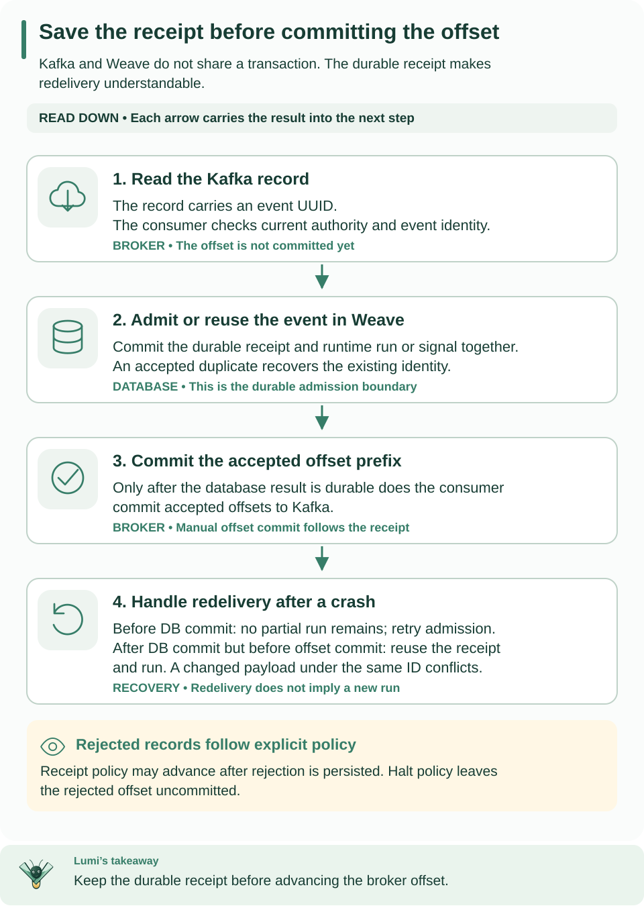

<!--
Copyright 2026 Firefly Software Foundation.

Licensed under the Apache License, Version 2.0 (the "License");
you may not use this file except in compliance with the License.
You may obtain a copy of the License at

    http://www.apache.org/licenses/LICENSE-2.0

Unless required by applicable law or agreed to in writing, software
distributed under the License is distributed on an "AS IS" BASIS,
WITHOUT WARRANTIES OR CONDITIONS OF ANY KIND, either express or implied.
See the License for the specific language governing permissions and
limitations under the License.
Author: Firefly Software Foundation
SPDX-License-Identifier: Apache-2.0
-->

# Kafka broker connector and durable triggers



**How to read this diagram:** Read downward in time. The gap between the database commit and offset commit explains why redelivery must reuse a durable receipt. The two crash cases apply to consumption; publish acknowledgment has its own unknown-outcome rules below.

## Choose publish, consume, or both

A **publish Action** sends a Workflow's JSON object to one configured topic.
A **broker trigger** consumes topic records and starts a pinned Workflow or signals
one existing run. These directions share a connection policy but use different
execution authority. Follow [standalone setup](../guides/standalone.md),
[worker admission](../guides/workers.md), and the
[publication sequence](authoring.md#from-package-to-an-executable-workflow) first.
Have the broker operator supply the cluster identity, topics, advertised endpoints,
TLS CA, and permitted numeric addresses; creating a Weave connection does not
provision a Kafka cluster or grant broker ACLs.

After the provisioning steps below, this complete run-trigger request belongs at
`POST /api/v1/tenants/{tenant}/projects/{project}/environments/{environment}/broker-triggers`:

```json
{
  "name": "order-events", "driver": "kafka",
  "connection_revision_id": "00000000-0000-4000-8000-000000000001",
  "cluster_id": "orders-cluster", "topic": "orders", "kind": "run",
  "activation_id": "00000000-0000-4000-8000-000000000002",
  "payload_schema": {
    "type": "object", "properties": {"order_id": {"type": "string"}},
    "required": ["order_id"], "additionalProperties": false
  },
  "dead_letter_policy": "halt"
}
```

Replace the UUIDs with the connection creation and Workflow activation response
IDs. The target Workflow input schema must accept this payload. Save the returned
trigger `id` and `binding_id`. The record value is `{"order_id":"123"}`, with
exactly one `weave-event-id` UUID header as specified below; arbitrary existing
Kafka records are not automatically valid Weave events.

A successful publish returns `topic`, `partition`, `offset`, and `event_id`.
Consumer acceptance records a receipt containing `run_id` (and `signal_id` for a
signal target). If nothing starts, check the consumer enable flag, scheduler
identity, operator route pins, and broker ACLs before inspecting trigger incidents.
A blocked `halt` route requires fixing the rejected source record/policy and an
explicit authorized retry; retry does not skip the record. A lost publish
acknowledgment requires [incident reconciliation](../reference/incident-operations.md).


The broker family currently supports Kafka only. Install `firefly-weave[server,kafka]` (or build Docker target `kafka-server`) and enable `WEAVE_BROKER_POLICY`. The locked driver is aiokafka 0.14.0 on CPython 3.12/3.13, Linux or macOS with an owned standard selector loop. Core startup without the Kafka extra does not import the driver. An enabled missing or incompatible driver fails startup.

## Provisioning and authority

1. Publish the trusted `weave-kafka@1.0.0` connector descriptor, register its worker release and publish an Action using `publish`. Create a connection revision with `driver: kafka`, a stable `cluster_id`, exact `topics`, `bootstrap` endpoints, and the complete exact `allowed_destinations` list, including every advertised broker and coordinator.
2. Obtain the connection revision UUID returned by the API. Configure operator route pins for that UUID, then restart the replicas that will publish or consume. Pins are infrastructure configuration, not tenant-controlled connection fields. Creating a revision does not require opening a broker connection.
3. Set `WEAVE_BROKER_POLICY` to a JSON object such as the following, using the actual returned UUID and verified operator addresses. Provision the CA file in the deployed image or trusted deployment configuration.

```json
{
  "enabled": true,
  "max_clients": 8,
  "routes": [{
    "connection_revision_id": "00000000-0000-0000-0000-000000000001",
    "advertised": "kafka://broker.example:9093",
    "addresses": ["192.0.2.10"],
    "ca_file": "/etc/weave/kafka-ca.pem"
  }]
}
```

Production connections require verified TLS and `SASL_SSL` with `PLAIN`, `SCRAM-SHA-256`, or `SCRAM-SHA-512`; username is configuration and password is the scoped `password` secret reference. Every dial uses the advertised hostname for TLS verification/SNI and the operator numeric address for TCP. There is no runtime DNS, arbitrary proxy, OAuth callback, GSSAPI, client-certificate authentication, or dynamically discovered destination permission. Unexpected advertised endpoints are denied before dialing or sending credentials. `PLAINTEXT` additionally requires each operator pin's `plaintext: true` and loopback addresses; it is for isolated development only. The isolated `compose.kafka.yaml` profile requires an explicitly pinned image and dedicated port.

4. Publish a Workflow with a connection slot and activate it with the immutable connection revision and connector release pins. The publish Action configuration is `{"topic":"orders"}`. **The Action input object itself is the JSON wire value**: input `{"order_id":"123"}` publishes that object, with no payload wrapper. The capability is `weave-connector-kafka-publish@1.0.0` and its side effect is `non_idempotent`.
5. Create a broker trigger through the environment's `broker-triggers` API or `weave broker-triggers create`, pinning the connection revision, cluster, topic, run activation or signal target, payload schema and explicit `dead_letter_policy` (`receipt` or `halt`). The configuring principal must currently hold `trigger.manage`, the target's `run.start` or `run.signal`, `connection.bind`, and `connection.manage`. A connections-owned source binding is created atomically with the route.
6. Consumer replicas set `WEAVE_KAFKA_CONSUMER_ENABLED=true` and supply the existing execute-only scheduler database URL. API/publish-only replicas leave it false and can still create durable routes for consumer replicas. `max_clients=1` is publish-only; background consumption with that value fails startup.

A source binding retains the exact configuring principal, scope, source, connection and configuration fingerprint. Revocation is available through environment `connection-source-bindings` API routes, typed SDK methods, and `weave source-bindings`. Routes expose read/list/disable/retry and metadata-only incident discovery on the same native API, SDK, CLI and OpenAPI surface. Connection `test` deliberately reports failure for Kafka: a metadata-only connection test has no standing or worker authority to create a credential-bearing client. Use an authorized publish or trigger for a live test.

## Connection request shape

Use the published Connector version `id` in this request, then use the returned
connection revision `id` in operator route pins and triggers. These names are
synthetic; obtain actual endpoints and topic ACLs from your broker operator.

```json
{
  "name": "orders-kafka",
  "connector_version_id": "00000000-0000-4000-8000-000000000003",
  "config": {
    "driver": "kafka", "cluster_id": "orders-cluster",
    "bootstrap": ["kafka://broker.example:9093"], "topics": ["orders"],
    "security_protocol": "SASL_SSL", "sasl_mechanism": "PLAIN", "username": "weave-orders"
  },
  "secretRef": {"password": "orders-kafka-password"},
  "allowed_destinations": ["kafka://broker.example:9093"]
}
```

The one-broker allowlist is complete only for an installation whose bootstrap,
advertised broker and coordinator all use that endpoint. Add every actual
advertised destination and a corresponding operator route pin; a bootstrap
address alone does not authorize newly discovered brokers.

## Delivery and failure semantics

Publishing requires current worker lease/release/connection authority. Credentials are resolved under that authority; checks occur before and after provider I/O, before sending, every second while awaiting acknowledgment, and after acknowledgment. The producer uses `acks=all`, producer-session idempotence and a stable UUID event header derived from the operation key. These do not deduplicate effects across client lifetimes. Lost acknowledgment produces an **unknown** native task outcome and incident, with no hidden new-client retry. Already-sent effects cannot be recalled after revocation.

Consumers use manual commits. A database transaction records the accepted transport receipt and starts the run or delivers its signal together. Only after that transaction commits may the accepted offset prefix advance. A crash before database commit replays without a partial run; a crash after database commit but before Kafka commit replays the same receipt/run. This is local durable deduplication with at-least-once broker delivery, not an atomic database/Kafka transaction.

Transport identity includes tenant, project, trigger, configured cluster, topic, partition and offset. Semantic identity is the valid event UUID within the source. The same event and admitted payload at a new offset references the original run; a changed payload is rejected. Rejected records have a typed rejection receipt and incident, never an invented run ID. Invalid, secret-classified or conflicting rejected content is omitted from persisted evidence, including raw payload hashes and unsafe event identifiers. Rejected events do not reserve semantic identity. Current authority is checked even for receipt replay.

`receipt` durably records rejection before allowing the offset to advance. `halt` durably blocks the route and leaves the offset uncommitted. Explicit authorized retry keeps the route pins and original offset; it does not skip the poison record, which will block again if still invalid. Disable and binding revocation prevent new admission. Operators can inspect the metadata-only incident and fix the source or provision a replacement route through normal authorization.

## Bounds, recovery, and operational limits

| Boundary | Limit or behavior |
| --- | --- |
| JSON value | 1,048,576 canonical serialized bytes; publish input must be an object; admitted consumer values may be any valid JSON |
| Wire metadata | No key; exactly one `weave-event-id` header containing a canonical 36-byte UUID; no extra headers or compression |
| Producer | 30-second maximum send window, with cleanup plus one second reserved inside the Action deadline for reporting; 5-second requests, 1 MiB + 4,096 request bytes, 1 MiB + 1,024 batch bytes |
| Broker configuration | Permit value plus record/request overhead; supplied fixture uses 1 MiB + 4,096 message/fetch allowance |
| Scope capacity | 64 active routes per environment; 16 bootstrap endpoints, 64 topics per connection |
| Local/process capacity | At most 8 client owners process-wide; one publication slot reserved, at most 7 consumers; lower per-app caps also apply |
| Consumer delivery | At most 32 fetched records per batch and 32 assigned partitions; contiguous delivered-prefix commit frontier |
| Credentials/client lifetime | At most 60 seconds; opaque provider-version ownership; no cross-lifetime credential cache |
| Discovery | Independent durable tenant/environment cursors, one scoped route admission per turn, least-recent admission ordering |
| Claim/retry | 65-second database claim, no indefinite renewal; 60-second consumer turn; 5-second failed-start backoff |
| Revocation | Current authority checked at credential/fetch/receipt/commit boundaries and each second while idle; checks bounded to 5 seconds |
| Shutdown/rebalance | 5-second drain/cleanup budgets; admission closes and transports abort before graceful producer stop |

Discovery re-reads durable routes after restart; in-memory clients are not configuration authority. Replicas contend on database claims. Kafka assignment generation independently fences offset commits after rebalance. A database check and a later broker commit cannot be atomically fenced across these systems. Fairness depends on finite eligible routes, available databases and cooperative cleanup; it is not a latency SLA. Periodic client retirement causes rebalances and a bounded credential rotation delay.

Kafka fetch limits are soft protocol limits: brokers may return a larger first batch. Oversized values are rejected on admission, but this is not a hard process-memory bound against a malicious broker. Python cannot forcibly kill a noncooperative thread; stuck owners remain counted rather than allowing unbounded replacements. Driver logs from owned threads are reduced to controlled codes (including exception context); unrelated applications' threads retain normal logging. This reduces low-level diagnostics and avoids leaking SASL usernames, secrets or broker-controlled errors.

Local integration tests exercise SASL PLAIN over verified TLS. SCRAM
configuration follows the driver contract but has not been independently
verified against a live authenticated broker in this release.
