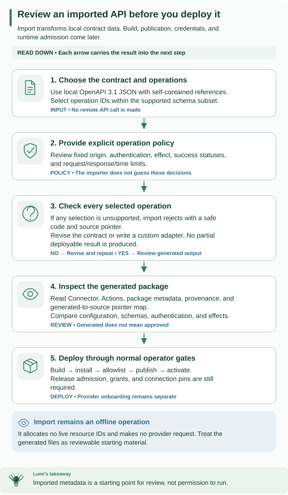

<!--
Copyright 2026 Firefly Software Foundation.

Licensed under the Apache License, Version 2.0 (the "License");
you may not use this file except in compliance with the License.
You may obtain a copy of the License at

    http://www.apache.org/licenses/LICENSE-2.0

Unless required by applicable law or agreed to in writing, software
distributed under the License is distributed on an "AS IS" BASIS,
WITHOUT WARRANTIES OR CONDITIONS OF ANY KIND, either express or implied.
See the License for the specific language governing permissions and
limitations under the License.
Author: Firefly Software Foundation
SPDX-License-Identifier: Apache-2.0
-->

# Offline OpenAPI connector import

Use this guide to turn selected operations in an OpenAPI document into a
connector package you can review. Your first result is local files, with no API
account or Weave server required. [Install the CLI](../installation.md) for your
own document, or use the source example below to learn with a complete fixture.



**How to read this diagram:** Read down through contract selection, policy, and the supported-operation check. A rejection returns you to the source; success produces files to review before the separate deployment step allocates live IDs.

## Choose the integration approach

Import is useful for a commercial service that supplies a local OpenAPI 3.1 JSON
contract whose selected operations fit this page's supported subset. It generates
HTTP operation definitions, not vendor onboarding, account permissions, webhook
verification, or a certified vendor SDK. Obtain the service's document through its
approved distribution channel and review it locally. A Salesforce, SAP, or other
product label does not make unsupported OAuth, OData, GraphQL, or schema features
work automatically. Use [custom package authoring](authoring.md) when an operation
needs a protocol-specific implementation.

## Try the local inventory example

This example is a Python script included in the source repository. From its
root, use `uv run` to select the locked dependencies explicitly. The standalone
CLI installer does not expose its Python packages to your system's `python3`:


```sh
uv run --locked --no-editable --extra openapi python examples/openapi/import_connector.py ./inventory-http
uv run --locked --no-editable --extra openapi weave connector validate ./inventory-http/connector.json --output json
```

The target must not already contain files. The example includes its source and
policy, so no download or account is needed. Expect the message `Review the
generated package at inventory-http. No request was sent.` and a successful
validation result. Inspect `connector.json`, `examples/get-item.action.json`,
`import-provenance.json`, and `src/inventory_http/__init__.py` before building
anything. The provenance file contains the generated-to-source pointer map.
The example selects `getItem`, renames it `get-item`, and fixes the service origin
and `/v1/items/{id}` path. Invocation input is `{"path":{"id":"item-123"}}`.
Its hypothetical response is `{"status":200,"body":{"name":"Widget"}}`.

For your own service, save its document as `api.json` and write `policy.json`
using the policy below, replacing the operation ID, server, effect and statuses
with reviewed values from that document. Run the import without `--directory`
first to inspect diagnostics. A diagnostic's source pointer tells you which
operation/schema needs attention; an unsupported feature requires an explicit
contract/profile decision, not deleting constraints until import passes.

After local review and build, use an [existing API](../guides/connect-to-api.md)
or create one with [standalone setup](../guides/standalone.md), then follow
[package publication and activation](authoring.md#from-package-to-an-executable-workflow).
Keep Connector version IDs, connection revision IDs, worker release IDs, and the
resulting activation ID from those API responses; the importer cannot allocate them.


The SDK and CLI import selected operations from one local, self-contained OpenAPI JSON document. Import produces reviewable Connector/Action definitions, package metadata, provenance and a generated-to-source pointer map. It never fetches schemas, imports package code, builds, installs, publishes, activates, creates credentials or grants destinations.

```python
from pathlib import Path
import json
from firefly_weave.sdk.openapi_import import import_openapi
from firefly_weave.sdk.connectors import scaffold_import

result = import_openapi(
    Path("api.json").read_bytes(), ["getItem"],
    json.loads(Path("policy.json").read_text()),
)
if not result.ok:
    for diagnostic in result.diagnostics:
        print(diagnostic.code, diagnostic.path)
else:
    scaffold_import(Path("reviewed-package"), result)
```

The equivalent CLI prints the same canonical result and exits 0 for a successful import, 1 for invalid/unsupported input and 2 for malformed command usage. Add `--directory reviewed-package` only when you explicitly want the scaffold written into an absent or empty directory.

```sh
weave connector import-openapi api.json --operation getItem --policy policy.json --output json
weave connector import-openapi api.json --operation getItem --policy policy.json --directory reviewed-package
```

The [offline scaffold example](../../examples/openapi/import_connector.py) includes a complete small source document and policy.

A minimal policy is:

```json
{
  "name": "acme-items", "version": "1.0.0", "auth": {"kind": "none"},
  "operations": {
    "getItem": {
      "name": "get-item", "sideEffect": "read_only",
      "server": "https://api.example.test/v1", "statuses": [200]
    }
  },
  "timeoutSeconds": 30, "maxRequestBytes": 1048576, "maxResponseBytes": 1048576
}
```

Selection, action names, side effects, server URL and accepted success statuses are explicit operator decisions. A policy cannot downgrade the operation's declared security. All selected operations share one origin and one auth profile. Review the fixed Connection config under the generated Connector's `configSchema.const`; copy that exact object when creating the Connection and supply only the required secret handles separately. Machine-token endpoint and scopes are also fixed nonsecret policy.

## Supported subset

Exactly OpenAPI `3.1.0` and `3.1.1`; JSON only; GET, HEAD, POST, PUT, PATCH and DELETE; local structural `#/...` pointers with RFC 6901 `~0` and `~1`. No remote/file refs, separate files, URI anchors, rebasing IDs, cycles or dynamic references. Nested schema definitions are supported through document-relative schema pointers. Ref sibling constraints are retained. Non-schema references must target the matching named component collection. Selected schemas are lowered to self-contained Draft 2020-12 schemas and validated with the [existing bounded profile](../reference/schema-profile.md). No format coercion or schema inference from examples.

Absent/default OAS dialect, `https://spec.openapis.org/oas/3.1/dialect/base`, and explicit Draft 2020-12 are accepted only for this supported keyword intersection. Other dialects, `nullable`, discriminator/XML/content-encoding features and unknown schema keywords fail. Null unions are supported for JSON bodies/responses; parameters use the narrower profile below. Secret-marked literals fail before annotations are discarded. Defaults are never materialized.

Operation parameters replace matching path parameters by `(in, name)`. Path templates contain complete `{name}` segments; names must match required path parameters. Server selection uses operation, then path, then document inheritance and must exactly match policy. Servers must be literal HTTPS, with no variables, userinfo, query or fragment. Relative/default servers are not imported.

| Input | Supported serialization |
| --- | --- |
| Path | Required string/integer/boolean; simple, explode false; one percent-encoded segment |
| Query | String/integer/boolean form scalar, or bounded homogeneous scalar array using repeated keys |
| Header | Nonprotected scalar; simple, explode false; no controls or non-ASCII field values |
| Body | Optional/required explicit application/json schema; absent for GET/HEAD |

Parameter strings require `maxLength <= 4096`; arrays require `maxItems <= 100` and bounded scalar items. Objects, nullable/composed parameters, floating-point parameters, cookie parameters, `allowReserved`, `allowEmptyValue`, content parameters and other serialization styles fail. Input groups are `path`, `query`, `headers` and `body`; unknown group/parameter names fail. Optional absent groups stay absent. Empty query arrays are omitted.

Each selected 2xx response must have an explicit application/json schema or absent content for an empty body. HEAD, 204 and 205 require empty responses. No wildcard/default success schema, alternative media, response-header forwarding or response links. Output is `{status, body}` with status-specific validation; undeclared success statuses fail. No partial deployable artifacts are returned when any selected operation fails.

## Authentication and failure boundaries

Security inherits from the document unless an operation overrides it; `security: []` disables inheritance. Anonymous, or one requirement containing one scheme, is supported. OR/AND combinations, optional-auth alternatives and non-OAuth role lists fail. Header API key, basic, bearer and OAuth clientCredentials use the [HTTP profile auth slots](http-profiles.md). Query/cookie API keys, interactive OAuth, refresh-token storage, mutual TLS and OpenID Connect discovery are not implemented.

Every operation requires `read_only` or `non_idempotent`. Read-only additionally requires GET/HEAD; POST query endpoints are conservative non-idempotent operations. There are no inferred idempotency claims or automatic retries. Lost or invalid acknowledgment after a non-idempotent dispatch remains unknown.

The entire document is bounded at 1 MiB, 100,000 JSON nodes and depth 32. The importer indexes at most 1,000 operations and selects at most 100, with 64 parameters and 20 accepted statuses each. Structural refs are capped at 10,000, chain depth 64 and aggregate traversal/expansion work 100,000. Existing schema limits remain stricter where applicable. Aggregate generated JSON is at most 1 MiB. Requests/responses are at most 1 MiB, URLs 16 KiB, headers 32 KiB, attempt timeout 30 seconds. Policy may lower request/response/timeout limits.

JSON validity/budgets, duplicate IDs/path ambiguities, unsafe/unresolved/cyclic structural references, credential-bearing metadata and security-reference existence are checked globally, including unused definitions. Other unsupported executable semantics are checked on the selected closure; an unused unsupported operation is not represented as supported. Literal examples/defaults are not interpreted as reference structures. Errors retain canonical value-free codes, source pointers and raw-JSON source ranges. The current implementation stops at the first bounded error; it never advertises an exact omitted count.

Prose and example values are not copied into artifacts. Known credential fields, URL userinfo and credential query parameters, and classified schema literals are rejected; this is not a detector for arbitrary secrets hidden in arbitrary prose or business data. Source documents must already be appropriate for local authoring. Provenance records digests and safe operation locations rather than raw source text.

## Review, build and install

The generated wrapper is fixed native code. It injects the shared HTTP profile service, and all imported operation text stays JSON. The package uses the package manifest, capability, and digest checks. Review the generated files before explicitly invoking `weave connector package reviewed-package --directory dist`. Install the reviewed wheel as an operator deployment operation, allowlist its exact entry point, and use `weave connector test ID --mode native`. Native testing proves composition only; generated scaffolds do not declare a fake live conformance test. Scaffolding anchors every directory component with no-follow handles, rejects symlinked ancestors and concurrent directory/file replacement or contamination, and writes the build declaration last. An interrupted scaffold has an incomplete marker and cannot be packaged by the authoring API.

Existing publication, Connection and worker-release SDK/API/CLI operations consume these generated definitions; no tenant installation API or import HTTP route is added. The clean installed acceptance fixture separately builds and installs a generated package, verifies native singleton composition, compiles its Actions and executes read/write wire contracts against an owned TLS fixture with a dropped write acknowledgment. That is contract testing, not live provider verification.

The versioned normative reference is [OpenAPI 3.1.1](https://spec.openapis.org/oas/v3.1.1.html); the restrictions above are explicit Weave subset choices. Future GraphQL needs parsed selected-operation and schema contracts; GET/POST does not classify its effect. Future OData needs explicit protocol version, ETags, CSRF and provider semantics. No GraphQL/OData/SAP/Oracle adapter is shipped by this importer.
