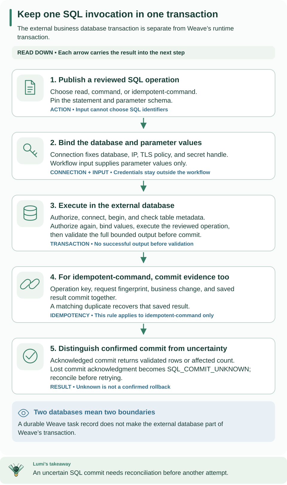

<!--
Copyright 2026 Firefly Software Foundation.

Licensed under the Apache License, Version 2.0 (the "License");
you may not use this file except in compliance with the License.
You may obtain a copy of the License at

    http://www.apache.org/licenses/LICENSE-2.0

Unless required by applicable law or agreed to in writing, software
distributed under the License is distributed on an "AS IS" BASIS,
WITHOUT WARRANTIES OR CONDITIONS OF ANY KIND, either express or implied.
See the License for the specific language governing permissions and
limitations under the License.
Author: Firefly Software Foundation
SPDX-License-Identifier: Apache-2.0
-->

# SQL connectors: PostgreSQL

Use this guide when a workflow needs to read or write a business PostgreSQL
database. Start with the read-only customer lookup below. Its success criterion
is an expected row result from the approved database; compiling its Action alone
does not query that database. Weave's own runtime database is a separate service.



**How to read this diagram:** Read down from the reviewed operation and connection to the external transaction and its result. Step 4 applies only to idempotent-command; ordinary commands do not gain that protection. A lost COMMIT acknowledgment remains unknown even after cleanup.

## First lookup: from connection to rows

This guide's first useful operation is a bounded lookup in an **external**
PostgreSQL database. Use an [existing API](../guides/connect-to-api.md) or create
one with [standalone setup](../guides/standalone.md), and arrange
[native worker admission](../guides/workers.md), then follow the
[Connector publication sequence](authoring.md#from-package-to-an-executable-workflow).
The business database and its credentials are separate from Weave's own database.

1. Ask the database owner for a reviewed `business.customers` table, a dedicated
   read login, its canonical server IP/port, database name, and trusted TLS CA.
   Check the table restrictions below before granting access.
2. Put the password behind an operator-scoped handle, here `customer-db-password`.
   Publish the installed PostgreSQL descriptor and use its returned version ID in
   this complete connection request:

```json
{
  "name": "customer-db",
  "connector_version_id": "00000000-0000-4000-8000-000000000001",
  "config": {
    "dialect": "postgresql", "host": "10.20.0.15", "port": 5432,
    "database": "customers", "user": "weave_reader", "role": "read", "tls": "verify-full"
  },
  "secretRef": {"password": "customer-db-password"},
  "allowed_destinations": ["postgresql://10.20.0.15:5432"]
}
```

The UUID and address are placeholders. A private address additionally needs the
operator network policy below; the certificate must cover the actual IP.
`role: read` selects the connector's access profile, not a PostgreSQL role name.

3. Publish [`postgresql.action.yaml`](../../examples/definitions/postgresql.action.yaml),
   bind the returned connection revision to the Workflow slot, and activate with
   the admitted PostgreSQL release. That Action takes this exact input:

```json
{"parameters":{"customerId":"customer-123","rowLimit":10}}
```

A matching row can produce `{"rowCount":1,"rows":[{"customer_id":"customer-123","status":"active"}]}`;
no matches produce `{"rowCount":0,"rows":[]}`. Actual row values come from your table.
A successful connection test does not prove this query's privileges or supported
table shape. On failure, inspect the fixed SQL code and run incident, compare the
Action's parameter names/types, and have the owner check grants/table metadata.
For `SQL_COMMIT_UNKNOWN`, reconcile the external operation before retrying; the
lookup example is read-only, but commands have different recovery rules below.


SQL is the connector family. The installed adapter is **`weave-postgresql`**, dialect
**`postgresql`**, version **`1.0.0`**. PostgreSQL is the only implemented driver.
There is no portable-SQL claim or Oracle/MySQL/SQL Server adapter. Publish the
installed trusted descriptor, then a reviewed Action such as
[`postgresql.action.yaml`](../../examples/definitions/postgresql.action.yaml).

An invocation receives its statement and parameter schema from the published,
pinned Action. Input contains only `parameters`; values never become identifiers.
Each invocation owns one connection and one explicit external transaction,
independent of the platform UnitOfWork. The native PyFly service uses constructor
injection; it retains resource limits, never an actor, lease, secret or connection.

| Action | Side effect | Connection role |
| --- | --- | --- |
| `read` | `read_only` | Dedicated read role, default read-only, no target-table or column write grants; `BEGIN READ ONLY` |
| `command` | `non_idempotent` | Dedicated command role |
| `idempotent-command` | `idempotency_key` | Command role plus the provisioned operation ledger |

Each action has its own reserved capability `weave-connector-postgresql-<action>@1.0.0`
and immutable descriptor binding. Releases and scoped worker connection grants
must explicitly authorize that capability and Connection revision.

## Supported grammar

The initial PostgreSQL profile accepts one fully consumed statement. It tokenizes
at most 16 KiB / 1,024 tokens, then emits SQL from parsed operations, identifiers
and positional value binds. Tokens are ASCII, identifiers are unquoted and folded
to lowercase, and every relation is explicitly `schema.table`.

```sql
SELECT customer_id, status FROM business.customers
WHERE customer_id = :customerId LIMIT :rowLimit
INSERT INTO business.customers (customer_id, status) VALUES (:customerId, :status)
UPDATE business.customers SET status = :status WHERE customer_id = :customerId
DELETE FROM business.customers WHERE customer_id = :customerId
```

SELECT permits optional equality predicates joined by AND and an optional bound
LIMIT. UPDATE and DELETE require WHERE. Commands permit explicit RETURNING
columns. Lists/predicates are limited to 64 entries. Repeated named values share
a positional bind; Action `parameters` schemas and input names must match exactly.

Rejected syntax includes literals, comments, semicolons, quoted identifiers,
SELECT *, functions, casts, CTEs, joins, subqueries, OR, DDL, COPY, CALL, session/role
changes and transaction control. This intentionally small grammar is not a general
SQL parser. Unsupported queries must be redesigned or await another reviewed profile.

Only ordinary, non-owned tables without inheritance, RLS or rules are accepted.
Columns must use the reviewed built-in scalar types; domains, arrays, JSON,
custom types and generated columns are unsupported. Commands additionally reject
user triggers, check/foreign/exclusion constraints and expression/partial indexes;
INSERT rejects tables with defaults or identity columns (ALWAYS and BY DEFAULT).
Primary/unique keys and NOT NULL are allowed.
The connector takes a table lock before metadata checks. Operators must own/review
schema changes and maintain least privilege; this is not protection against a
malicious database administrator. Parsing alone cannot prove arbitrary database
side effects absent. Extending this profile to triggers, sequences or functions
requires explicit treatment of effects that rollback cannot reverse.

## Connection and destination policy

Connection config has exactly `dialect`, `host`, `port`, `database`, `user`, `role`
and `tls`. `secretRef` contains only `password`. `allowed_destinations` contains
exact **`postgresql://IP:port`** origins, with IPv6 brackets where needed.

**Only canonical IP literals are supported in this release.** DNS names, URLs/DSNs,
paths, sockets, host lists and DSN query options are rejected. asyncpg receives
explicit host/port/database/user/password/TLS and `/dev/null` as its password file;
external connections never fall back to the platform database or an environment DSN.

`tls: verify-full` is the default. Both certificate chain and the IP SAN are
verified. The operator can supply `WEAVE_POSTGRES_CA_FILE`; connection authors
cannot select certificates or disable verification. Private ranges require
`WEAVE_POSTGRES_PRIVATE_NETWORKS` (JSON CIDR array). Link-local/metadata, multicast,
unspecified and reserved destinations remain denied under the shared address policy.
For an explicitly permitted local deployment only, `tls: disable` also requires
its IP in operator-only `WEAVE_POSTGRES_PLAINTEXT_NETWORKS`. Both arrays default empty.
HTTP destination validation remains HTTP-specific and unchanged.

At most `WEAVE_POSTGRES_MAX_CONNECTIONS` external invocations own connections per
process (default 8; range 1–64). Semaphore waits consume the attempt deadline.
Connections are never pooled/shared by URL, role, revision or credential version.
Connect timeout is 5 seconds, bounded additionally by the remaining attempt budget.
A separate 2-second cleanup budget attempts rollback/close, then terminates the
socket. These are process-local limits, not cluster-wide capacity admission.

## Bounds and mappings

Action config sets `statementTimeoutMs` (1–30,000, default 10,000), `maxRows`
(1–10,000, default 100), `maxBytes` (32–1,048,576, default 1 MiB), and `mappings`.
The outer attempt deadline bounds acquisition, metadata, statement, fetch and
commit together. A transaction-local PostgreSQL statement timeout applies to each
command; zero never disables it.

The driver fetches one row at a time, checks the row cap and exact serialized UTF-8
JSON envelope, and validates the Action output before COMMIT. It fails on overflow;
RETURNING overflow rolls back the command. No partial success is returned.
`rowCount` means returned rows when RETURNING/SELECT produces columns; otherwise
it is the affected count from the validated command tag. It does not count every
indirect effect. Streaming does not cap affected rows or server work.

| Database value | Required mapping | JSON value |
| --- | --- | --- |
| numeric/decimal | `decimal` | Exact finite decimal string |
| date | `date` | ISO date string |
| timestamp/timestamptz | `datetime` | ISO string; preserves available offset |
| time/timetz | `time` | ISO string |
| bytea | `base64` | Standard base64 string |
| UUID | `uuid` | UUID string |

Null stays null. Primitive text, boolean, integers and finite floats need no
mapping. Mapping/type mismatches, non-finite values and unsupported values fail.
Binary/temporal/decimal parameter coercion is not implicit: task values must match
the driver-inferred bind type; this profile primarily supports JSON scalar binds.

**Memory limit:** asyncpg can decode a single large field before Python can reject
it. The 1 MiB bound controls retained/accepted output, not arbitrary peak process
memory. Approved database projections/field constraints and process isolation are
needed when database data is untrusted or unbounded.

## Idempotency, authority and ambiguous outcomes

Provision the following ledger in the external database using a separate schema
owner; the connector never creates schemas or tables. Grant the command role
USAGE on the schema and SELECT/INSERT/UPDATE on this table only. Maintain this
ordinary table without triggers, custom types, defaults or rewrite policies.

```sql
CREATE SCHEMA weave_connector;
CREATE TABLE weave_connector.operations (
  scope text NOT NULL,
  operation_key text NOT NULL,
  request_hash text NOT NULL,
  result jsonb,
  PRIMARY KEY (scope, operation_key)
);
```

The scope is the immutable, globally unique Connection revision ID, which the
platform binds to tenant/project/environment. The fingerprint covers the pinned
Action identity, reviewed config and full input. The unique operation record,
business change and bounded result commit together. Concurrent duplicates wait
on that unique record and recover the saved result. Reusing a key for a different
request fails. A new revision is a new idempotency namespace. Do not discard or
mutate ledger records while deliveries may recur. No library/application retry
silently reexecutes a business command.

Before connecting, before the business statement and immediately before COMMIT,
PostgreSQL requires the active invocation's `ActionContext.authorize` callback.
Native execution rechecks the live lease, exact saved pins, current principal,
release capability and unrevoked connection grant without secret-provider I/O.
The callback fails closed when absent and expires when invocation execution exits.
A denial before COMMIT rolls back. Credentials are resolved once per invocation.

There is an unavoidable cross-database check-to-COMMIT race: a revocation committed
after the final authorization check cannot atomically cancel the external commit.
No distributed transaction or instantaneous revocation guarantee is claimed.

Any timeout, cancellation or transport failure after entering COMMIT without an
acknowledgment yields `SQL_COMMIT_UNKNOWN` / `outcome: unknown`; later rollback or
socket cleanup never proves that commit did not happen. Unsafe command recovery
opens `WV-TASK-AMBIGUOUS`; operators reconcile before replay. Idempotent commands
can safely recover the ledger on an authorized redelivery; this connector does
not automatically retry them. Earlier cancellation propagates after cleanup.
Stable failures carry codes only, never driver text, SQL, bind values or credentials.
Connection tests prove reachability/authentication, not complete Action privilege
or table-profile compatibility.
