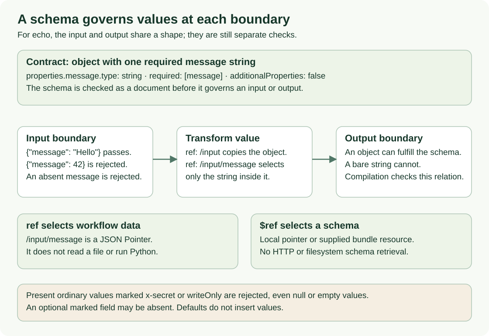

<!--
Copyright 2026 Firefly Software Foundation.

Licensed under the Apache License, Version 2.0 (the "License");
you may not use this file except in compliance with the License.
You may obtain a copy of the License at

    http://www.apache.org/licenses/LICENSE-2.0

Unless required by applicable law or agreed to in writing, software
distributed under the License is distributed on an "AS IS" BASIS,
WITHOUT WARRANTIES OR CONDITIONS OF ANY KIND, either express or implied.
See the License for the specific language governing permissions and
limitations under the License.
Author: Firefly Software Foundation
SPDX-License-Identifier: Apache-2.0
-->

# Read and write definition contracts

A **definition** is a versioned YAML or JSON document that describes a workflow,
an action, or a connector. Its **contract** is the set of rules that say which
fields it may contain and what they mean. This page is the precise lookup for
those rules: document shape, expressions, step kinds, actions, connectors, value
limits, and diagnostics.

**Who it is for.** Integration developers who write definitions by hand and
tool builders who generate them. Process designers who draw in
[Studio](guides/studio.md) do not need it: Studio writes these documents for you,
and its **Source** tab shows the result.

**What you need.** Nothing to read the reference. To run the 5-minute example,
the project's Python environment from a source checkout (see
[Install the current source](installation.md#install-the-current-source)). For a
guided first workflow, start with the [quickstart](quickstart.md) and
[workflow authoring](guides/workflow-authoring.md) instead.

## How a definition is checked

A definition passes four separate checks before it does real work. Each answers a
different question, and passing one never implies the next:

| Question | Who checks it | Example of a failure |
| --- | --- | --- |
| Is the document well shaped? | `load_definition`: required fields, step kinds, strict types | `durationSeconds: "10"` is a string where an integer is required |
| Is the source valid so far? | `validate_source`: parsing plus checks that need no catalog | An unsupported schema keyword or expression shape |
| Can this exact set of dependencies become executable? | `compile_source`: resolves an explicit catalog, checks expressions and types | A missing action version, or a reference to an unavailable step output |
| May it run here, now? | Publication, activation, and the runtime: scoped grants, ready resources, run input | A revoked grant, an unavailable integration connection, or invalid run input |

A **catalog** is the explicit, immutable set of definitions and capabilities the
compiler resolves references against. A workflow with no external dependencies
compiles against an empty catalog. A successful compilation does not establish a
worker, connection, credential, or permission; partial validation never returns
an artifact, even when its checks pass.



Read the three rows from top to bottom: accepted and rejected input, reading the
whole object versus one string, and data references (`ref`) versus schema
references (`$ref`). The definition's shape and the values its schemas accept are
separate checks.
[Open diagram at full size](diagrams/authoring-schema-boundaries.svg)

## Try the checks locally

This example shows that the three offline checks give three different answers
for the same document. It needs no server, provider, or network.

1. **Save the script.** It builds a workflow that returns its string input
   unchanged, then loads, validates, and compiles it. Save it as
   `contract_checks.py`:

    ```python
    from firefly_weave.compiler.api import compile_source, validate_source
    from firefly_weave.compiler.catalog import CatalogSnapshot
    from firefly_weave.contracts.definitions import load_definition

    document = {
        "apiVersion": "weave/v1alpha1",
        "kind": "Workflow",
        "metadata": {"name": "echo", "version": "1.0.0"},
        "spec": {
            "inputSchema": {"type": "string"},
            "outputSchema": {"type": "string"},
            "steps": [],
            "output": {"ref": "/input"},
        },
    }
    model = load_definition(document)
    partial = validate_source(document, format="object")
    compiled = compile_source(
        document, format="object", catalog=CatalogSnapshot.from_definitions([])
    )
    print(model.kind)
    print(partial.validation_ok, partial.partial, partial.artifact is None)
    print(compiled.ok, compiled.artifact is not None)
    ```

2. **Run it from the checkout root.** Use the project environment so the import
   resolves to this source tree:

    ```sh
    # Run the example with the checkout's locked Python environment.
    uv run python contract_checks.py
    ```

    Expected:

    ```text
    Workflow
    True True True
    True True
    ```

    The first line comes from shape validation, the second from partial
    validation (passed, partial, no artifact), and the third from complete
    compilation (passed, artifact present).

3. **Read what the document says.** `{"ref": "/input"}` is an expression that
   reads the run input; `{"literal": "/input"}` would return that string instead.
   `spec.output` is required even when `steps` is empty. The schema describes
   permitted input; it is not the input. A run of this workflow accepts
   `"hello"`, while `{"text": "hello"}` fails runtime input validation.

If the import fails, run `uv sync --locked` from the checkout root, then try
again. If the output differs, compare your document with the one above field by
field: every field name is case-sensitive.

## Document shape

Every definition has four top-level fields:

| Field | Value |
| --- | --- |
| `apiVersion` | Always `weave/v1alpha1`, the workflow language version |
| `kind` | `Workflow`, `Action`, or `Connector` |
| `metadata` | `{name, version}`. Names allow letters, digits, dots, underscores, and hyphens. Versions follow SemVer 2.0, including prerelease and build identifiers |
| `spec` | The kind-specific fields described below |

References to other definitions are exact `name@version` strings, such as
`onboarding.check-customer@1.0.0`. Unknown fields are rejected.

**Wire names are camelCase.** Documents use the published camelCase field names
(`inputSchema`, `timeoutSeconds`). Python model attributes are snake_case, but
snake_case keys in a document are rejected. Serialize Python models with
`model_dump(by_alias=True)` or `model_dump_json(by_alias=True)`.

**Some fields may be omitted but never set to null.** These are the workflow's
`timeoutSeconds` and `callable` (and its `allowedCallers`), an action's
`connection` and `routing`, an action step's `connection`, and a call step's
`onFailure` and `businessKey`. When present they must have their declared type;
an explicit `null` is rejected. Both serializers preserve the omission, and the
Python model shows an omitted field as `None`.

`load_definition` checks shape only. It does not parse source text, validate the
embedded JSON Schemas, resolve dependencies, compile, or authorize anything. The
contracts package imports no PyFly application, provider, network, database, or
secret code.

## Expressions

An **expression** computes a value from workflow data. Every expression is an
object with exactly one of these keys:

| Form | Meaning | Example |
| --- | --- | --- |
| `literal` | A fixed JSON value | `{literal: "Ready for review"}` |
| `ref` | A JSON Pointer (RFC 6901) into workflow data; the empty pointer reads the root | `{ref: /input/customerId}` |
| `object` | An object whose fields are expressions | `{object: {customerId: {ref: /input/customerId}}}` |
| `array` | A list whose items are expressions | `{array: [{ref: /input/a}, {literal: 1}]}` |
| `op` | An operator with expression arguments: `{op: {name, args}}` | `{op: {name: eq, args: [{ref: /input/urgent}, {literal: true}]}}` |

Operators are `eq`, `ne`, `lt`, `lte`, `gt`, `gte`, `and`, `or`, `not`, `exists`,
`coalesce`, `contains`, `notContains`, `in`, `notIn`, `startsWith`, `endsWith`,
`concat`, and `join`. `concat` joins one or more strings, numbers, or Booleans
into one string; `join` takes a list of such values and a separator string. Numbers
are written as JavaScript writes them (`2.0` becomes `2`, `1e21` stays `1e+21`).
There are no function calls, scripts, environment variables, or
file access. The compiler checks arity, types, and scope; the
[compiler reference](reference/compiler.md#cli-and-published-catalog-contract)
explains evaluation rules.

In Studio, the property editor writes these same forms, which it calls **Value**
(`literal`), **Data** (`ref`), **Fields** (`object`), **List** (`array`), and
**Formula** (`op`). See
[Decide where a value comes from](guides/studio-step-reference.md#decide-where-a-value-comes-from).
An action input whose schema lists fields is edited field by field instead, with
**Value**, **Data**, or **Formula** on each row; Studio still stores the result
as one of these expressions (see
[Map the input](guides/studio-step-reference.md#4-map-the-input)).

## Steps

Every step has an `id` and a `kind`. The `kind` decides which other fields are
allowed. The Studio column shows the name the step picker uses; the BPMN column
helps if you know process modeling from another tool:

| `kind` | Studio name | Closest BPMN idea | Other fields |
| --- | --- | --- | --- |
| `action` | **Call an action** | Service task | Required `uses` (exact action reference) and `with` (input expression); optional `connection` slot name |
| `llm` | **AI task** | Service task | Required `uses` (exact AI action reference), `profile` (an `llmProfiles` entry), `prompt` and `context` expressions, and `connection` slot name |
| `transform` | **Transform** | Script or business rule task (expressions only) | Required `value` expression |
| `decisionTable` | **Decision table** | Business rule task | Required `uses` (exact decision table reference) and `with` (input expression) |
| `switch` | **Decision** | Exclusive gateway | Nonempty `cases: [{when, steps, output}]` and required `default: {steps, output}` (the **Otherwise** path in Studio); the first true case wins |
| `parallel` | **Parallel** | Parallel gateway (split and join) | Nonempty `branches: {name: {steps, output}}` and a positive integer `concurrency`; every branch completes before the step continues |
| `wait` | **Wait for time** | Timer intermediate event | Required positive integer `durationSeconds` |
| `signal` | **Wait for signal** | Message intermediate event | Required `name`, positive integer `timeoutSeconds`, and a `payloadSchema` object |
| `humanTask` | **Human task** | User task | Required `assignment` (the name of an assignment bound at activation), `title` and `context` expressions, and `formSchema`; `decisions` defaults to `approve`, `reject` (1 to 32 unique names); optional positive `dueSeconds` and `expirySeconds` |
| `fail` | **Fail** | Error end event | Required business-error `code` (a name such as `customer-not-found`) and a nonempty `message` |
| `forEach` | **Loop over items** | Multi-instance subprocess | Required `items` (an expression that gives a list) and `body: {steps, output}`; optional `concurrency` (default 1), `maxItems` (default 1000), and `collect` (`all`, the default, or `nonNull`). The defaults are written into the stored document |
| `callWorkflow` | **Call a workflow** | Call activity | Required `uses` (exact workflow reference) and `with` (input expression); optional `mode` (`wait`, the default, or `detach`), `onFailure` (`stop` or `continue`, only with `wait`), and `businessKey` expression |

Weave is not a BPMN engine and does not import BPMN files. Loops and calls to
other workflows are part of the language; compensation is not.

**New language constructs.** `forEach`, `callWorkflow`, `concat`, and `join`
each need a language feature: `flow.forEach`, `flow.callWorkflow`, `text.concat`,
and `text.join`. Their document shape is final, so `load_definition` accepts
them, but this version of the compiler reports `WV-COMP-UNSUPPORTED_FEATURE` at
each use instead of compiling it. A platform runs a construct only when its
[language manifest](#language-manifest) lists the feature. Step IDs can never
contain `[`, `#`, or `~`, which keeps
[instance keys](reference/compiler.md#instance-keys) unambiguous.

Branches may contain zero steps, but each must declare its `output`. The compiler,
not the shape check, enforces unique step IDs, unique signal names, branch scope,
output compatibility, and concurrency budgets.

**Human tasks** need an environment assignment binding at activation, and
completing one requires the current claim and task permission. A workflow with a
human task compiles to IR version `weave/ir-v1alpha2`; other workflows keep
`weave/ir-v1alpha1`. Follow the [human-task walkthrough](guides/human-tasks.md)
before activating one.

**Retry and timeout belong to the action, not the step.** In Studio,
**Call an action** creates an `action` step whose `uses` selects a published
action version. That action's implementation selects the worker task or
connector operation. Retry policy and action timeout are fields of the action
definition; they are not legal on a workflow step.

## Workflow spec

| Field | Required | Meaning |
| --- | --- | --- |
| `inputSchema` | Yes | JSON Schema for the run input ([schema profile](reference/schema-profile.md)) |
| `outputSchema` | Yes | JSON Schema for the run output |
| `steps` | Yes | The ordered list of steps; may be empty |
| `output` | Yes | Expression that computes the run output |
| `timeoutSeconds` | No | Positive whole-run timeout; omit it for no workflow-wide timeout |
| `connections` | No (default `{}`) | **Connection slots**: named requirements `{connector: <exact ref>, required: <bool>}`; `required` defaults to `true`. Each slot is bound to an integration connection at activation |
| `callable` | No | Lets other workflows call this exact version with `callWorkflow`: `{}` allows any workflow in the project, and `{allowedCallers: [order-intake]}` allows only the named workflows (1 to 100 unique names). Studio will write it from a **Called by a workflow** trigger; the manifest marks the field `pending` until then |

A callable workflow, and a loop over a list that builds text for each item:

```yaml
# notify-customer@1.0.0 accepts calls from order-intake only.
spec:
  callable:
    allowedCallers: [order-intake]
---
# One reminder per invoice, four at a time, collected in invoice order.
- id: notify
  kind: forEach
  items: {ref: /input/invoices}
  concurrency: 4
  body:
    steps:
      - id: subject
        kind: transform
        value:
          op:
            name: concat
            args: [{literal: "Invoice "}, {ref: /item/number}, {literal: " is overdue"}]
    output: {ref: /steps/subject/output}
```

The full examples are in
[examples/language](../examples/language/).

## Actions

An **action** is a published, versioned definition of one external call. Its
`spec` contains:

| Field | Required | Meaning |
| --- | --- | --- |
| `implementation` | Yes | Either `{kind: worker, taskType, taskVersion}` or `{kind: connector, uses: <exact connector ref>, action: <descriptor action name>, config: {...}}`; `config` is optional and is checked against that connector action's `configSchema` |
| `sideEffect` | Yes | `read_only`, `idempotent`, `idempotency_key`, or `non_idempotent` |
| `timeoutSeconds` | Yes | Positive timeout for one attempt |
| `inputSchema`, `outputSchema` | Yes | JSON Schemas for the action's input and output |
| `retry` | No | Defaults to `maxAttempts: 1`, `initialDelaySeconds: 1`, `maxDelaySeconds: 30`; attempts include the first one, and the maximum delay cannot be smaller than the initial delay |
| `connection` | No | The connection requirement, same shape as a workflow slot |
| `routing` | No | `{queue}` selects a named worker queue |

**The declared side effect governs retries.** It decides whether automatic and
operator retries are allowed. It does not prove that the external system really
is idempotent.

## Connectors

A **connector** is trusted code that knows a protocol, such as the built-in
`weave-http@2.0.0`. Its published manifest is a `Connector` definition whose
`spec` requires:

- `adapter`: the installed adapter identity.
- `configSchema` and `authSchema`: what an integration connection supplies.
- `compatibility: {apiVersion: weave/v1alpha1}`.
- `actions`: a nonempty map of named action descriptors. Each requires
  `inputSchema`, `outputSchema`, `sideEffect`, and `timeoutSeconds`, may declare a
  `configSchema` for the action's `config`, and uses the same retry defaults as an
  action.
- `limits`: positive integers `maxRequestBytes`, `maxResponseBytes`, and
  `maxTimeoutSeconds`. These published I/O bounds are separate from the operator's
  compiler budgets.

Manifests contain no Python source or import paths. To build one, see
[Author a connector](connectors/authoring.md); to call a REST API without
writing one, see [Call a REST API without code](connectors/http-without-code.md).

## Language manifest

The **language manifest** lists every step kind, operator, and workflow field the
language defines, the features each one needs, the features the platform runs,
and the language limits. Studio will read it to decide what to offer. Read it with
`weave remote language` or `GET /api/v1/tenants/{tenant}/projects/{project}/language`
(`language.read`, capability `catalog.read`); Studio's local host serves the same
document at `/studio/contracts/language`, and `weave schema export` writes its
schema as `language-manifest.schema.json`.

| Field | Meaning |
| --- | --- |
| `version`, `language_version` | `weave/language-manifest-v1` and `weave/v1alpha1` |
| `ir_versions` | The executable IR versions the platform accepts |
| `features` | The language features the platform runs; empty in this version |
| `limits` | `max_loop_items`, `default_loop_max_items`, `max_loop_depth`, `max_concurrency`, `max_run_iterations`, `max_call_depth` |
| `step_kinds`, `operators`, `workflow_fields` | One entry each, with the `feature` it needs (if any) and `studio`: `ready` when Studio edits it, `pending` until then |

## Values and budgets

Definitions and payloads use plain JSON values: null, Boolean, integer, float,
string, list, and object with string keys. Models reject:

- Infinite or NaN floats.
- Integers outside `[-9007199254740991, 9007199254740991]`.
- Lone Unicode surrogates, bytes, and Python-only objects.

This applies to schema and literal fields and to numeric definition fields.
Models are frozen Pydantic models, but nested lists and dictionaries remain
ordinary JSON containers, so immutability is shallow.

The operator's `Limits()` defaults bound compilation:

| Limit | Default | What it measures |
| --- | ---: | --- |
| `max_source_bytes` / `max_payload_bytes` | 1,048,576 | Source and payload size in bytes |
| `max_steps` | 1,000 | Steps in one definition |
| `max_depth` | 32 | Nesting depth |
| `max_document_nodes` | 100,000 | Parsed values, including the root, containers, and scalars (mapping keys excluded) |
| `max_expression_nodes` | 10,000 | Expression nodes, counted by the compiler stage that owns expressions |
| `max_diagnostics` | 100 | Diagnostics returned per result |

Definitions cannot change these budgets. Building a model alone does not apply
them; the compiler does.

## Diagnostics

Every problem the compiler reports is a **diagnostic** with these fields:

| Field | Meaning |
| --- | --- |
| `code` | Stable identifier, such as `WV-COMP-TYPE_MISMATCH` |
| `severity` | `error`, `warning`, or `info` |
| `stage` | `parse`, `schema`, `resolution`, `semantic`, `lowering`, or `evaluation` |
| `message` | Safe, plain-language explanation; never contains submitted values |
| `path` | JSON Pointer into the parsed definition, such as `/spec/output` |
| `source` | Optional source range: optional `file`, required 1-based `line` and `column`, optional paired `endLine` and `endColumn` (the end never precedes the start) |
| `related` | Other locations, each with `path`, optional `source`, and optional `message` |
| `hint` | Optional next step |
| `suggestedEdit` | Optional `{path, value}` fix; since 0.1.0a7, Studio's **Apply suggested edit** applies it |

The compiler sorts, truncates, maps sources, and redacts diagnostics; the models
only define their shape. When the parser stops early, its result keeps the capped
`diagnostics`, an `omitted_count` of issues left out, and `truncated` (true when
`omitted_count` is greater than zero). Compiler and CLI results keep this
metadata. YAML source ranges recognize CR, LF, CRLF, NEL, line separator, and
paragraph separator as line breaks; JSON recognizes CR, LF, and CRLF only.

## Packages and project checks

The base package contains the offline compiler and depends on no PyFly code.
Optional extras add the rest:

| Extra | Adds |
| --- | --- |
| `client` | Authenticated remote CLI and SDK operations (HTTP client, credential store) |
| `studio` | The Studio local host |
| `server` | The API: PyFly web, security, relational data, PostgreSQL, OIDC, scheduling, migrations |
| `worker` | Remote workers: PyFly client and telemetry |
| `integration` | PostgreSQL, HTTP, and Kafka clients for integration tests |
| `kafka` | The Kafka client for broker triggers and the Kafka connector |
| `teams` | The Microsoft Teams provider |
| `openapi` | PyFly base only, for offline native OpenAPI generation |

Every extra that needs PyFly pins the published **PyFly 26.9.15** wheel by direct
URL and SHA-256, and `uv.lock` records the artifact and its dependencies. See
[runtime version and lifecycle](reference/local-runtime.md#runtime-version-and-lifecycle).
`contracts.openapi.create_openapi_generator` returns the native OpenAPI generator
with Weave's constraint policy; base compiler and schema exports remain PyFly-free.
See [native OpenAPI](reference/native-openapi.md). Provider specifics stay outside
the contracts package.

For contributors, `make check` runs strict source coverage, the documentation
link and SVG checks, a strict documentation build, Ruff lint and format checks,
strict mypy, unit and contract tests, and release packaging checks. Integration
tests never skip silently: a named real-backend test fails clearly when its
backend is absent. The `integration` and `e2e` pytest markers are registered.

## Next steps

- [Author a workflow](guides/workflow-authoring.md): validate, compile, and
  simulate the echo workflow step by step.
- [Schema profile](reference/schema-profile.md): the JSON Schema rules for
  `inputSchema`, `outputSchema`, `payloadSchema`, and `formSchema`.
- [Compiler](reference/compiler.md): results, artifacts, and how to read a
  diagnostic.
- [Choose and configure a workflow step](guides/studio-step-reference.md): the
  same steps as Studio presents them.

## Troubleshooting

| What you see | Why | What to do |
| --- | --- | --- |
| A field is rejected although it looks right | Field names are camelCase and case-sensitive; snake_case keys are rejected | Use the published name, such as `timeoutSeconds` |
| `null` is rejected for an optional field | Optional fields may be omitted but not set to null | Remove the field |
| A step's `retry` or `timeoutSeconds` is rejected | Retry and per-attempt timeout belong to the action definition | Move them to the action; use `spec.timeoutSeconds` for a workflow-wide timeout |
| `WV-COMP-UNSUPPORTED_FEATURE` | The document uses `forEach`, `callWorkflow`, `concat`, or `join`, which this version of the compiler does not compile yet | Keep the document for a later version, or replace the construct with the steps the compiler supports |
| `onFailure` is rejected on a call step | `onFailure` applies only when the call waits for its result | Remove `onFailure`, or set `mode: wait` |
| Partial validation passes, but there is no artifact | Partial validation never produces one | Compile with an explicit catalog |
| Compilation passes, but the run fails to start | Compilation proves no worker, connection, or permission | Check the activation's bindings and your grants |
