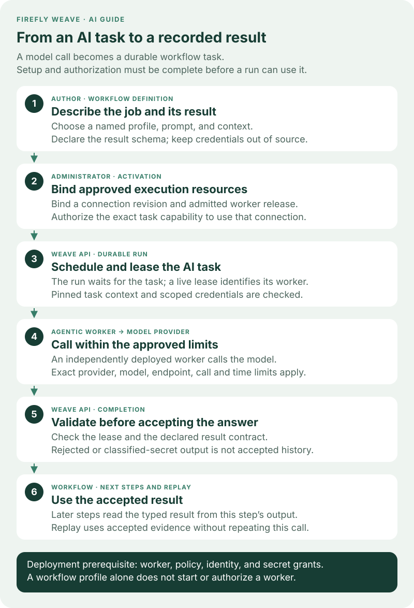

<!--
Copyright 2026 Firefly Software Foundation.

Licensed under the Apache License, Version 2.0 (the "License");
you may not use this file except in compliance with the License.
You may obtain a copy of the License at

    http://www.apache.org/licenses/LICENSE-2.0

Unless required by applicable law or agreed to in writing, software
distributed under the License is distributed on an "AS IS" BASIS,
WITHOUT WARRANTIES OR CONDITIONS OF ANY KIND, either express or implied.
See the License for the specific language governing permissions and
limitations under the License.
Author: Firefly Software Foundation
SPDX-License-Identifier: Apache-2.0
-->

# Run AI steps with an Agentic worker

Use an **AI task** when a business process needs a model's answer before it
continues. For example, a workflow can summarize a support request, then give
that summary to a person for review. You define the expected result; Weave
accepts the answer only if it satisfies that contract.

Use [Weave AI](weave-ai.md) when *you*, the person using Studio, want an
explanation or a proposed definition change. Weave AI has separate configuration
and does not execute workflow AI tasks.

The examples here use Weave **0.1.0a14** and the **0.1.6 Agentic worker package**,
whose core dependency is
pinned to that Weave version. The catalog references below retain their own
`1.0.0` definition and task versions.

## Follow one AI task from authoring to completion



[Open the workflow lifecycle diagram at full size](../diagrams/ai-workflow-lifecycle.svg).
Read the numbered cards from top to bottom:

1. **The author describes the work.** A step names a workflow AI profile and
   supplies a prompt and context. The profile specifies the provider, model,
   limits, and schema of the expected answer.
2. **The administrator makes execution possible.** Published definitions,
   an admitted worker release, an authorized connection revision, and the
   appropriate grants must be available. Activation pins the execution resources.
3. **Weave creates a durable task.** When the run reaches the AI step, it waits
   for a worker to claim a lease. The worker receives the pinned task context and
   requests credentials through the lease-scoped API.
4. **The worker calls the provider.** An independently deployed Agentic process
   checks its operator policy and applies the configured call and time limits.
5. **Weave checks completion.** A current lease and a valid result are required.
   A malformed answer cannot silently become successful workflow output.
6. **The run continues with accepted evidence.** Later steps can use the answer.
   Replay uses that accepted result; it does not ask the model to generate it again.

The AI step resolves its named `spec.llmProfiles` entry at compilation. Its
canonical Action is `weave-agentic-generate@1.0.0`; the Action delegates to the
worker task capability `weave-agentic.generate@1.0.0`. These two identifiers serve
different purposes: select the Action in the workflow and grant the task
capability to the worker.

The Weave server never imports Agentic or contacts a model provider. The worker
source and locked environment are in `workers/agentic`. This independent Python
3.13 process uses Firefly Agentic 26.9.0, pinned to the verified `v26.09.0` release
wheel and its SHA-256. Weave retains its Python 3.12 server requirement.

Agentic worker 0.1.5 uses the alpha13 SDK. Its installed task protocol was checked
against an unchanged alpha12 API, including recovery from explicit admission
capacity rejections before the model starts. That check used a simulated model.
A separate Azure acceptance completed one new workflow with `gpt-4o-mini` through
`azure-chat`: one model request returned the expected `{"ok": true}` result, and
replay was consistent. Replay did not verify authorization. The API, Weave AI and
Operations services remained on alpha12 with schema 0030; no new Weave AI call was
made. This verifies the tested deployment, not general compatibility between
different versions or providers. See [alpha13 verification](../capabilities.md#alpha13-verification)
for the exact scope and the separately retained alpha12 acceptance evidence.

## Set up the responsibilities before authoring


[Open the configuration roles diagram at full size](../diagrams/ai-configuration-roles.svg).
One person can perform several roles, but each configuration still has a separate
purpose and authorization boundary.

| Person | What they configure | What it makes possible |
| --- | --- | --- |
| Deployment operator | Worker process, identity, exact model/endpoint policy, network access, and scoped secret grants | A trusted service can reach Weave and an approved model provider. |
| Environment administrator | Published Connector and Action, provider connection, worker release, worker grants, and activation bindings | The chosen worker can execute the exact task using the chosen connection revision. |
| Workflow author | Workflow AI profile, prompt, context, output schema, and connection slot | The definition describes what to ask and how later steps can use the answer. |

**Secret provisioning is an operator step.** A connection stores an `apiKey`
*handle*, not the API key itself. The operator maps that handle to a secret in
`WEAVE_SECRET_GRANTS`, scoped to the tenant, project, and environment. The API
loads that grant list at startup; adding or changing a grant requires an API
restart or deployment rollout. Mounted secret-file contents are resolved when
used, which is separate from changing the grant list. Follow
[Give integrations their secrets](../operations/identity-and-secrets.md#give-integrations-their-secrets)
for the supported file and environment providers. Saving a handle in Studio does
not provision its secret or grant access to it.

Studio's **New AI connection** uses the standard OpenAI or Anthropic endpoint
automatically. **Advanced: custom endpoint** is available for an approved proxy
or compatible service. Azure requires the resource endpoint and API version
from its administrator. Review shows the exact saved endpoint; hostname case
and the default HTTPS port are normalized, while the base path and trailing
slash are preserved. The worker or Weave AI gateway must still allow that exact
endpoint. Existing endpoint policies are not changed by saving a connection.

**Saved · Not tested** means that the connection configuration passed validation.
It does not prove provider access, model availability, or worker/gateway readiness.
Workflow AI profiles and Weave AI settings remain separate and select their own model
or Azure deployment using the approved connection.

**Hosting Weave in Azure does not select an AI provider.** The Azure operator
still deploys the worker, supplies its configuration and token file, permits its
network traffic, and sets up the API's secret grants. An Azure model endpoint is
one provider choice; an Azure-hosted Weave API can also use another supported,
explicitly approved provider. Worker deployment and model choice are independent.
See [deployment](../operations/deployment.md) for service identity and worker
release provisioning.

## Author your first AI task

After the administrator has prepared the environment:

1. Add an **AI task** in Studio and select the canonical AI Action from the
   connected catalog. If it is missing, the administrator must publish it first.
2. Open **Configure workflow AI profiles** and create a named profile. The first
   fields choose the provider, model and maximum response tokens. Describe the
   expected result with the schema designer. **Advanced model settings** contains
   optional generation controls, reasoning strategies and execution limits.
   Start with the `none` reasoning pattern for a single structured answer.
3. Select that profile on the step. A name such as `summarizer` is local to this
   workflow; it is not a provider credential or a Weave AI setting.
4. Supply the **prompt** (the instruction) and **context** (the data to use).
   Map only the input or earlier step data needed for this task. The provider
   receives these values, so omit credentials and unnecessary sensitive data.
5. Choose the **connection slot**. The slot declares the provider Connector;
   activation binds it to an authorized environment connection revision.
6. Validate the workflow, resolve readiness problems, then publish and activate
   through the normal workflow process. Starting a run is a separate action.

Studio checks model settings against the same profile contract as the API before
allowing you to continue. Errors such as a per-call timeout longer than the total
step timeout must be corrected first. This is a configuration check, not proof
that the selected model is approved or reachable. Expanding or collapsing
advanced settings preserves edits; clearing an optional control omits that value.
Weave AI uses the same basic and advanced presentation for its separate profile.

The [AI task inspector reference](studio-step-reference.md#ai-task) explains the
Studio controls. The following complete source example summarizes a supplied
text into a typed string result. `gpt-4o` illustrates an explicit model ID; replace
it with a model approved and available in your deployment, and update the
worker policy to match.

```yaml
apiVersion: weave/v1alpha1
kind: Workflow
metadata:
  name: summarize-request
  version: 1.0.0
spec:
  inputSchema:
    type: object
    properties:
      text: {type: string}
    required: [text]
    additionalProperties: false
  outputSchema: {type: string}
  connections:
    ai-provider:
      connector: weave-agentic-provider@1.0.0
  llmProfiles:
    summarizer:
      provider: openai-chat
      model: gpt-4o
      options:
        max_tokens: 256
      reasoning:
        pattern: none
      maxCalls: 1
      timeoutSeconds: 60
      outputSchema: {type: string}
  steps:
    - id: summarize
      kind: llm
      uses: weave-agentic-generate@1.0.0
      profile: summarizer
      connection: ai-provider
      prompt:
        literal: Summarize the supplied text in one sentence.
      context:
        ref: /input/text
  output:
    ref: /steps/summarize/output/result
```

Here `summarizer` selects the profile, `ai-provider` selects the connection slot,
and `/steps/summarize/output/result` selects the validated model answer. The
step's full output also includes provider, model, and usage metadata. Compiling
this example requires the canonical Connector, Action, and worker task catalog;
a source-valid profile alone does not prove that a worker or credential is ready.
The compiler may report `WV-COMP-UNKNOWN_COMPATIBILITY` for the generic AI Action
input contract. Runtime validation of the pinned profile and answer still applies;
the example does not disable that validation.

The remaining sections walk the operator and administrator through that setup.

## Install and export the catalog

From the repository root:

```sh
uv sync --project workers/agentic --locked --python 3.13
workers/agentic/.venv/bin/weave-agentic-worker --catalog > agentic-catalog.json
workers/agentic/.venv/bin/weave-agentic-worker --release-manifest > agentic-release.json
```

The catalog contains `weave-agentic-provider@1.0.0`, the worker Action
`weave-agentic-generate@1.0.0`, and the exact task capability. Complete these
operations in order:

1. Register the worker release with its image digest and the exported task and
   credential capabilities. This makes the task available to the compiler.
2. Publish the Connector and then the Action through the normal definition APIs.
   Publishing the Action before admitting its task returns `WV-COMP-UNKNOWN_TASK`.
3. Create the provider connection described below, then use the worker connection
   grant API to authorize the release and task capability for that exact revision.
4. Activate the workflow with explicit worker-release and connection-revision pins.

A published definition, an admitted worker release, and a running worker are
separate prerequisites. Completing one does not automatically complete the others.

The Action is `non_idempotent` and allows one attempt. A provider request can
incur charges even when its result is lost. Weave fences completion and preserves
accepted results for replay; it cannot promise exactly one provider request
after an ambiguous network failure.

## Configure the provider connection

In Studio, open **Settings → AI models → New AI connection**. The same action is
available from **Connections** and the AI task inspector. You need
`connection.manage` in the environment. If the provider Connector is not yet
published, the form explains the prerequisite; an author cannot bypass it.

Studio alpha11 guides this setup through three steps. Alpha10 presents the
same fields in a single form.

1. **Provider:** enter a **Connection name** that identifies the intended account
   or purpose, choose **Provider**, and select **Continue**. The model or Azure
   deployment name belongs in the workflow profile.
2. **Access:** copy the exact operator-approved **Provider endpoint**. For Azure,
   also enter the explicit **Azure API version**. Enter the **API key secret
   handle** supplied by the operator, never the raw API key, then select
   **Review connection**. The Azure endpoint hint has no trailing slash; copy
   the approved endpoint exactly rather than inventing a different spelling.
3. **Review:** check the name, provider, endpoint, API version when applicable,
   and secret handle. **Back** preserves these details so you can correct them.
   Select **Create AI connection** only when they are ready. Earlier steps do
   not create a connection or send a model request.
4. Record the created connection and revision. Studio restricts allowed
   destinations to the endpoint's HTTPS origin, and the operator's worker policy
   must also permit the endpoint. The platform checked configuration, not live
   provider connectivity. Complete worker release and credential grants before
   binding it to an executable workflow.

For API clients, create a connection for the published provider Connector with
this configuration:

```json
{
  "provider": "openai-chat",
  "endpoint": "https://api.openai.com/v1",
  "secretSlot": "apiKey"
}
```

Set `secretRef.apiKey` to the existing secret handle and add the endpoint's
origin, for example `https://api.openai.com`, to `allowed_destinations`. Azure
connections additionally require an explicit `apiVersion`, such as the version
approved for your deployment. The supported provider selectors are
`openai-chat`, `openai-responses`, `azure-chat`, `azure-responses`, and `anthropic`.
Model IDs and Azure deployment names are supplied explicitly.

The server validates this configuration without provider I/O. The generic
connection test returns unsuccessful because this connection is executed by the
remote worker; it does not claim to test provider credentials. A successful AI
task is the end-to-end provider check.

## Apply the worker's model and endpoint policy

Mount a policy file owned by the operator:

```json
{
  "models": [{"provider": "openai-chat", "model": "gpt-4o"}],
  "endpoints": ["https://api.openai.com/v1"]
}
```

These are exact allowlists, with no wildcard model or endpoint selection. The
model name above illustrates the format; use models available to your provider
account. A workflow cannot set a provider URL, secret value, custom tool class,
or arbitrary model settings. Every task must satisfy the deployment policy and
its bound connection's destination list. Configure the worker's network policy
to allow only those provider destinations and Weave.

The provider clients disable environment proxies, redirects, and automatic SDK
retries. Model options are checked by the pinned Agentic `ModelOptions` and
provider settings resolver. Unsupported options fail before credential lookup;
they are not silently dropped.

## Start the worker

Provide these explicit deployment settings:

| Setting | Value |
| --- | --- |
| `WEAVE_API_URL` | Weave API origin |
| `WEAVE_ENVIRONMENT_URL` | Scoped `/api/v1/tenants/.../projects/.../environments/...` path |
| `WEAVE_WORKER_RELEASE_ID` | Admitted worker release UUID |
| `WEAVE_WORKER_TOKEN_FILE` | Mounted worker access-token file; use this or OAuth configuration, never both. |
| `WEAVE_WORKER_OAUTH_CONFIG_FILE` | Mounted client-credentials configuration JSON; alternative to the access-token file. |
| `WEAVE_AGENTIC_POLICY_FILE` | Mounted policy JSON file |

Choose exactly one authentication mode:

- **Access-token file:** the operator refreshes `WEAVE_WORKER_TOKEN_FILE`; each
  HTTP request reads the current token.
- **OAuth client credentials:** set `WEAVE_WORKER_OAUTH_CONFIG_FILE` to an
  operator-owned JSON file with the four fields below. The worker obtains and
  renews its own short-lived access token from the configured identity provider.

```json
{
  "token_endpoint": "https://login.microsoftonline.com/YOUR_TENANT_ID/oauth2/v2.0/token",
  "client_id": "YOUR_WORKER_APPLICATION_ID",
  "scope": "api://YOUR_WEAVE_API_APPLICATION_ID/.default",
  "client_secret_file": "/run/secrets/worker-client-secret"
}
```

This illustrates Microsoft Entra ID's client-credentials configuration. Use your
actual tenant, registered worker application, API scope, and mounted secret file.
The worker identity must already be trusted and linked to a Weave application
principal with the required grants; acquiring a token does not create authority.
This machine credential authenticates to **Weave**, while the provider
connection's `apiKey` authenticates to the **model provider**.

OAuth configuration is fixed when the worker starts. The client secret is read
again on token acquisition, and a cached token is refreshed before its reported
expiry. Acquisition is bounded to ten seconds, ignores environment proxies,
does not follow redirects, and does not retry. Tokens are attached only to the
configured HTTPS Weave API origin. A refused API request is not replayed after
refresh, which avoids silently repeating a state-changing operation.

The worker principal needs only its task/credential grants. The worker registers
one instance with capacity one and drains on `SIGTERM` or `SIGINT`. Lease renewal
failure cancels the running model call. No database or administrator credentials
are needed.

```sh
workers/agentic/.venv/bin/weave-agentic-worker
```

Or build the independent image from the repository root:

```sh
docker build -f workers/agentic/Dockerfile -t weave-agentic-worker:local .
```

Run it with the environment settings and read-only mounted policy and authentication files.
The image runs as UID 65532; make those files readable by that UID. It uses the
separate locked Python 3.13 environment and does not change the server image.

## Reasoning, limits, and results

Model reasoning effort (`options.reasoning`) is separate from the orchestration
pattern (`reasoning.pattern`). The patterns are `none`, `react`,
`chain_of_thought`, `plan_and_execute`, `reflexion`, `tree_of_thoughts`, and
`goal_decomposition`. They run without user-defined tools or persistent memory.
Each invocation constructs a new agent; workflow and assistant configurations
must be authorized separately.

`options.max_tokens` limits each model response. `maxCalls` bounds all model
calls across a reasoning pattern and its final structured answer. `timeoutSeconds`
bounds the entire task handler, including connection and credential lookups.
The worker additionally rejects provider-reported output usage above
`maxCalls * options.max_tokens`. Provider-reported token limits are checked after
responses; they are not an exact advance guarantee of billed input tokens.
`reasoning.maxSteps` bounds pattern iteration; a shared call budget also bounds
patterns that fan out. Tree of thoughts uses two candidate branches.

After reasoning, one final call synthesizes the declared result through a
structured output schema. This call uses the same request and time budget.
Without a reasoning pattern, there is only the structured answer call. Any
internal provider failure prevents completion, even if a pattern returns a
partial result. The result must pass Weave's bounded schema validator.

The only completion payload is:

```json
{
  "result": {"approved": true},
  "usage": {"requests": 2, "inputTokens": 120, "outputTokens": 40},
  "provider": "openai-chat",
  "model": "gpt-4o"
}
```

Raw reasoning traces, provider response objects, credentials, and exception text
are not returned or logged. The worker disables framework/provider content logs
and reports safe failure codes such as `LLM_LIMIT`, `LLM_TIMEOUT`, and
`LLM_OUTPUT`. Responses API storage is disabled.

Accepted results are durable workflow data. The profile's `outputSchema` is
part of the pinned result contract: a result containing an `x-secret` or
`writeOnly` value is rejected before its value or output hash enters history.
The run opens an incident with `WV-SCHEMA-SECRET_VALUE`. Manual reconciliation
uses the same profile contract; it cannot admit the rejected secret. Simulation
mocks also pass that contract before being stored, and history exports apply
the profile's classification defensively.

This guarantee applies to declared classifications. It does not detect
undeclared sensitive text. Keep credentials in connection secret slots, and
declare confidential result fields in the profile schema. Provider handling
of prompts and responses still follows the operator's provider agreement.

## Verify the worker

```sh
cd workers/agentic
uv run --locked pytest
uv run --locked ruff check src tests
uv run --locked mypy
```

Tests execute real Agentic patterns with deterministic fake
models, verify all five provider constructors, and exercise the real Weave SDK
worker through mocked HTTP lease/context/credential/completion endpoints. These
checks do not establish live model availability or provider account permissions.
The platform integration tests additionally activate the canonical catalog,
claim a real database-backed task, enforce the pinned credential grant, and
verify completion, output guards, replay, and classified-result rejection.

A separate Azure preproduction check on alpha10 used real Microsoft Entra ID
application tokens and an independently deployed Agentic worker to complete an
Azure OpenAI workflow. Its accepted result replayed consistently. This verifies
that configured deployment and model path; it does not certify other providers,
models, environments, or interactive Entra sign-in for people.

## Check readiness one layer at a time

| What you see | What to check next |
| --- | --- |
| The AI Action is missing from Studio | Publish the canonical Connector and Action in the connected catalog. |
| The profile or connection slot is invalid | Check the named `llmProfiles` entry, provider match, required options, and connection requirement. |
| A connection handle exists but credentials are unavailable | Ask the operator to check the exact environment-scoped secret grant and secret source; a new grant needs an API rollout. |
| Activation cannot bind a worker or connection | Check the admitted release, task capability, worker authority, and exact connection-revision grant. |
| The task waits without being claimed | Check that the independently deployed worker is running, authenticated, and has capacity for its admitted release. |
| The call fails with a safe LLM error | Check the allowed model/endpoint, provider access, output contract, and configured budgets. A generic connection test does not validate remote provider credentials. |

To pass results between AI steps in one workflow execution, follow
[Share context between AI steps](shared-ai-context.md). Context is explicit
workflow data; it is not a persistent conversation shared by unrelated runs.

For assistance while editing, continue with [Weave AI](weave-ai.md). Enabling
Weave AI is a separate setup; it neither starts this worker nor changes any
workflow profile.
