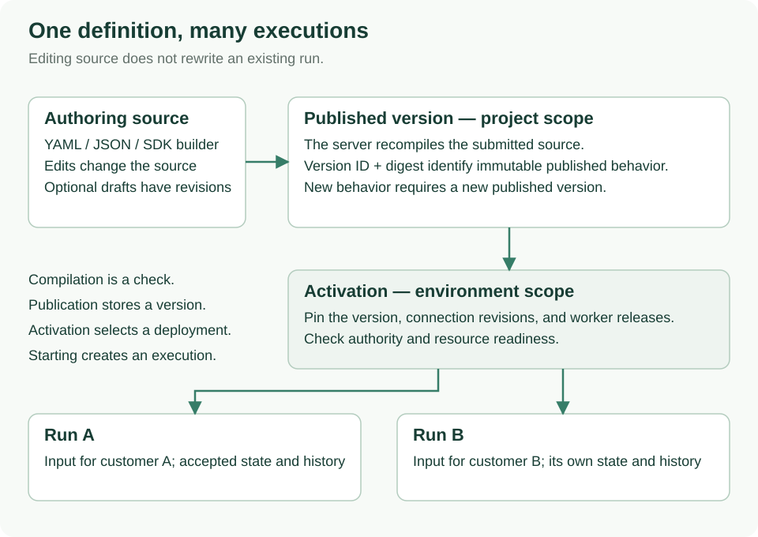

<!--
Copyright 2026 Firefly Software Foundation.

Licensed under the Apache License, Version 2.0 (the "License");
you may not use this file except in compliance with the License.
You may obtain a copy of the License at

    http://www.apache.org/licenses/LICENSE-2.0

Unless required by applicable law or agreed to in writing, software
distributed under the License is distributed on an "AS IS" BASIS,
WITHOUT WARRANTIES OR CONDITIONS OF ANY KIND, either express or implied.
See the License for the specific language governing permissions and
limitations under the License.
Author: Firefly Software Foundation
SPDX-License-Identifier: Apache-2.0
-->

# Operate a workflow from the CLI

This tutorial turns the offline `echo` workflow into a real saved execution using
CLI commands. You will capture each returned ID, use it in the next request, and
inspect the result. Nothing in this path requires writing a Python host application.

Complete [chapter 1](../quickstart.md) and [chapter 2](standalone.md) first.
Chapter 1 creates the YAML; chapter 2 supplies the API, identity, scope, and grants.
Keep the API running. A token alone cannot create workflows in an arbitrary scope.



Read the arrows as the resource IDs carried between commands. Publication creates
a version; activation selects its environment; starting creates a run. The next
sections perform those operations individually.

## 1. Understand the four command boundaries

| Boundary | Command examples | What it changes |
| --- | --- | --- |
| Local authoring | `workflow validate`, `compile`, `explain`, `simulate` | Local files and computed results only |
| Authenticated API client | `definitions publish`, `definitions activations create`, `runs start` | Scoped server resources |
| Privileged administration | `admin migrate`, `admin bootstrap` | Database schema or initial identity mapping; explicit owner credentials |
| Worker packaging/deployment | `worker package`, `worker deploy` | Artifacts or an explicitly selected local Compose deployment |

`weave workflow compile` does not publish anything. `weave definitions publish`
does not start a worker. `weave worker deploy` does not provision a database, an
identity provider, or a cloud cluster. Keeping these operations separate lets a
product author workflows without receiving infrastructure administrator access.

## 2. Restore the tutorial client

In terminal 1, restore the printed `cd` and `source .../session.env` commands from
chapter 2. If the installation is stopped, follow its [resume procedure](standalone.md#resume-this-installation-later).
Load the existing identity/runtime configuration and request a current token:

```sh
set -a
source "$WEAVE_WORK_DIR/identity.env"
source "$WEAVE_WORK_DIR/runtime.env"
set +a
"$WEAVE_PYTHON" "$WEAVE_WORK_DIR/refresh-token.py"
```

Stop if refresh fails. Then define a shell function selecting the installed
version from chapter 2; the function applies only to this terminal:

```sh
weave() { "$WEAVE_PYTHON" -I -m firefly_weave.cli.main "$@"; }
weave version --output json
weave --help
weave definitions --help
weave definitions activations create --help
```

Help is hierarchical. Start at a command family, then inspect the particular
operation. In a source checkout without this function, use `uv run weave` for
local commands and install the `client` extra for remote operations.

Configure the client from the saved first-run receipt:

```sh
umask 077
export WEAVE_CLI_DIR="$WEAVE_WORK_DIR/cli-tutorial"
mkdir -p "$WEAVE_CLI_DIR"
export WEAVE_BASE_URL="http://127.0.0.1:$WEAVE_API_PORT"
export WEAVE_ACCESS_TOKEN="$(python3 -c 'import json,os; print(json.load(open(os.environ["WEAVE_WORK_DIR"]+"/host-token.json"))["access_token"])')"
export WEAVE_TENANT_ID="$(python3 -c 'import json,os; print(json.load(open(os.environ["WEAVE_WORK_DIR"]+"/first-run.json"))["scope"]["tenant_id"])')"
export WEAVE_PROJECT_ID="$(python3 -c 'import json,os; print(json.load(open(os.environ["WEAVE_WORK_DIR"]+"/first-run.json"))["scope"]["project_id"])')"
export WEAVE_ENVIRONMENT_ID="$(python3 -c 'import json,os; print(json.load(open(os.environ["WEAVE_WORK_DIR"]+"/first-run.json"))["scope"]["environment_id"])')"
weave remote catalog --output json > "$WEAVE_CLI_DIR/catalog.json"
```

A successful catalog read confirms API reachability, authentication, and project
read authority. It does not prove permission for every mutation. Chapter 2 grants
the developer/deployer/operator/viewer roles used below. If you used a replacement
first-run receipt, use that successful path in every command above.

The request/response files below contain workflow data and real resource IDs.
They stay in the ignored private work directory. Repeating their generation
replaces these tutorial files; retain a copy before changing a completed exercise.

## 3. Validate locally, then publish

Inspect the original source with the CLI:

```sh
weave workflow validate .local/tutorial/echo.workflow.yaml --output json
weave workflow explain .local/tutorial/echo.workflow.yaml \
  --catalog .local/tutorial/empty-catalog.json
```

Validation without a catalog is partial. `explain` uses the supplied empty catalog
to resolve this workflow and display its executable plan; neither command calls
the API. Now create a publication request. Give this exercise the distinct name
`cli-echo` so it does not share publication identity with the SDK exercise:

```sh
python3 - <<'PY'
import json, os
from pathlib import Path
source = Path('.local/tutorial/echo.workflow.yaml').read_text()
assert '  name: echo\n' in source, 'Use the unchanged chapter 1 workflow'
source = source.replace('  name: echo\n', '  name: cli-echo\n', 1)
root = Path(os.environ['WEAVE_CLI_DIR'])
(root / 'publication-request.json').write_text(json.dumps({'source': source, 'format': 'yaml'}))
PY
weave definitions publish --collection workflows \
  --request "$WEAVE_CLI_DIR/publication-request.json" \
  --idempotency-key cli-echo-publish-1 --output json \
  > "$WEAVE_CLI_DIR/version.json"
```

Continue only if the command exits successfully. The response contains `id`,
`name`, `version`, and `digest`. The API recompiles the source against its catalog
before recording the immutable version. Inspect the safe identifiers:

```sh
python3 - <<'PY'
import json, os
from pathlib import Path
version = json.loads((Path(os.environ['WEAVE_CLI_DIR']) / 'version.json').read_text())
print(version['id'], version['name'], version['version'], version['digest'])
PY
```

## 4. Activate that exact version

An activation binds the version to an environment. Echo has no external Actions,
so it needs no connection or worker release bindings. Build the request from the
actual publication response and configured scope:

```sh
python3 - <<'PY'
import json, os
from pathlib import Path
root = Path(os.environ['WEAVE_CLI_DIR'])
version = json.loads((root / 'version.json').read_text())
request = {
    'version_id': version['id'],
    'artifact_digest': version['digest'],
    'scope': {
        'tenant_id': os.environ['WEAVE_TENANT_ID'],
        'project_id': os.environ['WEAVE_PROJECT_ID'],
        'environment_id': os.environ['WEAVE_ENVIRONMENT_ID'],
    },
}
(root / 'activation-request.json').write_text(json.dumps(request))
PY
weave definitions activations create \
  --request "$WEAVE_CLI_DIR/activation-request.json" \
  --idempotency-key cli-echo-activate-1 --output json \
  > "$WEAVE_CLI_DIR/activation.json"
```

Expected: a response with its own activation `id`, `revision`, and `request`.
The activation ID differs from the published version ID. Stop on failure; do not
use an error-response file as input to the next step.

## 5. Start and inspect a run

Supply the activation ID and one business input:

```sh
python3 - <<'PY'
import json, os
from pathlib import Path
root = Path(os.environ['WEAVE_CLI_DIR'])
activation = json.loads((root / 'activation.json').read_text())
request = {'activation_id': activation['id'], 'input': {'message': 'Hello from the CLI'}}
(root / 'run-request.json').write_text(json.dumps(request))
PY
weave runs start --request "$WEAVE_CLI_DIR/run-request.json" \
  --idempotency-key cli-echo-run-1 --output json > "$WEAVE_CLI_DIR/run.json"
```

After a successful start, read the returned run and its history:

```sh
export WEAVE_CLI_RUN_ID="$(python3 -c 'import json,os; print(json.load(open(os.environ["WEAVE_CLI_DIR"]+"/run.json"))["id"])')"
weave runs read "$WEAVE_CLI_RUN_ID" --output json
weave runs history "$WEAVE_CLI_RUN_ID" --limit 50 --output json
```

Expected: `state.status` is `succeeded`, with
`state.output: {"message": "Hello from the CLI"}`. If the first read is not
terminal, repeat the read; do not start another run just to check progress.
History contains the accepted facts for this run, rather than the local simulator's
in-memory session. Save the run ID for later investigation.

## 6. Understand retries and authentication failures

An **idempotency key** identifies one intended mutation. Keep these keys when
retrying the exact same request in the same scope after a connection interruption.
Use a new run key when you intentionally want another execution. Changing the
request body while reusing its key conflicts; changing published behavior also
requires a new definition version and publication/activation keys.

| Symptom | Meaning and next action |
| --- | --- |
| Exit 2 / local configuration error | Inspect command help, scope variables, and exact JSON request shape |
| `401` after a pause | Refresh `host-token.json`, then reload `WEAVE_ACCESS_TOKEN` from it |
| `403` | Check the identity link and the capability grant in the requested scope |
| Conflict | Check whether this key or immutable definition version belongs to an earlier request |
| Transport failure | The outcome may be unknown; keep the key and inspect before retrying |
| Run waits for a task | Check the admitted worker release, instance, grants, and queue; publication alone does not start a worker |

When finished with remote CLI calls, remove the bearer token from this shell:

```sh
unset WEAVE_ACCESS_TOKEN
```

For interactive human authentication, see [CLI login and secure persistence](../reference/cli.md#login-and-secure-persistence).
The tutorial uses the existing application identity so every command shares one
known local scope.

## 7. Move from a workflow to a deployed worker

The echo workflow needs no worker. An external Action adds this separate lifecycle:

1. Implement its handler and declare its task contract in a worker manifest.
2. Build/package the worker with its installed dependencies.
3. Admit the exact release and provision the worker's scoped identity/grants.
4. Activate a workflow bound to that release.
5. Start the process or container; it registers, claims tasks, and reports results.
6. Start a workflow run and inspect its actual output and external receipt.

Follow [chapter 3's complete local deployment](../operations/deployment.md) for
commands and concrete resource IDs. `worker package` prepares a deployment context; the documented `docker build`
command builds that context; `worker deploy --target compose` starts an exact
owned local container. The plural `workers` commands manage server-side releases
and instances. These are distinct command families.

For a remote installation, continue with [AWS, Azure, and GCP deployment](../operations/cloud-deployment.md).
The same API/CLI workflow lifecycle applies there, but cloud CLIs and Kubernetes
manage infrastructure and processes. There is no `weave deploy --target aws`
command in this release.

## Use these commands with a cloud installation

After completing the [Kubernetes acceptance steps](../operations/kubernetes.md),
use its verified token and saved cloud scope. Skip the local setup in section 2:
loading local `runtime.env` or `first-run.json` would select the wrong installation.
Keep the same checkout and chapter 1 YAML. Select the installed matching client
with `WEAVE_PYTHON` and set `WEAVE_API_URL` to the actual HTTPS API origin, or to
the active operator-only loopback tunnel described in the Kubernetes guide.

```sh
weave() { "$WEAVE_PYTHON" -I -m firefly_weave.cli.main "$@"; }
umask 077
export WEAVE_CLI_DIR="$WEAVE_CLOUD_DIR/cli-tutorial"
mkdir -p "$WEAVE_CLI_DIR"
export WEAVE_BASE_URL="$WEAVE_API_URL"
export WEAVE_ACCESS_TOKEN="$(python3 -c 'import json,os; print(json.load(open(os.environ["WEAVE_CLOUD_DIR"]+"/host-token.json"))["access_token"])')"
export WEAVE_TENANT_ID="$(python3 -c 'import json,os; print(json.load(open(os.environ["WEAVE_CLOUD_DIR"]+"/first-run.json"))["scope"]["tenant_id"])')"
export WEAVE_PROJECT_ID="$(python3 -c 'import json,os; print(json.load(open(os.environ["WEAVE_CLOUD_DIR"]+"/first-run.json"))["scope"]["project_id"])')"
export WEAVE_ENVIRONMENT_ID="$(python3 -c 'import json,os; print(json.load(open(os.environ["WEAVE_CLOUD_DIR"]+"/first-run.json"))["scope"]["environment_id"])')"
weave remote catalog --output json > "$WEAVE_CLI_DIR/catalog.json"
```

Continue with sections 3–6. The requests and commands are identical; the API,
identity, and resource IDs select the remote environment. If a token expires,
repeat the cloud guide's verified acquisition and reload `WEAVE_ACCESS_TOKEN`.
Cloud IAM login does not provide a Weave access token. For new installations,
create the scope/grants first; do not copy a local UUID into the cloud request.
