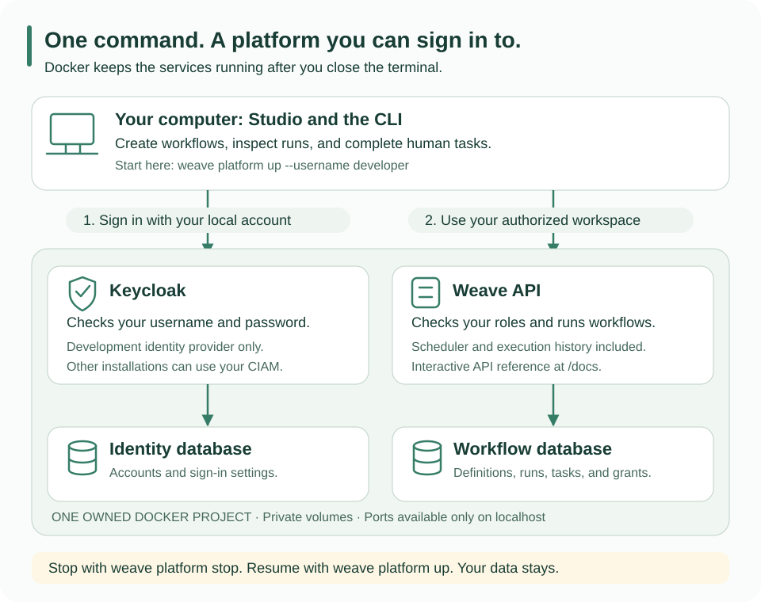

<!--
Copyright 2026 Firefly Software Foundation.

Licensed under the Apache License, Version 2.0 (the "License");
you may not use this file except in compliance with the License.
You may obtain a copy of the License at

    http://www.apache.org/licenses/LICENSE-2.0

Unless required by applicable law or agreed to in writing, software
distributed under the License is distributed on an "AS IS" BASIS,
WITHOUT WARRANTIES OR CONDITIONS OF ANY KIND, either express or implied.
See the License for the specific language governing permissions and
limitations under the License.
Author: Firefly Software Foundation
SPDX-License-Identifier: Apache-2.0
-->

# Keep a development platform running in Docker

Use this route when you want to open Studio, sign in, and work with real saved
workflows without keeping an API terminal open. The CLI starts an isolated Docker
Compose project containing the API, PostgreSQL, Keycloak, and Keycloak's database.
The API also runs the scheduler. This is a single-computer development environment,
not a highly available production cluster.



## 1. Prepare your tools

Install the [CLI](../installation.md), Python 3.12, `uv`, and Docker with
Compose 2.30 or newer. Start Docker before continuing. This local launcher supports
macOS and Linux Docker contexts that use a Unix socket.

Keep a source checkout matching your CLI version: it supplies the pinned container
and database setup files. Run the commands below from that checkout. Do not modify
that checkout while this installation depends on it; use a separate checkout for
application development.

```sh
# Confirm that the installed CLI matches the source version below.
weave --version
# Expected: Firefly Weave 0.1.0a14.

# Download the matching operator files into a new, dedicated directory.
git clone --branch v0.1.0a14 --depth 1 \
  https://github.com/fireflyframework/firefly-weave.git weave-platform-a14
cd weave-platform-a14
```

## 2. Start the platform and create your account

```sh
# Check the checkout and Docker before creating anything.
weave platform doctor

# Prepare private settings, start the API in Docker, run the example,
# and create a person who can sign in. Choose your own username.
weave platform up --username developer
```

The first start downloads dependencies and builds the server image, so it takes
longer than later starts. The CLI prints the API address and sign-in instructions;
`platform status` also shows the interactive API docs address. Copy the generated password when it appears:
it is shown once, and subsequent starts do not change it.

A default development account can author and run workflows, inspect executions,
and participate in human tasks. To also administer connections and reviewer groups,
choose these roles when creating the account:

```sh
# Development only: create an account that can follow the administration guides.
# Use this INSTEAD of the first up command, with a new username.
weave platform up --username localadmin --role tenant_admin --role developer \
  --role deployer --role operator --role viewer --role task_participant \
  --role task_manager
```

Your installation lives in `.local/platform`. Its containers and volumes have
unique names; other Docker projects are not changed. Ports are selected when the
installation is created and published only on loopback. Keep this directory:
it contains private settings and identifies the data that later commands reuse.

## 3. Connect and sign in

```sh
# Find the API address and confirm both services are ready.
weave platform status
```

Copy the `Sign in` command printed by status. It uses the actual selected port:

```sh
# Replace API_PORT with the port shown by status; it is not a fixed default.
weave auth setup http://127.0.0.1:API_PORT --name local

# Verify the saved account and workspace after browser sign-in.
weave auth status

# Open Studio using the saved platform.
weave studio
```

In the browser, sign in with the username and generated password from step 2.
The assistant asks you to review the platform and choose the demo workspace.
Do not use the Keycloak administrator account: your development person already
has the Weave roles required for the selected workspace.

You can also connect directly from Studio: open **Connect to a platform**, paste
the API address, review the sign-in settings, then sign in and select the workspace.
The [connection guide](connect-to-api.md) explains each screen and where sessions
are stored. Keycloak is only this environment's development identity provider;
[remote installations can use compatible OIDC providers](../operations/identity-and-secrets.md#use-your-own-identity-provider).

## 4. Check a real run and explore the API

```sh
# Read the saved successful example. Repeating this does not create another run.
weave platform demo

# Show recent API logs when diagnosing a startup or request problem.
weave platform logs
```

Open the `Docs URL` from status to inspect the API. The
[Swagger walkthrough](api-playground.md) explains how to authorize requests and
try them. You can now create workflows in Studio and use the same server from the
[Python SDK](sdk-tutorial.md).

HTTP integrations, external workers, AI providers, and Lumi need their own
configuration and credentials. Starting the platform does not silently connect
external accounts or make paid model calls. Follow
[local HTTP integration setup](local-platform.md#8-run-built-in-http-connector-actions)
and the [AI worker guide](ai-workers.md) when you need them.

## 5. Stop and resume without losing your work

```sh
# Stop this installation's API and dependencies. Volumes and workflows remain.
weave platform stop

# Resume the existing Docker installation; no new account or database is created.
weave platform up
```

You can close the terminal after `up` completes. To resume an existing installation,
always use its original directory and matching CLI. If you chose a custom directory,
place it before the subcommand every time:

```sh
# Use one stable private location from any working directory.
weave platform --directory /absolute/path/to/weave-dev up --source /absolute/path/to/checkout
weave platform --directory /absolute/path/to/weave-dev status
```

## 6. Let actions reach a local test service (development only)

Connector actions and signed webhooks normally reach only public addresses.
To try them against a test service that runs in Docker on this computer,
approve its exact `http://` origin when you create the installation:

```sh
# Create a new installation whose connectors may call one local test service.
weave platform --directory .local/platform-fixture up --subnet 10.231.0.0/24 \
  --allow-private-origin http://acme.acceptance.test:8080 --username YOUR_NAME
```

Expected: the summary shows `Private origins (Development only):` with the
origin and names the egress network `weave-local-ID-egress`. Attach your test
service to that network with the origin's host name as a network alias; nothing
else on that network is reachable. The approval is fixed when the installation
is created: use a new directory to change it. The platform writes one entry per
purpose (connector actions and signed webhooks) to `private-origins.json` in
the installation directory and gives the API a read-only copy. Credentials for
that origin travel over plain HTTP only inside that egress network. When you
remove the installation's containers, remove the network too with
`docker network rm weave-local-ID-egress`.

## 7. Run AI tasks on a local model (development only)

```sh
# Run Ollama in a Weave-managed container, pull a small model and test it.
weave platform ai enable --ollama container --model qwen2.5:1.5b --yes
```

Expected: `AI is ready on this platform (development only).` followed by a `Test:`
line with the model's answer time. The command also starts the AI gateway and the
Agentic worker; `weave platform start` and `up` start them again. See
[Run AI tasks with Ollama](ollama.md) for Ollama on this computer, other models
and troubleshooting.

## If something goes wrong

| What you see | What to do |
| --- | --- |
| Docker is unavailable | Start Docker and repeat `doctor`; verify the selected context |
| Setup did not finish | Inspect the saved stage and private logs. Do not remove volumes or repeat database provisioning blindly |
| The directory belongs to a foreground installation | Continue using its `start` command, or choose a new directory for Docker mode; existing installations are not converted silently |
| The checkout or CLI changed | Return to the matching version, or create a new installation in a separate directory |
| A username already exists | Sign in with the original password; starting again does not reset accounts |
| You need API logs | Run `platform logs`; retain the private setup logs for earlier stages |
| Every command reports that the private-origin file is missing, changed or not private | Never edit that file. In the installation directory, run `rm -f private-origins.json`, copy the byte-identical `container-config/private-origins-ID.json` (ID: the first 16 characters of `file_sha256` in `platform.json`) to `private-origins.json`, then run `chmod 600 private-origins.json`. Without that copy, or to change the approved origins, use a new directory |
| `weave platform ai enable` stops and asks for `--yes` | Without a terminal the command never assumes consent; rerun with `--yes` |

For the individual setup steps and the foreground API workflow, see
[the detailed local-platform guide](local-platform.md).
