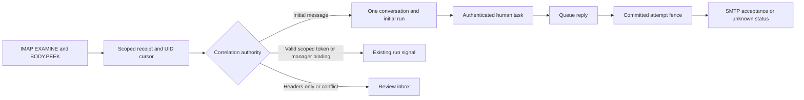
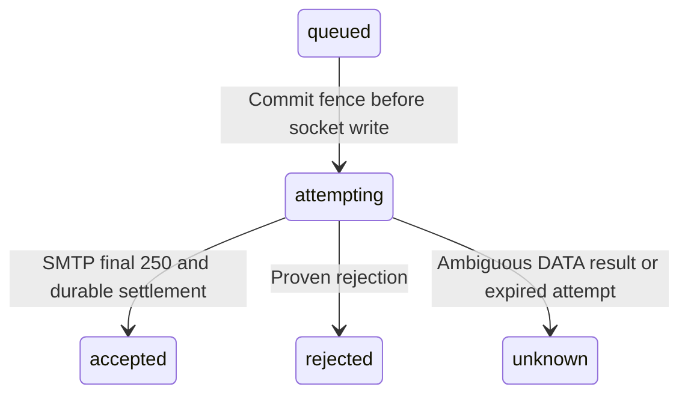

<!--
Copyright 2026 Firefly Software Foundation.

Licensed under the Apache License, Version 2.0 (the "License");
you may not use this file except in compliance with the License.
You may obtain a copy of the License at

    http://www.apache.org/licenses/LICENSE-2.0

Unless required by applicable law or agreed to in writing, software
distributed under the License is distributed on an "AS IS" BASIS,
WITHOUT WARRANTIES OR CONDITIONS OF ANY KIND, either express or implied.
See the License for the specific language governing permissions and
limitations under the License.
Author: Firefly Software Foundation
SPDX-License-Identifier: Apache-2.0
-->

# Threaded email

Weave provides generic SMTP send/reply actions, a read-only IMAP source, and scoped
conversation APIs. Email submission and human-task decisions are separate operations.
Receiving email never establishes the sender's identity as a human approver.



## Connection and authorization

Enable the installed `weave-email` connector and publish its connector definition
from its admitted package. Its actions are `send` and `reply`; SMTP and IMAP use
separate connection revisions when their hosts or ports differ. Connection config
contains `host`, `port`, `tls` (`tls` or `starttls`), `auth` (`none`, `password`, or
`oauth`), `sender`, exact `allowed_recipients`, `timeout_seconds`, and IMAP `folder`.
The configured destination is `https://HOST:PORT`, used as an egress authority
identifier for the mail socket; no HTTP request is sent to that URL.

Credentials are protected `secretRef` slots: `username` and `password`, or `username`
and `token`. OAuth bearer tokens must be provisioned/rotated through that boundary;
the connector does not implement provider-specific OAuth refresh.

Server-owned `MailPolicy` permits standard SMTP/IMAP ports by default, verifies
TLS certificates and hostnames, and rejects private network destinations.
`private_networks` in a connection cannot grant access beyond server policy.
Configure server policy through `WEAVE_MAIL_PRIVATE_NETWORKS` (JSON CIDR array),
`WEAVE_MAIL_ALLOWED_PORTS` (JSON port array), and `WEAVE_MAIL_ALLOW_LOCAL_FIXTURE`
(boolean). Keep these under deployment operator control. Plaintext requires a server-enabled `local_fixture` policy, an explicitly permitted
loopback port, and no credentials; it is intended for owned protocol tests only.

Assign explicit `email_reader`, `email_sender`, or `email_manager` roles. These
roles do not grant connection binding, workflow execution, source management, or
human approval authority. Add the existing applicable roles separately. Worker
send/reply uses a checked task lease, pinned connection, current credential grants,
and the run owner's email/connection authority.

## Queue, inspect, and execute

`POST /api/v1/tenants/{tenant}/projects/{project}/environments/{environment}/email/submissions`
accepts a typed request with `request_id`, `connection_revision_id`, `to`, `subject`,
and `text`; optional fields are `cc`, `bcc`, `html`, and bounded base64 attachments.
It commits a queued submission and stable Message-ID. Exact actor-bound retries
return the existing submission. Changed requests under the same request ID conflict.

Execute through `/email/submissions/{id}/execute`, then read status through
`/email/submissions/{id}`. Acceptance means SMTP accepted the message; it is not
proof of delivery. Recipient acceptance/rejection is retained individually.



There is no automatic resend from `unknown`, including a crash after SMTP accepted
but before database settlement. Review the mail server's evidence before issuing
an explicitly new command. A Message-ID supports tracing and threading, not reliable
SMTP deduplication. The same rule applies to workflow action retries.

## Conversations and replies

List `/email/conversations` and read `/email/conversations/{id}`. Both use bounded
keyset pagination. Read and send permissions remain separate from task visibility.
Plain text is exposed for display; inbound attachments are metadata only and HTML
is not rendered by the mail API.

POST `/email/conversations/{id}/reply` with `request_id`, `connection_revision_id`,
`parent_message_id`, `text`, and explicit `reply_all`. Stored Message-ID, In-Reply-To,
and ordered References establish continuity. Recipients must satisfy the connection
policy, incoming Reply-To cannot bypass it, and reply-all never reconstructs Bcc.
Caller-supplied message or routing headers are rejected. The sending connection must
match the conversation and parent.

The SDK facade is `firefly_weave.sdk.email.EmailClient`, wrapping an active
`WeaveClient`; it exposes conversations, send, reply, status, execute, sources,
inbox, dispatch, and token operations. CLI groups are `weave email conversations`,
`submissions`, `sources`, `receipts`, and `tokens`; each uses the common authenticated
SDK options. Use `--help` for exact scope, authentication, and request-file options.

## IMAP sources and routing

Create `/email/sources` with `connection_revision_id` and optional `activation_id`.
The initial poll records UIDVALIDITY and the current highest UID, ingesting **new
messages only**. A source leases each poll, retains generation fences, and commits
receipts and UID progress together. Oversized or malformed messages receive rejected
receipts, so poison mail does not stall the cursor. UIDVALIDITY change produces
`resync_required`; `/email/sources/{id}/rebaseline` explicitly requests a new baseline.
It does not replay historical mail or delete retained receipts.

When the runtime scheduler is enabled, its existing execute-only tenant traversal
polls one eligible mailbox per turn after provider dispatch. `/email/sources/{id}/poll`
is also available for explicit operations. The poll turn uses read-only `EXAMINE`
and `BODY.PEEK[]`, never modifies the mailbox, and observes bounded protocol budgets.

Initial messages without parent headers may create a new conversation and dispatch
one pinned activation. Threading headers only suggest grouping; subsequent replies
remain in `pending_correlation` until independently authorized. Unresolved correlation is held after `correlation_retention_seconds` (default one
day, bounded to seven days) and remains available for explicit manager resolution.
Late parent arrival
can update grouping without dispatching or merging existing runs. Use
`/email/receipts` to inspect retained receipt IDs and statuses. A manager with separate
run-signal authority can POST `/email/receipts/{id}/correlate` with conversation ID,
run ID, and signal, then `/email/receipts/{id}/dispatch`.

For automatic routing, configure an operator-owned `routing_domain` on the connection
and issue `/email/correlation-tokens` for a source, linked conversation, run, signal,
and bounded lifetime. The returned unguessable address is shown once; only its hash
is persisted. Configure your owned mail domain to deliver that address to the
configured mailbox; Weave does not assume provider plus-addressing or provision DNS.
The token permits one configured signal, never approval or conversation read access.
Revocation through `/email/correlation-tokens/{id}/revoke` and expiry are rechecked
before dispatch. Token/header conflicts are quarantined, and an invalid token never
falls back to creating a new run.

Automated messages, delivery reports, null reverse paths, known local submissions,
and the configured local sender are suppressed from automatic initial dispatch.
Workflow-generated replies also consume a durable per-conversation
`automated_response_limit` budget (default three); exact retries do not consume it
again. Terminal runs retain later messages instead of restarting. Permanently invalid signal
or target outcomes remain actionable in the inbox and are not dispatched repeatedly.

## Run the examples from this source checkout

Email conversations and triggers are included in alpha5. Use a matching alpha5
server and client; alpha4 predates these contracts. The examples below use this
checkout’s development CLI, or the installed `weave` command with the same arguments.
Install the client dependencies with `pip install -e '.[client]'` in your selected
virtual environment. The examples require `curl`, `jq`, and Python, an authenticated
Weave server, and a tenant/project/environment already provisioned for your identity.

Before sending, an operator must admit and publish the `weave-email` connector
package, provision protected secret references, and permit the destination through
server egress policy. A connection manager creates the revision. The sending actor
needs `email.send`, `email.read`, and `connection.bind`, including any connection
resource grant required by its policy. An inbox manager needs `email.manage`;
source creation additionally needs `trigger.manage` and `connection.bind`. Initial
run dispatch requires the source owner's current activation/run authority; follow-up
correlation and dispatch require current `run.signal` authority. Human approval
still requires an authenticated, assigned task participant and the human-task API.
An `email_manager` grant alone does not provide these other capabilities.

Set these variables to your existing scope and short-lived access token. Never put
mail passwords or OAuth tokens in these request files; `secretRef` values name
operator-provisioned secrets rather than containing them.

```sh
export WEAVE_BASE_URL='https://weave.example.org'
export WEAVE_TENANT_ID='<tenant UUID>'
export WEAVE_PROJECT_ID='<project UUID>'
export WEAVE_ENVIRONMENT_ID='<environment UUID>'
# Supply WEAVE_ACCESS_TOKEN through your approved credential/session mechanism.
export EMAIL_CONNECTOR_VERSION_ID='<published weave-email connector version UUID>'
export EMAIL_ACTIVATION_ID='<published workflow activation UUID>'
API="$WEAVE_BASE_URL/api/v1/tenants/$WEAVE_TENANT_ID/projects/$WEAVE_PROJECT_ID/environments/$WEAVE_ENVIRONMENT_ID"
```

### 1. Create a pinned SMTP connection

Replace the example host, sender, recipient, and secret names with your owned
service details. This example uses implicit TLS on port 465. It authorizes exactly
one recipient; it is not a wildcard policy. Creating a connection does not send mail.

```sh
jq -n --arg version "$EMAIL_CONNECTOR_VERSION_ID" '{
  name: "review-mail-smtp", connector_version_id: $version,
  config: {
    host: "smtp.example.org", port: 465, tls: "tls", auth: "password",
    sender: "reviews@example.org", allowed_recipients: ["reviewer@example.org"],
    timeout_seconds: 30, automated_response_limit: 3
  },
  secretRef: {username: "review-mail-username", password: "review-mail-password"},
  allowed_destinations: ["https://smtp.example.org:465"]
}' > smtp-connection.json
curl --fail-with-body -sS -H "Authorization: Bearer $WEAVE_ACCESS_TOKEN" \
  -H 'Content-Type: application/json' --data-binary @smtp-connection.json \
  "$API/connections" > smtp-connection-result.json
export EMAIL_SMTP_REVISION_ID="$(jq -r .id smtp-connection-result.json)"
```

The returned `id` identifies this immutable connection revision. Do not substitute
a connector version ID or the connection's numeric `revision` field.

### 2. Queue, inspect, then explicitly execute a send

This sequence sends real email when executed against your configured service.
Queueing alone stores the command; `execute` performs the SMTP exchange.
Keep `send.json` and its `request_id` for exact retries of the same command.

```sh
jq -n --arg request "$(python -c 'from uuid import uuid4; print(uuid4())')" \
  --arg connection "$EMAIL_SMTP_REVISION_ID" '{
    request_id: $request, connection_revision_id: $connection,
    to: ["reviewer@example.org"], subject: "Review requested",
    text: "Please review the attached workflow context."
  }' > send.json
curl --fail-with-body -sS -H "Authorization: Bearer $WEAVE_ACCESS_TOKEN" \
  -H 'Content-Type: application/json' --data-binary @send.json \
  "$API/email/submissions" > submission.json
export EMAIL_SUBMISSION_ID="$(jq -r .id submission.json)"
export EMAIL_CONVERSATION_ID="$(jq -r .conversation_id submission.json)"
export EMAIL_PARENT_MESSAGE_ID="$(jq -r .message_id submission.json)"
curl --fail-with-body -sS -H "Authorization: Bearer $WEAVE_ACCESS_TOKEN" \
  "$API/email/submissions/$EMAIL_SUBMISSION_ID"
curl --fail-with-body -sS -X POST -H "Authorization: Bearer $WEAVE_ACCESS_TOKEN" \
  "$API/email/submissions/$EMAIL_SUBMISSION_ID/execute"
curl --fail-with-body -sS -H "Authorization: Bearer $WEAVE_ACCESS_TOKEN" \
  "$API/email/submissions/$EMAIL_SUBMISSION_ID"
```

Read `state`, `accepted_recipients`, and `rejected_recipients`. An `unknown` result
requires operator investigation; creating a fresh request can send a duplicate.

### 3. Reply within that conversation

Use the stored message row UUID as `parent_message_id`, not the RFC Message-ID
string. This example follows up on the outbound message to its original recipient.
For an inbound parent, choose its message row from the conversation detail; the
connection revision must match that conversation and parent.

```sh
jq -n --arg request "$(python -c 'from uuid import uuid4; print(uuid4())')" \
  --arg connection "$EMAIL_SMTP_REVISION_ID" --arg parent "$EMAIL_PARENT_MESSAGE_ID" '{
    request_id: $request, connection_revision_id: $connection,
    parent_message_id: $parent, reply_all: false,
    text: "The review context has been updated."
  }' > reply.json
curl --fail-with-body -sS -H "Authorization: Bearer $WEAVE_ACCESS_TOKEN" \
  -H 'Content-Type: application/json' --data-binary @reply.json \
  "$API/email/conversations/$EMAIL_CONVERSATION_ID/reply" > reply-submission.json
curl --fail-with-body -sS -X POST -H "Authorization: Bearer $WEAVE_ACCESS_TOKEN" \
  "$API/email/submissions/$(jq -r .id reply-submission.json)/execute"
curl --fail-with-body -sS -H "Authorization: Bearer $WEAVE_ACCESS_TOKEN" \
  "$API/email/conversations/$EMAIL_CONVERSATION_ID?limit=50"
```

The reply queues a separate submission in the same conversation. It is not sent
until execution. No caller-provided subject or threading headers are needed.

### 4. Create and baseline an IMAP source

Create a separate pinned revision for the IMAP endpoint:

```sh
jq --arg name 'review-mail-imap' '.name=$name |
  .config.host="imap.example.org" | .config.port=993 | .config.folder="INBOX" |
  .allowed_destinations=["https://imap.example.org:993"]' smtp-connection.json > imap-connection.json
curl --fail-with-body -sS -H "Authorization: Bearer $WEAVE_ACCESS_TOKEN" \
  -H 'Content-Type: application/json' --data-binary @imap-connection.json \
  "$API/connections" > imap-connection-result.json
export EMAIL_IMAP_REVISION_ID="$(jq -r .id imap-connection-result.json)"
jq -n --arg connection "$EMAIL_IMAP_REVISION_ID" --arg activation "$EMAIL_ACTIVATION_ID" '{
  connection_revision_id: $connection, activation_id: $activation
}' > source.json
curl --fail-with-body -sS -H "Authorization: Bearer $WEAVE_ACCESS_TOKEN" \
  -H 'Content-Type: application/json' --data-binary @source.json \
  "$API/email/sources" > source-result.json
export EMAIL_SOURCE_ID="$(jq -r .id source-result.json)"
curl --fail-with-body -sS -X POST -H "Authorization: Bearer $WEAVE_ACCESS_TOKEN" \
  "$API/email/sources/$EMAIL_SOURCE_ID/poll"
```

The first poll establishes the current UID baseline and skips existing mail.
After a new message arrives, poll again and read the receipt inbox:

```sh
curl --fail-with-body -sS -X POST -H "Authorization: Bearer $WEAVE_ACCESS_TOKEN" \
  "$API/email/sources/$EMAIL_SOURCE_ID/poll"
curl --fail-with-body -sS -H "Authorization: Bearer $WEAVE_ACCESS_TOKEN" \
  "$API/email/receipts?limit=50"
```

Select an inbox receipt's `id` as `EMAIL_RECEIPT_ID`. With the necessary current
run authority, explicitly dispatch it:

```sh
curl --fail-with-body -sS -X POST -H "Authorization: Bearer $WEAVE_ACCESS_TOKEN" \
  "$API/email/receipts/$EMAIL_RECEIPT_ID/dispatch"
```

If it is `pending_correlation`, set `EMAIL_CONVERSATION_ID` to that inbound receipt's conversation UUID and
`EMAIL_RUN_ID` to the existing target run UUID. Submit an authorized binding using
a signal declared by that workflow:

```sh
jq -n --arg conversation "$EMAIL_CONVERSATION_ID" --arg run "$EMAIL_RUN_ID" '{
  conversation_id: $conversation, run_id: $run, signal: "followup"
}' > correlate.json
curl --fail-with-body -sS -H "Authorization: Bearer $WEAVE_ACCESS_TOKEN" \
  -H 'Content-Type: application/json' --data-binary @correlate.json \
  "$API/email/receipts/$EMAIL_RECEIPT_ID/correlate"
```

Use the inbound receipt's conversation, not an unrelated SMTP conversation.
Then dispatch the same receipt. If polling reports `resync_required`, an operator
can explicitly skip the mailbox's current contents by rebaselining, then polling:

```sh
curl --fail-with-body -sS -X POST -H "Authorization: Bearer $WEAVE_ACCESS_TOKEN" \
  "$API/email/sources/$EMAIL_SOURCE_ID/rebaseline"
curl --fail-with-body -sS -X POST -H "Authorization: Bearer $WEAVE_ACCESS_TOKEN" \
  "$API/email/sources/$EMAIL_SOURCE_ID/poll"
```

### 5. Use the typed SDK or CLI for the same operations

This Python program creates and executes a new command. Run it separately from the
curl send example only when you intend another message. Persist its request UUID
before issuing the command if your application must resume after a crash.

```python
import asyncio
import os
from uuid import UUID, uuid4

from firefly_weave.contracts.access import Scope
from firefly_weave.contracts.email import EmailReplyRequest, EmailSendRequest, EmailSourceRequest
from firefly_weave.sdk.client import WeaveClient
from firefly_weave.sdk.email import EmailClient

async def main():
    scope = Scope(
        tenant_id=UUID(os.environ["WEAVE_TENANT_ID"]),
        project_id=UUID(os.environ["WEAVE_PROJECT_ID"]),
        environment_id=UUID(os.environ["WEAVE_ENVIRONMENT_ID"]),
    )
    connection = UUID(os.environ["EMAIL_SMTP_REVISION_ID"])
    async with WeaveClient(
        os.environ["WEAVE_BASE_URL"], lambda: os.environ["WEAVE_ACCESS_TOKEN"], scope
    ) as client:
        mail = EmailClient(client)
        queued = await mail.send(EmailSendRequest(
            request_id=uuid4(), connection_revision_id=connection,
            to=("reviewer@example.org",), subject="Review requested", text="Please review."
        ))
        print((await mail.status(queued.id)).model_dump_json())
        print((await mail.execute(queued.id)).model_dump_json())
        reply = await mail.reply(queued.conversation_id, EmailReplyRequest(
            request_id=uuid4(), connection_revision_id=connection,
            parent_message_id=queued.message_id, reply_all=False, text="Updated context."
        ))
        print((await mail.execute(reply.id)).model_dump_json())
        source = await mail.create_source(EmailSourceRequest(
            connection_revision_id=UUID(os.environ["EMAIL_IMAP_REVISION_ID"]),
            activation_id=UUID(os.environ["EMAIL_ACTIVATION_ID"]),
        ))
        print((await mail.poll(source.id)).model_dump_json())
        # A later poll sees mail delivered after this baseline.
        print(await mail.inbox(limit=50))

asyncio.run(main())
```

The CLI uses the scope/token environment variables set above. Resource IDs are
**positional `IDENTIFIER` arguments**, not `--identifier` options:

```sh
weave email submissions send --request send.json
weave email submissions read "$EMAIL_SUBMISSION_ID"
weave email submissions execute "$EMAIL_SUBMISSION_ID"
weave email submissions reply "$EMAIL_CONVERSATION_ID" --request reply.json
weave email conversations read "$EMAIL_CONVERSATION_ID"
weave email sources create --request source.json
weave email sources poll "$EMAIL_SOURCE_ID"
weave email sources rebaseline "$EMAIL_SOURCE_ID"
weave email receipts list --limit 50
weave email receipts correlate "$EMAIL_RECEIPT_ID" --request correlate.json
weave email receipts dispatch "$EMAIL_RECEIPT_ID"
```

`conversations read` accepts no `--limit` CLI option in this source revision; use
`weave email conversations read "$EMAIL_CONVERSATION_ID"` or the HTTP detail query
above. List commands accept `--cursor` for the returned `next_cursor`. Avoid
repeating `sources create`: it creates another mailbox source and has no caller
request ID for deduplication.

## Verification boundary

Owned local fixtures cover SMTP partial acceptance and ambiguous DATA disconnects,
IMAP peek/size limits, PostgreSQL RLS, retry/crash fences, source takeover and mailbox
reset, plus scoped correlation revocation. No live mailbox, CIAM provider, or external
email delivery is certified by these tests. Inbound attachment download/storage,
historical replay, and provider-specific OAuth refresh are separate extensions.
