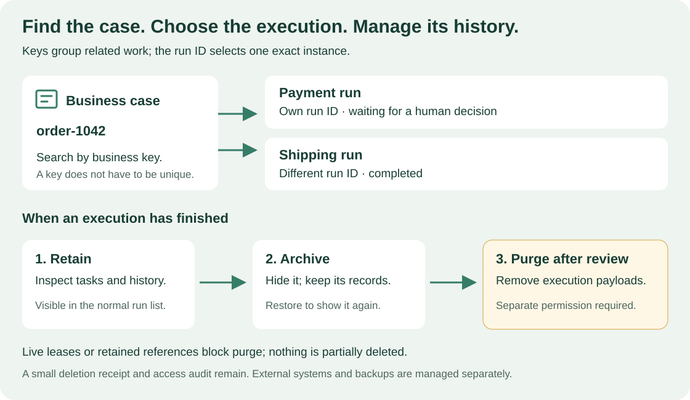

<!--
Copyright 2026 Firefly Software Foundation.

Licensed under the Apache License, Version 2.0 (the "License");
you may not use this file except in compliance with the License.
You may obtain a copy of the License at

    http://www.apache.org/licenses/LICENSE-2.0

Unless required by applicable law or agreed to in writing, software
distributed under the License is distributed on an "AS IS" BASIS,
WITHOUT WARRANTIES OR CONDITIONS OF ANY KIND, either express or implied.
See the License for the specific language governing permissions and
limitations under the License.
Author: Firefly Software Foundation
SPDX-License-Identifier: Apache-2.0
-->

# Manage runs and business cases

A workflow is a reusable definition. A **run** is one execution of an activated
workflow version, with its own input, state, tasks, and history. Studio and the
CLI call it a run; BPM tools call it a *process instance*. This page shows you
how to start runs that belong to the same business case, find them again, see
why one is waiting, and archive or delete finished runs.

**Who this is for:** operators and process owners who look after running work,
and developers who start runs from a product. It takes about 15 minutes.
**What you need:** Studio or the CLI connected to a platform (see
[Connect Studio](studio.md#connect-to-a-platform) or
[connect the CLI](connect-to-api.md)), an activated workflow version, and the
roles described in each step: `viewer` to read runs, `operator` to start, pause,
and archive them, and `execution_manager` to delete them permanently.

**Release status.** Business keys, archive, restore, and purge are also part
of alpha6. The CLI examples use the saved platform from
`weave auth setup`, new in 0.1.0a7. With an alpha6 or earlier CLI, add the
workspace and sign-in options that each command's `--help` lists. In an alpha6
or earlier Studio, **Run input (JSON)** is a plain JSON text box instead of the
input form described below.



Read the top row from left to right: one business key, `order-1042`, groups two
runs, and each run keeps its own run ID. The bottom row is what you can do once
a run has finished: keep it, archive it, and, after a retention review, purge
it. [Open diagram at full size](../diagrams/execution-lifecycle.svg).

## 1. Choose identifiers with different jobs

Every run gets a run ID. You can add keys that connect it to your business.

| Identifier | Example | What it does |
| --- | --- | --- |
| Run ID | Server-generated UUID | Addresses one exact run, its signals, and its history |
| `business_key` | `order-1042` | Groups the runs that concern the same business object |
| `correlation_key` | `fulfillment-2026-1042` | Groups related runs in a wider process or integration |
| `Idempotency-Key` | `submit-order-1042-attempt-1` | Lets the same caller safely repeat the same start command |

**Keys are labels, not unique IDs.** Business and correlation keys are
optional, case-sensitive, exact-match strings of at most 200 characters. An
order can have separate payment, shipping, and return runs with the same
business key. Do not put sensitive customer information in a key.

**Idempotency keys separate a retry from a new run.** If a start request's
response was lost, send the identical request again with the same idempotency
key: you get the original run back, not a second one. To start another run on
purpose, use a new key. Changing the business key or refreshing a screen is not
a substitute for choosing the key deliberately.

**Capacity has limits.** By default the platform admits up to 1,000 active runs
per environment and keeps up to 10,000 runs per project, within its other task,
message, and storage limits. There is no one-run-per-project rule. Operators can
lower these ceilings in the
[operational policy](../operations/configuration.md#operational-policy).
Archiving keeps a run in the retained count; a successful purge releases it.
These are admission ceilings, not measured throughput.

## 2. Start a run and find it again

**Why:** a business key on every run lets you find all the work for one case
later, without storing run IDs yourself.

### In Studio

1. Open **Runs** and select **Start run**. Studio opens **Start a run**.
2. Choose the **Version to run**: an activated version of a workflow. Each
   option names the workflow, its version, and when it became active, such as
   "expense-approval 1.0.0 · active since 2 Oct, 09:12".
3. Optionally open **Add a business key (optional)** and enter a **Business
   key**, a **Correlation key**, or both.
4. Fill in **Run input**. It is a form built from the workflow's input schema;
   **Edit as JSON** switches to raw JSON.
5. Select **Start run**.

Expected: a message such as "Started run 1a2b3c4d." with **View**, which opens
the new run; the run is also listed in **Runs**. If the platform refuses the
start, the dialog stays open and says "The run didn't start." with the reason.

**Find runs later** with the filters above the list in **Runs**. The list
updates as soon as you change a filter; there is no button to apply them.

- Type an exact business key in **Search by business key**.
- Choose a status: **All**, **Waiting**, **Failed**, or **Succeeded**.
- Open **More filters** to enter an exact **Correlation key** or to check
  **Include archived runs**.

To remove a filter, empty its field, choose **All**, or clear the check box.

### With the CLI

Save `start.json` with your activation's ID and input that matches the
workflow's input schema. `weave definitions activations list --output json`
lists the activations in your workspace with their IDs:

```json
{
  "activation_id": "YOUR_ACTIVATION_UUID",
  "input": {"orderId": "1042"},
  "business_key": "order-1042",
  "correlation_key": "fulfillment-2026-1042"
}
```

```sh
# Start one run; keep the same idempotency key if you need to retry this exact request.
weave runs start --request start.json --idempotency-key submit-order-1042-attempt-1
# List the waiting runs for this business case.
weave runs list --business-key order-1042 --status waiting
```

Expected: `runs start` prints the new run as one JSON object with its `id`,
`business_key`, and `state`. `runs list` prints one JSON page whose `items`
are the matching runs; pass its `next_cursor` with `--cursor` to read the next
page.

### From your product (Python SDK)

```python
from uuid import uuid4
from firefly_weave.contracts.runtime import StartRunRequest

# client is an authenticated WeaveClient scoped to the target environment.
# activation_id is the UUID returned when your published version was activated.
request = StartRunRequest(
    activation_id=activation_id,
    input={"orderId": "1042"},  # Must match that workflow's input schema.
    business_key="order-1042",
    correlation_key="fulfillment-2026-1042",
)

# Keep this key with your product's command record before sending the request.
command_key = str(uuid4())
run = await client.start_run(request, idempotency_key=command_key)

# Search returns a page, because one business key can match several runs.
page = await client.list_runs(business_key="order-1042", status="waiting")
for found in page.items:
    print(found.id)
```

This is a fragment of an async SDK application. The
[SDK tutorial](sdk-tutorial.md) explains imports, sign-in, scope, and the
client's async context manager.

**The underlying API.** The search is
`GET /api/v1/tenants/{tenant}/projects/{project}/environments/{environment}/runs`.
It accepts `business_key`, `correlation_key`, `status`, `include_archived`,
`limit`, and `cursor`, and combines the filters you pass. Keep the same filters
when you follow a cursor; changing them invalidates it.

**Pick one run before you signal it.** A business key never broadcasts an event
or picks the first match. The `runs/{run_id}/signals` endpoint, and
`weave runs signal RUN_ID`, target one exact run, so your application decides
explicitly which run should receive the event.

## 3. Understand why a run is waiting

Open a run in Studio's **Runs** view. Its detail shows, from top to bottom:
the status, business key, and run ID (**Copy** copies the full ID); a **Now**
line that says what the run is doing; the graph of the workflow version it runs,
with **Now** on the current step; a **Timeline** of its recorded events;
**Technical details**; and **Archive**. The detail does not update by itself:
select **Refresh** at the bottom of the detail to read the run again.

The **Now** line, or the card that replaces it, tells you what the run waits
for. STEP stands for the step's ID:

| Studio shows | What the run waits for | What moves it on |
| --- | --- | --- |
| "Waiting for TASK_TITLE, assigned to ASSIGNMENT" with **Open task**, or "Waiting for a person at STEP, assigned to ASSIGNMENT" with **Open My tasks** | A **Human task** | An eligible person claims and completes it in **My tasks**; see [human tasks](human-tasks.md) |
| "Waiting for a signal at STEP" | A **Wait for signal** step | An authorized sender signals this run ID with the named signal |
| "Waiting for time at STEP" | A **Wait for time** step | The durable timer; nothing to do |
| "Waiting for an action to finish at STEP" | A **Call an action** step | A connector or worker finishing the call |
| "Paused by an operator." and the status "Paused" | An operator's pause | **Resume run**, with a reason, by someone with `operator` |
| A card, "This run stopped at STEP.", with the incident's code, and the status "On hold" | An incident | An operational decision; see [incident operations](../reference/incident-operations.md) |

**Open task** opens the task in **My tasks**. **Open My tasks** shows the
run's tasks there when Studio can't open the task itself.

These situations need different controls, so there is no generic "complete"
button. Closing a browser never completes or cancels a task. Email replies are
[email events](email.md), not human approvals.

**Pause and resume are audited.** While the run hasn't finished, the detail
shows **Pause run** or, for a paused run, **Resume run**. Each asks for a
**Reason**, which is kept in the audit log, and confirms with "Run paused." or
"Run resumed." The [human-task walkthrough](human-tasks.md#6-pause-and-resume-when-operationally-necessary)
shows the same controls from the CLI.

## 4. Archive finished runs

**Why:** archiving hides finished runs from the normal list while keeping their
data, tasks, and history. Only runs that `succeeded`, `failed`, were
`cancelled`, or `timed_out` can be archived; finish or cancel an active run
first. Studio has no cancel button; use `weave runs cancel`, as in
[Cancel a run](../reference/incident-operations.md#cancel-a-run). The `operator` and `execution_manager` roles include `run.archive`.

**In Studio:**

1. Open the finished run in **Runs**. Under **Archive**, select **Archive
   run**. It stays disabled until the run finishes.
2. In **Archive this run?**, enter a **Reason** and select **Archive run**.

Expected: "Run archived." and the run leaves the list; its **Archive** section
reads "Archived. Hidden from Runs until you include archived runs." To see it
again, open **More filters** and check **Include archived runs**. **Restore
run** asks **Restore this run?** with a **Reason** and returns the run to the
normal list ("Run restored."). Restoring does not restart the run.

**With the CLI**, read the run's *lifecycle revision* first. It counts archive
changes and is separate from the run's own progress and from task revisions:

```sh
# Show whether the run is archived and its current lifecycle revision.
weave runs lifecycle RUN_ID
```

Expected: one JSON object with `run_id`, `archived`, `purged`, and `revision`.
Save `archive.json` with that revision and a reason:

```json
{"expected_revision": 0, "reason": "Order processing and review are complete"}
```

```sh
# Archive the run; restore it later with weave runs restore and a new request.
weave runs archive RUN_ID --request archive.json --idempotency-key archive-order-1042-attempt-1
```

Expected: the lifecycle object again, now with `"archived": true` and a higher
`revision`. `weave runs restore` takes the same kind of request.

**From the SDK:**

```python
from firefly_weave.contracts.run_lifecycle import RunLifecycleRequest

# The lifecycle revision is independent of runtime progress and task revisions.
lifecycle = await client.run_lifecycle(run.id)
archived = await client.archive_run(
    run.id,
    RunLifecycleRequest(
        expected_revision=lifecycle.revision,
        reason="Order processing and review are complete",
    ),
    idempotency_key="archive-order-1042-attempt-1",
)
```

The API operations are `GET runs/{run_id}/lifecycle`, `POST runs/{run_id}/archive`,
and `POST runs/{run_id}/restore`, under the same environment path. Each change
sends `expected_revision` and `reason` and needs an `Idempotency-Key` header.

## 5. Permanently delete an archived run

**Why:** when your retention period ends, purging removes a run's business data
for good. Only the separate **`execution_manager`** role has `run.purge`;
operators cannot purge. The run must be finished and already archived.

**In Studio:** open the archived run (open **More filters** and check **Include
archived runs**), and select **Delete run data** under **Archive**. In **Delete
this run's data?**, enter a **Reason**, type the exact run ID into **Run ID**,
and select **Delete run data**. **Delete run data** appears only on an archived
run and only when your roles include `run.purge`.

Expected: "Deleted the run's data. Its audit record stays." The run's
**Archive** section then reads "Data deleted. The audit record stays."

**With the SDK** (the CLI equivalent is `weave runs purge RUN_ID` with
`--request` and `--idempotency-key`):

```python
from firefly_weave.contracts.run_lifecycle import RunPurgeRequest

# This removes the run's payloads and history; run it only after a retention review.
receipt = await client.purge_run(
    run.id,
    RunPurgeRequest(
        expected_revision=archived.revision,
        reason="Approved retention period has ended",
        confirm_run_id=run.id,
    ),
    idempotency_key="purge-order-1042-attempt-1",
)
```

The API operation is `POST runs/{run_id}/purge` with the same body and header.

**What a purge removes:** the run snapshot, inputs and outputs, event history,
step results, worker completion data, signals, incidents, and the run's human
task forms, decisions, and task history.

**What it keeps:** a small scoped deletion receipt, the access audit of who
requested it, and redacted idempotency records. Replaying an earlier start
request after a purge returns HTTP 410 instead of recreating the run or
returning its old data. Repeating the same purge returns its recorded receipt.

**What blocks it:** a worker lease that is still active, or a reference kept by
email, schedules, triggers, or retry relationships. The purge is atomic, so a
blocked purge removes nothing. Leave such runs archived; this version does not
cascade deletion into those separately managed resources.

**What it cannot undo:** purging Weave's records does not recall an email, undo
work in other systems, erase exported files, remove backups, or delete data held
by a connected product. Plan retention for those systems separately.

## If something goes wrong

| What you see | Why | What to do |
| --- | --- | --- |
| `WV-RUN-NOT-TERMINAL` (HTTP 409), or **Archive run** is disabled | The run is still active | Wait for it to finish, or cancel it with `weave runs cancel` ([Cancel a run](../reference/incident-operations.md#cancel-a-run)), then archive |
| `WV-RUN-LIFECYCLE-REVISION` (HTTP 409) | Someone archived or restored the run since you read it | Read the lifecycle again and decide whether your change is still needed |
| `WV-RUN-LIFECYCLE-STATE` (HTTP 409) | The run is already archived, or already restored | Nothing to do; refresh the list |
| `WV-RUN-NOT-ARCHIVED` (HTTP 409) | You tried to purge a run that is not archived | Archive it first |
| `WV-RUN-PURGE-CONFIRM` (HTTP 422) | `confirm_run_id` does not match the run | Type the exact run ID |
| `WV-RUN-PURGE-BLOCKED` (HTTP 409) | A live lease or a retained email, trigger, schedule, or retry reference | Keep the run archived until those dependencies are retired |
| `WV-RUN-PURGED` (HTTP 410) | You replayed a request for a run that was purged | Start a new run with a new idempotency key if you need one |
| HTTP 403, or the run has no **Archive** section or no **Delete run data** button | Your roles do not include `run.archive` or `run.purge` in this workspace | Ask an administrator; see [People and access](people-and-access.md) |
| A search returns several runs | Business keys are not unique | Filter by status or correlation key, then choose one run ID |

## Next steps

- [Add human approvals](human-tasks.md) and handle the tasks a run waits for.
- [Resolve incidents](../reference/incident-operations.md) when a run is
  blocked.
- [Read run history and replay it](../reference/history-and-replay.md).
- [Remove expired debug sessions](../operations/retention.md) with a reviewed
  plan; runs are purged one at a time, as above.
