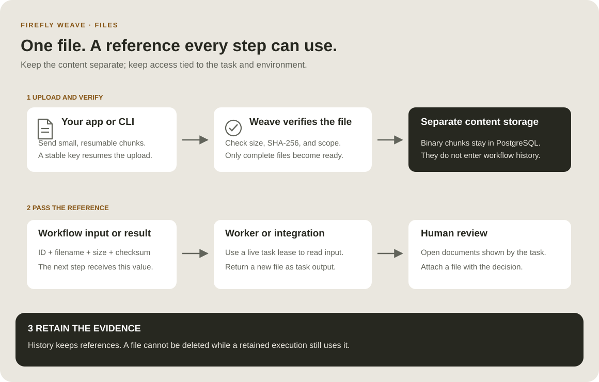

<!--
Copyright 2026 Firefly Software Foundation.

Licensed under the Apache License, Version 2.0 (the "License");
you may not use this file except in compliance with the License.
You may obtain a copy of the License at

    http://www.apache.org/licenses/LICENSE-2.0

Unless required by applicable law or agreed to in writing, software
distributed under the License is distributed on an "AS IS" BASIS,
WITHOUT WARRANTIES OR CONDITIONS OF ANY KIND, either express or implied.
See the License for the specific language governing permissions and
limitations under the License.
Author: Firefly Software Foundation
SPDX-License-Identifier: Apache-2.0
-->

# Work with files, step by step

A workflow can receive a file, pass it to a worker, send it to another system,
and ask a person to review it. It passes a **file reference** between steps.
The bytes are stored separately, so execution history remains readable and
replaying a workflow does not download or upload the same document again.



## 1. Understand what moves through the workflow

A reference contains `kind: weave/file`, a server-generated `id`, `filename`,
`contentType`, `sizeBytes`, and `sha256`. Treat it as one value: do not replace
its ID or edit its metadata. A reference is not a download URL or a bearer token.
Every content request checks your current identity and environment permissions.

For example, your workflow input can be `{"invoice": <file reference>}`.
A later step reads `/input/invoice`, or `/steps/download/output` when an earlier
integration downloaded the file. The same reference works in YAML, the Python
builder, the API, and Studio. Binary data and base64 payloads belong only to the
transfer API, not to workflow variables or Actions' ordinary JSON input.

The first storage implementation keeps bounded binary chunks in PostgreSQL,
separate from run state and events. Database backups therefore include file
content. This release does not use an Azure Blob, S3, or Google Cloud Storage
backend. The file-reference contract is independent of that storage choice.

## 2. Upload your first file with the CLI

First [connect and sign in](connect-to-api.md) and select a workspace. Ask your
administrator for `file_manager` in that environment to upload files, and an
appropriate role to start workflows. `file_reader` permits reading existing
files without modifying them.

```sh
# Keep this key when retrying an interrupted transfer of the same file.
# The CLI resumes chunks already accepted by the platform.
weave files upload ./invoice.pdf --idempotency-key invoice-2026-001 > invoice-reference.json

# List file metadata in your selected environment; this does not download content.
weave files list

# Replace FILE_ID with the id in invoice-reference.json.
# Download verifies size and SHA-256 before creating this new local file.
weave files download FILE_ID --to ./invoice-copy.pdf
```

The download command never overwrites an existing path. Reusing an upload key
with different metadata is rejected. A file becomes available to workflows only
after all chunks arrive and the platform verifies its complete checksum.

## 3. Declare a file input

Use the canonical schema rather than maintaining a second definition of a file.
This Python example builds a small workflow that returns its input file:

```python
from firefly_weave.contracts.definitions import RefExpression, TransformStep
from firefly_weave.contracts.files import file_reference_schema
from firefly_weave.sdk.builder import WorkflowBuilder

# Require an invoice whose ID, metadata, and discriminator follow the platform contract.
invoice_schema = {
    "type": "object",
    "properties": {"invoice": file_reference_schema()},
    "required": ["invoice"],
    "additionalProperties": False,
}
workflow = WorkflowBuilder(
    "receive-invoice", "1.0.0",
    input_schema=invoice_schema,
    output_schema=file_reference_schema(),
    output=RefExpression(ref="/steps/keep-invoice/output"),
).add_step(TransformStep(
    id="keep-invoice",
    kind="transform",
    value=RefExpression(ref="/input/invoice"),
))
# Continue with the SDK tutorial to compile, publish, and activate this definition.
```

The equivalent step in YAML uses the same reference expression:

```yaml
steps:
  - id: keep-invoice
    kind: transform # Pass a reference; no file content is loaded by this step.
    value: {ref: /input/invoice}
output: {ref: /steps/keep-invoice/output}
```

Include the full canonical file schema in the workflow's `inputSchema` and
`outputSchema`; the YAML fragment above shows only its steps. See the
[Python SDK tutorial](sdk-tutorial.md) for the complete publication and activation
sequence. Starting a run with an existing file requires `file.read` in the same
environment. The platform checks that the reference matches a ready file and
retains that association for the execution.

## 4. Transfer files from a host product

Use the existing authenticated `WeaveClient`; no second file login is needed.
These functions can be called from your application's async request handler:

```python
from pathlib import Path
from firefly_weave.sdk.client import WeaveClient
from firefly_weave.sdk.files import upload_file, download_file

async def attach_invoice(client: WeaveClient):
    # The helper hashes a bounded stream, resumes accepted chunks, and finishes the upload.
    with Path("invoice.pdf").open("rb") as source:
        return await upload_file(
            client, source, filename="invoice.pdf", content_type="application/pdf",
            idempotency_key="invoice-2026-001",
        )

async def inspect_invoice(client: WeaveClient, reference):
    # The stream is exposed only after the downloaded size and checksum match.
    async with download_file(client, reference) as verified:
        first_bytes = verified.read(1024)
        return {"filename": reference.filename, "bytes_inspected": len(first_bytes)}
```

Use the returned reference's `model_dump(mode="json", by_alias=True)` as a
workflow input field. Downloads use a private temporary stream that is closed
when the context exits. Your code owns what it does with the verified content;
the declared MIME type does not prove the file is safe or valid for a parser.

### Studio forms and human task files

In the schema designer, choose **File** to insert the canonical file-reference
schema. A live run or task form then offers a file picker and explicit download;
the workflow stores only the verified reference. Uploads are bounded to 25 MiB
and use 256 KiB chunks. Studio verifies downloaded size and SHA-256 before saving.
Designer form previews are inert: they neither upload nor download files.

A claimed human task uses task-relative transfer routes under
`/human-tasks/{identifier}/files/`: **create**, **chunk**, **finish**, **read**,
and **download**, all POST operations. Each carries the expected task revision;
creation also uses an idempotency key. Upload requests recheck the current
claimant, assignment eligibility, task revision, and live task/run. Reading is
limited to authorized task context or output references and the caller's own
uploads for that task; unsubmitted uploads require the current live claim.
These routes do not require a broad environment file-manager grant. Losing the
claim or task revision stops further transfer instead of silently reusing stale
authority.

## 5. Use a file inside a worker

An admitted worker uses `upload_task_file` and `download_task_file` from the same
SDK module. Supply its `WorkerTransport` and the task's current `LeaseProof`.
The platform checks that proof on every chunk request. A worker may read files
in its task input and files it produced; it cannot browse the environment's
file collection. New output files are associated with that task and run.

```python
from uuid import uuid5, NAMESPACE_URL
from firefly_weave.sdk.files import download_task_file, upload_task_file

async def copy_for_review(transport, lease, reference):
    async with download_task_file(transport, lease, reference) as verified:
        # A stable request ID makes a retry of this task's upload resumable.
        return await upload_task_file(
            transport, lease, verified,
            request_id=uuid5(NAMESPACE_URL, f"{lease.task_id}:review-copy"),
            filename="review-copy.pdf", content_type="application/pdf",
        )
```

Return the new reference as JSON in the normal task completion. Continue
heartbeating during long transfers; expired, revoked, or settled leases cannot
transfer more data. The [worker guide](workers.md) explains registration,
capabilities, dispatch, and completion.

A file reference does not automatically extract a PDF, parse a spreadsheet, or
send an attachment to a model. Implement that processing in a worker using the
verified stream above. For an [AI step](ai-workers.md), return bounded extracted
text or structured fields and map those values into its input. The transfer
connectors move binary files; they do not provide document extraction or OCR.

## 6. Connect a file service

The [file connector worker guide](file-connectors.md) explains FTP, FTPS, SFTP,
SharePoint/OneDrive, and Google Drive. Choose **list** to discover items,
**download** to obtain a Weave file reference, or **write** to send a ready
reference to the remote service. Connections pin the allowed root and operations.
A dedicated change-feed trigger is not included; the guide distinguishes these
Actions from polling subscriptions.

## 7. Inspect the HTTP contract

The [API explorer](../reference/api-explorer.md) includes the complete file DTOs.
The paths below are relative to your environment path:

| Operation | Method and path | Purpose |
| --- | --- | --- |
| Create upload | `POST /files` | Reserve metadata and receive the file ID; requires `Idempotency-Key` |
| Upload chunk | `POST /files/{id}/chunks` | Send `{index, contentBase64}`; an accepted chunk is immutable |
| Finish | `POST /files/{id}/finish` | Send `{}`; verify complete size and SHA-256 |
| List/read metadata | `GET /files` and `GET /files/{id}` | Inspect progress and ready references |
| Read chunk | `POST /files/{id}/download` | Send `{index}` and receive one verified stored chunk |
| Delete | `DELETE /files/{id}` | Remove content only when no retained execution uses the file |

Worker transfers use the separate `/tasks/files/*` operations with lease proof.
To try requests interactively, enable your platform's
[Swagger UI](api-playground.md). Use the SDK or CLI for complete transfers so
you do not need to calculate base64, chunk indexes, or checksums manually.

## Limits and retention

Each file is limited to **25 MiB** and transferred in **256 KiB** chunks.
Each environment can reserve at most **1 GiB across 1,000 files**, including
unfinished uploads. An interrupted upload keeps its reservation; resume it with
the same key or delete it if it is no longer needed. There is no automatic
cleanup of abandoned uploads in this release.

A file referenced by a retained execution cannot be deleted. Archive alone keeps
execution history and therefore keeps its files protected. After the execution
is permanently purged, a file may be deleted if no other execution retains it.
File content is removed; deletion metadata and audit records remain subject to
the platform's retention policy. Operators must size database storage and backups
for binary content as well as execution history.
