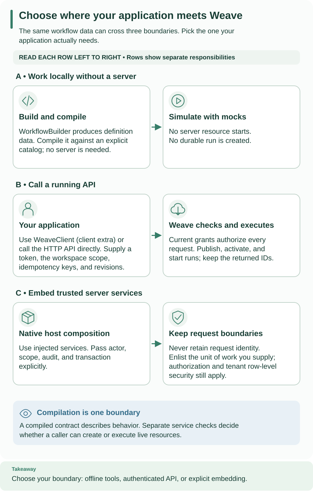

<!--
Copyright 2026 Firefly Software Foundation.

Licensed under the Apache License, Version 2.0 (the "License");
you may not use this file except in compliance with the License.
You may obtain a copy of the License at

    http://www.apache.org/licenses/LICENSE-2.0

Unless required by applicable law or agreed to in writing, software
distributed under the License is distributed on an "AS IS" BASIS,
WITHOUT WARRANTIES OR CONDITIONS OF ANY KIND, either express or implied.
See the License for the specific language governing permissions and
limitations under the License.
Author: Firefly Software Foundation
SPDX-License-Identifier: Apache-2.0
-->

# Integrate Weave into a host product

A **host product** is your application: for example, a customer portal that lets
users author workflows and start runs. Weave stores and executes the workflows;
your host supplies the user experience and a verified identity for each request.

For a first integration, [connect to your team's API](connect-to-api.md).
If you need a server, complete the [standalone tutorial](standalone.md) and
retain its scope receipt and host credentials. Then follow the
[SDK echo example](../reference/sdk.md) to compile the same workflow from Python.
It is deliberately smaller than the external-service example described below.

## 1. Choose where your host calls Weave

Choose the boundary that fits the host. All three approaches share the same
language and contracts; they do not share implicit administrative authority.

| Approach | Use it for | Host responsibility |
| --- | --- | --- |
| Pure compiler and immutable builder | Authoring tools, validation and previews | Supply definitions/catalogs; preserve diagnostics; no server resources are started |
| Typed SDK or native HTTP API | A separate host application or service | Obtain a verified access token, provision local identity/grants, choose scope and manage revision/idempotency contracts |
| In-process native services | A trusted Python application composition | Preserve constructor injection, explicit actor/scope/audit/UoW and service authorization; do not retain request state in singletons |

Compare the three rows: local authoring, remote API calls, and trusted in-process services. Read each row left to right to see what your host supplies and what Weave does. Choose a boundary before configuring identity or adding lifecycle operations. [Open the diagram at full size](../diagrams/authoring-execution-boundaries.svg).

## 2. Connect identity and scope

The [embedding reference](../reference/embedding.md) includes a runnable pure
builder example. The [SDK reference](../reference/sdk.md) shows the typed remote
client, token callback and errors. Use the [API reference](../reference/api.md)
and [native OpenAPI export](../reference/native-openapi.md) for canonical requests.
Remote SDK/CLI dependencies come from the `client` extra; the pure compiler does
not require the server, database or identity provider.

A **principal** is the local Weave identity associated with a verified token.
A **grant** permits that principal to perform a capability, such as `run.start`,
in a tenant/project/environment. A token proves identity; local grants determine
what that identity can do. UUIDs in a `Scope` select resources and confer no rights.
Have an administrator provision this mapping before testing SDK calls.

Start by reading the catalog and compiling echo. A successful artifact proves the
host can reach the API with its project authority. If this fails, check token
expiry and local grants before adding publication or workers.

A host must not bypass domain services by writing orchestration tables. A provided
transaction is enlisted under the existing UoW contract, while local authorization
and transaction-local tenant context remain mandatory. Services must not capture
a request's actor, database session or token in long-lived state.

The standalone deployment uses Keycloak initially. An embedding host can implement
the provider-neutral verifier/resolver ports, but must preserve verified-token and
explicit local-principal semantics. [Identity and secrets](../operations/identity-and-secrets.md)
explains what is implemented and what has not been verified with another CIAM.

## 3. Add the authoring and run lifecycle

Use the [typed SDK lifecycle example](../reference/sdk.md#extend-the-host-to-publish-activate-and-run)
for a concrete implementation. In a host UI, each action has a distinct purpose:

| Host action | Weave operation | Store in your host state |
| --- | --- | --- |
| Save edit | `save_draft` | Draft ID and returned revision |
| Release workflow | `publish` | Immutable version ID and digest |
| Make version available | `activate` | Activation ID, environment, and revision |
| Execute for a user | `start_run` | Run ID and the chosen idempotency key |
| Show progress | `read_run`, `history` | Cursor if you fetch history in pages |
| Respond to a waiting workflow | `signal` | Event ID, signal name, and payload |

For an updated draft, send its last observed revision. If another editor changed
it, reload and reconcile rather than overwriting. Publication recompiles against
the server catalog; the host cannot use a local artifact to bypass that check.
Existing runs keep their original activation even after a new version is released.

Handle uncertain transport results separately from domain rejection. An SDK retry
cannot prove an external request had no effect. Preserve idempotency keys and
revision expectations, inspect receipts/history and reconcile unknown outcomes.

Follow requests downward; dashed arrows return the identities needed by later calls. Each operation has its own authorization check. For the same lifecycle from a terminal, use the [CLI tutorial](cli-tutorial.md). [Open the diagram at full size](../diagrams/authoring-host-sequence.svg).

## Optional: read a larger integration fixture

The chapter's runnable path is the SDK echo example above. After it works, read
[the host fixture](../../examples/host_product/client.py) to see how a larger
application could read customer data through HTTP, invoke `example-record@1.0.0`
on a remote worker, wait for approval, and inspect the result. This is an optional
code-reading example, not the next command in the tutorial.

Its `prepare` operation publishes connector/Action contracts, admits releases,
creates a connection, and creates an activation and signed webhook trigger.
Those mutations require deployer authority. The fixture's state JSON initially
needs `scope` containing `tenant_id`, `project_id`, and `environment_id`; `prepare`
replaces that file with resource IDs used by later operations.

Chapter 3 does **not** provision everything this fixture requires. In particular,
its receiver implements `/health` and `/effect`, while this fixture needs a
customer service exposing `/customer`. Running the fixture would additionally
require an operator to supply:

- That customer service and its approved origin as `WEAVE_EXTERNAL_ORIGIN`.
- The `http-token` and `webhook-key` secret handles, actual secret-provider values,
  and the corresponding resolution grants. The sender needs the matching webhook
  signing material in `WEAVE_WEBHOOK_SECRET`.
- Actual image identities in `WEAVE_NATIVE_IMAGE_DIGEST` and
  `WEAVE_WORKER_IMAGE_DIGEST`, plus executor/worker authority for the new release
  IDs created by `prepare` and the required connection credential grants.
- A current `WEAVE_ACCESS_TOKEN`, the host-facing `WEAVE_API_URL`, and a private
  state file. Existing chapter 3 release grants do not automatically cover newly
  admitted releases.

There is no complete provisioning recipe for those additional fixture dependencies
in this chapter. Use the [worker deployment](../operations/deployment.md) and
[identity/secret contracts](../operations/identity-and-secrets.md) as background
when designing your own integration. The table below is a reading map for the
fixture's operations, not a ready-to-run command sequence.

| Fixture operation | Inputs beyond its state file | Expected progression |
| --- | --- | --- |
| `prepare` | API/token, native and worker image digests, external origin | Saves activation, trigger, and admitted release IDs |
| `trigger` | API/token and webhook signing secret | Returns the receipt for the submitted event |
| `approve --run-id …` | Run ID waiting for approval | Sends the `approved` signal with a Boolean payload |
| `inspect --run-id …` | Run ID | Reads current durable state |

The compiler's `customer-onboarding` YAML is a separate teaching example. Its
catalog lock does not provision the implementations used by this host fixture.
For worker handler behavior and restart semantics, continue with [workers](workers.md).
