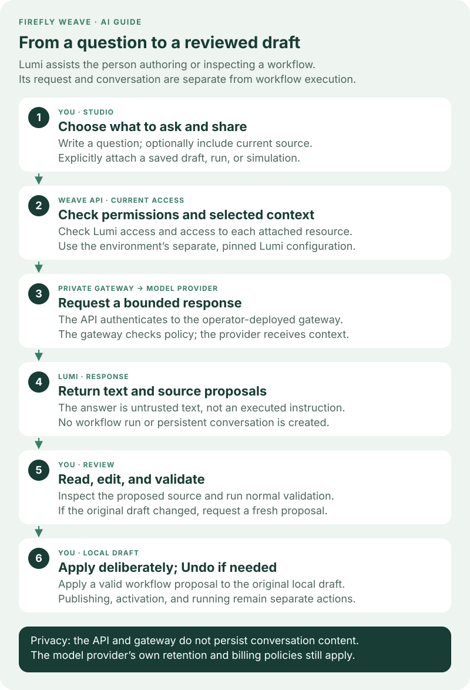
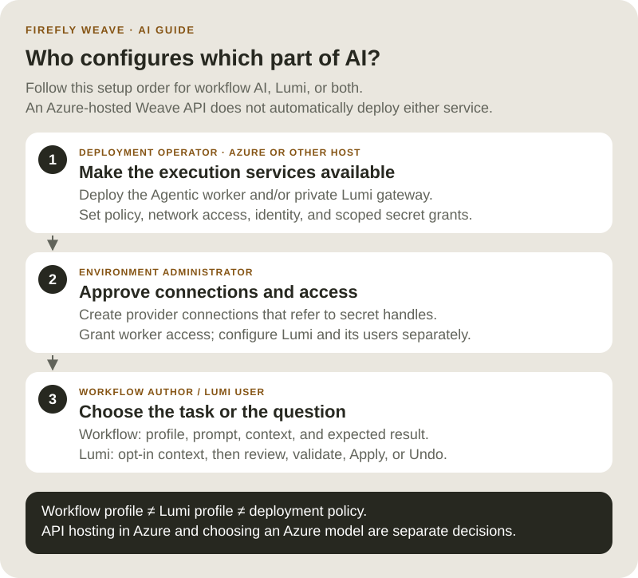

<!--
Copyright 2026 Firefly Software Foundation.

Licensed under the Apache License, Version 2.0 (the "License");
you may not use this file except in compliance with the License.
You may obtain a copy of the License at

    http://www.apache.org/licenses/LICENSE-2.0

Unless required by applicable law or agreed to in writing, software
distributed under the License is distributed on an "AS IS" BASIS,
WITHOUT WARRANTIES OR CONDITIONS OF ANY KIND, either express or implied.
See the License for the specific language governing permissions and
limitations under the License.
Author: Firefly Software Foundation
SPDX-License-Identifier: Apache-2.0
-->

# Lumi assistant

{ .lumi-guide }

Lumi is an optional Studio assistant for explaining and drafting Weave definitions.
It returns text and source proposals for review. It cannot publish, activate, run,
delete, upload, or modify resources. Proposals still need the normal compiler and
permission checks before a person applies them.

Lumi has its own configuration per environment. It never reads a workflow's
`llmProfiles`, and changing an LLM step does not change the assistant.

The Studio **AI setup** examples and named provider-connection selection
shown here use Weave **0.1.0a12**. Use the matching **0.1.4 Agentic worker
package** for the independently deployed Lumi gateway.

## Follow a question through review



[Open the Lumi review diagram at full size](../diagrams/lumi-review-lifecycle.svg).
The person stays in control of both what is shared and what changes:

1. **Choose a question and context.** You can ask a general authoring question
   without attaching a resource. Include source or a saved resource only when
   the explanation needs it.
2. **Weave checks access.** Lumi permission does not grant permission to read
   another person's draft, run, or simulation. The API checks each attachment.
3. **The private gateway calls the configured model.** The API uses the
   environment's Lumi profile and pinned connection. The gateway independently
   enforces the operator's provider, model, endpoint, and execution limits.
4. **Read the reply.** It may contain an explanation, proposed source, and
   follow-up questions. A proposal is a suggestion, not an executed command.
5. **Review and validate.** Open the proposed source, edit it if needed, and use
   the normal compiler validation before applying it.
6. **Apply deliberately.** A valid workflow proposal can replace the original
   unchanged local draft and offers Undo. Saving, publishing, activating, and
   running remain separate actions with their normal permissions.

For example, ask “Explain which path this decision takes when the amount is
above the limit,” and include the current source. Inspect the explanation against
your conditions. If Lumi proposes a change, review both the condition and its
branch output before validating and applying it. Validation checks the definition;
it does not prove that a suggested business rule is the one you intended.

## Keep the three configurations separate



[Open the configuration roles diagram at full size](../diagrams/ai-configuration-roles.svg).
These settings may use the same approved provider, but they are not inherited
from one another:

| Configuration | Who maintains it | Purpose |
| --- | --- | --- |
| Workflow `spec.llmProfiles` | Workflow author | Defines a model task inside a durable workflow run. |
| Environment Lumi configuration | Administrator with `lumi.manage` | Selects the assistant's model profile and pinned provider connection. |
| Deployment policy and services | Deployment operator | Starts the worker or gateway, restricts destinations/models, and provisions secrets and service identity. |

To enable Lumi from a new deployment, the operator deploys the private gateway
and configures the API first. The administrator then prepares the provider
connection, grants access, and saves the environment's Lumi configuration.
Users can ask questions only after those layers are ready. Saving settings in
Studio does not deploy a gateway, create an API key, or start a workflow worker.

On Azure, the cloud operator is still responsible for these service settings,
private connectivity, TLS, mounted secrets, and allowed provider egress. Hosting
Weave in Azure does not automatically choose an Azure model or enable Lumi.
The [AI worker guide](ai-workers.md#set-up-the-responsibilities-before-authoring)
explains the shared operator/administrator handoff.

## Use Lumi in Studio

1. Connect Studio to the intended environment and select **Ask Lumi** when
   assistance is available there. Check the environment before sharing context.
2. Type your question. Context is opt-in: check **Include current source** to
   share the current local draft, including unsaved source edits, or select an
   available saved draft, run, or simulation attachment. The selected provider
   receives that included source and authorized context.
3. Send the request and read the plain-text answer. If a proposed draft is
   useful, open it, review its source, and make any corrections you need.
4. Select **Validate proposal**. Address diagnostics before applying. A valid
   workflow proposal offers **Apply to local draft** only while the original
   local draft and source revision remain unchanged. If either changed, ask
   again against the current draft.
5. Apply the reviewed change, then inspect the local workflow. Use **Undo** if
   you want to restore the previous draft. Applying does not save to the
   platform, publish, activate, or run the workflow. Other valid proposal kinds
   offer **Save reviewed draft file** for review in their normal authoring tools.

**New conversation** clears the current exchange. Conversations remain in memory
and clear when the workspace, identity, or sign-in session changes. They are not
workflow history. Managers can open **Lumi settings** to configure the enabled
flag, pinned connection revision, and model profile separately from workflow AI
profiles. Studio supplies the fixed reply schema from the canonical contract;
changing a workflow's AI profile does not configure Lumi.

## Deploy the private gateway

The Weave API remains on its existing Python runtime. The model gateway uses the
independently built Python 3.13 Agentic worker image described in
[AI workers](ai-workers.md), with the `weave-lumi-gateway` entry point. It reuses the
same bounded FireflyAgent executor and tested provider adapters. It does not
register a worker, create a workflow run, or store conversations.

Set these gateway environment variables:

| Variable | Purpose |
| --- | --- |
| `WEAVE_LUMI_POLICY_FILE` | Mounted JSON file listing exact permitted provider/model pairs and provider endpoints; same shape as the AI worker policy. |
| `WEAVE_LUMI_GATEWAY_TOKEN_FILE` | Mounted service token shared only with the API deployment. |
| `WEAVE_LUMI_GATEWAY_PORT` | Internal listener port; defaults to `8090`. |

Run the gateway behind a private TLS ingress. Its only route is `POST /v1/lumi`.
Restrict ingress to the API service and configure ingress request/body limits and
idle timeouts for the selected model budget. The container itself speaks HTTP on
its private listener; never expose that listener directly to browsers or the
public network. Disable request/response body capture at the ingress and APM
layers. The process disables access and provider/framework content logs.

Configure the API using operator-owned settings, not a browser-provided URL:

```json
{
  "endpoint": "https://lumi-gateway.internal.example/v1/lumi",
  "token_file": "/run/secrets/lumi-gateway-token",
  "max_concurrency": 4
}
```

Supply that JSON as `WEAVE_LUMI_GATEWAY`. The API requires HTTPS, does not follow
redirects, ignores proxy environment variables, and performs no automatic retry.
Both processes reread the mounted service token for every request, allowing
rotation. Deploy overlapping rotation changes carefully: the token file contains
one active token, so mismatched deployments fail closed.

## Configure an environment

Grant `lumi_manager` to the administrator and `lumi_user` to assistant users at
the intended project or environment scope. Existing viewer/developer roles do not
implicitly grant access to models. A manager also needs `connection.manage` to
select a provider connection.

Publish the Agentic provider connector and create a connection as described in
[AI workers](ai-workers.md). Configure an operator-approved `apiKey` secret handle
and exact provider origin. Lumi pins one immutable connection revision. This is
an explicit delegation: users with `lumi.use` can spend that connection's model
budget through Lumi, but do not gain `credential.lease`, connection management,
or access to other resources.

The connection's handle must already have an operator-provisioned scoped
secret grant. The API reads `WEAVE_SECRET_GRANTS` at startup; adding or changing
that grant list requires an API restart or deployment rollout. A manager saving
a connection or Lumi configuration cannot create that grant from the browser.
See [Give integrations their secrets](../operations/identity-and-secrets.md#give-integrations-their-secrets).
The operator also supplies `WEAVE_LUMI_GATEWAY` when starting the API. This is
separate from the administrator's editable environment Lumi configuration.

### Save the settings in Studio

1. Open **Settings → AI setup → Configure Lumi**, or open **Lumi settings** from
   the assistant. These settings belong to the current environment.
2. In Studio alpha11, the **Model → Connection → Review** wizard
   keeps changes local until **Save Lumi settings**. Alpha10 presents
   these fields in a single form. Choose the provider and an explicit model. For Azure,
   supply the Azure deployment name. Set the model's token, call, and time limits;
   Studio supplies the fixed reply schema. Select **Continue to connection**.
3. Choose **Provider connection**. The list displays the connection name and
   revision and filters for the selected provider. Lumi pins the exact revision,
   so a later connection revision does not silently change the assistant.
4. If needed, select **New AI connection** and follow the
   [provider connection steps](ai-workers.md#configure-the-provider-connection).
   Use **Refresh connections** to reload available choices.
5. Select **Review settings**, check the model and pinned connection, then select
   **Save Lumi settings**. **Back** preserves your draft. Use a simple request
   without attachments to confirm the complete path, as described
   [below](#confirm-setup-without-sharing-sensitive-source).

A workflow AI profile never fills these fields automatically. Likewise, a saved
Lumi profile does not change a workflow's model or authorize its worker.

### Configure through the API

Use these API operations under the environment URL:

| Method and path | Capability | Behavior |
| --- | --- | --- |
| `GET /lumi/configuration` | `lumi.manage` | Read the pinned connection, profile, enabled flag, and revision. |
| `PUT /lumi/configuration` | `lumi.manage` | Create without `If-Match`; subsequent changes require the current revision. |
| `GET /lumi/status` | `lumi.use` | Read availability, provider, model, and revision; no connection details. |
| `POST /lumi/ask` | `lumi.use` | Await one private, bounded response. |

Configuration contains `enabled`, `connection_revision_id`, and `profile`. The
profile uses the same strictly bounded options as workflow LLM steps, but its
`outputSchema` must equal the published `LUMI_REPLY_SCHEMA` from
`firefly_weave.contracts.lumi`. The model returns only `answer`, `proposals`, and
`followUps`. Each proposal contains `title`, `kind`, `format`, and `source`.

An ask request contains a message, up to sixteen prior user/assistant messages,
and up to four explicit attachments:

```json
{
  "message": "Explain the failed step and suggest a draft fix.",
  "history": [],
  "attachments": [
    {"kind": "run", "id": "00000000-0000-0000-0000-000000000001"}
  ]
}
```

To share an unsaved local definition, explicitly include `draft: {"format": "yaml",
"source": "..."}` (or `format: "json"`). Source is untrusted text and may be
syntactically incomplete. No URL or file path is fetched from it, and it grants
no access to referenced resources. Its UTF-8 content is limited to 256 KiB; inline
source and authorized resource attachments share the same 256 KiB context budget.

Attachments name existing `draft`, `run`, or `simulation` resources. The server
reads them with the caller's current permissions: catalog admission for drafts,
redacted recorded history for runs (at most twenty events), and creator-scoped,
unexpired simulation inspection. Simulation context contains status, active
node identifiers, and diagnostics rather than variables. A Lumi grant alone
cannot attach an unread resource. The gateway also receives the current public
authoring schemas. It receives no general resource-query tool.

## Privacy and bounds

Conversation history exists only in the current UI identity/environment session
and the in-flight request. The API and gateway do not persist prompts, replies,
reasoning traces, or model calls in workflow history. Studio clears its temporary
conversation when identity or environment changes. All replies and proposed
source are untrusted text/code, never rendered as HTML or automatically executed.

The API resolves only the pinned connection's scoped secret handle and forwards
the credential to the trusted gateway over TLS. The gateway must therefore be
operated as a credential-bearing service. It independently checks an exact
provider/model/endpoint policy, rejects expired invocation envelopes, and owns
no persistent conversation or model session. Provider account retention policies
still apply; Responses API storage is explicitly disabled.

Each process limits concurrent model requests. Model call count, reasoning steps,
per-response output tokens, and total time use the AI worker's shared limits.
The API body limit is 512 KiB, attached-resource and inline-source context is bounded to 256 KiB,
and gateway requests/responses are capped at 1 MiB. The API rechecks the caller's
Lumi and attachment permissions and configuration revision before returning a
reply. Disabling or changing configuration discards an in-flight response.

HTTP disconnects cancel and await owned model work. Cancellation or an ambiguous
network failure can still incur provider cost; the API deliberately does not
retry or replay a request. Operators should also apply provider-side quotas and
network egress controls. No live-provider availability is implied by local tests.

## Confirm setup without sharing sensitive source

First ask a simple authoring question with no source or attachments, such as
“What is the difference between a workflow input and a step output?” A successful
reply verifies that this user's current access, environment configuration,
gateway, credential, policy, and provider can complete that request. It does not
prove future model availability or the correctness of every proposed definition.
Then try an explicitly selected, nonsensitive draft and practice reviewing,
validating, applying, and undoing one proposed workflow change.

A separate Azure preproduction check on alpha10 completed a real Azure OpenAI
request through the Lumi gateway. Installed alpha10 Studio was also used at
desktop and narrow widths to read back Lumi configuration using an application
identity.
These checks do not establish interactive Entra sign-in for people or prove
that every generated proposal is correct.

| Problem | Responsible next step |
| --- | --- |
| Lumi is unavailable | The administrator checks the environment configuration and `lumi.use` grant; the operator checks that the API has a configured gateway. |
| Configuration cannot use a connection | The administrator checks its immutable revision and provider; the operator checks the exact scoped secret grant. |
| A request is refused or fails | Check current permissions, gateway connectivity/service token, exact model/endpoint policy, provider access, and configured limits. Do not copy keys into a prompt to work around it. |
| A resource cannot be attached | Obtain ordinary read access to that resource; Lumi access alone is insufficient. |
| A proposal cannot be applied | Resolve validation errors or ask again against the changed local draft. Applying to a different or newer draft is deliberately refused. |

Lumi has no arbitrary tools, provider plug-ins, or resource-query access. Its
supported adapters and bounded reasoning patterns are the ones documented in
[AI workers](ai-workers.md#reasoning-limits-and-results). Extending a prompt does
not grant the assistant new platform capabilities.
