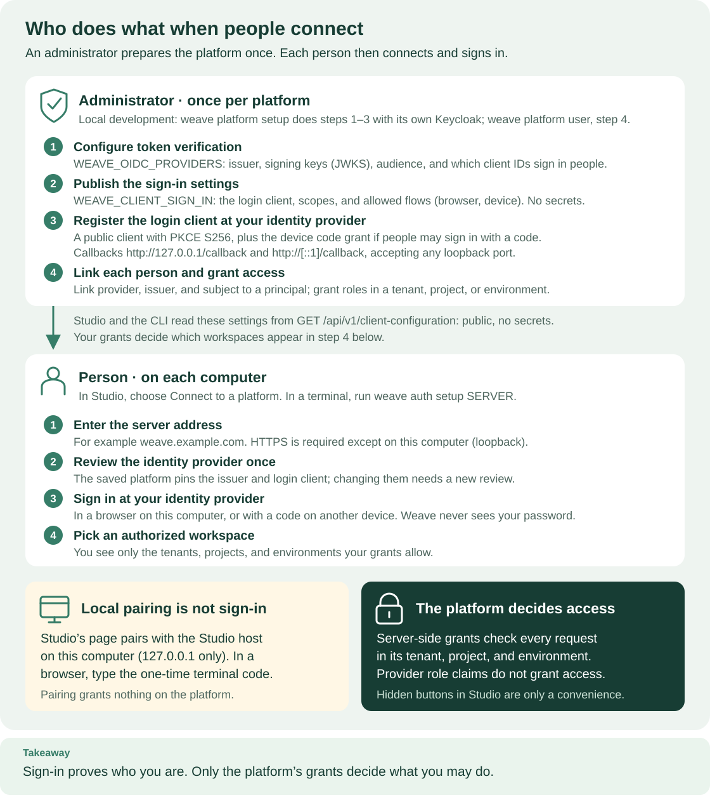

<!--
Copyright 2026 Firefly Software Foundation.

Licensed under the Apache License, Version 2.0 (the "License");
you may not use this file except in compliance with the License.
You may obtain a copy of the License at

    http://www.apache.org/licenses/LICENSE-2.0

Unless required by applicable law or agreed to in writing, software
distributed under the License is distributed on an "AS IS" BASIS,
WITHOUT WARRANTIES OR CONDITIONS OF ANY KIND, either express or implied.
See the License for the specific language governing permissions and
limitations under the License.
Author: Firefly Software Foundation
SPDX-License-Identifier: Apache-2.0
-->

# Give people the right access

Weave separates **signing in** from **permission to do work**. Your identity
provider, the OIDC or CIAM service where people have their accounts, proves who
a person is. Weave then decides what that person may do: a Weave **principal** is linked
to their provider identity and holds **role bindings**, each naming a role and
the tenant, project, environment, and optional resources where it applies.
Studio calls a principal an *account* and shows its role bindings as the
account's roles.

**Who this is for:** platform and tenant administrators who onboard people. It
takes about 10 minutes per person. **What you need:** an administrator account
on the platform, and a platform whose identity provider is already configured,
as described in [identity setup](../operations/identity-and-secrets.md).

**Release status.** The principal and role-binding commands, the SDK helper,
and Studio's **People and access** panel are also part of alpha6. Three things
on this page are new in 0.1.0a7: connecting by server address
(`weave auth setup` or Studio's **Connect to a platform**), the account details
shown for an unrecognized account, and `weave platform user`.



Read the top panel first: the administrator's four one-time steps, ending with
step 4, linking each person and granting access, which this page covers. The
lower panel is what each person then does on their computer; the workspaces they
see in their step 4 are exactly the ones your grants allow.
[Open diagram at full size](../diagrams/sign-in-roles.svg).

## 1. Choose who manages which part

| Responsibility | Where it belongs |
| --- | --- |
| Create the sign-in account, reset a password, configure MFA | Your identity provider's administration, such as Entra ID or Keycloak |
| Publish the sign-in settings people use to connect by server address | The Weave operator, through [published sign-in settings](../operations/identity-and-secrets.md#3-publish-sign-in-settings-for-people) |
| Create a Weave principal and link its verified provider identity | A Weave platform administrator |
| Grant or remove access in a tenant | That tenant's administrator, or a platform administrator |
| Define workflows | A person with `developer` in the relevant project |
| Operate runs | A person with the required run roles in the relevant scope |
| Claim and complete assigned approvals | An eligible person with `task_participant` |

**Studio never handles passwords.** It does not collect identity provider
passwords, create provider accounts, or copy the provider's role names into
Weave grants. Keycloak is used by the local development platform; your provider
can be different. The [identity-provider setup](../operations/identity-and-secrets.md)
covers token verification, published sign-in settings, and the public login
client.

**The first platform administrator comes from the bootstrap procedure.** There
is no self-registration button in Studio. On a new shared platform, bootstrap
links an application identity; use it once to
[make your own account a platform administrator](../operations/kubernetes.md#make-your-own-account-a-platform-administrator).

## 2. Choose the smallest useful role combination

Roles are **additive**, not a hierarchy. An administrator is not automatically a
workflow author or a run operator, so managing memberships does not expose
business data.

| Studio label | Role | What it allows |
| --- | --- | --- |
| Workflow editor | `developer` | Write, compile, simulate, and publish definitions; read the catalog |
| Viewer | `viewer` | Read the catalog, run state, status, and delivery information |
| Run operator | `operator` | Start, signal, cancel, pause, resume, retry, and archive runs; handle incidents |
| Deployer | `deployer` | Activate and retire releases, bind connections, and manage triggers and subscriptions |
| Execution manager | `execution_manager` | Read, archive, and permanently purge run content |
| Task participant | `task_participant` | Read eligible tasks; claim, release, and complete assigned work |
| Task manager | `task_manager` | Manage assignment bindings, groups, and human tasks |
| Email reader, Email sender, Email manager | `email_reader`, `email_sender`, `email_manager` | Read conversations, send messages, or manage email sources |
| File reader | `file_reader` | Read file metadata and download verified content in the granted scope |
| File manager | `file_manager` | Read, upload and delete files; deletion remains blocked while retained runs use them |
| Lumi user | `lumi_user` | Ask the configured assistant using only context the caller may access |
| Lumi manager | `lumi_manager` | Use Lumi and change its separate environment model configuration; selecting a connection also needs `connection.manage` |
| Tenant administrator | `tenant_admin` | Manage the tenant's projects, environments, grants, and integration connections |
| Worker | `worker` | For worker identities only: register workers and claim and complete their tasks |
| Not granted in Studio | `platform_admin` | Manage platform identities, create tenants, and grant across the platform |

**Common combinations:**

- **Someone who inspects and operates runs** needs both `viewer` and
  `operator`: `operator` alone cannot read runs.
- **An author who also activates** needs `developer` and `deployer`; add
  `deployer` deliberately.
- **Approvals and email are separate.** Grant `task_participant` or an email
  role only to the people who need them.

**Files and Lumi require explicit roles.** Add them only in the intended project
or environment. A task participant can use attachments offered by a current
human-task claim without receiving access to the whole environment file store.
Lumi access does not allow publishing or starting workflows.

A worker identity stays limited to worker capabilities even if a human role is
attached to it by mistake.

**Scope narrows a grant.** A tenant binding covers every project and
environment in the tenant. A project binding covers that project and its
environments. An environment binding covers only that environment. Resource
restrictions narrow supported operations further; they never turn an
environment grant into tenant administration.

### Create your team's workspace

A **workspace** is one tenant, one project in it, and one environment in that
project. The local platform's `weave platform demo` and the deployment guides'
first-run example each create one. For your team's real work, create your own
with the CLI; Studio cannot create tenants, projects, or environments.

| Create | Needs | Request file |
| --- | --- | --- |
| Tenant | `platform_admin` | `{"name": "Finance"}` |
| Project in a tenant | `tenant_admin` in that tenant | `{"name": "Expenses"}` |
| Environment in a project | `tenant_admin` in that tenant | `{"name": "production"}` |

Each command prints `{"id": "NEW_UUID"}`; keep the IDs. Every `remote access`
command needs a tenant, even `create-tenant`, which does not use it: when your
saved platform has no workspace yet, pass an existing tenant with `--tenant`,
such as the one the first-run example created.

1. **A platform administrator creates the tenant.**

    ```sh
    # Create the tenant; this needs platform_admin.
    printf '%s\n' '{"name":"Finance"}' > tenant.json
    weave remote access create-tenant --tenant EXISTING_TENANT_ID --request tenant.json
    ```

    Expected: `{"id": "NEW_TENANT_ID"}`.

2. **The platform administrator names the tenant's administrator.** Nobody,
   not even the creator, has a role in a new tenant until it is granted.
   Create `tenant-admin.json` with the administrator's principal UUID, which can
   be your own:

    ```json
    {"principal_id": "PRINCIPAL_UUID", "grant": {"role": "tenant_admin", "scope": {"tenant_id": "NEW_TENANT_ID"}}}
    ```

    ```sh
    # Grant tenant_admin in the new tenant.
    weave remote access grant --tenant NEW_TENANT_ID --request tenant-admin.json
    ```

    Expected: one JSON object with an `id`.

3. **The tenant administrator creates the project and the environment.**

    ```sh
    # Create a project in the new tenant.
    printf '%s\n' '{"name":"Expenses"}' > project.json
    weave remote access create-project --tenant NEW_TENANT_ID --request project.json
    # Create an environment in that project.
    printf '%s\n' '{"name":"production"}' > environment.json
    weave remote access create-environment --tenant NEW_TENANT_ID \
      --project NEW_PROJECT_ID --request environment.json
    ```

    Expected: two JSON objects, each with an `id`.

Run each creation once: every call creates a new resource, so after an
uncertain network result, check before you try again. The tenant administrator
then grants the roles people need, as in [section 3](#3-create-and-link-a-person),
and each person chooses the new workspace with `weave auth workspace` or in
Studio. These commands were checked against the API contracts, not run against
a server.

## 3. Create and link a person

As a platform administrator:

1. Confirm that the person already has a sign-in account at your identity
   provider.
2. Get the exact **provider ID**, **issuer**, and **subject**. The easiest
   source is the account details the person shares after signing in, described
   next. Confirm them with your identity provider's administration. The subject
   is normally not an email address or a display name.
3. Create a Weave principal of kind `human` and keep its UUID.
4. Link the provider ID, issuer, and subject to that principal.
5. Grant the roles the person needs, in the intended tenant.
6. Have the person sign in with their own account and confirm they see the
   expected workspace and operations.

A principal can exist before its identity link or grants, but it cannot do the
intended work until all three are in place. Linking an identity that another
principal already owns fails; it never moves the account.

### Find the provider ID, issuer, and subject

**Ask the person to connect first.** A person can sign in before you link their
account. Weave then refuses their requests, and the CLI and Studio show the
details you need instead of a generic error.

In the CLI, `weave auth setup` and `weave auth status --check` exit 1 and print
the details on the terminal. On a local platform, `weave auth status --check`
shows the following for an account that is not linked yet; the ports, the
subject, and the name differ on yours:

```text
Checking your sign-in with http://127.0.0.1:API_PORT ...
You signed in, but this platform does not recognize your account yet.
Ask an administrator to link your account. Share:
  Identity provider: http://localhost:KEYCLOAK_PORT/realms/weave
  Provider id:       local-keycloak
  Subject:           KEYCLOAK_USER_ID
  Name:              bob
Support code: WV-AUTH-NOT-LINKED
```

`weave auth setup` prints the same details and adds that the platform is saved,
the person is signed in, and a workspace can be chosen later. With
`--output json`, the details are in the `account` object, with the fields
`provider_id`, `issuer`, `subject`, and `display_name`, next to
`"code": "WV-AUTH-NOT-LINKED"`.

In Studio, the **Choose a workspace** step shows **You signed in, but this
platform doesn't recognize your account yet**. The person selects **Copy
details** under **Details for your administrator** and sends you the text. It
names the platform and server, the identity provider and its ID, the issuer,
the account name, and the subject.

**Treat these details as a lead, not as proof.** The CLI and Studio read the
account name and subject from the ID token without verifying its signature.
They keep them only when the token names the platform's issuer and login
client, and never use them for authorization. Before you link, confirm the
subject in your identity provider's administration. In Keycloak, the subject is
the user's **ID** shown on the user's details page. When the details say **Not
shared by your identity provider**, or when the person's provider issues a
different subject per application, as Microsoft Entra ID does, look up the
subject that your API's access tokens carry instead.

### Perform these steps in Studio

1. **Connect as an administrator.** On Home, select **Connect to a platform**
   and follow the steps in the [Studio guide](studio.md#connect-to-a-platform).
   Choose a workspace in the tenant you administer.
2. **Open the account list.** Open **Settings → People and access**. The
   **Accounts** table shows each account with its **Type**, its **Roles**, and,
   under **Applies to**, where each role applies. Select **Refresh** to read it
   again.
   Platform administrators see every account, including accounts with no roles
   yet; tenant administrators see only the accounts that hold roles in the
   selected tenant.
3. **Create the account.** Under **Account type**, keep **Person** and select
   **Create account**. Studio confirms it with a message such as "Created
   Account 1a2b3c4d." and the new account appears in **Accounts**, named
   "Account" followed by the first eight characters of its ID.
4. **Link the sign-in.** Open **Advanced: link a sign-in to an account**.
   **Account ID** already holds the new account's full ID. Enter the verified
   **Identity provider ID**, **Issuer URL (exact)**, and **Subject (exact)**,
   then select **Link sign-in**.
5. **Assign a role.** Open the actions menu at the end of the account's row and
   select **Assign role**. In the side panel, choose the **Role** and, under
   **Applies to**, where it applies: **This environment**, **This project**, or
   **Whole tenant**.
   The environment and project are the ones in the workspace you selected, and
   the hint under the field names them, for example "Payments / Production
   only." Start with **This environment** unless the person needs more.
   Optionally narrow it with **Limit to resources**, a comma-separated list of
   resource IDs. Select **Assign role** and check the new role in the account's
   row. Assign each additional role the same way.
6. **Ask the person to test.** They sign in with their own account. Your
   administrator session cannot show what their account may do.

Expected: Studio confirms each change in a short message at the bottom left of
the window, for example "Assigned Workflow editor to Account 1a2b3c4d.", and
refreshes **Accounts**.

- **Only platform administrators can create accounts and link sign-ins.** A
  tenant administrator sees neither **Create account** nor the link section.
  They select **Assign role** at the top of the tab and enter the **Account ID**
  that a platform administrator gives them.
- **If People and access is missing,** check which account and workspace you
  are using before you create a second administrator account.
- **If Studio can't confirm that an account was created,** for example after a
  network error, it says "Studio couldn't confirm the account was created. Check
  the list before creating it again." and blocks **Create account**. Select
  **Refresh**, look for the new account in **Accounts**, then select **I checked
  the list**. Until you do, Studio doesn't switch the platform or workspace.
- **Switching workspaces** clears the account list and any unfinished access
  forms.

### Perform the same steps with the CLI

First connect the CLI as an administrator and choose a workspace in the tenant
you manage. Remote commands then use the active saved platform for the server,
your sign-in, and the tenant:

```sh
# Connect once as an administrator; prompts and the sign-in address appear on the terminal.
weave auth setup https://weave.example.com
```

Expected: the four setup steps end with `Platform 'NAME' is set up and active.`
and a workspace in your tenant. Add `--profile NAME` to the commands below to
use another saved platform. Scripts can still pass `--base-url` and `--tenant`
with a `WEAVE_ACCESS_TOKEN` or `--auth-config`; see
[client configuration](../operations/configuration.md#client-configuration-cli-studio-desktop).
If you created a source checkout's environment without running its installer,
type `.venv/bin/weave` instead of `weave`.

```sh
# Create a request for a human principal; no password or token goes in this file.
printf '%s\n' '{"kind":"human"}' > person-request.json
# Requires platform administrator authority, not just a tenant administrator role.
weave remote access principals create --request person-request.json
```

Expected: one JSON object such as `{"active": true, "id": "PRINCIPAL_UUID",
"kind": "human"}`. Each call creates a new principal, so after an uncertain
network result, list the directory before you try again.

```sh
# Paste the returned UUID instead of typing one from memory.
printf 'Created principal UUID: '; read -r WEAVE_PERSON_ID
export WEAVE_PERSON_ID
```

Create `identity-link.json` with the **verified values** from the previous
section. This shape is illustrative; use your provider's real values:

```json
{
  "provider_id": "your-configured-provider-id",
  "issuer": "https://your-provider.example/your-tenant",
  "subject": "verified-provider-subject"
}
```

```sh
# Link this existing provider identity to the new Weave principal.
weave remote access principals link "$WEAVE_PERSON_ID" --request identity-link.json
```

Expected: one JSON object echoing `principal_id`, `provider_id`, `issuer`, and
`subject`. From now on, the person's sign-in resolves to this principal.

Next, grant a role. This example grants `viewer` on the project of your saved
workspace:

```sh
# Read the project ID from your saved workspace instead of typing it.
PERSON_PROJECT_ID="$(weave auth status --output json \
  | python3 -c 'import json, sys; print(json.load(sys.stdin)["workspace"]["project_id"])')"
export PERSON_PROJECT_ID

# Write the grant request from the two IDs.
python3 - <<'PYTHON'
import json
import os
from pathlib import Path
request = {
    "principal_id": os.environ["WEAVE_PERSON_ID"],
    "role": "viewer",
    "project_id": os.environ["PERSON_PROJECT_ID"],
    "resources": [],
}
Path("viewer-grant.json").write_text(json.dumps(request, indent=2) + "\n")
PYTHON

# Requires grant management in the selected tenant.
weave remote access members grant --request viewer-grant.json
```

Expected: one JSON object for the new binding, with its own `id`, the
`principal_id`, `"role": "viewer"`, and the project scope.

The tenant always comes from the saved workspace or `--tenant`. The request can
narrow it with `project_id` and `environment_id`; it cannot choose another
tenant or create a platform administrator.

### Create a development person on the local platform

**On a local platform from `weave platform setup`, one command does all of
this.** It creates a Keycloak account with a generated password, a `human`
principal, the identity link, and grants in the demo workspace. It needs a
completed `weave platform demo` and a running API:

```sh
# Development only: the generated password is printed once and never saved.
weave platform user --username alice
```

Expected: `Username: alice`, the password, the granted roles, and the next
command, `weave auth setup http://127.0.0.1:API_PORT`. The default roles are
`developer` on the demo project, and `deployer`, `operator`, `viewer`, and
`task_participant` on the demo environment. Repeat `--role` to grant a
different set instead. An existing username is never reset. Never use this
command with a shared or production identity provider.

**To practise platform-administrator commands locally,** act as the local host
application, which `weave platform setup` bootstrapped as platform
administrator. `weave platform user` never offers `platform_admin`. From the
checkout where you ran setup:

```sh
# Load the installation's paths, then renew the host token.
source .local/platform/session.env
weave platform token
# Use the host token for explicit-mode commands in this terminal only.
export WEAVE_ACCESS_TOKEN="$(python3 -c 'import json,os; print(json.load(open(os.environ["WEAVE_WORK_DIR"]+"/host-token.json"))["access_token"])')"
export WEAVE_DEMO_TENANT_ID="$(python3 -c 'import json,os; print(json.load(open(os.environ["WEAVE_WORK_DIR"]+"/first-run.json"))["scope"]["tenant_id"])')"
# Example: list the platform's principals.
weave remote access principals list --base-url "$WEAVE_API_URL" --tenant "$WEAVE_DEMO_TENANT_ID" --limit 50
```

Expected: one JSON page of principals. Run `unset WEAVE_ACCESS_TOKEN` when you
finish, so later commands use your own saved platform again.

## 4. Help the person finish connecting

After you link the identity and grant at least one role, the person completes
the connection without setting it up again:

- **CLI:** `weave auth workspace` lists the workspaces their grants allow, and
  `weave auth status --check` confirms the sign-in with the platform.
- **Studio:** select **Check again** on the same step, then choose a workspace
  and select **Start working**.

```sh
# Run as the person: choose the newly granted workspace, then verify the connection.
weave auth workspace
weave auth status --check
```

Expected: the workspace is saved, and `weave auth status --check` shows
`signed in as` with their account name and the chosen workspace, and exits 0.

**A person who is linked but has no grants sees no workspace.**

- `weave auth setup` and `weave auth workspace` report `Your account has no
  access to any workspace on this platform yet.` with the same account details;
  JSON output carries `WV-AUTH-NO-ACCESS`. `weave auth setup` still saves the
  platform and exits 0; `weave auth workspace` exits 1.
- `weave auth status --check` exits 0 and says the account has no access to any
  workspace yet.
- Studio shows **Your account doesn't have access to a workspace yet** with
  **Copy details**.

Grant a role that covers at least one environment, then have the person run
`weave auth workspace` or select **Check again**.

**If a saved workspace stops being authorized later,** Studio forgets it when it
checks the connection, and `weave auth status --check` reports `The selected
workspace is no longer available.` with the command to choose another.

## 5. Review, revoke, or deactivate

**In Studio,** **Settings → People and access** lists each account under
**Accounts**, with its **Roles** and, under **Applies to**, where each one
applies, such as "All of Acme" or "Acme / Payments / Production". The actions menu at the end of an
account's row offers **Assign role**, one removal per role, such as "Remove
Viewer (All of Acme)", and, for platform administrators, **Deactivate** or
**Activate**. A removal takes away that one role binding and leaves the
account's other roles in place. Each removal or status change asks you to
confirm, with **Remove**, **Deactivate**, or **Activate**, and names the account
it affects.

**With the CLI:**

```sh
# Tenant administrators see the bindings in the selected tenant.
weave remote access members list --limit 50
# Platform administrators can inspect the global principal directory.
weave remote access principals list --limit 50
```

Expected: each command prints one JSON page with `items` and `next_cursor`. Pass
a returned cursor with `--cursor` to continue the same list. In a membership
row, `id` is the **binding ID** and `principal_id` identifies the person.
Revoking takes the binding ID, so removing one role leaves the person's other
roles in place.

```sh
# Revoke only the binding you reviewed; paste its returned UUID.
printf 'Binding UUID to revoke: '; read -r WEAVE_BINDING_ID
weave remote access members revoke "$WEAVE_BINDING_ID"
```

Expected: `{"revoked": true}`. List the bindings again to confirm that the row
is gone.

**Deactivating a principal is a platform administrator operation.** It stops
further use of that Weave identity. It does not delete past decisions or
disable the account at your identity provider. You cannot deactivate yourself
or revoke your own `tenant_admin` binding: the API refuses both with
`WV-MEMBER-SELF-LOCKOUT`.

**Revocation applies to the next request.** The server checks grants on every
request, so a button still visible in an open browser no longer works.
Operations already past their authorization check may complete, and revoking
cannot undo effects that already reached other systems.

## 6. Use the same API from your product

The [HTTP API explorer](../reference/api-explorer.md) shows the request and
response schemas for `principals.*` and `members.*`. Swagger on your running
platform can send these requests with your own authorized token.

For Python, wrap an already configured `WeaveClient` with `MembersClient`:

```python
from firefly_weave.sdk.members import MembersClient

async def read_members(weave_client):
    # The client supplies the existing sign-in and the selected tenant scope.
    access = MembersClient(weave_client)
    page = await access.bindings(limit=50)
    return page.items, page.next_cursor
```

The helper also provides `principals`, `create_principal`, `link_identity`,
`set_active`, `grant`, and `revoke`. They use the same contracts and server
checks as Studio and the CLI. Creating accounts in a third-party identity
provider stays a separate integration with that provider.

## If something goes wrong

| What you see | Why | What to do |
| --- | --- | --- |
| The person sees `WV-AUTH-NOT-LINKED`, or Studio says it doesn't recognize their account | Their identity is not linked to a principal yet | [Link it](#find-the-provider-id-issuer-and-subject) |
| The person sees `WV-AUTH-NO-ACCESS`, or no workspace | They are linked but have no role covering an environment | Grant a role, then have them run `weave auth workspace` or select **Check again** |
| `WV-IDENTITY-ALREADY-LINKED` (HTTP 409) | Another principal already owns that provider identity | Find and use that principal; linking never moves an account |
| `WV-PRINCIPAL-NOT-FOUND` (HTTP 404) | The principal UUID is wrong or outside your view | Use the ID Studio fills in after **Create account**, or copy it from `weave remote access principals list` |
| `WV-MEMBER-SCOPE` (HTTP 409) | The project or environment is not in the selected tenant | Choose a workspace in that tenant, or fix the IDs |
| `WV-MEMBER-SELF-LOCKOUT` (HTTP 409) | You tried to deactivate yourself or revoke your own `tenant_admin` binding | Ask another administrator |
| **People and access** is missing in **Settings**, or HTTP 403 | Your account lacks grant management in this tenant | Check that you selected the right workspace and administrator account |
| The person signs in but a command doesn't run or is missing | Their roles do not include that operation in this workspace | In the designer, selecting an unavailable **Save draft**, **Publish…**, **Activate…**, or **Start run…** shows the reason under the toolbar, such as "Your account can't publish workflows in this workspace."; grant the role from the table above |

## Next steps

- [Connect Studio to a platform](studio.md#connect-to-a-platform): what the
  person does after you grant access.
- [Add human approvals](human-tasks.md): reviewer groups and assignment
  bindings.
- [Identity and secrets](../operations/identity-and-secrets.md): token
  verification, published sign-in settings, and the login client.
