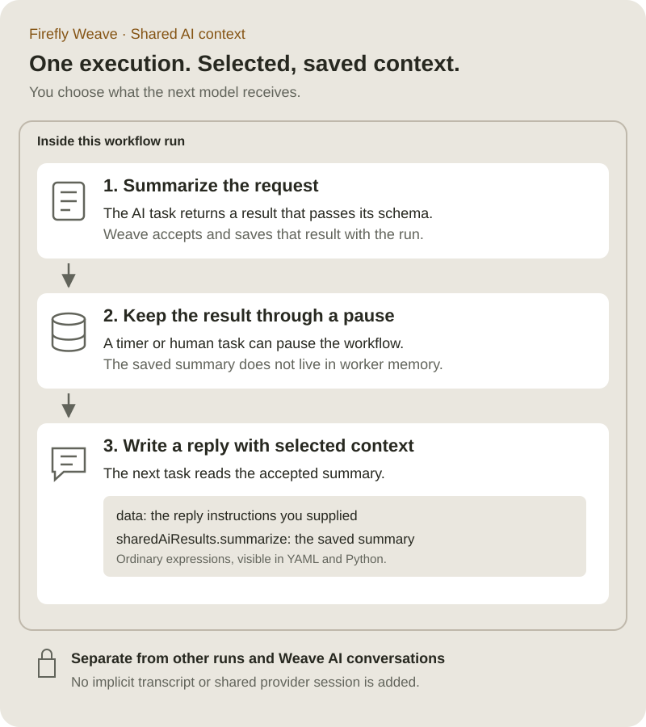

<!--
Copyright 2026 Firefly Software Foundation.

Licensed under the Apache License, Version 2.0 (the "License");
you may not use this file except in compliance with the License.
You may obtain a copy of the License at

    http://www.apache.org/licenses/LICENSE-2.0

Unless required by applicable law or agreed to in writing, software
distributed under the License is distributed on an "AS IS" BASIS,
WITHOUT WARRANTIES OR CONDITIONS OF ANY KIND, either express or implied.
See the License for the specific language governing permissions and
limitations under the License.
Author: Firefly Software Foundation
SPDX-License-Identifier: Apache-2.0
-->

# Share context between AI steps

Use shared AI context when a later model task needs an earlier model's accepted
answer. For example, one task summarizes a customer request and a later task
writes a reply using that summary. Both tasks belong to the **same workflow run**.



[Open the diagram at full size](../diagrams/shared-ai-context.svg).

## What “memory” means here

Weave saves each successful step's validated output with its execution. A later
step reads that output through a reference such as
`/steps/summarize/output/result`. The reference resolves inside the current run;
it cannot address another run. This is explicit, structured context sharing.

There is no implicit conversation transcript, background memory service, or
provider session shared between tasks. Each task starts a fresh bounded Agentic
invocation. The worker receives the prompt, the chosen context, and its pinned
model profile. Weave AI conversations remain separate.

| Setting | What it shares |
| --- | --- |
| The same workflow AI profile | Provider, model, result schema, and generation limits. It does not share answers. |
| A result selected in **Shared AI context** | An earlier AI step's accepted result, in this execution only. |
| A context expression | Precisely the workflow input or earlier output fields you select. |
| Weave AI configuration | The Studio assistant's own provider and model. It does not add workflow memory. |

## Configure it in Studio

Start with a workflow containing two **AI task** steps in sequence, named
`summarize` and `write-reply`. Complete the [AI worker setup](ai-workers.md)
before expecting live model calls.

1. Select `summarize`. Configure its workflow AI profile with the model, limits,
   and expected result fields. Choose the AI connection slot and review the
   configuration before applying it.
2. Give it a prompt such as “Summarize the request in one sentence.” Set its
   context to the relevant workflow input.
3. Select `write-reply`. In **Shared AI context**, check **Use result from
   summarize**. Only earlier AI results available on this execution path appear.
4. Write a prompt that names the context you are providing: “Draft a reply using
   `sharedAiResults.summarize` and the instructions in `data`.”
5. Keep any additional input in the ordinary **Context** editor. When you select
   a shared result, Studio preserves the existing expression under `data` and
   places the selected results under `sharedAiResults`.
6. Validate the workflow. Publish, bind the connection slot during activation,
   and start a run using the normal [CLI or Studio workflow](cli-tutorial.md).
7. Inspect the first task's accepted output and the second task's input in the
   run details. Verify that only the intended context was sent.

You can select up to 16 earlier AI results in the convenience picker. Unchecking
the last selection restores the original context expression. If a referenced
step is deleted or moved out of scope, Studio flags that unavailable result;
remove it or repair the workflow before running. The compiler remains the final
authority for scope, schema, classification, and payload limits.

## Write the same workflow in YAML

Save the following as `shared-ai-context.yaml`. Replace `approved-model` with a
model or deployment that your operator permits. This example needs the published
Agentic Action and Connector described in [AI workers](ai-workers.md).

```yaml
apiVersion: weave/v1alpha1
kind: Workflow
metadata:
  name: shared-ai-context
  version: 1.0.0
spec:
  inputSchema:
    type: object
    properties:
      request: {type: string}
    required: [request]
  outputSchema: {type: string}
  connections:
    # Activation chooses an authorized connection revision for this slot.
    ai: {connector: weave-agentic-provider@1.0.0}
  llmProfiles:
    writer:
      provider: openai-chat
      model: approved-model
      options: {max_tokens: 256}
      reasoning: {pattern: none}
      maxCalls: 1
      timeoutSeconds: 60
      outputSchema: {type: string}
  steps:
    - id: summarize
      kind: llm
      uses: weave-agentic-generate@1.0.0
      profile: writer
      connection: ai
      prompt: {literal: "Summarize the supplied request in one sentence."}
      context: {ref: /input/request}
    - id: pause
      kind: wait
      # The summary stays in the run while the process waits.
      durationSeconds: 10
    - id: write-reply
      kind: llm
      uses: weave-agentic-generate@1.0.0
      profile: writer
      connection: ai
      prompt:
        literal: "Use sharedAiResults.summarize to draft a reply. Follow data."
      context:
        object:
          # Keep ordinary task context alongside explicitly selected results.
          data: {literal: "Use a concise, professional tone."}
          sharedAiResults:
            object:
              summarize: {ref: /steps/summarize/output/result}
  output: {ref: /steps/write-reply/output/result}
```

`data` and `sharedAiResults` are ordinary object keys, not new runtime APIs. The
Studio picker produces this expression shape so you can inspect and edit the
same definition in YAML, JSON, or Python. You can use a direct `ref` instead
when the task needs only one earlier result.

## Use the Python SDK

The SDK uses the same contracts. If `builder` is your existing
`WorkflowBuilder`, with a `writer` profile, an `ai` connection slot, and an
earlier `summarize` step, append the consumer this way:

```python
from firefly_weave.contracts.definitions import (
    LLMStep,
    LiteralExpression,
    ObjectExpression,
    RefExpression,
)

# The builder is immutable: keep the returned updated workflow.
builder = builder.add_step(
    LLMStep(
        id="write-reply",
        kind="llm",
        uses="weave-agentic-generate@1.0.0",
        profile="writer",
        connection="ai",
        prompt=LiteralExpression(
            literal="Draft a reply using sharedAiResults.summarize and data."
        ),
        context=ObjectExpression(
            object={
                "data": LiteralExpression(literal="Use a professional tone."),
                "sharedAiResults": ObjectExpression(
                    object={
                        "summarize": RefExpression(
                            ref="/steps/summarize/output/result"
                        )
                    }
                ),
            }
        ),
    )
)
```

See [the Python SDK](../reference/sdk.md) for constructing the builder and
publishing through the normal APIs. No separate memory endpoint or provider SDK
is needed in your product.

## Understand pauses, retries, and branches

- **Pauses and recovery:** accepted outputs belong to the persisted execution,
  rather than worker process memory. Restarting a worker does not erase them.
- **Replay:** Weave uses accepted evidence. Replaying a completed step does not
  call its model again.
- **Ambiguous provider failures:** a provider may charge for a request even when
  its response is lost. Shared context does not provide exactly-once model calls.
  Review incidents through the normal recovery controls.
- **Branches:** a step can read only values available on its execution path. It
  cannot read a future step or a concurrent sibling's incomplete result. Expose
  branch outputs at the join when the next step needs them, then map those values
  with the ordinary context editor.
- **Data boundaries:** choosing a result sends it to the consuming step's
  provider, which may differ from the producing step's provider. Share only the
  necessary fields. Normal schema, secret classification, and size limits still
  apply; there is no bypass for AI context.
