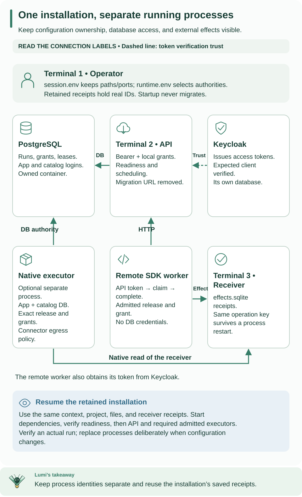

<!--
Copyright 2026 Firefly Software Foundation.

Licensed under the Apache License, Version 2.0 (the "License");
you may not use this file except in compliance with the License.
You may obtain a copy of the License at

    http://www.apache.org/licenses/LICENSE-2.0

Unless required by applicable law or agreed to in writing, software
distributed under the License is distributed on an "AS IS" BASIS,
WITHOUT WARRANTIES OR CONDITIONS OF ANY KIND, either express or implied.
See the License for the specific language governing permissions and
limitations under the License.
Author: Firefly Software Foundation
SPDX-License-Identifier: Apache-2.0
-->

# Set up a local platform manually

This guide runs Weave on your own computer one operation at a time: you build
the server package, start PostgreSQL and Keycloak, link the first identity,
start the API, and save one real workflow run. The API, SDK, and CLI then read
that same run, whose output is `{"message": "Hello, Weave"}`.

**Most people should use [Start a local platform in small steps](local-platform.md)
instead.** `weave platform` performs every operation below with one command per
step and also creates a person who can sign in to the CLI and Studio. Use
this manual route when you operate Weave and want to see, and control, each
underlying command. You do not need to complete both guides.

**Only want to try a workflow?** Start with the [offline quickstart](../quickstart.md).
**Already have a platform?** [Connect the CLI to it](connect-to-api.md) instead.
Installing the CLI alone does not need any of the services below.

**This is a local development installation.** It creates fresh resources and
keeps their data when stopped. Production needs its own TLS, identity, secret
management, capacity, and backup configuration. Plan for a longer session than
the `weave platform` route: you run each block yourself and check its result
before continuing.



Use this process map while opening terminals. Setup and client commands belong
to terminal 1; the API keeps running in terminal 2. The receiver, native
executor, and worker in the extended topology come later, in
[Deploy your first worker](../operations/deployment.md).
[Open diagram at full size](../diagrams/operations-topology.svg)

If you are still deciding what to install, read
[Deploy, start, and use the platform](platform-overview.md) first. This guide is
the complete command sequence for its manual local path.

## Follow the setup in order

This guide has two parts: set up the installation once, then use or resume it.
Keep each terminal open as directed, and run one block at a time. Continue only
when its expected result appears.

| Stage | Terminal | Successful checkpoint |
| --- | --- | --- |
| [1. Prepare the server package](#1-reserve-the-installation-and-install-exact-artifacts) | 1 | The selected Python environment reports its Weave version |
| [2. Start PostgreSQL and Keycloak](#2-create-fresh-database-and-identity-services) | 1 | Identity discovery works and the database schema is current |
| [3. Link the initial identity](#3-verify-and-bootstrap-one-local-identity) | 1 | A private bootstrap receipt records the linked identity |
| [4. Start the API](#4-launch-and-check-the-api) | 2 for the API; 1 to check it | `API is ready` |
| [5. Run a workflow](#5-grant-scope-publish-activate-and-run) | 1 | The saved run succeeds with `Hello, Weave` |

After the first run, choose between [using the CLI](#continue-with-the-cli),
[adding a worker](#6-add-workers-and-package-the-runtime), or
[stopping while keeping your data](#7-stop-safely-and-retain-data).
On a later visit, go directly to [resume this installation](#resume-this-installation-later).

## What you will run

| Component | Its job | Location |
| --- | --- | --- |
| PostgreSQL | Stores definitions, grants, runs, and tasks across restarts | Local container |
| Keycloak | Issues tokens identifying the host application and workers | Local container with its own database container |
| Weave API | Checks permissions and coordinates workflow execution | Python process in terminal 2 |
| Host client | Calls the API as an application | Commands in terminal 1 |

There is no remote worker yet. The first workflow only copies its input to its
output, which Weave does internally. [Deploy your first worker](../operations/deployment.md)
adds a worker and an HTTP integration to this installation.

## Before you start

You need Git, Python 3.12+, `uv`, and a running local Docker engine with Compose
2.30 or later. If needed, follow the
[official Docker installation guide](https://docs.docker.com/get-started/get-docker/).
These examples use Bash or Zsh and a local Unix-socket Docker context.

This operator guide uses files from the source repository: Compose definitions,
setup helpers, and examples. A user-local CLI installation does not contain that
checkout. If you do not already have it, run:

```sh
# Clone the alpha7 release that matches the CLI, then install its locked dependencies.
git clone --branch v0.1.0a9 --single-branch \
  https://github.com/fireflyframework/firefly-weave.git
cd firefly-weave
uv sync --locked --python 3.12
```

The clone selects the same **v0.1.0a9** release as the CLI installation guide.
A detached-HEAD message is expected when Git opens a release tag; this tutorial
does not require creating a branch or editing application source.

If you already have a checkout, enter its root and run `git describe --tags --exact-match`.
For this released walkthrough, the result must be `v0.1.0a9`. If the checkout has
another version or local development work, preserve it and clone the release into
a separate directory by adding a new directory name to the clone command above.
Contributors intentionally using unreleased source should use that checkout's
matching CLI and documentation; do not mix it with a pinned released client.

This guide creates its own echo workflow through the API; it does not require
copying the offline quickstart's files into the checkout.

Open **terminal 1** at the checkout root and check the prerequisites:

```sh
# Confirm the checkout root and that uv, Docker Compose, and a Docker context are available.
pwd
test -f pyproject.toml && test -f compose.yaml
uv --version
docker compose version
docker context ls
```

`test` prints nothing when both files exist. If it fails, enter the `firefly-weave`
directory. Keep terminal 1 open for setup and client commands. Terminal 2 will
hold the API process; the worker guide adds terminal 3 for its integration
receiver.

You do not need to run the project's acceptance tests to follow this tutorial.
The setup scripts prepare a local development installation for you.

## 1. Reserve the installation and install exact artifacts

A Docker **context** selects the engine that receives commands. The command below
preserves an explicitly selected `WEAVE_DOCKER_CONTEXT`, otherwise it uses your
current context. Inspect its endpoint: it must start with `unix://` and belong
to the local engine intended for this tutorial. Later commands select it explicitly.

```sh
# Select the local Docker engine, then build and install this installation's own server environment.
export WEAVE_DOCKER_CONTEXT="${WEAVE_DOCKER_CONTEXT:-$(docker context show)}"
export WEAVE_REPO_DIR="$PWD"
docker context inspect "$WEAVE_DOCKER_CONTEXT"
docker --context "$WEAVE_DOCKER_CONTEXT" info >/dev/null

umask 077
mkdir -p .local
export WEAVE_LAUNCH_ID="weave-local-$(python3 -c 'from uuid import uuid4; print(uuid4().hex[:12])')"
export WEAVE_WORK_DIR="$PWD/.local/$WEAVE_LAUNCH_ID"
mkdir -m 700 "$WEAVE_WORK_DIR"
uv run --python 3.12 --locked --no-editable --all-extras python scripts/prepare_release.py \
  --output "$WEAVE_WORK_DIR/release"
uv venv --python 3.12 "$WEAVE_WORK_DIR/runtime"
uv pip install --python "$WEAVE_WORK_DIR/runtime/bin/python" --require-hashes \
  -r "$WEAVE_WORK_DIR/release/images/server-requirements.txt"
uv pip install --python "$WEAVE_WORK_DIR/runtime/bin/python" --no-deps \
  "$WEAVE_WORK_DIR/release/artifacts/$(python3 -c 'import json,os; print(json.load(open(os.environ["WEAVE_WORK_DIR"]+"/release/release.json"))["wheel"])')"
export WEAVE_PYTHON="$WEAVE_WORK_DIR/runtime/bin/python"
"$WEAVE_PYTHON" -I -m firefly_weave.cli.main version --output json
```

**Why a separate server environment?** The CLI installer creates a small client
installation. The API additionally needs its server and database dependencies.
This step builds one package and installs those dependencies in an isolated runtime,
so the later API, migration, and operator commands all use the same version.
It does not replace your installed `weave` command.

What those commands do:

- `umask 077` limits newly created private files to your user.
- `WEAVE_LAUNCH_ID` gives the installation a unique name to avoid sharing another
  installation's containers or volumes.
- `WEAVE_WORK_DIR` holds its packages, environment, credentials, and response files
  beneath the ignored `.local/` directory.
- `prepare_release.py` builds one installable Python **wheel**, its source archive,
  and locked dependency lists.
- The install commands create a dedicated server environment. `WEAVE_PYTHON`
  selects that environment for later commands.

Expected: release preparation prints wheel and sdist SHA-256 values; the final
command reports the installed Weave version and language/IR versions. The
`release.json` receipt identifies the exact artifact, including when two builds
have the same package version. Protect the whole work directory: later steps
write credentials inside it.

## 2. Create fresh database and identity services

The commands in this step create these files inside `WEAVE_WORK_DIR`:

| File | Purpose | Use it again when… |
| --- | --- | --- |
| `session.env` | Paths, ports, and this installation's unique name | Opening a new terminal or resuming the tutorial |
| `postgres.env` | Local PostgreSQL configuration and credentials | Starting the database container |
| `identity.env` | Local Keycloak configuration and credentials | Starting Keycloak or refreshing a tutorial token |
| `runtime.env` | Database logins and trusted identity settings for Weave | Starting the API or running an operator helper |

The last three files contain credentials. Keep them in the private work directory;
do not copy their contents into terminal output, Git, or a support request.

The defaults below use PostgreSQL 55434, Keycloak 18080, API 8080, and the later
container API 8081. Preconfigure the port variables to select unused ports; the
commands preserve those choices. Do not reuse a port or volume belonging to
another installation. The runtime setup helper accepts only canonical
`http://localhost:<port>` origins with ports 1024 through 65535.

```sh
# Choose distinct local ports (preset a variable to override it), then check that each one is free.
export WEAVE_POSTGRES_PORT="${WEAVE_POSTGRES_PORT:-55434}"
export WEAVE_KEYCLOAK_PORT="${WEAVE_KEYCLOAK_PORT:-18080}"
export WEAVE_API_PORT="${WEAVE_API_PORT:-8080}"
export WEAVE_CONTAINER_API_PORT="${WEAVE_CONTAINER_API_PORT:-8081}"
export WEAVE_POSTGRES_VOLUME="$WEAVE_LAUNCH_ID-postgres"
export WEAVE_KEYCLOAK_VOLUME="$WEAVE_LAUNCH_ID-keycloak"
export WEAVE_KEYCLOAK_TEST_URL="http://localhost:$WEAVE_KEYCLOAK_PORT"
python3 - <<'PY'
import os, socket
names = ("WEAVE_POSTGRES_PORT", "WEAVE_KEYCLOAK_PORT", "WEAVE_API_PORT", "WEAVE_CONTAINER_API_PORT")
ports = [int(os.environ[name]) for name in names]
assert len(set(ports)) == len(ports), "Each service needs a different local port"
assert all(1024 <= port <= 65535 for port in ports), "Select ports from 1024 through 65535"
for port in ports:
    with socket.socket() as check:
        check.bind(("127.0.0.1", port))
print("Selected local ports are available")
PY
```

Continue only after `Selected local ports are available`. If the check fails,
select distinct unused ports, for example `export WEAVE_API_PORT=18083`, and rerun
the block above before creating configuration. A failed command does not stop an
interactive shell from executing later pasted commands, so keep this check
separate from initialization.

Now save the selected paths and ports and create the private configuration:

```sh
# Save paths and ports to session.env, create the private configuration, then start PostgreSQL and Keycloak.
python3 - <<'PYSESSION'
import os, shlex
from pathlib import Path
root = Path(os.environ["WEAVE_WORK_DIR"])
names = (
    "WEAVE_REPO_DIR", "WEAVE_WORK_DIR", "WEAVE_LAUNCH_ID", "WEAVE_DOCKER_CONTEXT",
    "WEAVE_PYTHON", "WEAVE_POSTGRES_PORT", "WEAVE_KEYCLOAK_PORT", "WEAVE_API_PORT",
    "WEAVE_CONTAINER_API_PORT", "WEAVE_POSTGRES_VOLUME", "WEAVE_KEYCLOAK_VOLUME",
    "WEAVE_KEYCLOAK_TEST_URL",
)
with os.fdopen(os.open(root / "session.env", os.O_WRONLY | os.O_CREAT | os.O_EXCL, 0o600), "w") as stream:
    for name in names:
        stream.write(f"export {name}={shlex.quote(os.environ[name])}\n")
print("In another terminal, restore the same paths and ports with these commands:")
print("cd " + shlex.quote(os.environ["WEAVE_REPO_DIR"]))
print("source " + shlex.quote(str(root / "session.env")))
PYSESSION
python3 scripts/setup-local.py --output "$WEAVE_WORK_DIR/postgres.env"
python3 scripts/setup-identity.py --output "$WEAVE_WORK_DIR/identity.env"
set -a
source "$WEAVE_WORK_DIR/postgres.env"
source "$WEAVE_WORK_DIR/identity.env"
set +a

docker --context "$WEAVE_DOCKER_CONTEXT" compose --project-name "$WEAVE_LAUNCH_ID" \
  --env-file "$WEAVE_WORK_DIR/postgres.env" --env-file "$WEAVE_WORK_DIR/identity.env" \
  -f compose.yaml -f compose.identity.yaml config --quiet
docker --context "$WEAVE_DOCKER_CONTEXT" compose --project-name "$WEAVE_LAUNCH_ID" \
  --env-file "$WEAVE_WORK_DIR/postgres.env" --env-file "$WEAVE_WORK_DIR/identity.env" \
  -f compose.yaml -f compose.identity.yaml up --detach --no-recreate --wait \
  --wait-timeout 180 postgres keycloak
```

The selected paths and ports are saved in `session.env`. Save the printed `cd`
and `source` commands for other terminals; this file contains no tokens or passwords.

`postgres.env` supplies the local database configuration. `identity.env` supplies
Keycloak's database and client secrets. `set -a` exports variables loaded by
`source` so child processes receive them; `set +a` ends automatic export mode.
Keep these private configuration files rather than printing or recreating them.

Expected: PostgreSQL is healthy and Keycloak is running. `WEAVE_CONTAINER_API_PORT`
is reserved for the later API container; it has no readiness endpoint until that container starts. Verify OIDC discovery
before creating a runtime database:

```sh
# Wait until Keycloak publishes its OIDC discovery document.
"$WEAVE_PYTHON" - <<'PY'
import os, time, httpx
url = os.environ["WEAVE_KEYCLOAK_TEST_URL"] + "/realms/weave/.well-known/openid-configuration"
for attempt in range(90):
    try:
        response = httpx.get(url, timeout=2, trust_env=False)
        if response.status_code == 200:
            assert response.json()["issuer"] == os.environ["WEAVE_KEYCLOAK_TEST_URL"] + "/realms/weave"
            print("Keycloak discovery is ready")
            break
    except httpx.HTTPError:
        pass
    time.sleep(1)
else:
    raise SystemExit("Keycloak discovery did not become ready")
PY
```

Continue only after `Keycloak discovery is ready`. If discovery fails, resolve
Keycloak startup before creating a runtime database. This discovery-only block is
also the check to reuse when resuming an existing installation.

For this new installation, provision the runtime database next:

```sh
# Create the runtime database and its logins, load them, then apply the schema migrations.
"$WEAVE_PYTHON" scripts/setup-runtime.py --output "$WEAVE_WORK_DIR/runtime.env"
set -a
source "$WEAVE_WORK_DIR/runtime.env"
set +a
"$WEAVE_PYTHON" -I -m firefly_weave.cli.main admin migrate
```

`setup-runtime.py` creates a fresh runtime database plus restricted application
and scheduler logins. It also tells Weave which local Keycloak issuer to trust.
The variables named `WEAVE_TEST_DATABASE_URL` and `WEAVE_KEYCLOAK_TEST_URL` belong
to the guarded local setup helpers; they do not require running tests.
A **migration** is a versioned database schema update. The explicit migration
command checks that the tables match the installed package.

Expected: a fresh retained runtime database is provisioned, then `Weave schema is
current`. The helper creates separate application and scheduler login credentials
and applies migrations explicitly. It does not overwrite a database or existing
credential file. Keep migration and identity-administrator credentials out of API
and worker process environments. Existing Keycloak realm imports are skipped;
changing a secret file does not update a retained realm.

## 3. Verify and bootstrap one local identity

This step tells Weave which verified identity may perform the initial setup.
For the local exercise, that identity is Keycloak's `weave-host` service account.
Step 5 will give it permission to work in one new tenant, project, and environment.
One application identity is enough on your own computer. On a shared platform,
the people who administer it should use their own accounts instead:
[Kubernetes](../operations/kubernetes.md#make-your-own-account-a-platform-administrator)
shows how the bootstrapped identity makes a person's account a platform
administrator. A Keycloak role alone does not grant a Weave permission.

A **token** proves the caller's identity. A **principal** is Weave's local record
for it. An **identity link** maps the verified token subject to that principal.
Bootstrap creates the first administrator link; workflow access still needs the
grants added in step 5.

A human-paced tutorial can outlast a token. Create this helper once so you can
request a fresh verified token whenever needed, without repeating bootstrap:

```sh
# Create the token helper, renew the host token, then link that identity as the initial administrator.
cat > "$WEAVE_WORK_DIR/refresh-token.py" <<'PYTOKEN'
"""Renew the verified tutorial host token without printing credentials."""
import asyncio, json, os, tempfile
from pathlib import Path
import httpx
from firefly_weave.access.oidc import OIDCVerifier, ProviderConfig

async def main():
    config = ProviderConfig.model_validate(json.loads(os.environ["WEAVE_OIDC_PROVIDERS"])[0])
    async with httpx.AsyncClient(timeout=10, trust_env=False) as client:
        response = await client.post(config.issuer + "/protocol/openid-connect/token",
            data={"grant_type": "client_credentials"},
            auth=("weave-host", os.environ["WEAVE_HOST_SECRET"]))
        response.raise_for_status()
        token = response.json()["access_token"]
    identity = await OIDCVerifier(config).verify(token)
    root = Path(os.environ["WEAVE_WORK_DIR"])
    destination = root / "host-token.json"
    if destination.exists():
        assert json.loads(destination.read_text())["subject"] == identity.subject
    with tempfile.NamedTemporaryFile(mode="w", dir=root, delete=False) as stream:
        json.dump({"access_token": token, "subject": identity.subject}, stream)
        temporary = Path(stream.name)
    temporary.replace(destination)
    print("Verified host token saved privately")

asyncio.run(main())
PYTOKEN
"$WEAVE_PYTHON" "$WEAVE_WORK_DIR/refresh-token.py" &&
export WEAVE_HOST_SUBJECT="$(python3 -c 'import json,os; print(json.load(open(os.environ["WEAVE_WORK_DIR"]+"/host-token.json"))["subject"])')" &&
"$WEAVE_PYTHON" -I -m firefly_weave.cli.main admin bootstrap \
  --provider local-keycloak --issuer "$WEAVE_KEYCLOAK_TEST_URL/realms/weave" \
  --subject "$WEAVE_HOST_SUBJECT" --kind application \
  --output "$WEAVE_WORK_DIR/bootstrap.json"
```

The verifier checks the signature, issuer, audience, allowed client, and token
class before saving a private token file. Expected bootstrap output:
`Identity linked; private receipt written`. The receipt contains the real principal
ID used in step 5; no access token is printed.

A bootstrap conflict means the identity is already linked. Inspect the existing
installation rather than repeating initialization. After a pause, refresh only
the token by running this in terminal 1:

```sh
# Renew only the host token; grants and principals stay unchanged.
"$WEAVE_PYTHON" "$WEAVE_WORK_DIR/refresh-token.py"
```

The helper replaces the private token file for the same verified subject. SDK
examples reread that file on each invocation. If using `WEAVE_ACCESS_TOKEN` for CLI
requests, reload that variable from the new file before the next request.
Refreshing a token does not change grants or create another principal.

## 4. Launch and check the API

Open **terminal 2**. Run the two `cd` and `source` commands printed when you
created `session.env` in step 2. They restore the exact repository path, work
directory, and selected port. Then run this block in terminal 2:

```sh
# Terminal 2: load the runtime settings, then run the API without the migration credential.
set -a
source "$WEAVE_WORK_DIR/runtime.env"
set +a
env -u WEAVE_MIGRATION_DATABASE_URL \
  "$WEAVE_WORK_DIR/runtime/bin/python" -I -m uvicorn \
  firefly_weave.main:create_application --factory --host 127.0.0.1 --port "${WEAVE_API_PORT:?Set the selected API port}"
```

This is the command that starts the Weave server. Uvicorn loads the application
factory from the selected installed package. `--host 127.0.0.1` keeps this first
API reachable only from your laptop; `--port` uses the port reserved in step 2.
The `env -u` removes the migration credential from this process. Its runtime
settings supply the separate application and scheduler database logins.

The API stays running and prints logs; it does not return a shell prompt.
Leave terminal 2 running. In **terminal 1**, wait for readiness:

```sh
# Terminal 1: wait until the API reports that it is ready.
export WEAVE_API_URL="http://127.0.0.1:$WEAVE_API_PORT"
"$WEAVE_PYTHON" - <<'PY'
import os, time, httpx
for attempt in range(60):
    try:
        response = httpx.get(os.environ["WEAVE_API_URL"] + "/health/ready", timeout=2, trust_env=False)
        if response.status_code == 200:
            print("API is ready")
            break
    except httpx.HTTPError:
        pass
    time.sleep(1)
else:
    raise SystemExit("API readiness timed out; inspect the API terminal")
PY
```

Expected: `API is ready`. A listening port alone does not prove the database and
schema are ready. Readiness must succeed before any provisioning request. An incompatible schema
fails startup; apply the matching wheel's explicit migration command rather than
letting a runtime process migrate its own database.

## 5. Grant scope, publish, activate and run

Now that the API is running, an example script creates a place for your workflow
and runs it using the public HTTP API. It handles the initial resource-creation
requests so you can confirm the installation works before making those requests
individually from the CLI. It records the server's returned IDs in a file for later
steps.

The script grants this identity `tenant_admin` in the new tenant, `developer` in
the new project, and `deployer`, `operator`, and `viewer` in its environment. These
allow the publication, activation, execution, and read operations in the exercise.

Before running the helper, understand the resources it creates:

| Resource | Purpose in this tutorial |
| --- | --- |
| Tenant | A new organization boundary with a unique generated name |
| Project | `first-project`, where the workflow version is published |
| Environment | `local`, where its activation and run live |
| Grants | Permission for this host to author, deploy, operate, and view this workspace |
| Published workflow | `first-run@1.0.0`, with one transform copying its input |
| Activation | The selected workflow version in the local environment |
| Run | One invocation with `{"message": "Hello, Weave"}` |

The workflow has the same typed-message shape and transform as the
[quickstart](../quickstart.md). The
helper calls it `first-run` so your `echo` authoring example can be published
independently later. Read [`examples/first_run.py`](../../examples/first_run.py)
to follow each real HTTP request. It is not a special demo endpoint. After this
workspace exists, [the SDK tutorial](sdk-tutorial.md) shows the individual
publish, activate, and start calls using your own YAML file.

Refresh the host token immediately before provisioning. The `&&` runs the
provisioning command only if token refresh succeeds:

```sh
# Renew the token, then create the workspace, publish, activate, and save one real run.
"$WEAVE_PYTHON" "$WEAVE_WORK_DIR/refresh-token.py" &&
"$WEAVE_PYTHON" examples/first_run.py --api-url "$WEAVE_API_URL" \
  --token-file "$WEAVE_WORK_DIR/host-token.json" \
  --bootstrap-receipt "$WEAVE_WORK_DIR/bootstrap.json" \
  --output "$WEAVE_WORK_DIR/first-run.json"
```

Expected JSON includes `status: "succeeded"`, `output: {"message": "Hello, Weave"}`,
and the tenant, project, environment, activation and run IDs. This workflow needs
no remote worker or external effect. The new private receipt is never overwritten.
A failed attempt may retain resources and an incomplete receipt. Diagnose the
failure first, retain that evidence, and use a new output filename for a deliberate
retry. If the successful receipt is named, for example, `first-run-retry.json`,
use that exact path everywhere the remaining tutorial and deployment guide refer
to `first-run.json`, including each `--scope-receipt` argument. Do not read the
failed attempt's receipt or overwrite it to hide the failure.

`first-run.json` is a **receipt**: a file containing the actual workspace, activation,
version, and run IDs. Subsequent steps read these values instead of inventing
UUIDs. The API, SDK, and CLI below inspect one saved run, not three executions.

Read that same run through the typed SDK:

```sh
# Read the saved run through the typed Python SDK.
"$WEAVE_PYTHON" - <<'PY'
import asyncio, json, os
from pathlib import Path
from uuid import UUID
from firefly_weave.contracts.access import Scope
from firefly_weave.sdk.client import WeaveClient
root = Path(os.environ["WEAVE_WORK_DIR"])
receipt = json.loads((root / "first-run.json").read_text())
token = json.loads((root / "host-token.json").read_text())["access_token"]
async def main():
    async with WeaveClient(os.environ["WEAVE_API_URL"], lambda: token,
            Scope.model_validate(receipt["scope"])) as client:
        run = await client.read_run(UUID(receipt["run_id"]))
        print(run.state.status, run.state.output)
asyncio.run(main())
PY
```

Expected: `succeeded {'message': 'Hello, Weave'}`. Read the same run through the
CLI using IDs from the receipt and the private access token:

```sh
# Read the same run through the CLI in explicit mode, then forget the token.
export WEAVE_BASE_URL="$WEAVE_API_URL"
export WEAVE_ACCESS_TOKEN="$(python3 -c 'import json,os; print(json.load(open(os.environ["WEAVE_WORK_DIR"]+"/host-token.json"))["access_token"])')"
export WEAVE_TENANT_ID="$(python3 -c 'import json,os; print(json.load(open(os.environ["WEAVE_WORK_DIR"]+"/first-run.json"))["scope"]["tenant_id"])')"
export WEAVE_PROJECT_ID="$(python3 -c 'import json,os; print(json.load(open(os.environ["WEAVE_WORK_DIR"]+"/first-run.json"))["scope"]["project_id"])')"
export WEAVE_ENVIRONMENT_ID="$(python3 -c 'import json,os; print(json.load(open(os.environ["WEAVE_WORK_DIR"]+"/first-run.json"))["scope"]["environment_id"])')"
export WEAVE_RUN_ID="$(python3 -c 'import json,os; print(json.load(open(os.environ["WEAVE_WORK_DIR"]+"/first-run.json"))["run_id"])')"
"$WEAVE_PYTHON" -I -m firefly_weave.cli.main runs read "$WEAVE_RUN_ID"
unset WEAVE_ACCESS_TOKEN
```

Expected: the same run ID, `state.status: "succeeded"`, and declared output. The
[native contract reference](../reference/native-openapi.md) explains the generated
schema and shared API/SDK/CLI surface.

## Continue with the CLI

The saved first run proves that setup works. Next, follow the
[CLI tutorial](cli-tutorial.md#use-a-manual-installation) to publish your own
YAML, capture the publication and activation IDs, start a run, and inspect its
history. Every request body and command is shown; this path needs no Python SDK
script.

**This installation acts as an application, not as a person.** Every request
above uses the `weave-host` service account's token. Signing in as a person,
with `weave auth setup` or Studio, also needs a Keycloak account linked to a
Weave person with roles. The [`weave platform` route](local-platform.md#5-create-a-person-who-can-sign-in)
creates one with `weave platform user`; this manual route does not include that
step.

When moving beyond local Compose, use the
[cloud deployment guide](../operations/cloud-deployment.md) for AWS, Azure, or GCP
and the shared Kubernetes manifests. Local setup helpers are not cloud provisioners.

## 6. Add workers and package the runtime

**Checkpoint:** you have a running API, a verified host identity, scoped grants,
and one saved successful workflow. You have not yet called an external system.
Leave terminals 1 and 2 open to continue directly to
[Deploy your first worker](../operations/deployment.md).
That guide reuses `first-run.json`, provisions a worker identity, builds a worker
image, starts an HTTP receiver, and runs a workflow through the worker.


The worker guide introduces its additional setup when it is needed: a worker
identity, permission to claim particular tasks, and an approved release containing
your handler. A worker calls the API over HTTP and does not need database
credentials. Starting its container alone does not give it permission to claim work.

Continue with the ordered [packaging and Compose commands](../operations/deployment.md)
using this installation's `release` directory. They distinguish local image IDs,
worker-only shutdown and full runtime shutdown. The [worker protocol](../reference/worker-protocol.md)
defines lease fencing, finite token drain and ambiguous external effects.

## 7. Stop safely and retain data

If you continued with the worker guide, stop its worker and any native executor
first using [its shutdown sequence](../operations/deployment.md#stop-the-intended-scope).
Then stop the API and dependencies below.

Press **Ctrl-C in the API terminal** and wait for the process to exit. This stops
that runtime's background loops and active work according to their shutdown
bounds. It does not undo an external effect. Then stop only this installation's
Compose services:

```sh
# Stop only this installation's containers; volumes and data are kept.
docker --context "$WEAVE_DOCKER_CONTEXT" compose --project-name "$WEAVE_LAUNCH_ID" \
  --env-file "$WEAVE_WORK_DIR/postgres.env" --env-file "$WEAVE_WORK_DIR/identity.env" \
  -f compose.yaml -f compose.identity.yaml stop --timeout 30
```

The containers, volumes, databases and credentials remain. Reuse the exact same
installation variables and secret files when restarting; do not regenerate them.
Do not use `down --volumes` as a shutdown command. Before a backup, fence **all**
writers and follow [backup and restore](../operations/backup-restore.md).

## Resume this installation later

Initialization happens once. Reuse the same work directory, volumes, configuration
files, and images. Do not rerun secret generation, runtime database creation,
bootstrap, or the first-run resource-creation helper to restart an installation.

1. In terminal 1, use the saved `cd` and `source .../session.env` commands from step 2.
2. Load the original private files and start only this installation's dependencies:

    ```sh
    # Load the original private files, then start only this installation's PostgreSQL and Keycloak.
    set -a
    source "$WEAVE_WORK_DIR/postgres.env"
    source "$WEAVE_WORK_DIR/identity.env"
    source "$WEAVE_WORK_DIR/runtime.env"
    set +a
    docker --context "$WEAVE_DOCKER_CONTEXT" compose --project-name "$WEAVE_LAUNCH_ID" \
      --env-file "$WEAVE_WORK_DIR/postgres.env" --env-file "$WEAVE_WORK_DIR/identity.env" \
      -f compose.yaml -f compose.identity.yaml up --detach --no-recreate --wait \
      --wait-timeout 180 postgres keycloak
    ```

3. Run the Keycloak discovery check from step 2, then launch terminal 2 as in step 4.
4. In terminal 1, restore the API URL and refresh the token with the block below.
    Then repeat the readiness-check block from step 4 before making API requests:

    ```sh
    # Restore the API URL and renew the host token.
    export WEAVE_API_URL="http://127.0.0.1:$WEAVE_API_PORT"
    "$WEAVE_PYTHON" "$WEAVE_WORK_DIR/refresh-token.py"
    ```

5. Repeat the SDK or CLI **read** from step 5 using the existing `first-run.json`.
    The saved run ID and successful output should be unchanged.

If you also deployed a worker, follow its
[restart instructions](../operations/deployment.md#restart-a-stopped-local-deployment).

## If a step does not work

| Symptom | Check | Recovery |
| --- | --- | --- |
| `weave --help` works but no API responds | Only the client is installed or the API terminal has stopped | Complete server setup and keep terminal 2 running; CLI installation does not launch the API |
| `WEAVE_WORK_DIR` or `WEAVE_PYTHON` is unset in a new terminal | Session variables were not restored | Run the saved `cd` and `source .../session.env` commands before the step |
| A tool or repository file is missing | Tool installation and `pwd` | Complete prerequisites and enter the checkout root |
| Port check fails | Another process owns that port | Choose unused ports before generating configuration |
| Setup output already exists | An earlier initialization created it | Inspect the installation; use the resume path when complete |
| Keycloak discovery is unavailable | Compose status, logs, port, and original secrets | Resolve startup before proceeding to runtime setup |
| API never becomes ready | Terminal 2 logs and runtime configuration | Check matching migrations and separate app/scheduler credentials |
| API returns `401` after a pause | Token expiration | Refresh the token and reload any CLI token variable |
| API returns `403` | Identity link, grant, and exact scope | Verify the bootstrap receipt and requested resource permissions |
| `First run failed` | Readiness, token lifetime, grants, and occupied output file | Diagnose first; retry to a new receipt path and use that successful path in all later steps |

Inspect service status with the same Compose selection and `ps` in place of `up`.
For logs use `logs --tail 100 postgres keycloak` with that selection. Do not print
secret files or include tokens in support reports. Continue with
[troubleshooting](../operations/troubleshooting.md) if the symptom remains.
