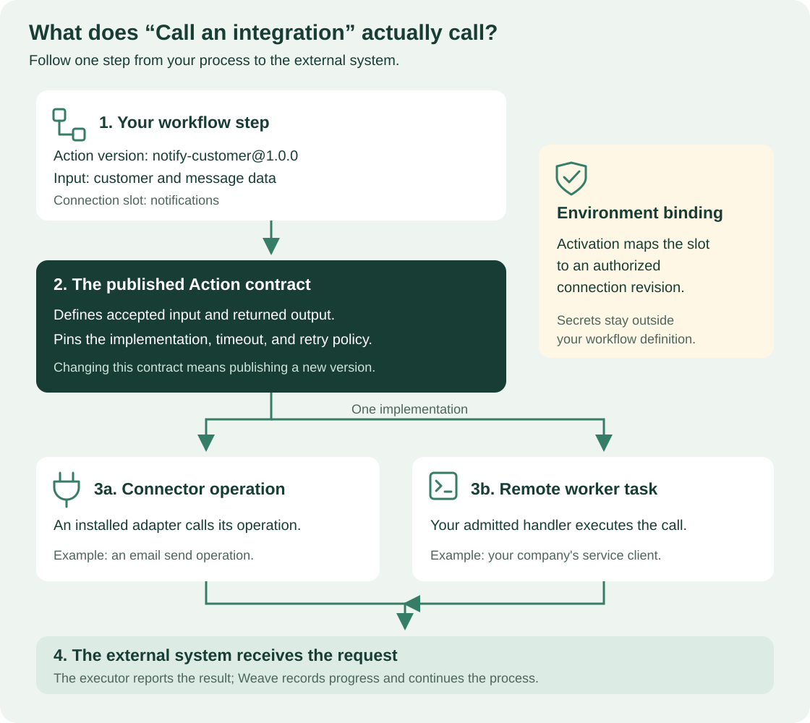

<!--
Copyright 2026 Firefly Software Foundation.

Licensed under the Apache License, Version 2.0 (the "License");
you may not use this file except in compliance with the License.
You may obtain a copy of the License at

    http://www.apache.org/licenses/LICENSE-2.0

Unless required by applicable law or agreed to in writing, software
distributed under the License is distributed on an "AS IS" BASIS,
WITHOUT WARRANTIES OR CONDITIONS OF ANY KIND, either express or implied.
See the License for the specific language governing permissions and
limitations under the License.
Author: Firefly Software Foundation
SPDX-License-Identifier: Apache-2.0
-->

# Choose and configure a workflow step

This page tells you which step to choose for each part of a process and what
every field in Studio's inspector means. Keep it open next to the
[Studio guide](studio.md) while you draw. It is for process designers and
developers; you need Studio running, locally or connected to a platform. Coming
from a BPM suite? [Coming from BPM/BPMN](../concepts.md#coming-from-bpmbpmn)
maps BPMN elements to these steps.

A *step* is one node of a workflow. Its **kind** decides which properties it
has; adding a field that belongs to another kind does not add that behavior.
Studio writes the same versioned definition language that you can edit as YAML
or build with the CLI and the Python SDK, so every choice here is visible in
the **Source** tab.

**This page describes the Studio 0.1.0a9 editor.** The step kinds and native
human tasks are also part of alpha6, but several controls described here, such
as the canvas step picker, the searchable action picker, the **Value** /
typed input rows with **Use data** and **Calculate…**, the schema designer, the API action builder,
and the simulation setup and panel, are new in 0.1.0a7. An alpha6 or earlier
browser bundle does not have them; to see the same screens,
[install the alpha9 browser application](studio.md#install-the-alpha9-browser-application).

**How to use this page:**

| You want to | Read |
| --- | --- |
| Pick the right step for a part of your process | [Start with the outcome you need](#start-with-the-outcome-you-need) |
| Add, rename, move, or delete a step | [Add a step](#add-a-step) and [Edit a step in the inspector](#edit-a-step-in-the-inspector) |
| Fill in one kind of step | [Configure each step](#configure-each-step) |
| Describe a form, a signal payload, or the workflow input | [Design forms and payloads](#design-forms-and-payloads-with-the-schema-designer) |
| Call another system | [Configure Call an action](#configure-call-an-action) |
| Pass data from one step to the next | [Decide where a value comes from](#decide-where-a-value-comes-from) |
| Check, simulate, and run the result | [Validate](#validate-and-read-the-diagnostics), [simulate](#simulate-before-publishing), and [check before running](#check-before-running) |

## Start with the outcome you need

| I need to… | Choose in the palette | Kind in Source | What happens during a run |
| --- | --- | --- | --- |
| Call a service, system, or connector | **Call an action** | `action` | Weave schedules a published Action and its admitted implementation |
| Apply reusable business rules | **Decision table** | `decisionTable` | Weave evaluates a versioned table with a declared matching policy and result schema |
| Ask a model for a typed result | **AI task** | `llm` | A durable worker uses an explicit workflow profile and authorized connection |
| Build or select data | **Transform** | `transform` | Weave evaluates an expression without an external call |
| Take one route based on data | **Decision** | `switch` | Weave evaluates cases in order and follows the first true case, or the **Otherwise** path |
| Run independent branches | **Parallel** | `parallel` | Weave runs named branches within the configured concurrency |
| Delay for a fixed period | **Wait for time** | `wait` | Weave records a durable timer; a worker does not sleep for the duration |
| Wait for an external event | **Wait for signal** | `signal` | Weave waits, up to a timeout, for an authorized, schema-valid signal with the configured name |
| Ask a person to decide | **Human task** | `humanTask` | Weave creates an assigned task with a form and allowed decisions |
| Stop with a business error | **Fail** | `fail` | Weave records the supplied error code and message |

Start and End mark the boundaries of the process. They are fixed visual nodes,
not extra executable steps. **Start** is also a button: select it to open the
workflow settings. A blank Start → End process can return its input or a literal
output; it does not need an artificial Transform just to be a workflow.

## Add a step

- **From the palette.** The **Steps** pane groups the kinds under **Logic**
  (Decision, Parallel, Fail), **Data** (Transform), **Waiting** (Wait for time,
  Wait for signal), **People** (Human task), and **Actions** (Call an action);
  hover a kind to read its one-line description. Select a kind to insert it
  after the selected step, or at the end of the main sequence when nothing is
  selected. You can also drag it onto a **+** on the canvas. **Search steps**
  filters the list, and everyday words work: `approval` finds **Human task**. In
  a window 1024 pixels wide or narrower, open the palette with **Insert step**.
- **From the canvas.** Each **+** opens a picker titled with the position, such
  as "Add a step here, after call-api"; in an empty workflow, select **Add your
  first step**. Type in **Search steps and actions**. The list has a **Steps**
  group and a **Published actions** group. Choosing a published action inserts a
  **Call an action** step that already uses it. Escape closes the picker.
- **Into an empty branch.** A decision case or parallel branch with no steps
  shows a dashed card with the branch's label, such as "Condition not set",
  **Otherwise**, or `first`, and **Add a step**. Screen readers announce it as
  "Add a step here, in Case 1 of decision-1". The card keeps the empty route
  visible; the branch still returns its own output.

After an insert, Studio selects the new step, opens it in the inspector, and
moves keyboard focus to the new node. New steps get readable IDs by kind:
`call-action-1`, `transform-1`, `decision-1`, `parallel-1`, `wait-1`,
`signal-1`, `approval-1` for a human task, and `fail-1`.
Each node shows its ID and a one-line summary, for example
`get-record@1.0.0 · api`, `1 min`, `Amount > 1000 · otherwise`, or
`2 branches · max 2`. A step that still needs a choice has a dashed border and a
chip that says what to choose: **Choose an action** for an action step that has
none, or **Choose a condition** for a decision with a case whose condition is
not set. A step with problems from the last check has a red border and a chip
such as "1 problem".

## Edit a step in the inspector

Select a step to edit it. The inspector heading shows the kind's palette label.

- **Step name.** This is the step's ID: later steps read this step's output by
  it. Type a new name and press Enter, or move to another field. Studio checks
  that the name is unique and updates every expression that reads the step;
  values inside a literal are data and stay unchanged. The hint under the field
  says where the step sits, such as "Main sequence" or "Case 1 of decision-1".
- **Sections.** The step's fields follow in sections you can fold: **Action**,
  **Connection**, **Input**, and **Output** for **Call an action**, then
  **Properties**, which a Decision calls **Paths** and a Parallel calls
  **Branches**. Studio remembers which sections you folded for each kind.
  **Advanced JSON**, at the end, shows the same step as JSON, and **Properties
  table** switches back. Fields Studio does not edit are listed under
  **Additional properties preserved**; change those in the Source tab.
- **Automatic edits.** Valid fields update the local definition after a short
  pause or on leaving the field, with one Undo for the edit. Invalid drafts stay
  inline and preserve the last valid graph; valid sibling edits still save.
  Leaving an invalid draft offers **Go back** to continue it. The Source editor
  retains its separate **Apply changes** action.
- **Workflow settings.** The link in the inspector header opens the workflow's
  own properties. Selecting empty canvas, selecting **Start**, or pressing
  Escape does the same.
- **Move, duplicate, and delete.** The footer's ⋯ menu (**Step actions**) offers
  **Move to…**, which waits for you to select a **+** on the canvas,
  **Duplicate**, and **Delete step**. A decision or parallel group with steps
  inside reads "Delete group with 2 steps" (with its own count) and asks first.
  Studio refuses to delete a step that later steps or the workflow output still
  read, and names them. After a deletion, the message that appears offers
  **Undo**.

**Durations take an amount and a unit.** **Duration**, **Timeout**,
**Due after**, **Expires after**, and **Workflow timeout** each pair a number
with a unit select: **seconds**, **minutes**, **hours**, or **days**. Studio
stores whole seconds, so `1.5` minutes is saved as `90`. The field shows the
largest unit that divides the stored value evenly: `7200` appears as `2` hours.
A value that is not a positive whole number of seconds shows "Enter a positive
duration in whole seconds." Leave an optional duration empty to remove it.

## Configure each step

| Palette label | Inspector fields | Why it matters |
| --- | --- | --- |
| Call an action | **Published action** (connected) or **Action version**, **Connection slot**, **Input** | Chooses the reusable operation and its per-call business data |
| Decision table | **Published table**, **Table version**, **Table input**, **Create a reusable decision table** | Reuses a published rule set and maps the data it evaluates |
| AI task | **AI action version**, **Workflow AI profile**, **AI connection slot**, **AI prompt**, **AI context** | Uses a bounded model configuration with explicit credentials and typed output |
| Transform | **Value** | Its result becomes the step output available to later steps |
| Decision | "Case 1 condition" and "Case 1 output", one pair per case, then **Otherwise output** | Every route has an explicit output, including an empty branch |
| Parallel | **Run at most … branches at once**, then one output per branch, such as "first output" | Controls independent work and the shape of the combined result |
| Wait for time | **Duration** | Sets a durable relative delay |
| Wait for signal | **Signal name**, **Timeout**, **Payload schema** | Defines which event can resume the wait and what data is accepted |
| Human task | **Assignment binding**, **Title**, **Context**, **Decisions**, **Due after**, **Expires after**, **Form schema** | Defines who may claim the work and what a valid decision contains |
| Fail | **Error code**, **Message** | Gives operators and calling products a business failure they can recognize |

Every step also has a unique ID. References to earlier step results use that ID;
moving steps can change what they may read. The compiler checks those
relationships, and [What each step can read](#what-each-step-can-read) lists the
rules.

### Decision table

Choose **Decision table** from the Logic palette. Select a **Published table**
when connected, or enter its immutable `name@version` in **Table version**.
Map **Table input** from workflow data, a fixed value, or a formula. The table's
declared output becomes available to later steps in the Data picker.

**Create a reusable decision table** opens the table editor. Set the table name
and version, define its input and result fields, and choose the matching policy:
first matching rule, exactly one matching rule, or collect all matching rules.
Rule cards provide typed conditions, results, reorder buttons and Remove. Use
**Try an input** to check sample data without running a workflow. You can export
the table as YAML, or publish and use it with the required project permissions.
The [decision table reference](../reference/decision-tables.md) defines exact
matching, no-match behavior, limits and API/SDK usage.

### AI task

Choose **AI task** from the Actions palette. The built-in action reference is
`weave-agentic-generate@1.0.0`; Studio indicates whether that action is available
in the connected catalog. Select a **Workflow AI profile** and an **AI connection
slot**, then map **AI prompt** and **AI context** using Value, Data or Formula.

Open **Configure workflow AI profiles** to create or edit a named profile.
Choose its provider and model explicitly, configure time and token limits, and
describe the expected result with the schema designer. Profile changes belong
to the workflow; select the profile on each AI task that should use it. Provider
credentials belong to an authorized connection, not the prompt or profile.
Workflow AI profiles are separate from Studio's Lumi assistant settings.
The [AI worker guide](ai-workers.md) covers deployment, supported providers,
credential binding and execution limits. A configured inspector alone does not
install the action or start a worker.

### Transform

**Value** is an expression. Its result is the step's output. For a literal, a
mapped object, or a reference, Studio works out the output's fields, so later
steps get suggestions for them. The node summary says what the value does:
"Fixed value", "Copies /input/customer", "Builds 2 fields", or "Computes a value".

### Decision

A new decision has one case with no condition yet: the node shows **Choose a
condition**, and the field says "Choose when this path applies." until you set
one. Weave tests the cases in order and takes the first one that is true;
otherwise it takes the **Otherwise** path.

Build each case's condition, such as "Case 1 condition", from rule rows. In each row, choose the data to test
(placeholder "Choose data"), a test (**is**, **is not**, **is greater than**,
**is at least**, **is less than**, **is at most**, **is present**, or **is
missing**), and, for most tests, a value. Select **Add condition** for another
row; with two or more rows, choose **All of** or **Any of**. The rows write the
same expression as before; for example, "amount is greater than 1000" becomes
`{op: {name: gt, args: [{ref: /input/amount}, {literal: 1000}]}}`. **Edit as
formula** opens the condition in the general expression editor, and **Use
condition rows** switches back when the rows can show it; a condition the rows
can't show opens there directly. On the canvas, each path is labeled with a
summary of its condition, such as "Amount > 1000".

Each path has one card containing its rules, reorder and remove actions, and a
collapsed **Path result**. Empty results read **Not set (optional)**; their
stored literal empty objects remain unchanged until edited. **+ Add path** adds
a card before **Otherwise**, which always stays last. The first matching path
runs. Human-task answer checks use titles such as **Approve** and **Reject**.
Nested steps stay on the canvas. Move them out before removing a path; a
Decision keeps at least one non-default path.

### Parallel

A new group has two branches, `first` and `second`, and reads **Run at most 2
branches at once**. This positive whole number limits how many branches may run
at the same time. Each branch declares an output, labeled with its name ("first output").
The group's output is an object with one field per branch name. Under **Parallel
branches**, rename a branch in its text box, delete an empty one with **Remove**,
or add one with **Add branch**. A group keeps at least one branch.

### Wait for time

**Duration** is required; a new step waits 1 minute. The run continues when the
durable timer is due. The duration control explains the pause in your selected
unit. The step's output is `null`, so later steps have nothing
to read from it.

### Wait for signal

- **Signal name** is the name a sender must use. It accepts letters, numbers,
  dots, underscores, and hyphens. A new step starts empty; `message-received` is
  a hint to replace with your own name. The
  compiler requires each signal name to be unique in the workflow.
- **Timeout** is required; a new step waits up to 1 hour. If no matching signal
  arrives first, the run ends as timed out.
- **Payload schema** describes the accepted data. Edit it with the
  [schema designer](#design-forms-and-payloads-with-the-schema-designer); its
  preview reads "Preview of the signal fields".

The step's output is the received payload, so later steps read
`/steps/<step ID>/output/<field>`.

### Human task

The inspector groups **Who**, **What they see**, **How they answer**,
and **Deadlines**. Assignment suggestions use the connected environment; offline,
enter the binding name directly. The title can be typed or bound with **Use
data**. Context uses named Fields, and the reviewer form has a live inert preview.

| Field | What to enter |
| --- | --- |
| **Assignment binding** | A name, `reviewers` by default. Each environment maps it to an assignment binding with exactly this name when you activate the version (**Human task assignments**). A task manager must first create an enabled binding with that name in the environment, with `weave human-groups put` and `weave human-assignments put`; see [human tasks, step 2](human-tasks.md#2-create-a-reviewer-group-and-assignment). Studio cannot create bindings |
| **Title** | An expression that produces 1–512 characters, such as a literal "Review request" |
| **Context** | An expression that produces an object; reviewers see it as business context |
| **Answers** | 1–32 unique identifiers, `approve` and `reject` by default. Add or edit an answer chip; renaming updates matching decision-path comparisons in one undoable edit |
| **Due after** | Optional. Marks the task overdue; it does not decide anything |
| **Expires after** | Optional. When it passes, the whole run times out |
| **Form schema** | The fields a reviewer fills in, edited with the schema designer; the preview reads "What reviewers will see" |

The task's output has two fields: `decision` (one of **Answers**) and `data`
(the submitted form). **Create a path for each answer** adds a decision right after
the task with one case per answer, each testing
`/steps/<task ID>/output/decision`. Reviewers complete the task in
[My tasks](studio.md#complete-human-work); [human tasks](human-tasks.md) covers
claims, eligibility, and audit history.

### Fail

**Error code** accepts letters, numbers, dots, underscores, and hyphens.
**Message** starts empty and must contain your failure reason. A Fail step ends its path, so no later step on
that path runs and nothing after it can read data from that path.

## Design forms and payloads with the schema designer

The schema designer edits **Input schema** and **Output schema** in the workflow
settings, a signal's **Payload schema**, and a human task's **Form schema**.

1. Select **Add field**. Enter a **Field name**, choose a **Type** (**Text**,
   **Number**, **Whole number**, **Yes/No**, **Choice**, **Group**, **List**,
   **File**, **Any value**, or **Empty**), and check **Required** if the value must
   be present.
2. Select **Details** for **Label shown to people**, **Help text**, a **Text
   format** (such as **Date and time** or **Email address**), **Allowed values**,
   length or value limits, and **Can be empty (null)**. A list asks what
   **Each item is**; a group of fields gets a button that adds a field inside it.
3. Check **Only allow these fields** to refuse extra fields.
4. Read the preview under the fields; it renders the form people will see.

**Paste sample JSON** opens **Find fields from an example**. Paste a JSON
example, add up to nine more with **Add another example**, and select **Find
fields**. Studio's local host reads only the
field names and types; the values are not saved. If the schema already has
fields, choose **Keep them and add new fields only** or **Replace them with the
example's fields**.

**Show schema JSON** displays the result. The link below each designer, such as
"Edit form schema as JSON", switches that schema to a raw JSON editor, and
**Use the field editor** switches back. A schema that cannot be shown as a list of fields is
kept unchanged; edit it in the Source tab.

## Understand action calls before configuring one



Read the diagram from top to bottom: the step names an Action version, the
Action pins the implementation, and activation binds the slot to a real
connection in each environment. Secrets never pass through the workflow
definition. [Open diagram at full size](../diagrams/studio-integration-call.svg)

There are three definitions involved:

1. The **Workflow step** says which Action version to call, what input to send,
   and which logical connection slot to use.
2. The **Action** describes the reusable operation: input/output schemas,
   implementation, timeout, retry policy, and side-effect behavior.
3. A **Connector** declares operations that its installed adapter can execute.
   An Action can instead use a remote worker task.

For example, a step can call your published `notify-customer@1.0.0` Action. That
Action may use an email connector's send operation. Another version could use a
worker implementation, but a workflow pinned to version `1.0.0` does not silently
switch implementations when someone publishes version `2.0.0`.

A valid graph alone does not install connector code, start a worker, create a
connection, or grant access. Use [connector authoring](custom-connectors-tutorial.md)
and [worker deployment](../operations/deployment.md) to prepare those dependencies,
or [call a REST API without code](../connectors/http-without-code.md) through the
built-in HTTP connector.

## Configure Call an action

The inspector's **Action** section walks through the step in order: choose the
action, read what it needs, pick a connection slot, map the input, and use the
output.

### 1. Choose the action

When you are connected and your account can read the catalog, **Published
action** is a searchable list (placeholder "Search by name, API or operation").
It matches every word you type against the name, version, connector or worker,
operation, and description, and lists name matches first. Results are grouped
under **HTTP APIs** for the built-in HTTP connector, one group per other
connector, **Worker actions**, and **Other actions**. Use the arrow keys and
Enter to choose, Escape to close the list, and Tab to leave without choosing.
**Load more actions** fetches the next page of the catalog, and **New API action**
opens the builder when you can publish.

Choosing an action loads its contract. If exactly one workflow slot fits the
action's connection, Studio selects it. Studio never declares a new slot from
this list; use **Add connection slot** for that.

The palette's **Published actions** list, under **Actions**, shows up to six
published actions that match the palette search. Selecting one inserts the step
and its slot as one undoable change: Studio reuses the workflow's only compatible
slot or, when none fits, declares one named after the connector. When several
slots fit, choose one in the inspector. Screen readers announce what happened,
for example "Inserted call-action-1, which calls get-pet@1.0.0, and added the
connection slot petstore."

The section shows a different state when the catalog is unavailable:

| What you see | What it means | What to do |
| --- | --- | --- |
| **Working locally.** and **Open Settings** | Studio is not connected to a platform | Type the exact `name@version` in **Action version** at the top of the **Action** section, or connect in Settings to choose from the catalog |
| "Studio could not confirm your account's permissions, so published actions are hidden." | The platform has not confirmed what your account may do | Check the platform connection in Settings |
| "Your account cannot read the action catalog in this workspace." with "Needed permission: catalog.read" | Your grants lack `catalog.read` | Ask an administrator for a role that includes it, such as **Workflow editor**, or type the action version |
| "Loading published actions…" | The catalog is loading | Wait for the list |
| "Published actions could not be loaded." with a support code | The catalog request failed | Select **Try again**; quote the support code if it keeps failing |
| "This project has no published actions yet." | The project's catalog is empty | Select **Refresh actions** after someone publishes one, or create one from an API |

[Give people the right access](people-and-access.md) explains roles and grants.

### 2. Read what the action needs

**What this action needs** summarizes the published contract:

| Row | Shows |
| --- | --- |
| **Runs on** | **Connector** with its reference, such as `weave-http@2.0.0`, or **Worker** with its task type and version |
| **Operation** | The connector operation the action calls (connector actions only) |
| **Connection** | "No connection needed", "Requires a crm@1.0.0 connection", or "Optional crm@1.0.0 connection", with the action's own connector |
| **Side effect** | "Read only — safe to retry", "Idempotent — safe to retry", "Retried with an idempotency key", "Not idempotent — never retried automatically", or "Not declared" |
| **Timeout** | The action's timeout in seconds |
| **Retry** | "One attempt, no automatic retry", or "Up to 3 attempts, waiting 1–30 seconds between them" with the action's own numbers |

**Timeout and retry belong to the published action version.** To change them,
publish a new Action version and deliberately select it in the workflow. Do not
add `retry` or `timeoutSeconds` to an action **step**: those fields are not part
of the step's contract. **Output schema**, under the output section, shows what
the action returns.

While the contract loads, the section reads "Loading the action's details…". If
it fails, it shows "The action's details could not be loaded." with **Try again**.

### 3. Choose a connection slot

Under **Connection**, **Connection slot** lists the workflow's slots that fit the
action: the same connector, and never an optional slot for a required
connection. Until Studio knows the action's contract, it lists every slot the
workflow declares. Each option reads `slot · connector`, for example `api ·
weave-http@2.0.0`. The empty option reads "Choose a connection slot" when the
action requires a connection, and "No connection" otherwise. A slot that no
longer fits is marked "(not compatible)".

If no slot fits, select **Add a PostgreSQL connection slot** (the connector's
name changes with the action). Studio creates and selects the slot in one step.

The **Connection slots** list is shared with workflow settings. Each row shows
**Slot name**, **Connector**, **Required**, and **Used by N steps**:

1. Change **Slot name** and leave the field to rename it. Studio updates all
   steps that use it, including steps in decision paths and parallel branches.
2. Choose a connector reference, or enter `name@version` when working offline.
   Invalid names and versions stay in the field with an explanation.
3. Turn **Required** on if every environment must supply a connection at activation.
4. **Remove** explains which steps will lose their slot before changing anything.
   **Undo** restores the slot and its step assignments together.

In workflow settings, **Add connection slot** also lets you declare a slot
before adding an action. Enter **New slot name** and **New slot connector**, then
select **Add slot**.

**A slot is a name, not a credential.** Activation maps each slot to an
authorized connection revision for the chosen environment, so passwords and
tokens never enter the workflow. When you are connected and the step uses a slot
on the built-in HTTP connector, **Create a connection for this API** opens
**New API connection**; the
[no-code integration guide](../connectors/http-without-code.md) explains what a
connection holds and who must grant it.

### 4. Map the input

When the action's input schema lists fields, **Input** shows one row per field.
Each row starts with the editor for its schema type: text, numbers, yes/no,
choices, dates, lists, groups, or files. **Use data** opens the typed picker;
a selected reference appears by name and **Remove data** restores the prior
fixed value while editing that field. Choose **Calculate…** from the field's
options menu to combine values with a formula. Formula operands have their own
value or data control without another mode switch above the formula.

Fields bound to **Data** or **Formula** count as filled in. Fields you do not
touch keep their original expression. A secret field is locked and reads
"Supplied by the connection's credentials; workflows can't set it."

**Write one expression for the whole input** replaces the rows with one
**Input** expression under **Properties**. **Edit the input field by field**
switches back; if the expression cannot be shown as fields, Studio asks first
(**Replace with fields** or **Keep the expression**). Without a contract, for
example while working locally, map the input with the **Input** expression.

Field-by-field input is stored as an ordinary expression:

```yaml
# The step that a field-by-field input produces, as shown in the Source tab.
- id: get-record
  kind: action
  uses: get-record@1.0.0
  connection: api
  with:
    object:
      id: {ref: /input/recordId}
      includeHistory: {literal: false}
```

When every field holds a typed **Value**, Studio stores the whole input as one
`literal` object instead.

### 5. Use the output

Later steps read the action's result at `/steps/<step ID>/output`. **Copy output
reference** copies that path. **Use action output as workflow result** asks you
to confirm replacing the workflow result and its schema, then offers **Undo**.
After confirmation, it sets the
workflow output to that reference and copies the action's output schema into the
workflow's **Output schema**. It is available for steps in the main sequence;
for a nested action, expose the value through the enclosing branch output first.

### 6. Resolve an incomplete configuration

Until the step is complete, the section lists **Configuration incomplete** with
the reasons:

| Reason | What to do |
| --- | --- |
| "Choose a published action." or "Enter the action version to call." | Choose or type the exact `name@version` |
| "crm-lookup@1.0.0 is not in the published catalog for this project. Choose a published action." | The version is unpublished or belongs to another project; choose one from the list |
| "Fill in the required inputs: customerId." | Give each named field a value, data, or a formula |
| "Choose a connection slot for crm@1.0.0." | Choose a compatible slot, or add one |
| "The workflow has no connection slot named crm. Choose another slot or add it." | The step names a slot the workflow does not declare |
| "Slot crm does not provide a required crm@1.0.0 connection." | Choose a slot whose connector matches and that is required |
| "This action does not use a connection. Clear the slot." | Choose "No connection" |
| "Fix the step configuration JSON." | **Advanced JSON** holds text that is not a valid step |

These are quick inspector checks. **Validate** runs the compiler, which is the
authority on whether the step is valid.

### Create an action from an API

While the step has no action, or still uses the placeholder `your-action@1.0.0`,
the **Action** section says "No action yet? Describe the API request, or import
an OpenAPI document, and Studio builds the action with no code." and offers **New
API action**. That button, and **New API action** in the picker and the palette,
open the **New API action** builder with two tabs: **Describe a request** and **Import OpenAPI**. After you
publish the action, the builder offers **Use in this step** when you opened it
from a step, or **Insert into workflow** when you opened it from the palette.

When the builder cannot publish, for example while working locally, it offers
**Use as a placeholder in this step** or **Insert as placeholder** instead. Save
the action with **Download .action.yaml** and publish that file before you run
the workflow. Connected without permission to publish, these entries are hidden
and the palette reads "To call another API, ask a developer to publish an
action." [Call a REST API from a step](studio.md#call-a-rest-api-from-a-step)
walks through the builder in Studio, and
[Call a REST API without code](../connectors/http-without-code.md) explains the
built-in HTTP connector, what a described request may contain, OpenAPI import
rules, and the operator's one-time setup.

## Decide where a value comes from

Expression fields such as **Value**, **Title**, **Context**, **Input**, and
outputs have a keyboard-operable mode switch beside their label. Typed action
inputs start with their value control, **Use data**, and **Calculate…** in the
field menu. Conditions keep rule rows, with **Edit as formula** for complex logic:

| Mode | Writes | Use it for |
| --- | --- | --- |
| **Value** | `literal` | Fixed data of any JSON type |
| **Data** | `ref` | Workflow input or an earlier step's output |
| **Formula** | `op` | Comparing or combining values with an operation; it starts at "Choose a formula…"; fixed-arity operations have labelled operands, while combining operations can add inputs |
| **Fields** | `object` | An object whose fields are expressions (**Add field**) |
| **List** | `array` | A list whose items are expressions |

**Fields** is the object builder for Transform values, human-task context, and
results. Each row has a name and a value. **Use data** reads another field;
**Calculate…** in the row's ⋯ menu builds a formula. **+ Add field** focuses the
new name. Move rows with the arrow buttons or choose **Remove**. Existing
literal objects retain their original YAML shape until you edit them. Raw JSON
is available only through **Advanced: JSON value** in the row menu.

These are the same rules in the property editor and YAML:

```yaml
# A fixed string, unchanged for every run.
value:
  literal: "Ready for review"
```

```yaml
# Read the customer ID from this run's input.
value:
  ref: /input/customerId
```

```yaml
# Build a business object from a reference and a fixed value.
value:
  object:
    customerId: {ref: /input/customerId}
    channel: {literal: email}
```

```yaml
# A decision condition: check whether the request is marked urgent.
when:
  op:
    name: eq
    args:
      - {ref: /input/urgent}
      - {literal: true}
```

Supported operations are `eq`, `ne`, `lt`, `lte`, `gt`, `gte`, `and`, `or`, `not`,
`exists`, `coalesce`, `contains`, `notContains`, `in`, `notIn`, `startsWith`,
and `endsWith`; the **Formula** list uses the same words as rule rows, such as
"is" for `eq` and "first available" for `coalesce`. This is a bounded
expression language, not JavaScript or arbitrary Python. The [schema and expression reference](../reference/schema-profile.md)
explains type rules and JSON pointers. Validate after changing a reference or condition.

### What each step can read

A field set to **Data**, and the data in a condition row, suggests exactly the
data the compiler lets that field read. Suggestions are grouped under **Workflow
input** and under each earlier step's ID with its icon and kind, and a chosen
reference shows as a readable token, such as "Input › Customer ID". Each
suggestion shows its type, such as "Text" or "Whole number", and notes "may be
absent" or "may not match this field" when that applies; mismatches are listed
last. The picker starts empty, gives compatible leaf fields priority, and hides
raw pointers until **Show path**. **Remove data** restores the prior fixed value
while you are editing the same field. Rule comparisons can use another data
reference on the right side as well as a typed value.

The rules follow the compiler:

- Every field can read `/input`.
- A step reads the outputs of earlier steps in the same sequence.
- A step inside a branch reads what was readable where its group starts, plus
  earlier steps in the same branch. It never reads the group itself or steps in
  a sibling branch.
- A case condition reads only what was readable before the decision.
- A branch output reads what was readable where its group starts, plus the
  steps of that branch.
- After a group ends, later steps read the group's output, not the steps inside
  it.
- Nothing after a Fail step on the same path is reachable.

What `/steps/<step ID>/output` holds depends on the kind:

| Kind | Output |
| --- | --- |
| Call an action | A value matching the Action's output schema |
| Transform | The result of **Value** |
| Decision | The output of the case or **Otherwise** path that ran |
| Parallel | An object with one field per branch name |
| Wait for time | `null` |
| Wait for signal | The signal payload |
| Human task | `decision` and `data` |
| Fail | Nothing; the path ends |

You can still type a path that is not suggested. Studio explains what it sees,
for example "Data references start with /input or /steps/&lt;step ID&gt;/output."
or "Not in the suggestions. Validate to check this reference." The compiler
decides on **Validate**.

## Configure the whole workflow too

Step properties are only part of a complete definition. Open **Workflow
settings** and edit the fields; valid changes are kept automatically. **Inputs**,
**Result**, **Connections**, and **Limits** group these settings:

Schema fields start as compact rows showing the name, type, and whether they
are required. Open a row to edit its details, or use its **⋯** menu to move or
remove it. **Undo** restores a removed field.

| Workflow setting | Purpose |
| --- | --- |
| **Name** and **Version** | Identify the definition and the semantic version you intend to publish |
| **Input schema** | Describes the business data required when starting a run; its preview reads "What people starting a run will see" |
| **Output schema** | Describes the result returned when the run finishes |
| **Connection slots** | Maps each slot name to a connector `name@version` and a required flag |
| **Workflow timeout** | Optional bound on the workflow's total execution time |
| **Workflow output** | Selects or constructs that final result |

For a first local example, keep object input/output schemas and a literal empty
object output. Add a **Wait for time** with a short duration, then validate. For
an integration example, choose an Action that your project actually publishes and
use its schema to build the input. A made-up Action name cannot become executable
by drawing it.

## Validate and read the diagnostics

Studio checks your workflow while you edit. Shortly after you stop typing, the
local Studio host checks structure, data references, and types; this check never
leaves your computer. **Validate** compiles against the project catalog when you
are connected and your account has `compile`; otherwise it runs the same local
check.

The **Diagnostics** bar at the bottom of the designer shows one status line,
with a neutral local-check icon, or a project check, warning, or error icon:

| Status line | Meaning |
| --- | --- |
| "Not validated yet." | No check has run since the workflow opened |
| "Checking…" | A check is running |
| "Checked locally — Validate to check against the project" | The local check passed. Project actions and connections still need validation. If the session expired or the account lacks compile access, the line explains that instead |
| "1 item needs attention" | A published contract requires an input or connection. The same gap appears on the step; select it to open its field |
| "No problems found." alone | After **Validate**, a complete project compile found no errors or warnings |
| "No errors, 1 warning." | No errors, but at least one warning |
| "No errors · 4 steps still need an action." | No errors, but some **Call an action** steps still have no action |
| "No errors found, but the project catalog check didn't finish. Validate again." | The compile was partial |
| "2 errors, 1 warning. Fix the errors to publish." | At least one error |
| "Validate to check your latest changes." or "Validate again to check your workflow." | The result is for an older version, or for another workspace |
| "Studio couldn't check this workflow. Try again." | The check itself failed |

Select **Diagnostics** to fold or unfold the rows. Each problem row shows
**Error** or **Warning**, a plain explanation, and often a hint. Its location,
such as "Step decision-1 · Case 1 condition", is a link that opens that step, or
the workflow settings, with the field focused. **Apply suggested edit** applies a
compiler suggestion as one undoable change. **Details** shows the support code,
such as `WV-COMP-…`, which identifies the rule, and the compiler's own wording
when it differs. Notes are collected under a separate count, such as "2 notes".
On the canvas, a step with problems has a red border and a chip such as
"2 problems".

**Publish validates first.** With `compile`, publishing requires a passing
project compile. Without it, the local check must pass, and the platform compiles
the version again when it receives it.

## Simulate before publishing

**Simulate** runs the compiled workflow on the platform without calling any real
system. It needs a connected platform and the `simulate` permission; otherwise
selecting it shows why under the toolbar. If the workflow does not compile
completely, Studio shows the diagnostics and "Simulation needs a fully compiled
workflow. Fix the problems in the diagnostics first."

1. In **Simulate this workflow**, fill in **Workflow input**. When the workflow
   calls actions, an **Action results** tab, labeled with their count, lists each
   one by step ID and version; enter the result it should return, or check
   **Skip this action**. **Edit as JSON** and **Use the form** switch between
   editors.
2. Select **Start simulation**. Studio sends each result as a mock keyed
   `node:<step ID>`. A skipped action stops the simulation when it is reached,
   with "The simulation reached an action that has no result to return."
3. The **Simulation** panel opens beside the canvas, in the inspector's place.
   Use **Step** to advance one step, **Continue** to run until the next wait or
   breakpoint, and **Start over** to return to the setup. The panel shows the
   status, the simulated time, and the current steps after **Now at**. On the
   canvas, the current step is highlighted, the path taken is drawn in color,
   finished steps show a check, and steps not reached are dimmed; select a step
   to see its simulated input and output. Editing is paused until you select
   **Stop simulation** or close the panel.
4. When the run waits, the matching control is the panel's main button:
    - For a human task, choose a **Decision**, fill in **Decision data**, select
        **Submit decision**, then **Continue**.
    - For a signal, choose the **Signal**, fill in **Signal payload**, select the
        send button named after the signal, such as "Send message-received", then
        **Continue**.
    - For a timer, select a shortcut such as "Finish the wait at pause (1 min)",
        "Let approval time out (1 h)", or "Let review expire (30 min)", with your
        own step IDs and times; or enter an **Amount**, choose a unit, and select
        **Advance**.
5. Read **Step results** and the **Workflow output** when the run finishes.
   **Breakpoints** pauses **Continue** before the steps you check; **Activity**
   lists what happened.

**The simulation keeps the artifact it started with.** After you edit the
workflow, select **Simulate** again to compile the current version. A failed
command is shown in the panel with a plain explanation and a support code.
[Mock-only simulation](../reference/simulation.md) describes the underlying
debugger, its commands, and virtual time.

## Check before running

1. Resolve any inline invalid fields; valid inspector edits are kept automatically.
   If you edited Source directly, select its **Apply changes** first.
2. Fix every error in **Diagnostics**. When you are connected with `compile`,
   **Validate** until the status line reads "No problems found."
3. **Simulate** the routes you care about with realistic action results.
4. **Save draft** and **Publish…** the version. Then **Activate…** it: the
   activation dialog maps **Connections** and pins **Integration versions**,
   **Task versions**, and **People and teams** for the environment. Single
   compatible choices are picked automatically; use **Review** to inspect them.
5. **Start run…** with schema-valid input and inspect its progress.

The [Studio guide](studio.md#save-publish-activate-and-run) explains each lifecycle
button. [Manage runs and business cases](execution-management.md) covers
several runs per case, business keys, archive and restore, and permanent
deletion.

## What has been verified

Studio's browser tests (`studio/tests/browser/`) drive most controls on this
page with pointer and keyboard input against a mocked platform API, and the unit
tests in `studio/tests/` cover the logic behind them, such as action search,
slot choice, data scoping, and node summaries. In the browser tests, the local
authoring calls behind the API action builder run the repository's own Python
code. An opt-in browser test also ran the **New API action** builder against a
[local platform](local-platform.md): the call it built ran to `succeeded`. The
[Studio guide](studio.md#validate-a-source-contribution) describes that test.

## Next steps

- [Save, publish, activate, and run](studio.md#save-publish-activate-and-run)
  the workflow you configured.
- [Call a REST API without code](../connectors/http-without-code.md) to create
  the Actions that **Call an action** uses.
- [Add human approvals](human-tasks.md): assignment bindings, claims, and
  decisions behind the **Human task** step.
- [Read the schema and expression reference](../reference/schema-profile.md)
  for the full type and JSON pointer rules.
