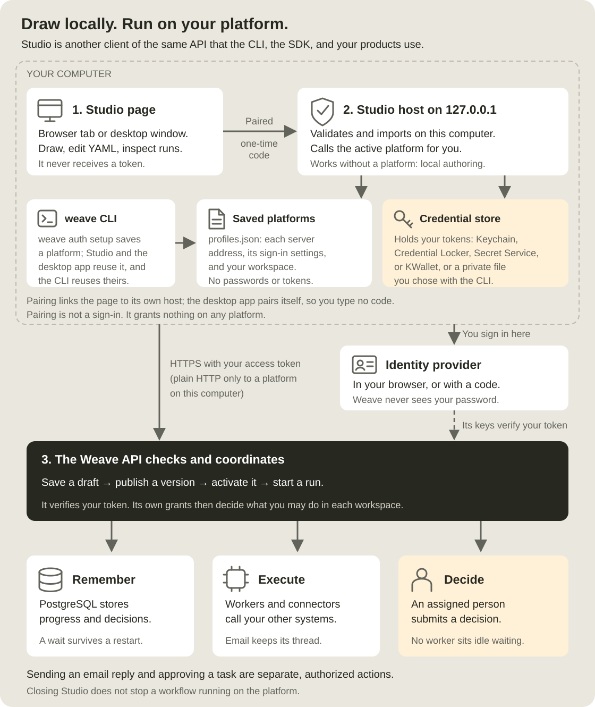
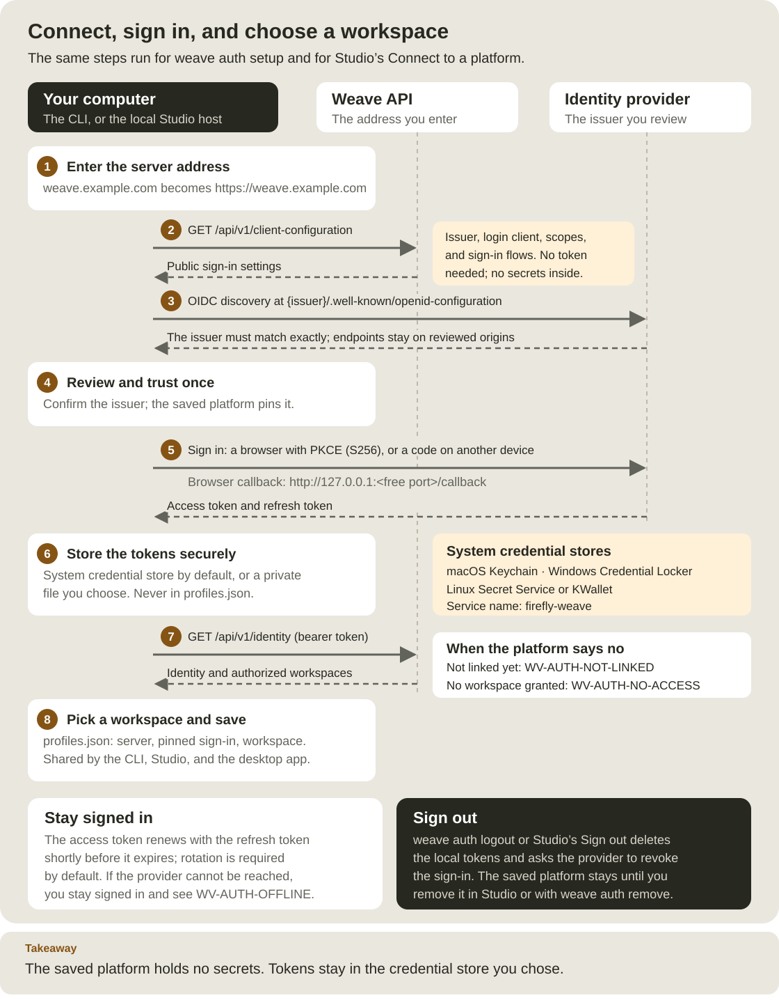
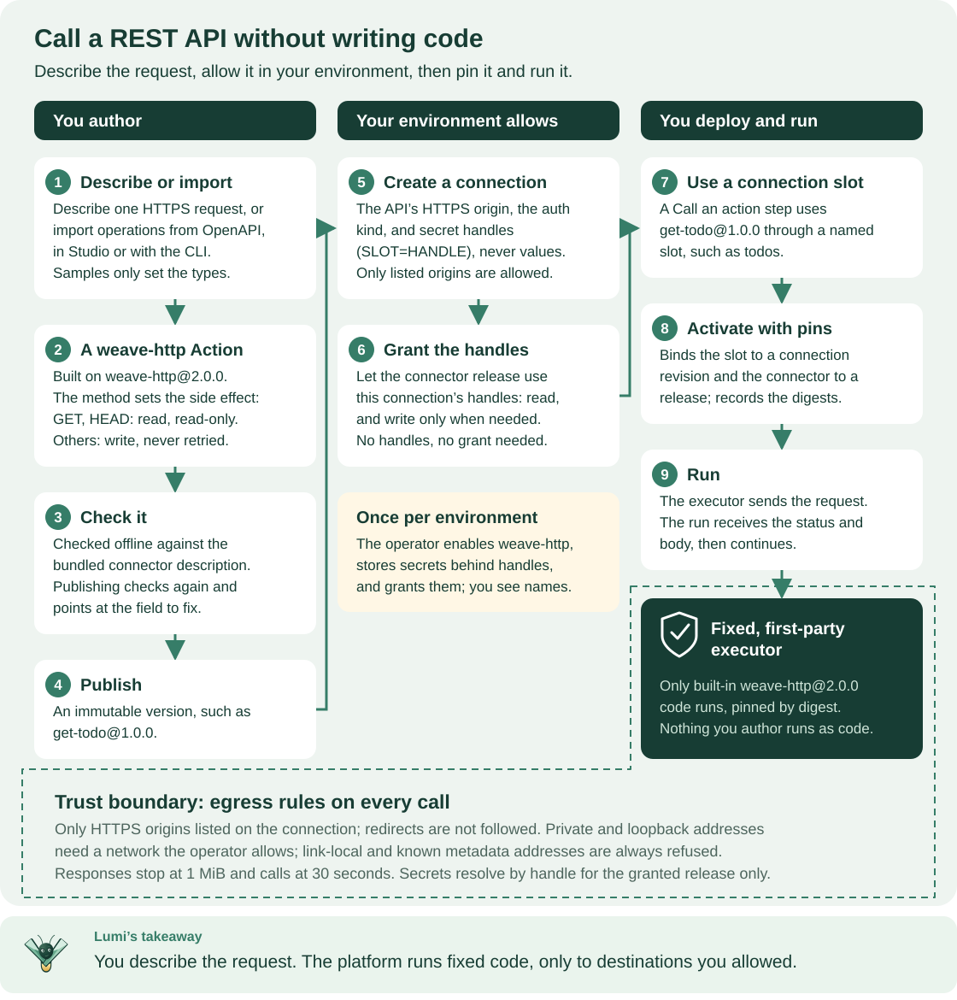

<!--
Copyright 2026 Firefly Software Foundation.

Licensed under the Apache License, Version 2.0 (the "License");
you may not use this file except in compliance with the License.
You may obtain a copy of the License at

    http://www.apache.org/licenses/LICENSE-2.0

Unless required by applicable law or agreed to in writing, software
distributed under the License is distributed on an "AS IS" BASIS,
WITHOUT WARRANTIES OR CONDITIONS OF ANY KIND, either express or implied.
See the License for the specific language governing permissions and
limitations under the License.
Author: Firefly Software Foundation
SPDX-License-Identifier: Apache-2.0
-->

# Design and run workflows in Studio

Studio is the visual workspace for Weave workflows. You can draw, import, and
validate workflows on your computer without an account. When you connect to a
platform, your team's Weave server or a local one, you can also save drafts,
publish, run, and handle tasks. Studio uses the same compiler, API
authorization, and durable runtime as the CLI and SDK.

**Who this is for:** process designers and business analysts who model
processes, and anyone who approves tasks or watches runs. Developers use it to
review what the CLI and SDK produce. **What you need:** Python 3.12 or newer and
a terminal for the browser version, or the [desktop app](desktop.md) instead.
Drawing needs nothing else; publishing and running need a platform and an
account. Installing takes about 10 minutes, and a first workflow about 15.
Coming from a BPM suite? [Coming from BPM/BPMN](../concepts.md#coming-from-bpmbpmn)
translates BPMN terms into Weave steps.

The Studio page in your browser talks only to a small host that runs on your
computer at `127.0.0.1`. That host keeps your saved platforms, which it shares
with the `weave` command line, and keeps your sign-in in the operating system's
credential store. The page never receives your tokens.

**This page describes Studio 0.1.0a12.** An alpha6 or earlier browser bundle
shows an earlier connection assistant, which imports a login configuration file,
and lacks the editor features and API actions described here. To follow this
page, [install the alpha12 browser application](#install-the-alpha12-browser-application).



Follow the numbers: the Studio page (1) talks only to the paired local host (2),
which calls your selected platform's API (3) over HTTPS. Everything below box 3
happens on the platform and keeps running after you close Studio.
[Open diagram at full size](../diagrams/studio-and-runtime.svg).

## Choose what you want to do

| Your goal | What must be running | Start here |
| --- | --- | --- |
| Open Studio as a native desktop app | A matching desktop build for your operating system | [Install desktop](desktop.md) |
| Draw, import, or validate a workflow on your computer | Studio's local host; no account | [Install Studio](#install-the-alpha12-browser-application), then [work locally](#work-locally-without-signing-in) |
| Learn the editor with a small example | Studio's local host | [Try it: draw your first workflow](#try-it-draw-your-first-workflow) |
| Save and run workflows on your laptop | Studio plus a separate local Weave platform | [Start the platform](local-platform.md), then [connect Studio](#connect-to-a-platform) |
| Work with your team's platform | Studio on your computer and the server address from your administrator | [Connect to a platform](#connect-to-a-platform) |
| Call a REST API from a workflow without writing a connector | Connected Studio; an operator has prepared the built-in HTTP connector | [Call a REST API from a step](#call-a-rest-api-from-a-step) |
| Approve a task or inspect a run | Connected Studio with the relevant Weave grants | [Complete human work](#complete-human-work) and [follow runs](#save-publish-activate-and-run) |

**Studio is a client.** Launching it starts a small local host and the editor. It
does not provision PostgreSQL, an identity provider, workers, or a remote platform.
Closing Studio does not stop runs already in progress on the platform.

**Local authoring** in the top bar means Studio is working with files on your
computer. You can create, import, edit, and validate workflow definitions.
Connect when you want to save them to a shared platform, run processes, or handle
tasks. This status does not mean your computer has lost its internet connection.

## Install the alpha12 browser application

Alpha7 includes the Studio host. Its browser assets are an optional, matching
release bundle; the Python wheel does not embed the Angular application. Alpha4
does not include Studio. Download all files from the same
[v0.1.0a12 release](https://github.com/fireflyframework/firefly-weave/releases/tag/v0.1.0a12).
The CLI installer does not automatically fetch or install the Studio ZIP.

Use Python 3.12 or newer. The alpha12 CLI installer includes the Studio host
and authentication dependencies, but downloads no browser ZIP automatically.
These Bash/Zsh commands need neither Node nor a source checkout:

```sh
# Install the pinned CLI into its isolated installation directory.
# Review the installer first using the download-and-inspect alternative in Installation.
curl --fail --location https://github.com/fireflyframework/firefly-weave/releases/download/v0.1.0a12/install.sh \
  | sh -s -- --version v0.1.0a12
# Make the installed command available in this terminal.
export PATH="$HOME/.local/bin:$PATH"
# Check that the host version matches the browser bundle you will install.
weave --version

# Keep the downloaded optional browser bundle and its digest together.
mkdir weave-studio-alpha12
cd weave-studio-alpha12
curl --fail --location --remote-name https://github.com/fireflyframework/firefly-weave/releases/download/v0.1.0a12/firefly-weave-studio-0.1.0a12.zip
curl --fail --location --remote-name https://github.com/fireflyframework/firefly-weave/releases/download/v0.1.0a12/firefly-weave-studio-0.1.0a12.zip.sha256
# Verify the bundle on macOS. Stop if the check fails.
shasum -a 256 --check firefly-weave-studio-0.1.0a12.zip.sha256
# On Linux, use sha256sum --check in place of shasum -a 256 --check.

# Install only the bundle whose version and verified digest match this host.
weave studio install --bundle firefly-weave-studio-0.1.0a12.zip \
  --sha256 "$(awk '{print $1}' firefly-weave-studio-0.1.0a12.zip.sha256)"
# Start the local host without opening a browser automatically.
weave studio --no-browser
```

Expected: `weave --version` prints `Firefly Weave 0.1.0a12`, the checksum line
ends with `OK`, and the install prints `Studio installed at PATH. Start it with:
weave studio`. The host then prints `Firefly Weave Studio · Local authoring (no
platform selected)`, or `Firefly Weave Studio · Platform: NAME` when a saved
platform is active, then `Open http://127.0.0.1:8766` and a `Pairing code:`
line.

Open the printed loopback address and enter the pairing code, as described in
[Pair the browser with the local host](#pair-the-browser-with-the-local-host).
Leave the terminal running; Ctrl+C stops this host. After closing the terminal,
run `weave studio` again to launch the installed bundle.

An advanced wheel-only installation must explicitly select the `studio` extra
for this host, or `client` for API-only SDK use; see
[installation](../installation.md). Installing Studio neither provisions nor
migrates a platform: for that, follow [local platform setup](local-platform.md)
or the [remote deployment guide](../operations/remote-deployment.md).

## Start from source

**This route is for contributors,** and for trying changes made after the
latest release; the release bundle above already has everything this page
describes. To reproduce the alpha12 release exactly, check out `v0.1.0a12`
instead; development `main` can differ from released assets.

From the repository root, install the development dependencies first. Node 24
and npm are required only for building the browser application.
Angular 22.2.1 is pinned in the application and `package-lock.json` fixes the
complete dependency graph.

```sh
# Create the locked Python environment, including optional features and docs.
uv sync --locked --all-extras --group docs

# Enter the browser application directory.
cd studio

# Install exactly the dependency versions recorded in the lockfile.
npm ci

# Compile the production application; this does not publish it.
npm run build

# Return to the repository root to use the Python development environment.
cd ..

# Serve only the freshly built browser assets on loopback.
.venv/bin/weave studio --assets studio/dist/studio/browser --no-browser
```

Expected: the host prints `Firefly Weave Studio · Local authoring (no platform
selected)`, or `Firefly Weave Studio · Platform: NAME` when a saved platform is
active, then `Open http://127.0.0.1:8766`, a `Pairing code:` line, and `Enter
this code in the browser. Press Ctrl+C to stop Studio.` Keep the terminal running
while you use Studio.

**Already installed a release browser bundle?** Installed bundles are kept per
version, and a checkout can report the same version as the latest release, for
example `0.1.0a12`. A plain `weave studio` then keeps serving the installed
release screens, and `weave studio install` keeps that bundle instead of
replacing it. Always start a source build with `--assets studio/dist/studio/browser`.

A source build can also package its browser application as a bundle and
install it by digest, so you no longer need `--assets`. This works only when no
bundle for the same version is installed yet:

```sh
# Package the built application; prints the SHA-256 and the bundle path in dist/.
.venv/bin/python scripts/build_studio.py
# Install the bundle generated for this exact Weave version.
# Replace both placeholders with the bundle path and SHA-256 printed above.
.venv/bin/weave studio install --bundle /path/to/weave-studio.zip \
  --sha256 YOUR_VERIFIED_SHA256

# Launch the installed bundle; Node and --assets are no longer required.
.venv/bin/weave studio --no-browser
```

Expected: `Studio installed at PATH. Start it with: weave studio`, then the same
startup lines as above. The installer checks bundle/version/digest compatibility.
Do not mix a source host with assets generated for a different version.

## Pair the browser with the local host

**Pairing proves that a browser window belongs to the person who started the
host.** `weave studio` prints a one-time code in your terminal. Open the printed
address, type the code into **Pairing code**, and select **Pair browser**.

- The code works once, and only within five minutes of starting the host.
- A paired window stays paired for up to eight hours, including page reloads.
  When the session ends, Studio says "Your Studio session ended" and asks you to
  restart `weave studio` for a new code.
- After 10 wrong codes, the host refuses every further attempt. Restart it.
- The desktop app pairs its own window automatically, so you never type a code.
  If its pairing page stays open, quit and reopen Firefly Weave Studio.

**Pairing is not a sign-in.** It grants nothing on any Weave platform and never
reaches your identity provider. You sign in to a platform separately, in
[Connect to a platform](#connect-to-a-platform). Pairing codes and tokens never
appear in URLs. The [sign-in roles diagram](../diagrams/sign-in-roles.svg) shows
pairing next to the platform sign-in and the grants an administrator controls.

## Work locally without signing in

The first time Studio opens with no saved platform, it asks **How do you want to
work?** and offers two choices:

- **Work locally**: draw, import, and validate workflows on this computer. No
  account is needed. Studio remembers this choice and opens directly the next
  time.
- **Connect to a platform**: opens the [connection assistant](#use-the-connection-assistant).

While you work locally, the top bar shows **Local authoring** and "Create and edit
on this computer". You can create, import, and edit workflows, and Studio checks
their structure, data references, and types as you type. Actions and connections
are checked against a project catalog only after you connect. Studio keeps each
workflow you edit in this browser and lists it on the **On this computer** tab
of **Workflows**. In the designer, the main button is **Save to file**. This
works without a platform. The nearby information button explains which
operations need a connection and opens the connection assistant. Saving a
shared platform draft, publishing, simulating, activating, and starting runs
need a platform.

**You can change how Studio starts.** In **Settings → Platforms**, under
**Starting Studio** and **When Studio opens**, choose **Ask how to work** or
**Start with local authoring**. Studio asks only while no platform is saved. The
preference is kept in `studio.json`, next to your saved platforms.

**Working locally keeps your platforms saved.** Select **Work locally** at the
bottom of **Settings → Platforms** to stop using the active platform. Your saved
platforms and sign-ins stay, and Studio says "You're working locally. Workflows
stay on this computer until you connect to a platform." This also leaves the
`weave` command line with no active platform. To make one active again, select
**Switch to this platform** on its row in **Settings → Platforms**, or run
`weave auth use NAME`.

## Connect to a platform

A *platform* is a Weave server that Studio has saved: its address, the sign-in
settings you reviewed, the sign-in methods your administrator allows, your
chosen workspace, and the last account name. Before you start, you need:

- The **server address** from your administrator, for example
  `https://weave.example.com`.
- An account at your organization's identity provider. You type your password
  only on the identity provider's own sign-in page, never in Studio.
- An administrator who has published the server's sign-in settings, linked your
  account, and granted you a role in a workspace. The administrator's side is in
  [What your administrator does](connect-to-api.md#before-you-start-what-your-administrator-does)
  and [People and access](people-and-access.md).



Read the numbered steps from top to bottom: Studio and `weave auth setup` follow
the same sequence. Tokens go to the credential store in step 6; only the address,
the reviewed sign-in settings, and the workspace reach `profiles.json` in step 8.
[Open diagram at full size](../diagrams/connect-and-sign-in.svg).

### Use the connection assistant

Open the assistant in any of these ways:

- While you work locally, select **Connect to a platform** on **Home**, in the
  platform menu at the top right, in the designer next to "Saving, publishing
  and runs need a platform.", or on the **Runs**, **My tasks**, **Email**,
  **Connections**, and **Workers** pages.
- In **Settings → Platforms**, select **Add platform** while you use a platform,
  or **Connect to a platform** while you work locally.

To move to another saved platform, select **Switch to this platform** on its row
in **Settings → Platforms**. **Switch workspace**, in the platform menu or on the
platform in use, opens the assistant at its Workspace step.

A progress list shows four steps: Server, Review, Sign in, and Workspace. Press
Enter to continue from any step, or select **Back** to return to the previous one.

#### 1. Enter the server address

Type the address into **Server address** and select **Continue**. Studio adds
`https://` when you leave out the scheme. Remote servers need HTTPS; plain
`http://` works only for a server on this computer, such as a
[local platform](local-platform.md). While Studio checks the server, select
**Cancel** to stop.

Studio reads the server's public sign-in settings and checks each identity
provider they name. No token is sent, and nothing is saved yet. If you already
have saved platforms, they appear above the address field under **Saved
platforms**; select one to use it again. Expected: the **Review and trust**
step opens. If Studio shows a problem instead, find it in
[Fix a connection problem](#fix-a-connection-problem).

#### 2. Review and trust the platform

**Review and trust** shows what the server proposed: the platform name, the
server, the identity provider and its host ("You will sign in with …"), and the
allowed sign-in methods. Continue only if you recognize them.

- When the server offers several identity providers, pick one under
  **Identity provider**. A provider with a problem is disabled and explains why.
- **Name** is how this platform appears in Studio and in the `weave` command
  line on this computer. Use up to 64 letters, digits, spaces, periods,
  underscores, or hyphens, starting with a letter or digit.
- **Advanced** shows the identity provider address, client ID, scopes, and any
  extra trusted origins.
- If you saved this server before, Studio says so and offers **Use saved
  platform** with its name.

Check **I trust this server and identity provider**, then select **Continue**.
Studio saves the platform now and pins the settings you reviewed. If the server's
settings changed between your review and the save, Studio stops with "The
server's sign-in settings changed." and asks you to review them again. If you go
back after saving, the name is read-only; select **Remove and start over** to
change it. Expected: the sign-in step opens, titled "Sign in to" and the
platform's name.

#### 3. Sign in

Choose how to sign in to the platform. Your password stays with the identity
provider; Studio never sees it.

- **Sign in with your browser** opens the identity provider's sign-in page. In a
  browser, select **Open sign-in page**; it opens in a new tab. In the desktop app,
  Studio opens your default web browser for you; select **Open again** if you
  closed it. Sign in, approve access, and come back to Studio: the page continues
  by itself.
- **Use a code instead** appears when your administrator allows sign-in with a
  code. Studio shows a short code and an address. Open the address on this or any
  other device, such as your phone, and enter the code. **Copy code** copies it.
- When your administrator allows only codes, the single button reads **Sign in
  with a code**.

Both methods show the **Sign-in address** with a copy button and how long you
have left to finish. **Cancel sign-in** ends the attempt. A sign-in still waiting
when you reload the page or leave the assistant continues in the background; the
top bar shows it, and Studio tells you when it finishes. Expected: after you
sign in, Studio moves on to **Choose a workspace**.

#### 4. Choose a workspace

**Choose a workspace** lists the tenants, projects, and environments your
account may use. With more than eight, **Search workspaces** appears above them.
Pick an environment and select **Start working**. Studio returns to the designer
if you came from there, otherwise to Home.

The workspace is saved with the platform, so the `weave` command line uses it
too. The top bar now shows the platform, the workspace, and **Signed in**.
Confirm them before you save, publish, or start a run.

If your account is not ready yet, this step says so instead of listing
workspaces:

- "Your account doesn't have access to a workspace yet": you are signed in,
  but no workspace is shared with you.
- "You signed in, but this platform doesn't recognize your account yet": your
  administrator has not linked your sign-in to a Weave account.

Both show **Details for your administrator**, which name your identity
provider, issuer, and account subject. Select **Copy details** and send them to
your administrator, then **Check again** once they have acted. When an account is
not recognized, **Sign in with a different account** lets you try another one.
Administrators use these details in
[Find the provider ID, issuer, and subject](people-and-access.md#find-the-provider-id-issuer-and-subject).

**What has been verified.** Browser sign-in (PKCE) and code sign-in (device
flow) from the CLI were verified with the local Keycloak development platform.
The CLI's `weave auth setup` follows the same server, review, sign-in, and
workspace steps as Studio; see [Connect the CLI to a platform](connect-to-api.md). Studio's connection
steps are covered by automated browser tests against a simulated platform. An
opt-in browser test also ran them on macOS against a
[local platform](local-platform.md) with its Keycloak 26.7.4 and the login
Keychain: pairing, connecting, browser sign-in, silent renewal, switching
account, an unreachable server, a cancelled sign-in, a REST call built in Studio
that ran to `succeeded`, and signing out; see
[Validate a source contribution](#validate-a-source-contribution). Sign-in with
a code from a locally built macOS desktop app was also verified; see
[What has been verified](desktop.md#what-has-been-verified) in the desktop guide.
Microsoft Entra ID and other identity
providers have not been verified; see the
[provider notes](../operations/identity-and-secrets.md#provider-notes). The
Windows and Linux credential stores are covered only by unit tests with simulated
backends.

### Use a connection file (advanced)

Use a connection file when the server does not publish its sign-in settings, or
when your administrator gives you one. A connection file is a JSON file of at
most 64 KiB that holds sign-in settings only: the server, identity provider,
issuer, and login client. The format is described under
[Connection files](../reference/cli.md#connection-files).

1. On the Server step, expand **Advanced** and select **Use a connection file**.
   On the Review step, the same choice reads **Use a connection file instead**.
2. Select **Choose connection file**, or drop the `.json` file onto the area.
3. Review the server, sign-in, client ID, scopes, and extra trusted origins that
   Studio shows, enter a **Name**, and check **I trust this server and identity
   provider**.
4. Select **Continue**, then sign in and choose a workspace as above.

Studio refuses files that contain anything beyond sign-in settings, such as
tokens, secrets, or credential file paths. The platform is saved like any other,
marked as coming from a file.

### Fix a connection problem

Each problem shows a plain explanation, and most also show a support code.
Search these tables for the code or the words Studio shows.

| Support code | What Studio says | What to do |
| --- | --- | --- |
| `WV-CONNECT-ADDRESS` | "That doesn't look like a server address." | Enter only the address, without paths such as `/login` |
| `WV-CONNECT-INSECURE` | "This address isn't secure." | Use HTTPS for a remote server; the problem offers a button to switch to the `https://` address |
| `WV-CONNECT-BLOCKED` | "Studio can't connect to that address." | Reserved addresses such as `169.254.x.x` or `0.0.0.0` never belong to a Weave server; check the address with your administrator |
| `WV-CONNECT-UNREACHABLE` | Studio couldn't reach the server | Check the address and your network; connect to your VPN if the server is on your company network |
| `WV-CONNECT-TLS` | Studio couldn't set up a secure connection | This computer does not trust the server's certificate; see the TLS note in [If something goes wrong](connect-to-api.md#if-something-goes-wrong) |
| `WV-CONNECT-TIMEOUT` | The server didn't answer in time | Check your network or VPN, then try again |
| `WV-CONNECT-REDIRECT` | "This address forwards to another location." | If the address Studio names is your Weave server, select the button that uses it |
| `WV-CONNECT-NOT-WEAVE` | "This doesn't look like a Firefly Weave server." | Use the address of the Weave server itself, not a sign-in page or a website |
| `WV-CONNECT-INCOMPATIBLE` | "This server runs a version of Firefly Weave that this Studio can't use." | Update Studio, or ask your administrator which version matches the server |
| `WV-CONNECT-NO-SIGN-IN` | "This server doesn't publish its sign-in settings." | Ask your administrator for a connection file, then select **Use a connection file** |
| `WV-CONNECT-PROVIDER` | "Studio couldn't check the identity provider for this server." | Try again; if it keeps failing, your administrator should check the platform's sign-in settings |
| `WV-PROFILE-CHANGED` | "The server's sign-in settings changed." | Review the new settings before you continue |
| `WV-PROFILE-STORE` | "Studio couldn't save platforms on this computer." | Make sure your user configuration folder is writable; see [Where saved platforms live](../operations/configuration.md#where-saved-platforms-live) |

When a sign-in does not finish, the Sign in step explains why and offers **Try
again** when another attempt can work:

| What Studio says | What it means |
| --- | --- |
| "Sign-in canceled" | You selected **Cancel sign-in**; nothing changed |
| "Sign-in timed out" | The sign-in request expired before you finished; start again and finish within a few minutes |
| "This sign-in is no longer active" | Studio restarted, or another sign-in replaced this one |
| "Sign-in was declined" | The request was declined in the browser or by the identity provider (`WV-AUTH-DENIED`) |
| "Studio couldn't save your sign-in" | The credential store is locked or unavailable (`WV-AUTH-STORE`); unlock your keychain or credential manager |
| "Studio couldn't reach the identity provider" | Check your network or VPN (`WV-AUTH-OFFLINE`) |
| "This identity provider doesn't offer sign-in with a code" | Sign in with your browser instead (`WV-AUTH-DEVICE-UNAVAILABLE`) |
| "Another sign-in finished first" | A different sign-in for this platform replaced this one (`WV-AUTH-SUPERSEDED`) |
| "The sign-in page sent back an unexpected answer" | Start again from Studio and finish on the page it opens (`WV-AUTH-CALLBACK`) |
| "The sign-in page isn't on an address you reviewed" | Studio stopped for your safety; your administrator should check the sign-in settings (`WV-AUTH-TRUST`) |
| "Your administrator doesn't allow this sign-in method" | Use the other method Studio offers (`WV-AUTH-FLOW`) |
| "This platform isn't ready for sign-in" | Review the platform in Settings, then try again (`WV-STUDIO-CONNECTION`) |
| "Sign-in didn't work" | The identity provider returned an error; try again, and if it keeps failing, ask your administrator to check the sign-in settings |

**A successful sign-in can still be refused by Weave.** The identity provider
proves who you are; your administrator's link and grants on the platform decide
what you may do. Follow [People and access](people-and-access.md) for that
onboarding step.

### Manage saved platforms

**Saved platforms are shared with the `weave` command line on this computer.**
A platform you save in Studio appears in `weave auth profiles`, and one you saved
with `weave auth setup` appears in Studio. Choosing a platform or workspace in
Studio changes the active one for the CLI too, and signing out in Studio signs
the CLI out of that platform.

**Settings → Platforms** lists every saved platform under the note "Studio keeps
your sign-ins in this computer's credential store. This window never sees your
password or tokens." Each row shows the **Server**, the **Account** ("Signed in
as NAME" or "Not signed in"), and the **Workspace** ("Not chosen yet" until you
pick one). **In use** marks the active platform, next to its status: **Signed
in**, **Session expired**, **Signed out**, **Signing in**, or **Not signed in**.
Studio checks only the platform in use; the others show the account last saved
for them.

| Control | What it does |
| --- | --- |
| **Switch to this platform** | On a platform you aren't using: makes it active ("Now using NAME."); Studio asks you to sign in or choose a workspace when needed |
| **Switch workspace** | On the platform in use: opens the Workspace step |
| **Sign in** | On the platform in use while you are signed out: opens the sign-in step |
| **Switch account** | While signed in: shows the identity provider's sign-in page again so you can choose another account; with a code sign-in, Studio explains how to choose the account yourself |
| **Sign out** | While signed in: after you confirm, removes your sign-in from this computer and asks the identity provider to end it; the platform and workspace stay saved |
| The remove item in the row's ⋯ menu, such as "Remove staging" | After you confirm with **Remove platform**, forgets the platform and signs you out of it on this computer; your work on the platform is not affected |
| **Add platform** | At the top of the list while you use a platform: opens the [connection assistant](#use-the-connection-assistant); while you work locally, the list offers **Connect to a platform** instead |
| **Work locally** | At the bottom of the list: stops using the active platform; saved platforms stay |

While you are signed out, the platform lists such as **Runs** say "You're signed
out of NAME. Sign in to see runs and tasks." and offer **Sign in**, and **Home**
asks you to sign in to see what needs you, your runs, and your tasks. The status
stays **Signed out**; local authoring keeps working.

If the identity provider does not confirm a sign-out, Studio says "Signed out on
this computer. Your identity provider did not confirm the sign-out." If Studio
could not delete the sign-in from the credential store, a banner says it
"couldn't remove its sign-in from this computer's credential store."

**The platform menu at the top right shows where you work.** Its button shows
the platform name, the workspace, and your sign-in status, or **Local
authoring** with "Create and edit on this computer". With a platform in use, it
offers **Switch workspace**, then **Switch account** and **Sign out** (or **Sign
in** while you are signed out), and **Platform settings**. While you work
locally, it offers **Connect to a platform** and **Platform settings**. To
change platforms or work locally, use **Settings → Platforms**.

**Switching keeps your open workflow.** When you change the platform or the
workspace, or start working locally, the workflow stays open as a local copy and
the platform's lists are cleared. If the workflow was saved or published on the
platform and has changes you have not saved there, Studio asks first; select
**Stay here** to save them. Afterward, save the copy as a new draft or save it
to a file. While a command's outcome is still unknown, Studio refuses to switch
and says "Finish or reconcile the pending command before changing the platform or
workspace."

### What Studio saves, and where

| What | Where | Shared with |
| --- | --- | --- |
| Saved platforms: server, reviewed sign-in settings, allowed sign-in methods, workspace, last account name | `profiles.json` in your Weave settings folder | The CLI and the desktop app |
| How Studio starts | `studio.json` in the same folder | The desktop app |
| Access and refresh tokens | The operating system's credential store under the service name `firefly-weave`: Keychain on macOS, Windows Credential Manager, or Secret Service or KWallet on Linux | The CLI, for the same platform |
| Workflows you edit while you work locally | This browser's local storage for Studio's address, shortly after each change, until you delete them from **On this computer**. The desktop app's host gets a new address at each launch, so use **Save to file** to keep a workflow after you quit | Not shared |
| A workflow you edit while you are connected | The Studio page's memory, until you save a draft or save it to a file | Not shared |
| The last run input for each workflow version, without fields its schema marks as secret | This browser's local storage | Not shared |

The settings folder is `~/Library/Application Support/Firefly Weave` on macOS,
`%APPDATA%\Firefly Weave` on Windows, and `firefly-weave` under
`$XDG_CONFIG_HOME` or `~/.config` on Linux; `WEAVE_CONFIG_HOME` overrides it.
[Client configuration](../operations/configuration.md#client-configuration-cli-studio-desktop)
describes both files, their permissions, and the
[credential stores](../operations/configuration.md#where-credentials-are-stored).

**Nothing about platforms, accounts, or tokens is written to browser storage.**
Platforms you save in Studio use the system credential store. A platform the CLI
saved with a private credential file keeps using that file. If the credential
store is locked or missing, for example on Linux without an unlocked Secret
Service or KWallet, Studio cannot sign in and says so; it never falls back to a
plain file.

Starting Studio with a legacy profile file (`weave studio --profile FILE`)
turns saved platforms off for that session; **Settings → Platforms** then
explains that Studio was started with a connection file. Start `weave studio`
without `--profile` to save and switch platforms. The options are listed in
[Studio commands](../reference/cli.md#studio-commands).

### Reconnect after a restart

Run `weave studio` again, or reopen the desktop app. `weave studio` names the
active platform on its first line, for example `Firefly Weave Studio · Platform:
acme`. Pair the browser with the new code; the desktop app pairs itself.

Studio opens at once, so local work never waits. In the background it checks the
active platform: it renews your sign-in when the identity provider allows it,
and confirms your workspace. When everything is fine, the top bar shows **Signed
in**. A sign-in that was still waiting when the page reloaded resumes on the Sign
in step.

When the check, or an action on a saved platform, finds a problem, a banner
appears under the top bar. A banner also appears while a sign-in you left keeps
waiting. It never blocks local work, and you can dismiss it.

| Banner (excerpt) | Button | What to do |
| --- | --- | --- |
| "Sign in again to publish, run, and manage work. You can keep working locally." | **Sign in again** | Your session expired: the identity provider no longer renews it. Sign in; your platform and workspace stay saved |
| "doesn't recognize your account yet." | **See details** | Send the details to your administrator to link your account |
| "Studio couldn't reach" | **Try again** | Check your network or VPN |
| "Studio can't use this computer's credential store. Unlock or set up the system keychain, then try again." | **Try again** | Unlock your keychain or credential manager |
| "changed on the server. Review them before you use it again." | **Review** | Review the platform's new sign-in settings |
| "is no longer available to your account." | **Choose workspace** | Your access to the saved workspace was removed; choose another |
| "Choose a workspace on" | **Choose workspace** | No workspace is chosen yet |
| "Studio is waiting for you to finish signing in to" | **Show sign-in** | Return to the sign-in page, or open it again |

**A saved platform keeps the sign-in settings you reviewed.** If your
administrator later changes the platform's identity provider or login client,
connecting again under the same name fails because a saved platform already uses
that name. Choose another name, or first remove the saved platform from its ⋯
menu in **Settings → Platforms**, then connect again.

### Move between Studio, the CLI, and the SDK

All three clients use the same definitions and API operations, and the CLI and
Studio share saved platforms. Run `weave auth setup` once, and the next time you
start Studio it reconnects to that platform; see
[Connect the CLI to a platform](connect-to-api.md). Use **Save to file**
to get the YAML for review in Git, or **Import workflow** to open an existing
CLI-authored YAML/JSON file. A saved server draft is a shared resource; a locally
opened file is not uploaded until you explicitly save it. Layout sidecars affect
presentation only.

| Studio action | Equivalent workflow outside Studio |
| --- | --- |
| Connect to a platform | `weave auth setup SERVER`; see [Connect the CLI to a platform](connect-to-api.md) |
| Import workflow or Save to file | Edit a YAML/JSON definition in your project |
| Validate | `weave workflow validate` or the Python compiler API |
| Save draft / Publish | Definition operations in the [CLI tutorial](cli-tutorial.md) or [SDK tutorial](sdk-tutorial.md) |
| Activate / Start run | Activation and run API operations with the same workspace and grants |
| New API action | `weave connector http-action` or `import-openapi`; see [Call a REST API without code](../connectors/http-without-code.md) |
| Claim / Complete task | [Human task API, CLI, and SDK](human-tasks.md) |
| Inspect / Archive run | [Run discovery and lifecycle operations](execution-management.md) |

## Draw and validate a workflow locally

Keep the [step-by-step property reference](studio-step-reference.md) open when
choosing a step. It explains action calls, expressions, approvals, and the
difference between step properties and workflow-wide settings.

### Try it: draw your first workflow

This five-minute exercise works without a platform. You build a workflow that
waits 30 seconds, watch Studio check it, and save it as a file.

1. **Start a blank workflow.** On **Home**, select **New workflow**. Expected:
   the **Designer** tab shows **Start** and **End** with an **Add your first
   step** card between them. A new workflow is named `untitled-workflow`,
   version `1.0.0`.
2. **Name it.** Select **Start** to open the workflow settings, change **Name**
   to `first-wait`. Valid edits are kept automatically. The name identifies the
   workflow on a platform and names the files you save.
3. **Add a step.** Select **Add your first step**. A picker titled "Add a step
   here, at the start" opens. Type `wait` in **Search steps and actions** and
   choose **Wait for time**. Expected: a step named `wait-1` appears with the
   summary `1 min`, and the inspector opens.
4. **Change the duration.** In the inspector, set **Duration** to `30`, choose
   **seconds**, and leave the field. Expected: the step summary reads `30 s`.
5. **Read the check.** A moment later, the **Diagnostics** bar at the bottom
   reads "Checked locally — Validate to check against the project". Studio's
   local host ran this check; nothing left your computer. A local check does
   not claim that the project's actions and connections are ready.
   Next to the version, the status reads **Draft saved**: Studio
   keeps your work in this browser as you edit.
6. **Look at the source.** Open the **Source** tab: the same workflow is YAML,
   with `kind: wait` and `durationSeconds: 30`. Canvas edits update the source
   at once; edits you type in **Source** take effect when you select **Apply
   changes**.
7. **Save it to a file.** Select **Save to file**. Expected: in a browser, two
   downloads, `first-wait.yaml` and `first-wait.layout.json`; the desktop app
   saves both files to your Downloads folder. The YAML file is the workflow;
   the layout file only keeps the positions on the canvas.

**What you learned:** a workflow is a sequence of steps between Start and End,
valid inspector edits update that workflow automatically, and Studio checks
your work as you go. Next, [connect to a platform](#connect-to-a-platform)
to publish and run it, or read on to learn every editor feature.

If a field contains an invalid edit, Studio keeps that draft visible and asks
you to fix it before switching views, validating, saving to a file, or
publishing. This prevents a downloaded or published workflow from silently
using the previous value. Hiding the inspector keeps your draft; reopen it to
finish editing.

### Start a workflow

- On Home, select **New workflow**, select **Use template** on a row under
  **Start from a template**, or select **Import workflow** to open a YAML or
  JSON file of up to 1 MiB. You can also drop the file onto the top of Home.
- In **Workflows**, **New workflow** starts a blank draft, and its **More ways to
  start** menu offers **Blank workflow**, **From a template…**, and **New API
  action**. **Import workflow** opens an existing definition.

The templates are **Call an API**, **Approval, then branch**, **Wait for a
signal with a time limit**, **Two calls at once, merged**, and **Customer
onboarding**. A template opens as a new draft with its first step focused.
**Approval, then branch** uses the assignment binding name `approvers`;
before you can activate it, a task manager creates an enabled binding with that
name in your environment, as in [human tasks, step 2](human-tasks.md#2-create-a-reviewer-group-and-assignment).

**Working locally, your workflows stay on this computer.** Studio keeps each
workflow in this browser shortly after every change, and the status next to the
version reads **Draft saved**. **Workflows** lists them on the **On
this computer** tab, next to **Published** and **Drafts**, which need a platform.
On Home, **Continue editing** reopens the last one. **Delete** on a row removes
a workflow from this computer after you confirm, and the message that follows
offers **Undo**. A new workflow or template never replaces one kept here. While
you are connected, a new workflow replaces the one in the window, so save a draft
first. If the browser refuses storage, Studio says "Studio can't keep drafts in
this browser. Use Save to file to keep your work."

Opening a workflow shows it at a readable zoom, between 75 and 100 percent,
with **Start** at the top; scroll to see the rest.

### Add and arrange steps

Select a **+** on the canvas to open the step picker at that exact position; in a
new workflow, select **Add your first step**. The picker's title says where the
step goes, such as "Add a step here, after check". Type to filter under **Search
steps and actions**; everyday words work too, so `approval` finds **Human
task**. Then choose a step: **Call an action**, **AI task**, **Transform**,
**Decision**, **Decision table**, **Parallel**, **Wait for time**,
**Wait for signal**, **Human task**, or **Fail**. When you are connected, the picker also lists **Published actions**;
choosing one inserts a step that already calls it. Focus moves to the new step;
Escape closes the picker and returns focus to the **+**.

The **Steps** palette on the left groups the same steps under **Logic**
(Decision, Decision table, Parallel, Fail), **Data** (Transform), **Waiting**
(Wait for time, Wait for signal), **People** (Human task), and **Actions**
(Call an action, AI task).
Hover a step to read what it does. Select a palette step to add it after the
selected step, or drag it onto a **+** to place it there. Under **Actions**,
**Use an existing action** lists your project's published actions. Working
locally, **Connect to a platform** opens the connection assistant to browse that
catalog. The separate **Create an API action** section opens **New API action**;
you can configure and save an action file locally before connecting to publish
it. Each section has an information control for more detail. In a window 1024
pixels wide or narrower, **Insert step** in the toolbar opens the palette.

- **An empty branch shows a dashed card** with the path's name and **Add a
  step**. In a Decision or Parallel, select the card to add the branch's first
  step.
- **Each node summarizes its configuration.** It shows, for example, the action
  it calls, a duration, or its conditions, such as "Amount > 1000 · otherwise".
  A step that still needs a choice has a dashed border and a chip such as
  **Choose an action** or **Choose a condition**; a step with errors has a red
  border and a chip such as "1 problem".
- **A Decision's paths are labeled by their conditions.** Each case's label on
  the canvas summarizes its condition, and the default path is **Otherwise**.
- **Add a path for each answer**, at the top of a selected Human task's
  inspector, adds a Decision after it with one case for each decision people
  can make.
- **Drag a step onto a highlighted + to change execution order.** The move
  offers Undo. Dropping on blank canvas leaves the step in its original place.
  The node's actions menu also offers **Move to…**, **Duplicate** and **Delete
  step** on hover, keyboard focus or right-click. A Decision or
  Parallel group keeps ownership of its nested steps; cycles and moving a group
  inside itself are rejected.
- A palette drop onto blank canvas creates an unplaced step. Studio lists unplaced
  steps in a bar under the canvas, each with a button, such as "Place Wait for
  time", that works like **Move to…**. Unplaced steps block saving to a file
  and publishing.

The canvas tools at the bottom right zoom out and in; the percentage between
them returns to 100%. **Fit all** shows the whole workflow, and **Tidy layout**
restores automatic positions and re-fits, reporting when the layout was already
tidy. Below 60 percent, the overview keeps wrapped names, lane labels and problem
dots. The **+** controls remain usable at 40 percent; press **A** or **/** with
a step focused to open its following insertion slot. Very large graphs may fit
below 40 percent; insertion buttons are hidden to avoid overlapping targets.
Press **A** or **/** on a step to zoom to 40 percent and open its following
insertion slot, or use the palette. A Human task without following
answer paths offers **Branch on the answer** below its card. Scroll to pan, and
hold Ctrl or Command while you scroll to zoom.

Start and End are fixed visual boundaries, including an empty Start → End flow;
they are never added as synthetic execution steps.

### Edit workflow settings and step properties

**Workflow settings** hold the name, version, input and output schemas,
connection slots, workflow timeout, and workflow output. Open them by selecting
empty canvas, the Start node, or the inspector's **Workflow settings** link,
or by pressing Escape once to deselect the step. Inputs, Result, Connections,
and Limits group the settings. Existing schema fields expand when selected.
Valid edits are kept automatically.

Select a step to edit it in the inspector. **Step name** comes first. The step's
settings follow in sections you can fold, such as **Action**, **Connection**,
**Input**, and **Output** for **Call an action**, and **Properties** (**Paths**
for a Decision, **Branches** for a Parallel); Studio remembers which sections
you folded. Durations take an amount and a unit (seconds, minutes, hours, or
days). Valid edits update the local definition after a short pause or when you
leave a field. One Undo restores the edit. Invalid drafts stay inline while the
canvas and source keep the last valid value; valid sibling fields still save.
Leaving an invalid draft shows a **Go back** link to resume editing it.
**Advanced JSON**, at the end of the inspector, provides a growing editor for
the step. **Show inspector** and **Hide inspector** control the panel; in a
window wider than 1280 pixels, drag its edge to resize it.

Choice fields open a list inside the window, even at the bottom of an inspector.
Long lists have search. Use the arrow keys to move, Enter to choose, and Escape
to close without changing the value. Page Up and Page Down move by a visible
page of options.

Outcome messages offer **Dismiss notification** so you can clear feedback before
continuing. Dismissing a message does not undo the change; use **Undo** when that
is the action you want.

**Renaming a step updates what reads it.** Type the new name in **Step name** and
press Enter, or move to another field. Studio updates every expression that reads
the step's output, keeps YAML comments, and moves its layout. Fixed literal
values are never rewritten. New steps get readable names, such as
`call-action-1`, `decision-1`, or `approval-1`.

**Duplicate and delete steps from the Step actions menu.** The inspector's ⋯
menu (**Step actions**) offers **Move to…**, **Duplicate**, which copies the
step right after itself, and **Delete step**. On the canvas, Delete or Backspace
deletes the step that has keyboard focus. Studio refuses to delete a step that
other steps or the workflow output still read, and names them. Deleting a
Decision or Parallel group with steps inside asks you to confirm first. After a
deletion, a message at the bottom of the window offers **Undo**; **Undo** in the
toolbar also reverses a rename or a deletion.

### Choose where each value comes from

Each field of an action's input offers three sources:

- **Value**: type the value.
- **Data**: use the workflow input or an earlier step's output. Suggestions follow
  what that field can actually read, including case and branch outputs.
- **Formula**: combine data with an operation.

Other expression fields in the inspector, such as a Transform's **Value**, also
offer **Fields**, to build an object field by field, and **List**. Data you
choose shows as a readable name, such as "Input › Amount".

The **Fields** builder opens with a row ready for its name. Select **+ Add field**
to add another, **Use data** to read workflow data, or **Calculate…** in the row's
⋯ menu to build a formula. Reorder or remove rows without opening JSON. Empty
path and branch results start collapsed as **Not set (optional)**.

Workflow settings and action steps share **Connection slots**. Rename a slot to
update all its uses, see **Used by N steps**, or **Remove** it after reviewing the
impact. **Undo** restores the slot and its assignments. When an action has no
compatible slot, its **Add a PostgreSQL connection slot** button (named for the
connector) creates and selects one for you.

Fields you do not touch keep their original expression. To write the whole input
as one expression instead, select **Write one expression for the whole input**;
**Edit the input field by field** switches back. Fields that a schema marks as
secret are locked: Studio never enters, sends, or stores their values. In an
action's input, the connection's credentials supply them. The expression rules
are in [Decide where a value comes from](studio-step-reference.md#decide-where-a-value-comes-from).

### Design schemas

Input, output, signal payload, and human task form schemas open in a field
designer. Select **Add field** for each field and choose its type, whether it is
required, a label, help text, and allowed values. **Paste sample JSON** finds
fields in an example; the local Studio host does the work and keeps only field
names and types, never the sample's values. **Reject fields that are not
listed** forbids extra fields, and **Show schema JSON** previews the result. Each schema also has a link to edit
it as JSON instead.

### Check your workflow as you edit

Studio checks the workflow by itself shortly after every change, including
while you type in **Source**. The **Diagnostics** bar at the bottom shows one
status line: "Not validated yet." before the first check, "Checking…" while a
check runs, "No problems found." when there is nothing to fix, or the counts, such as "2 errors, 1 warning. Fix the errors to
publish." Working locally, it adds "Actions and connections are checked when you
connect." When nothing is wrong but steps still need an action, it says so, for
example "No errors · 4 steps still need an action."

Select **Validate** to run the full check. When you are connected with
permission to compile, Validate also checks actions and connections against the
project catalog, and "No problems found." then means they all resolve. Passing
the local check alone does not prove that actions or worker releases are
available.

Each diagnostic row shows what is wrong, a hint, and where, such as "Step
decision-1 · Case 1 condition". Select the location to open the step, or the
workflow settings, with the field focused. **Details** shows the support code
and the compiler's own wording. **Apply suggested edit** applies a proposed fix
as one undoable change. Select **Diagnostics** to fold or unfold the rows. Steps
on the canvas show the same problems as a red border and a chip such as
"2 problems".

### Simulate a run

**Simulate** runs the compiled workflow step by step without calling real
systems. It needs a connected platform and permission to simulate. In **Simulate
this workflow**, enter the **Workflow input** and, under **Action results**, the
result each action should return, or select **Skip this action** to stop the
simulation there. Select **Start simulation**.

The **Simulation** panel takes the inspector's place beside the canvas. It shows
the status, the simulated time, and the current steps after **Now at**. On the
canvas, the current step is highlighted, the path taken is drawn in color,
finished steps show a check, and steps the run has not reached are dimmed. Select
a step to see its simulated input and output in the panel. While a simulation
runs, editing is paused: the canvas says "Simulating. Editing is paused." and
offers **Stop simulation**.

When the run waits, the panel offers the matching control as its main button:
**Submit decision** for a human task, the send button under **Send a signal**,
or a duration under **Advance time**. **Continue** and **Step** move on, and
under **Breakpoints** you choose steps where **Continue** pauses. **Step
results** shows each step's output and, at the end, the **Workflow output**;
**Activity** lists what happened. **Start over** returns to the setup.

### Edit source, undo, and save to a file

**Source** shows the same workflow as YAML or JSON; choose the format in
**Source format**. Type your changes and select **Apply changes** to update the
graph. If the text is not a valid definition, Studio keeps exactly what you
typed, shows the problem, and makes the graph read-only until you repair it
("Read-only until the source is fixed"). YAML comments survive the edits you
make on the canvas. Switching to JSON asks
first, because JSON cannot keep comments (**Convert and remove comments**).
**Outline** lists the steps as an indented tree with branch labels.

**Undo and redo cover your editing only.** They undo changes to the workflow
and its layout, never a published version, a started run, a human decision, or
a sent email. Every insertion and move also has a keyboard-operated button or
target picker. Press ? on the canvas, or select **Keyboard shortcuts** in the
canvas tools, to see the shortcuts:

| Keys | What they do |
| --- | --- |
| Ctrl+Z or Command-Z, with Shift to redo | Undo and redo |
| Ctrl+S or Command-S | Save a draft on a connected platform, or save to a file while you work locally |
| Ctrl+Enter or Command-Enter, in the inspector | Flush valid edits immediately |
| Arrow up and down, while the canvas or outline has focus | Select the previous or next step |
| Enter, on a focused step | Edit the step in the inspector |
| Delete or Backspace, while the canvas has focus | Delete the focused step |
| + and −, while the canvas has focus | Zoom in or out |
| Ctrl+0 or Command-0 | Zoom to 100% |
| Shift+1 | Fit all steps on screen |
| Escape | Cancel a gesture or close a picker; on a selected step, show the workflow settings |

**Save to file** saves the definition and a separate `.layout.json` file. The
layout file holds positions, the viewport, and the definition's digest; it is
never part of what runs. The browser downloads both files; the desktop app saves
them to your Downloads folder. Working locally, **Save to file** is the
designer's main button; while you are connected, it is in the toolbar's **More**
menu (⋯).

**Studio is designed for a desktop-size screen.** In the designer, the
navigation shows icons only to give the canvas room; the menu button at the
bottom of the sidebar (**Expand navigation**) shows the names again. In a window 1280
pixels wide or narrower, the navigation shows icons only everywhere. At 1024
pixels or narrower, **Insert step** opens the step palette. At 767 pixels or
narrower, the inspector opens over the canvas, and the toolbar moves its other
commands into **More**. Below 600 pixels, a workflow opens on its **Outline**,
and **Show canvas** switches to the designer.

While you are connected, the workflow you are editing lives in the page's
memory, so save a draft before you reload the page; the browser asks first.
Working locally, Studio keeps your workflows in this browser's storage. Studio
never writes tokens, or task or email content, to browser storage.

## Call a REST API from a step

Studio can turn one HTTPS request, or operations from an OpenAPI document, into
Actions on the built-in `weave-http@2.0.0` connector, with no code. You build and
publish the Action, an administrator allows it with a connection, and you
activate and run a workflow that uses both.



Read the three columns from left to right: what you author, what your
environment allows, and what you deploy and run. The shaded card in the middle is
the operator's one-time preparation. Everything inside the dashed boundary is
enforced by the platform's fixed executor, whatever you authored.
[Open diagram at full size](../diagrams/no-code-integration.svg).

Before the first call, a platform operator prepares the environment once: the
built-in connector, an executor release, and stored secrets. Those steps, the
roles each person needs, and the equivalent CLI commands are in
[Call a REST API without code](../connectors/http-without-code.md).

### Open the API action builder

Any of these opens **New API action**:

- In the inspector of a **Call an action** step that has no action yet, select
  **New API action** under **Action**.
- In the palette, under **Create an API action**, or in the step's action picker,
  select **New API action**.
- In **Workflows**, open **More ways to start** and select **New API action**.

While you work locally, these entries are always there. While you are connected,
they appear only when your account may publish definitions in the workspace;
otherwise the palette says to ask a developer to publish an action.

While you are connected, the builder starts with one readiness line: "Ready to
publish", or how much is missing, such as "2 things to set up". Select **Show**
to list each step. Each says what is missing and **Who acts:** you, a workspace
administrator, or the platform operator, sometimes with a command to **Copy**.
Select **Check again** after someone has acted. Studio cannot see platform
settings such as executors and secret grants, so even when it is ready, the
details read "Looks ready. Studio can't see platform settings, so the first run
confirms it."

### Describe a request

On the **Describe a request** tab, fill in:

- **Action**: a **Name**, a **Version**, and an optional description.
- **Request**: the **Method**, the **API address** (the HTTPS origin), the
  **Path**, and its **Parameters** (path, query, or header; text, whole number,
  or yes or no).
- **How the API checks who is calling**: **No sign-in**, **API key in a header**
  (with the **Header that carries the key**), **User name and password**,
  **Bearer token**, or **OAuth client credentials**. The connection holds the
  secret; Studio never asks for secret values.
- **Send a JSON body**, for methods that change data, described by **An
  example** or **A JSON Schema**.
- **Response**: the **Success statuses** and how to describe the body (**An
  example**, **A JSON Schema**, or **Leave it untyped**), plus the **Timeout in
  seconds (1 to 30)**.

The local Studio host builds the Action from your description as you type.
Nothing is sent to the API you describe.

### Import operations from OpenAPI

On the **Import OpenAPI** tab, select **Choose a file** for a JSON or YAML
document on this computer, or paste it under **Or paste it here**. Studio never
downloads documents from the internet. Then:

1. Select **List operations**. Studio shows how many operations can be imported
   and why the others cannot.
2. If an operation needs it, turn on an import option for documents Weave cannot
   read as they are. Each option becomes a warning on the actions it changes;
   the options are explained in
   [Import operations from an OpenAPI document](../connectors/http-without-code.md#import-operations-from-an-openapi-document).
3. Check the operations you want, or **Select all ready**, and optionally enter a
   **Name for this API (optional)** for the connection.
4. Select the create button, such as **Create 1 action**. Review each created
   action, or use **Download all actions** and **Download the import policy**.

### Check and publish the action

**Action preview** names the Action and says whether it reads or changes data.
**Show YAML** shows the read-only YAML, with **Copy YAML** and **Download
.action.yaml**. The builder's footer stays in view with **Cancel** and the next
step. When you are connected:

- **Check with the platform** runs the platform's full check; "The platform
  accepts this action." means it passed.
- **Publish action** publishes the version for your project after you confirm.
  If that version is already taken, Studio suggests the next free one.
- If the project cannot use the built-in HTTP connector yet, Studio says what is
  missing. When the connector is installed but not published in this project,
  someone who can publish selects **Publish the built-in HTTP connector**, once
  per project. When it is not installed, ask the platform operator.

Without a connection, download the file and ask a developer to publish it, or
publish it yourself after you connect.

### Insert the action into your workflow

After publishing, select **Use in this step** when you opened the builder from a
step, or **Insert into workflow** otherwise. Studio sets the step's action and
binds it to a connection slot named after the API, declaring that slot when the
workflow does not have it yet. A step that already uses a compatible slot keeps
it. The whole insert is one undo step.

When you cannot publish, because you work locally, the platform refuses the
publication, or the platform has no built-in HTTP connector, **Insert as
placeholder** and **Use as a placeholder in this step** add a step that refers to
the action anyway. Download the file, and have it published before you run the
workflow.

### Create the API connection

Every environment binds the slot to a connection when a version is activated.
While you are connected, select **Create a connection for this API** in the
step's inspector, or **New connection** in **Connections**. The **New API
connection** dialog takes the names and the API address from the builder when
you come from it:

- Under **API**, **Connection name**, the name you choose when you activate a
  workflow, and **API address**, the HTTPS origin only.
- Under **Authentication**, **How the API checks who is calling**: the same
  choices as the builder. OAuth client credentials add **Client ID**, **Token
  endpoint**, **Scopes (optional)**, and **How the client secret is sent**.
- A handle field for each secret. Enter the name under which the secret is
  stored, never the secret itself. On a local platform, you store values with
  `weave platform secret set`; on a shared platform, the operator tells you the
  handle names.
- **Allowed destinations**: the only addresses the connection may call. The API
  address and an OAuth token endpoint are always included; select **Add
  destination** for others.

Select **Create connection**. Studio confirms the new revision, for example
"Created pets (revision 1).", and offers **Check configuration (no request is
sent)**. Under **Last step: let the connector use this connection**, it shows the
grant command with the real revision ID: on a platform on this computer, a
command to run, with **Copy command**; on a shared platform, a command and its
request file for an administrator, with **Copy for an administrator**. Select
**Done**, or **Back to the workflow** when you opened the dialog from a step.

**Without permission to create connections, you prepare a request instead.**
The button reads **Prepare the request for an administrator**. Studio then shows
**Ask an administrator** with the **Connection request (connection.json)**, which
names stored secrets by handle only. Send it with **Copy request**, **Download connection.json**, or
**Copy command**. In **Connections**, an existing connection shows its API
address, **Authentication**, **Secret names**, and **Destinations**, never secret
values; **Technical details** holds the adapter and the revision ID.

### Activate and run the workflow

Publish the workflow, then select **Activate…**. The activation dialog, titled
with the workflow's name and version, such as "Activate first-wait 1.0.0", lists
connections under **Connections**, with a **Connection** to choose where a
choice is needed. When only one compatible choice exists, Studio groups it
under **items picked automatically**; select **Review** to inspect it. Integration
versions, task versions, and people and teams use the same review. Select **Activate version**;
a failure is shown inside the dialog so you can correct the bindings. Then select
**Start run…**, as described in the next section.

## Save, publish, activate and run

The editor header separates **where you are** from **what you can do**. Its
first row shows the workflow name, version, save state, and Designer / Source /
Outline views. The second row groups editing controls, validation and simulation,
then the main save or run action. Secondary commands are in **More**; narrow
screens move additional commands there to keep the primary controls reachable.
Zoom, Fit all, and Tidy layout remain with the canvas because they affect only
its presentation. The connection information button opens help when you need
it instead of taking space away from the controls.

**Why four separate steps?** A draft is work in progress that colleagues can
open. Publishing freezes a version that can never change. Activating decides
where that version runs and with which connections and people. Starting a run
executes it once with real input. Each step needs its own permission.

The designer's toolbar shows one main button at a time, for the next step:
**Save draft**, then **Publish…**, then **Activate…**, then **Start run…**. The
other commands are in the toolbar's **More** menu (⋯). The status next to the
version says where you are, such as **Draft saved**. **Draft → Published → Active**
marks the current stage. A command that can't run
stays in place; select it and Studio says why under the toolbar, for example
"Publish this version before activating it." Screen readers announce the same
reason. Each result appears for a few seconds at the bottom of the window, often
with a button for the next step.

1. **Save a draft.** Select **Save draft**, or press Ctrl+S (Command-S on
   macOS). Expected: "Draft saved." and the status **Draft saved** once the
   platform has stored it. If a colleague saved the same draft first, Studio
   says "Someone else saved this draft. Your version is still here. Compare them
   before you save." **Draft changed on the server** shows both versions side by
   side and keeps your work: select **Keep editing locally**, or **Save as a new
   draft** instead of overwriting theirs.
2. **Publish a version.** Select **Publish…**. Studio checks the workflow first,
   against the project catalog when your account may compile, then asks you to
   confirm with **Publish version**. The platform compiles the version again
   before it records it; any problems appear in **Diagnostics**. If that version
   number is already taken, Studio offers to publish as the next patch version
   instead, with a button such as "Publish as 1.0.1". Expected: "Published
   first-wait 1.0.0." with **Activate**, and the status "Published 1.0.0".
3. **Activate it.** Select **Activate…**, or **Activate** in that message. The
   activation dialog, such as "Activate first-wait 1.0.0", binds the published
   version to your selected environment: choose a **Connection** where needed,
   and review the **Integration versions**, **Task versions**, and **People and
   teams** it needs. Single compatible choices are picked automatically; select
   **Review** to inspect them. Version labels use the release's declared
   capability versions; **Technical details** keeps full release IDs and image
   digests available for support. Under **People and teams**, Studio lists only enabled bindings with the step's exact
   assignment name; if none exists, it says "No enabled assignment binding named
   NAME exists here. A task manager creates one." Select **Activate
   version**. The platform rejects missing or invalid bindings, and the dialog
   stays open, showing the problem, until the activation succeeds. Expected:
   "Activated first-wait 1.0.0 in Payments / Production." with **Start run**,
   where the last part names your workspace.
4. **Start a run.** Select **Start run…**, or **Start run** in that message. In
   **Start a run**, the version you activated is preselected under **Version to
   run**. Optionally open **Add a business key (optional)** to enter a
   **Business key** and a **Correlation key**. Fill in **Run input**: a form
   built from the workflow's input schema, or JSON with **Edit as JSON**. Select
   **Start run**. Expected: "Started run" and the run's short ID, with **View**,
   which opens the run in **Runs**.

Every start creates a new run, even with the same business key; a business key
groups related runs. Studio remembers the last input for each version in this
browser, leaving out fields the schema marks as secret.

**Follow and manage runs in Runs.**

- **Find runs** with the filters above the list: type an exact business key in
  **Search by business key**, choose **All**, **Waiting**, **Failed**, or
  **Succeeded**, or open **More filters** for an exact **Correlation key** and
  **Include archived runs**. The list updates as you change a filter. In a
  narrow window, the filters fold behind a button such as "Filters (2)".
- **Open a run** to watch it. The **Now** line says what it is doing, such as
  "Waiting for a person at review, assigned to reviewers", and offers **Open
  task** or **Open My tasks** when a person must act
  ([what each reason means](execution-management.md#3-understand-why-a-run-is-waiting)).
  The graph of the version it runs marks the current step **Now** and finished
  steps with a check. **Timeline** lists the recorded events in plain sentences,
  each with **View raw event**, and **Technical details** holds the run ID, the
  correlation key, the artifact, and the run data. The view does not update by
  itself: select **Refresh** at the bottom of the run's detail.
- **Pause run** and **Resume run** need their own permissions, ask for a
  **Reason**, and appear only while the run hasn't finished; only one of them
  shows at a time. Studio has no controls to cancel or retry a run or to resolve
  an incident; a blocked run shows "This run stopped at" and the step. Use the
  CLI or the API, as in [incident operations](../reference/incident-operations.md).
- **Archive run**, under **Archive**, hides a finished run from the list and
  keeps its history. Open **More filters** and check **Include archived runs** to
  show it again; **Restore run** returns it to the list.
- **Delete run data** permanently deletes an archived run's data. It needs a
  separate permission, a **Reason**, and the exact run ID, and the platform
  refuses it while references or active work remain. Deletion is never
  automatic.

[Manage runs and business cases](execution-management.md) explains business
keys, archiving, and deletion in depth. To try a workflow without running it for
real, use [Simulate](#simulate-a-run).

**If the network fails after you submit a change, the result is unknown.** Studio
says, for example, "Studio didn't get an answer for "Start run".", keeps the
exact request, and offers **Check now**, which resends the same request with the
same idempotency key so the platform reports what happened instead of doing it
twice. Expected: "Checked. Start run finished." Studio never retries an
approval, a run start, or an email by itself. While you are connected, your
source stays in memory when a check or a save fails; save it to a file before you
close the page.

## Complete human work

**My tasks** is your inbox for approvals and other human tasks that you are
allowed to see. Who may see and decide a task is set by your administrator; see
[People and access](people-and-access.md). Your identity provider proves who you
are, and Weave's grants decide which tasks you may handle. On **Home**, **Needs
you** lists tasks ready to claim next to runs that failed or wait.

1. **Find a task.** Open **My tasks**. Search, or use the status filter: **All
   tasks**, **Ready to claim**, **Claimed**, **Completed**, **Expired**, or
   **Canceled**. A task you claimed shows "Claimed by you".
2. **Open it.** The detail lists the task's business context as labels and
   values (nested values under **Technical details**), when it is **Due**, when
   it **Expires**, and, once decided, who it was **Decided by**. A due time only
   marks the task as needing attention; it never decides anything.
3. **Claim it.** Select **Claim task**. Expected: "Task claimed. Fill in the
   form, then choose a decision." Claiming makes you the only person who can
   decide it; **Release task** gives it back to the other candidates ("Task
   released. Others can claim it now.").
4. **Decide.** Under **Your decision**, fill in the form, then select a decision
   button. The buttons carry the decision names, such as **Approve** or
   **Reject**, and stay disabled until the form is valid ("Correct the fields
   marked with an error."). Studio asks once, for example "Approve Review expense
   104? You can't change this later."; select the decision again to confirm, or
   **Back**.

Expected: "Approved Review expense 104." Studio opens the next task that is
ready to claim, if there is one. The decided task shows its **Recorded
outcome**, and the run continues. Studio always records you, the signed-in
person, as the decision actor; you cannot act on someone else's behalf.

**If the task changed, Studio keeps your answers.** When someone else acted
first, or you lost access, Studio says "This task changed or you lost access to
it. Your answers are still here. Refresh before you try again." Select
**Refresh** in the task's detail. Completed, canceled, and expired tasks are
read-only. The same rules apply to the CLI, the SDK, and your products; see
[human tasks](human-tasks.md).

## Read and reply to email

**Email** lists the conversations you are allowed to read and shows each message
as plain text with a status, such as "Received" or "Sent to mail server"; Studio
never runs received HTML. To answer, open a conversation, write in **Reply**, and
select **Send reply**: Studio queues the reply and hands it to the mail server in
one step. Expected: "Reply sent to the mail server." If it is only queued
("Reply waiting to send."), the reply shows "Waiting to send", and **Send now**
sends it.

"Sent to mail server" means the mail server took the message, not that the
recipient received or read it; Studio says "Mail servers don't confirm delivery
or reading." When the result is unknown, Studio says "We couldn't confirm it was
sent. Check the status before sending again." Select **Check status**, which
never sends twice, and agree with your operator before sending again; Studio
never resends by itself. A reply never completes a human task.

Your reply text stays only in this browser tab; it is not saved as a draft on
the platform and does not survive a page reload.

## When a step does not work

| What you see | What to check next |
| --- | --- |
| The pairing code is refused, or "Your Studio session ended" | Restart `weave studio` and pair with its new code; codes work once, within five minutes |
| The top bar shows **Local authoring** after a restart | No platform is active; select **Switch to this platform** in **Settings → Platforms**, or [connect](#connect-to-a-platform) |
| `Saved platforms could not be read` when Studio starts | `profiles.json` is damaged, locked, or not yours; see [Where saved platforms live](../operations/configuration.md#where-saved-platforms-live) |
| A connection or sign-in problem with a support code | Find the code in [Fix a connection problem](#fix-a-connection-problem) |
| The credential store banner | Unlock your keychain or credential manager; on Linux, start an unlocked Secret Service or KWallet |
| "Sign-in for … is managed by the weave command line" | Studio was started with a profile file whose sign-in the CLI manages; run `weave auth login` in a terminal, then **Check again** |
| No workspace appears, or your account is not recognized | Send **Details for your administrator**; a sign-in alone does not grant access |
| A designer command doesn't run | Select it: Studio says why under the toolbar; you may need a platform, a workspace, or another permission |
| HTTP 403 for one operation | Confirm that your current role permits that operation in the selected workspace |
| An action reference is not found | Choose a published action version from this project's catalog |
| "This platform doesn't have the built-in HTTP connector installed." | Ask the platform operator to [prepare the environment](../connectors/http-without-code.md#prepare-an-environment-once-operator) |
| A valid workflow cannot activate | Check its connection slots, worker release bindings, and human assignment bindings |
| A saved draft changed on the server | Use the revision-conflict comparison; keep your work or save it to a file before reloading |
| "Studio didn't get an answer for …" | Select **Check now** in that banner before you do anything else; it resends the same request, so nothing happens twice |

For server startup, see [local platform troubleshooting](local-platform.md).
For deployment and worker failures, see [operational troubleshooting](../operations/troubleshooting.md).

## Next steps

- [Choose and configure each step](studio-step-reference.md): every field of
  every step kind, with examples.
- [Call a REST API without code](../connectors/http-without-code.md): the
  operator's one-time setup and the CLI equivalents of the API action builder.
- [Add human approvals](human-tasks.md) and
  [manage runs and business cases](execution-management.md).
- [Install the desktop app](desktop.md) to use Studio without a terminal.

## Validate a source contribution

**This section is for contributors** who change Studio's own code.

```sh
# Run these commands from studio/. Check types strictly, then formatting.
npm run check
npm run format:check
# Run the adapter and transport unit tests.
npm test
# Check the Angular templates and build the production bundle.
npm run build

# Install the owned browser-test runtime, then exercise pointer and keyboard UI.
npx playwright install chromium
npm run test:browser
```

Expected: each command exits with status 0, and Playwright reports no failed
tests.

The browser suite includes a real loopback host test of pairing, the content
security policy, start preferences, and local validation when the repository
Python `.venv` is available. Connected API fixtures test request shapes and
failure handling; they are separate from database/mail transport integration
evidence. `tests/browser/real-platform.spec.ts` drives the connection, sign-in,
session expiry and revocation, switch-account, and quick-integration journeys
against a running local platform and its Keycloak, with the system credential
store; it is skipped unless `WEAVE_E2E_PLATFORM_DIR` and
`WEAVE_E2E_PERSON_FILE` are set, as its header explains. Tests use owned
fixtures and never a production service.
