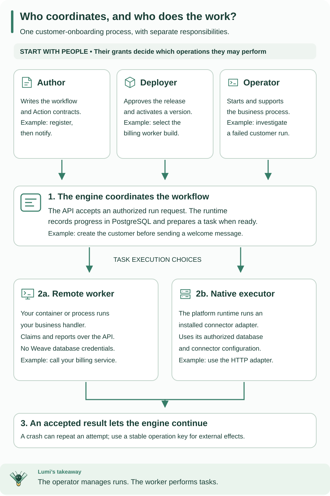

<!--
Copyright 2026 Firefly Software Foundation.

Licensed under the Apache License, Version 2.0 (the "License");
you may not use this file except in compliance with the License.
You may obtain a copy of the License at

    http://www.apache.org/licenses/LICENSE-2.0

Unless required by applicable law or agreed to in writing, software
distributed under the License is distributed on an "AS IS" BASIS,
WITHOUT WARRANTIES OR CONDITIONS OF ANY KIND, either express or implied.
See the License for the specific language governing permissions and
limitations under the License.
Author: Firefly Software Foundation
SPDX-License-Identifier: Apache-2.0
-->

# Implement and operate a worker

A **worker** is a process that asks Weave for a task, calls your business code,
and reports a result. For example, a customer-onboarding workflow can ask your
worker to create a customer in an internal billing system. The worker implements
that operation; Weave remembers where the overall process is and what comes next.
The echo workflow in the [standalone tutorial](standalone.md) needs no worker;
finish that tutorial before adding this integration.

This guide explains the checked-in [worker example](../../examples/worker/main.py)
and its [manifest](../../examples/worker/manifest.json). Its external receiver,
identity, image, and grants must be provisioned through the
[deployment guide](../operations/deployment.md). Running `main.py` alone is not a
complete deployment.

## First, separate the people from the running processes

**BPM** means business process management. In Weave, a workflow describes the
business process and the engine coordinates its steps. A worker performs a
particular job within that process. An operator is a person or application
responsible for running and supporting the process.



Read the people row first, then follow the numbered path from a run request to a
completed task. The two execution choices explain where your business code runs.
[Open the diagram at full size](../diagrams/worker-and-operator-roles.svg).

| Name | What it does | Customer-onboarding example |
| --- | --- | --- |
| Workflow author | Defines and validates the business process | Write the order of registration and notification steps |
| Deployer | Admits a worker release and activates a workflow in an environment | Approve the exact billing worker image for production |
| Operator | Starts, signals, cancels, or safely retries runs within granted scope | Investigate a failed registration and resolve its incident |
| Workflow engine | Records progress and decides which step is ready next | Wait for registration to finish before sending the notification |
| Remote worker | Claims tasks over the API and runs your handler | Call the billing service from your own container or network |
| Native executor | Executes configured connector code inside the platform runtime | Use an installed HTTP connector with an authorized connection |

The names above describe responsibilities. Weave also has explicit authorization
roles: `developer` for authoring, `deployer` for activation, `operator` for run
operations, `viewer` for run/status reads, and `worker` for task execution. Grant
the roles a principal actually needs; they do not inherit one another. For
example, a support application often needs both `viewer` and `operator`. The
worker role cannot publish workflows or approve its own release. Identity-provider
roles do not automatically become Weave permissions. See
[identity and grants](../operations/identity-and-secrets.md).

Here, “operator” is an operational responsibility and an authorization role. It
does not mean a Kubernetes Operator controller. The
[Kubernetes guide](../operations/kubernetes.md) describes the available manifests.

## Choose how a step will execute

You do not need a custom worker for every workflow. Pure calculations and control
flow run in the engine. An installed connector can execute an integration through
a configured native executor. Write a remote worker when you want to own the
handler, its dependencies, or its deployment boundary.

A remote worker needs an API connection and a scoped worker identity. It does not
need the Weave database credentials. A native executor is part of the trusted
platform runtime and needs its configured database and connector authority. Both
follow the task/lease rules below, but they have different deployment and secret
access boundaries.

For this tutorial, choose the remote-worker path. You will create one handler,
package its exact capability, authorize a release, and start one process. The
[deployment walkthrough](../operations/deployment.md) supplies the complete build,
authorization, start, verification, and stop commands.


Read down from release admission and registration through claim, execution, completion, and recovery. A release, instance, and lease identify the allowed build, running process, and authorized attempt. [Open the diagram at full size](../diagrams/authoring-worker-lifecycle.svg).

## 1. Define the work before implementing it

An **Action** is the reusable workflow-facing contract. A **task capability** is
the worker-facing contract that implements it. This example uses the exact
capability `example-record@1.0.0`:

| Contract field | Example value | Meaning |
| --- | --- | --- |
| `taskType` / `taskVersion` | `example-record` / `1.0.0` | Exact handler identity |
| Input | `{"customer": "demo"}` | Required string, no extra properties |
| Output | `{"receipt": "accepted", "customer": "demo"}` | Required receipt constant and customer string |
| `timeoutSeconds` | `180` | Absolute task execution budget |
| `sideEffect` | `idempotency_key` | The external target must support deduplication by operation key |

The published Action names this capability in its `implementation`. The workflow
calls the Action by name/version. The admitted release declares the same schemas
and policy. All three must agree; a similarly named handler does not satisfy a
different version's contract.

### See the workflow-to-handler connection

A workflow references an Action, not a Python function or a container name. This
is the workflow used by the [admission example](../../examples/admit_worker.py),
shown in YAML so you can follow the link:

```yaml
apiVersion: weave/v1alpha1
kind: Workflow
metadata:
  name: worker-first-run
  version: 1.0.0
spec:
  # Validate the customer's identifier before any task can execute.
  inputSchema:
    type: object
    properties:
      customer: {type: string}
    required: [customer]
    additionalProperties: false
  outputSchema:
    type: object
    properties:
      receipt: {const: accepted}
      customer: {type: string}
    required: [receipt, customer]
    additionalProperties: false
  steps:
    - id: record
      kind: action
      # Resolve this published Action version; do not name the handler here.
      uses: record-customer@1.0.0
      with: {ref: /input}
  # Return the result only after the worker's completion is accepted.
  output: {ref: /steps/record/output}
```

The published `record-customer@1.0.0` Action declares
`implementation.kind: worker`, `taskType: example-record`, and
`taskVersion: 1.0.0`. The manifest and SDK handler map declare
`example-record@1.0.0`. Activation pins that task type to an admitted release.
This is why publishing YAML alone cannot start a worker: publication defines
behavior, activation selects its authorized implementation, and a running worker
provides execution capacity.

The deployment script publishes both complete definitions and creates the
activation; this YAML is an explanation of that workflow, not a substitute for
the remaining setup. Whether you submit definitions through the CLI, API, or
[Python SDK](sdk-tutorial.md), the same Action and release bindings apply.

## 2. Implement one handler

The [example handler](../../examples/worker/main.py) receives a `TaskLease`.
Its `input` is the validated task input. It posts that input to `WEAVE_EFFECT_URL`
and sends `lease.operation_key` as the target's `Idempotency-Key`. It returns the
target's JSON response, which must satisfy the output contract above.

The essential wiring inside an already authenticated process is:

```python
from firefly_weave.sdk.worker import Worker

# transport is the authenticated WorkerTransport created after registration.
# record is an async function accepting one TaskLease and returning JSON.
worker = Worker(transport, {"example-record@1.0.0": record}, concurrency=1)
await worker.run()
```

This is a wiring excerpt; use the complete example for authentication,
registration, and shutdown. `Worker` handles claims, heartbeats, and completion
delivery around the handler. A **lease** is temporary permission to execute one
task attempt. Its generation changes when recovery issues a new attempt; an old
generation cannot complete the new one. Never print the lease's secret proof.

Keep credentials outside business inputs, logs, and returned results. The API
validates results against the pinned schemas; it rejects present secret-classified
values rather than storing a masked successful output.

## 3. Admit the release, then register an instance

A **release** identifies an immutable build and its allowed capabilities. An
**instance** is one running process of that release. A deployer admits the release
before a worker can register; a worker cannot grant itself new capabilities.
The deployment guide walks through the commands in this order:

1. Build the image and record its actual immutable image digest.
2. Provision the worker's verified identity and scoped grants, admit the manifest,
   and retain the returned release ID.
3. Activate the workflow with the matching worker release binding.
4. Start the process with the environment below. It registers its instance and
   claims only compatible, authorized tasks.

| Variable used by the example | Source |
| --- | --- |
| `WEAVE_API_URL` | The deployed API origin |
| `WEAVE_ENVIRONMENT_URL` | The scoped API path for the selected environment |
| `WEAVE_TOKEN_URL` | The configured identity provider's token endpoint |
| `WEAVE_WORKER_SECRET` | The separately provisioned `weave-worker` client credential |
| `WEAVE_WORKER_RELEASE_ID` | The admitted release ID |
| `WEAVE_EFFECT_URL` | The external receiver with durable idempotency support |

Pass only worker configuration. The example explicitly refuses database and
administrator environment variables. The checked-in example uses a development client named `weave-worker` and an
OAuth client-credentials exchange. For your deployment, configure token acquisition
for your CIAM and the API
[trusted provider profile](../operations/identity-and-secrets.md#configure-token-verification);
the Worker SDK takes an authenticated transport rather than choosing a provider.
It obtains one access token per invocation
and stops claiming early enough to drain its declared 180-second tasks; a
supervisor can restart it with fresh credentials. It is not an indefinitely
refreshing token client.

## 4. Observe one task through completion

Start a workflow that calls the published Action. Inspect its run history and
worker status through the API. Use the [API playground](api-playground.md) to
authenticate and select your environment, then the [full API reference](../reference/api-explorer.md)
for worker registration and run/history reads. A worker token is for execution;
use a separately granted operator/viewer identity to inspect runs. You should see
a task claim, then a completion
receipt, followed by the workflow's next step. No claim may simply mean no
compatible work exists; check the Action identity, activation release pins, and
current grants before changing the handler.


Follow the external effect separately from the completion receipt. A crash between
them explains why the target needs the same operation key after recovery.
[Open diagram at full size](../diagrams/worker-recovery.svg)

See [worker protocol](../reference/worker-protocol.md) for release admission,
claims, capacity, fencing, rejected classified outputs and current wire models.
Native connectors use this same task/lease model; they do not grant themselves
access to arbitrary connection secrets or destinations.

## Containers and recovery

The [deployment guide](../operations/deployment.md) walks through packaging a
worker, building its image, provisioning its identity and grants, admitting its
release, and launching it with Compose. The worker uses a separate dependency
closure and receives API credentials rather than orchestration database access.
Server, Teams, and Kafka images use their own locked closures. API and native
executor processes receive separate private environment files.

At least one runtime replica must own recovery. Every runtime replica also needs
execute-only catalog authority for startup compatibility checks, even when its
background scheduler is disabled. This requirement does not apply to remote
worker-only processes.

A crash after an external effect and before the accepted completion can cause a
new lease and another invocation. Use supported provider idempotency or independent
reconciliation. Heartbeats and lease fencing do not roll back external effects;
cancellation may leave an operation in flight. Inspect the durable run and incident
state after a restart, and preserve the original operation identity when an
authorized safe retry is appropriate.
