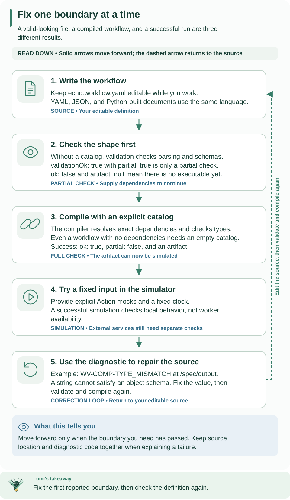

<!--
Copyright 2026 Firefly Software Foundation.

Licensed under the Apache License, Version 2.0 (the "License");
you may not use this file except in compliance with the License.
You may obtain a copy of the License at

    http://www.apache.org/licenses/LICENSE-2.0

Unless required by applicable law or agreed to in writing, software
distributed under the License is distributed on an "AS IS" BASIS,
WITHOUT WARRANTIES OR CONDITIONS OF ANY KIND, either express or implied.
See the License for the specific language governing permissions and
limitations under the License.
Author: Firefly Software Foundation
SPDX-License-Identifier: Apache-2.0
-->

# Author and deploy a workflow

A workflow definition describes input, ordered steps, and output. This guide builds
an **echo** workflow: given `{"message": "Hello, Weave"}`, it returns that same
object. You will validate the file, compile it into an executable artifact, and
simulate it locally before deciding to deploy it.

**First workflow?** Follow the [quickstart](../quickstart.md) first. This lab adds
partial validation, a deliberate type error, and repair to the same echo example.
Its offline steps need only the [installed CLI](../installation.md) and Python
3.12 or later. Use the working directory from the quickstart, or create
`.local/tutorial/` in your chosen directory. No API, database, token, or worker is
needed until the publication step.

If you use a source checkout, select its CLI using the quickstart's shell function.
Only the optional external Action fixture at the end requires repository files.
The Python request-building snippet below uses the standard library, so it does
not need to import packages from the CLI's isolated environment.



Read the two result columns before following the numbered steps. Partial validation can pass without an artifact; the right column requires an explicit catalog. The return arrow shows how diagnostics guide an edit. [Open the diagram at full size](../diagrams/authoring-diagnostic-loop.svg).

## 1. Write the input and output contract

Save this as `.local/tutorial/echo.workflow.yaml`:

```yaml
apiVersion: weave/v1alpha1
kind: Workflow
metadata:
  name: echo
  version: "1.0.0"
spec:
  inputSchema:
    type: object
    required: [message]
    additionalProperties: false
    properties:
      message: {type: string}
  outputSchema:
    type: object
    required: [message]
    additionalProperties: false
    properties:
      message: {type: string}
  steps:
    - id: echo
      kind: transform
      value: {ref: /input}
  output: {ref: /steps/echo/output}
```

Read this from the outside in:

- `apiVersion` selects the workflow language; `metadata.version` identifies your
  workflow version. Changing one does not change the other.
- `inputSchema` accepts an object with a required string `message` and rejects
  extra properties. `outputSchema` promises the same shape to callers.
- `steps` runs in order. A `transform` evaluates a data expression without an
  external call. The step ID `echo` gives later expressions a stable name to read.
- `{ref: /input}` reads the complete run input. The final `output` reads the
  transform's result at `/steps/echo/output`.

A `ref` is a JSON Pointer into workflow data, not a Python expression or a URL.
For example, `/input/message` reads only the string. `{literal: "Hello"}` would
produce a fixed string. Neither expression reads environment variables or files.
See [compiler expression forms](../reference/compiler.md#cli-and-published-catalog-contract)
and [schema rules](../reference/schema-profile.md) before adding more complex values.

## 2. Validate the document

```sh
weave workflow validate .local/tutorial/echo.workflow.yaml --output json
```

Expect exit code `0`, `validationOk: true`, `partial: true`, `ok: false`, and
`artifact: null`. This is a successful **partial validation**: it checks the
language shape and schemas without resolving dependencies. `ok: false` here does
not mean your YAML failed; it means no executable artifact was produced.

## 3. Compile with an explicit catalog

A catalog is a snapshot of dependency contracts available to the compiler.
Echo calls no Actions, so save an explicitly empty catalog as `.local/tutorial/empty-catalog.json`:

```json
{"definitions": [], "tasks": [], "adapters": [], "schemas": {}}
```

```sh
weave workflow compile .local/tutorial/echo.workflow.yaml --catalog .local/tutorial/empty-catalog.json \
  --strict --directory .local/tutorial/compiled --output json
weave workflow explain .local/tutorial/echo.workflow.yaml --catalog .local/tutorial/empty-catalog.json
```

Expect `ok: true`, `partial: false`, and an artifact. The `.local/tutorial/compiled` directory
contains `compiled-artifact.json`, `executable.json`, and `catalog.lock.json`.
The first file includes the executable plus diagnostics and source locations;
use it for simulation. `explain` shows the start, `echo`, and end nodes and how
they connect. Compilation checks references and data types; it executes no steps.

Export refuses existing target files. For another attempt, choose a fresh
`--directory`, or deliberately use `--force` to replace those exports.
If compilation fails, inspect each diagnostic's `code`, `path`, and source span
before proceeding. [Compiler results](../reference/compiler.md) explains these
fields. A successful compile does not provision runtime dependencies.

### Make a type error, then repair it

Change the transform's `value` from `{ref: /input}` to
`{ref: /input/message}` and compile again without exporting:

```sh
weave workflow compile .local/tutorial/echo.workflow.yaml \
  --catalog .local/tutorial/empty-catalog.json --strict --output json
```

Expect exit code `1`, `ok: false`, and `WV-COMP-TYPE_MISMATCH` at `/spec/output`.
The transform now returns a string, but `outputSchema` promises an object. The
YAML is structurally valid, so partial validation alone does not catch this
relationship. Restore `{ref: /input}` and recompile; expect success again. Your
previously exported artifact remains the original valid workflow because this
exercise did not export a replacement.

## 4. Simulate one input

Build a simulation request from the exported artifact. Save the following as
`.local/tutorial/make-simulation.py` and run it with Python 3.12 or later:

```python
import json
from pathlib import Path

request = {
    "artifact": json.loads(Path(".local/tutorial/compiled/compiled-artifact.json").read_text()),
    "mocks": {},
    "input": {"message": "Hello, Weave"},
    "now": "2026-01-01T00:00:00Z",
}
Path(".local/tutorial/simulation-request.json").write_text(json.dumps(request))
```

```sh
python3 .local/tutorial/make-simulation.py
weave workflow simulate .local/tutorial/simulation-request.json --output json
```

Expect `status: "succeeded"` and `variables.output` equal to
`{"message": "Hello, Weave"}`. `mocks` is empty because a transform needs no
external result. `now` initializes the simulator's virtual clock; simulation
never calls a live worker or provider. To explore breakpoints, signals, and
mocked Actions, continue with [simulation](../reference/simulation.md).

Try changing the request's `message` to a number. Simulation rejects it because
it violates `inputSchema`. Restore the string before continuing. This check
protects the workflow's contract independently of whether the source compiled.

## 5. Publish and activate for durable execution

Use [the CLI lifecycle tutorial](cli-tutorial.md) to perform these operations
one at a time. It supports an [existing API](connect-to-api.md) or the local API
created by the [standalone tutorial](standalone.md). You need permission to publish
in your project and activate/run in your environment. The lifecycle is:

| Stage | What you create | Why it is separate |
| --- | --- | --- |
| Draft, optionally | An editable, revisioned source document | An editor can save work before it compiles |
| Publish | An immutable workflow version | The server recompiles against its authorized catalog |
| Activate | An environment-specific version and dependency binding | Future runs pin this selected artifact and its dependencies |
| Start | A durable run with schema-valid input | History records execution of the pinned activation |

The echo workflow needs no connection or worker release. When you add an Action
that calls external code, its worker release must be admitted, its instance
running, and any required connection revisions bound before execution can work.
Follow [workers](workers.md) or [host integration](host-integration.md) for that
next layer.

Publish a new version to change behavior and activate it for new runs. Existing
runs retain their original pins. Retiring authoring state preserves historical
revisions; it does not delete runtime evidence.

## Read an external Action example next

The [customer onboarding definition](../../examples/definitions/customer-onboarding.workflow.yaml)
calls `onboarding.check-customer@1.0.0`, waits for a `customer-approved` signal,
and combines their Boolean results. Its [Action](../../examples/definitions/check-customer.action.yaml)
and catalog lock are teaching fixtures for dependency resolution:

```sh
weave workflow compile examples/definitions/customer-onboarding.workflow.yaml \
  --catalog tests/fixtures/catalog/onboarding.lock.json --strict --output json
```

Run this command from the repository root. A successful result proves the
fixture contracts compile. It does not install the external implementation,
create an activation, or make this a runnable deployment. Use explicit mocks to
explore it offline. Credentials belong in authorized connection secret references,
never ordinary workflow input, literals, or output.
