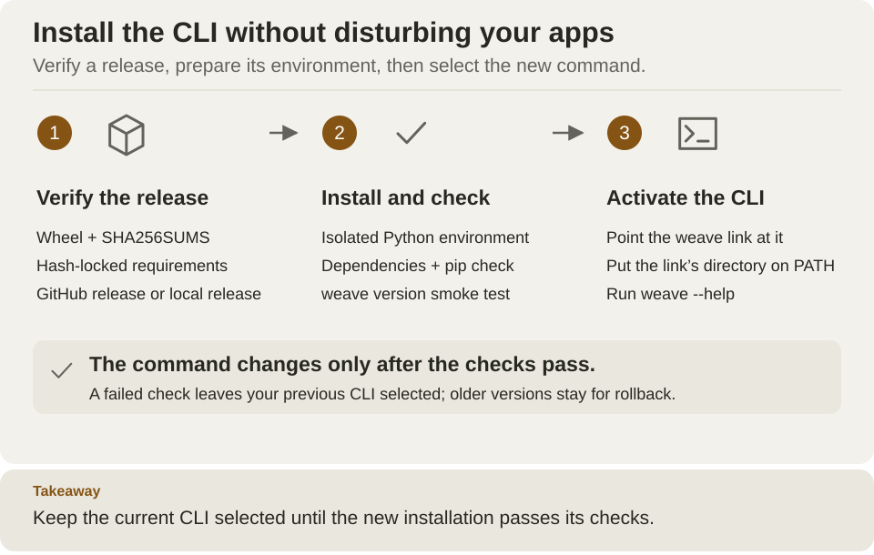

<!--
Copyright 2026 Firefly Software Foundation.

Licensed under the Apache License, Version 2.0 (the "License");
you may not use this file except in compliance with the License.
You may obtain a copy of the License at

    http://www.apache.org/licenses/LICENSE-2.0

Unless required by applicable law or agreed to in writing, software
distributed under the License is distributed on an "AS IS" BASIS,
WITHOUT WARRANTIES OR CONDITIONS OF ANY KIND, either express or implied.
See the License for the specific language governing permissions and
limitations under the License.
Author: Firefly Software Foundation
SPDX-License-Identifier: Apache-2.0
-->

# Install the Weave CLI

**Goal:** type `weave` from any directory to write and check workflows, open
Studio, or work with a running Weave platform. Installation takes a few minutes
and needs Python 3.12 or newer on macOS, Linux, or WSL. It does not start a
server, a database, or a worker.

The installer puts the CLI in its own Python environment, so your applications'
packages are never affected. It includes local authoring, the API client with
sign-in support, OpenAPI import, and the host that runs Studio. Studio's browser
application is a separate download; see the
[Studio guide](guides/studio.md#install-the-alpha14-browser-application).

## Choose the installation path

**Recommended:** install the pinned **v0.1.0a14 alpha** below. You do not need Git,
a source checkout, Docker, or `sudo`. An alpha is a preview release: use it to
evaluate Weave, and check the [current limits](capabilities.md).

| Your situation | Start here |
| --- | --- |
| You want to write, check, and simulate workflows, connect to your team's platform by its address (`weave auth setup`), or call REST APIs without code | [Install a release](#install-a-release), then [check the result](#check-the-result) |
| You want the visual editor in your browser | [Install Studio](guides/studio.md#install-the-alpha14-browser-application) |
| You want a native desktop app | [Desktop installation](guides/desktop.md) |
| You contribute code, or want to try changes made after the release | [Install the current source](#install-the-current-source) |
| You already have the CLI | [Upgrade or select another version](#installation-locations-and-upgrades) |

The original `v0.1.0a1` release predates this installer. Use `v0.1.0a2` or a later
release.



Follow the three numbered stages from left to right: the installer verifies the
release, builds and checks a new environment, and only then switches the `weave`
command to it. A failure at any stage leaves your previous command in place.
[Open diagram at full size](diagrams/cli-installation.svg)

## Before you start

You need:

- macOS, Linux, or a Linux shell on Windows (WSL). Native Windows is not
  supported by the installer.
- Python 3.12 or newer with its `venv` and `ensurepip` support. Python 3.12 is the
  version the project's checks use. Some Linux distributions package `venv`
  separately.
- `curl`, and internet access to GitHub and PyPI. The installer downloads the
  pinned PyFly wheel from GitHub; you do not install PyFly or Docker yourself.

```sh
# Check the interpreter the installer will use; it must be Python 3.12 or newer.
python3 --version
# Check that the download tool is available.
curl --version
```

Expected: `Python 3.12` or later, and a curl version line. If `python3` is
older, the installer also looks for `python3.14`, `python3.13`, and `python3.12`
on your `PATH`. Otherwise, set `WEAVE_INSTALL_PYTHON` to the path of a newer
interpreter you already have, or use the [source route](#install-the-current-source),
where `uv` selects Python 3.12.

## Install a release

**Step 1: run the installer.** Copy this whole block into Bash or Zsh. It
downloads the installer from the release and selects that same version
explicitly:

```sh
(
  # Stop if downloading the installer fails.
  set -o pipefail
  curl --proto '=https' --tlsv1.2 -fsSL \
    https://github.com/fireflyframework/firefly-weave/releases/download/v0.1.0a14/install.sh \
    | sh -s -- --version v0.1.0a14
)
```

The installer downloads the release manifest, the package, and its locked
dependency list; checks their SHA-256 hashes; creates an isolated Python
environment; and tests the new command before it makes it available. The first
installation can take several minutes. No services start and no cloud resources
are created.

Expected, at the end: `Installed Firefly Weave 0.1.0a14: PATH`, then `Run: PATH
--help`, where `PATH` is the new command (by default `~/.local/bin/weave`). When
that directory is not on your `PATH`, the installer also prints the `export`
line to add. The last line says where earlier environments are kept for
rollback.

**Prefer to read the installer before running it?** Download it to a file
instead:

```sh
# Download the installer to a file instead of running it directly.
curl --proto '=https' --tlsv1.2 -fsSL \
  https://github.com/fireflyframework/firefly-weave/releases/download/v0.1.0a14/install.sh \
  -o weave-install.sh
```

Expected: no output, and a new `weave-install.sh` file. Inspect it in your
editor, then run it:

```sh
# Install the same pinned release with the reviewed file.
sh weave-install.sh --version v0.1.0a14
```

Expected: the same output as above. Keep the file if you want to reuse it for
upgrades or removal.

HTTPS and checksums protect the download path. They are not an independent
signature of the publisher, so only run installers from a source you trust.

**Step 2: check the result** as described next, before you start a tutorial.

## Check the result

```sh
# Make the installed command available in this shell (default location).
export PATH="$HOME/.local/bin:$PATH"
# Show the installed version.
weave --version
# Show the command groups and examples; this starts no server.
weave --help
# Show the installed and workflow language versions as JSON.
weave version --output json
# Print the link to the platform guide.
weave docs platform
```

Expected: `Firefly Weave 0.1.0a14`; the help with its command groups and
examples; one JSON object with `version`, `apiVersion`, and `irVersion`; and the
address of the platform guide. The Firefly banner appears only in the main help;
it never appears in command results or JSON output.

For help on one command, run `weave help workflow compile` or `weave workflow
compile --help`. `weave docs` prints links without opening a browser; add
`--open` to visit one.

**Keep `weave` on your `PATH` in new terminals** by adding the `export` line to
your shell's startup file, such as `~/.zshrc` or `~/.bashrc`. The installer
leaves your shell configuration to you.

For a ready-to-run example, run `weave init my-first-workflow`, enter that
directory, and follow its generated `README.md`.

## Installation locations and upgrades

| Item | Default location |
| --- | --- |
| Isolated environments and the installation receipt | `~/.local/share/firefly-weave` |
| Command | `~/.local/bin/weave` |

Use `--install-dir` and `--bin-dir` to choose other locations; quote paths that
contain spaces, and reuse the same locations for every later install and for
removal. To choose Python explicitly, set `WEAVE_INSTALL_PYTHON` to its
executable path. `sh weave-install.sh --help` lists every option.

**An upgrade is another installation.** The installer builds a new environment,
checks it, and only then switches the managed command. If anything fails, the
previous command stays selected, and earlier environments are kept for rollback.
The installer refuses to replace a `weave` command it did not install. Do not
remove or move the Python interpreter the environment was built with.

### Select a version or release channel

The explicit `--version v0.1.0a14` makes an installation repeatable. To upgrade,
use the installer URL and `--version` value of the new release shown on
[GitHub Releases](https://github.com/fireflyframework/firefly-weave/releases).
Tags start with `v`; `weave --version` shows the package version without it.

With a downloaded `weave-install.sh`, you can select a channel instead:

| Command | What it installs |
| --- | --- |
| `sh weave-install.sh --version v0.1.0a14` | Exactly this documented alpha |
| `sh weave-install.sh --prerelease` | The most recently published release, including alpha previews |
| `sh weave-install.sh` | The latest stable release only |

Weave currently publishes only alpha releases, so a stable-only request reports
that no release was found; use an exact version. After any upgrade, run
`weave --version` and the quickstart's validation step again.

## Remove the command

**To sign out everywhere too, do it first, while `weave` still works.** Your
sign-ins live in your operating system's credential store, or in a private file
you chose, and uninstalling does not remove them.

Each saved platform keeps its own sign-in:

```sh
# List the saved platforms; each NAME has its own stored credentials.
weave auth profiles
# Sign out of one platform and forget it; repeat for every NAME in the list.
weave auth remove NAME --yes
```

Expected: `Removed 'NAME'. You are signed out of it.` for each platform.

With an alpha6 or earlier CLI, or for a connection file you used directly, sign
out with that file and the same credential-store options you signed in with, for
example `weave auth logout --auth-config FILE --revoke`.

Then remove the command. With a downloaded installer, run:

```sh
# Remove only the managed weave command; your environments and files stay.
sh weave-install.sh --uninstall
```

If you used the `curl` installation, run the same published installer with the
removal option:

```sh
(
  # Stop if downloading the installer fails.
  set -o pipefail
  curl --proto '=https' --tlsv1.2 -fsSL \
    https://github.com/fireflyframework/firefly-weave/releases/download/v0.1.0a14/install.sh \
    | sh -s -- --uninstall
)
```

Expected: `Removed the managed weave entrypoint. Environments and receipt remain
at PATH.` Add `--install-dir` and `--bin-dir` again if you chose custom
locations.

Removal deletes only the managed command. Local platforms, workflow files, the
folder that holds `profiles.json` (listed in
[what is saved, and where](guides/connect-to-api.md#what-is-saved-and-where)),
`~/.weave-credential-locks` on macOS and Linux, and the environments under the
installation directory stay. After you have signed out they hold no credentials;
delete them yourself if you want no trace.

## If installation stops

| What you see | Why | What to do |
| --- | --- | --- |
| A Python version or `venv` error | The selected Python is older than 3.12, or lacks `venv` | Set `WEAVE_INSTALL_PYTHON` to Python 3.12 or newer; install your distribution's `venv` package |
| No installable release was found | You asked for the latest stable release, and only alphas exist | Run the pinned `v0.1.0a14` command above, or add `--prerelease` |
| Missing installer assets | The selected release is older than this installer | Choose `v0.1.0a2` or later; never mix files from different releases |
| A checksum mismatch | A downloaded file is not the published one | Stop, and download the complete release again from the same trusted source |
| The installer refuses to replace `weave` | Another program already uses that command path | Choose a different `--bin-dir`, or inspect the old command before replacing it yourself |
| A dependency download fails | GitHub or PyPI is unreachable | Check your network access; the previous command remains available |
| `weave: command not found` | The command directory is not on your `PATH` | Add the printed directory to `PATH`, or run the full printed command path |

## Install the current source

This route installs **unreleased development source from `main`**, for
contributors and for trying changes made after the latest release. You do not
need it for any feature this documentation describes: the v0.1.0a14 release
includes them. Behavior on `main` can change before the next release. Follow the
documentation of the same checkout.

You need Git and [uv](https://docs.astral.sh/uv/getting-started/installation/).
Clone once, then run every command from the repository root:

```sh
# Get the source and enter it.
git clone https://github.com/fireflyframework/firefly-weave.git
cd firefly-weave
# Create the locked development environment with Python 3.12.
uv sync --locked --python 3.12
# Build the package once and export its exact dependency versions and hashes.
mkdir -p .local
uv run --locked --no-editable python scripts/prepare_release.py \
  --output .local/cli-release
# Install that build with the same installer the releases use.
WEAVE_INSTALL_PYTHON="$PWD/.venv/bin/python" sh install.sh \
  --from-release .local/cli-release/artifacts
```

Expected: the prepare step prints one JSON line with `wheel_sha256` and
`sdist_sha256`, and the installer prints `Installed Firefly Weave VERSION: PATH`.
Already cloned? Skip the first two commands and enter your checkout.

**The version comes from the checkout.** `weave --version` prints the version
recorded in the checkout, which can equal the latest release even when `main`
has later changes. To install exactly a release, use the
[release installer](#install-a-release) instead.

The prepare step starts no service, and its output directory must be new. For a
later build, choose a different directory and pass that directory's `artifacts`
folder to the installer. Keep the build output if you may need to reinstall that
exact build. If you use `UV_PROJECT_ENVIRONMENT`, point `WEAVE_INSTALL_PYTHON` at
that environment's `bin/python` instead of `.venv/bin/python`.

To use Studio from this source, also [build its browser application](guides/studio.md#start-from-source).

## Next: choose one task

- [Write your first workflow](quickstart.md): no server or credentials needed.
- [Connect the CLI to a platform](guides/connect-to-api.md): sign in to the
  platform your team runs, or to your local one.
- [Start a local platform](guides/local-platform.md): run the API, PostgreSQL,
  and Keycloak on your laptop.
- [Open Studio](guides/studio.md): draw workflows in the visual editor.
