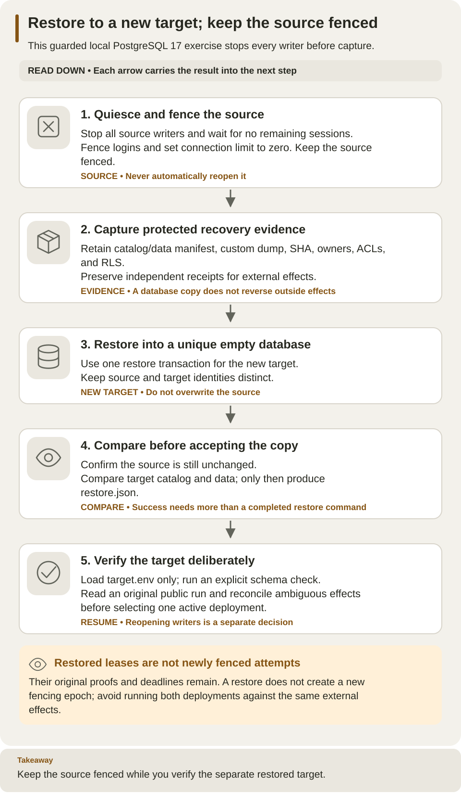

<!--
Copyright 2026 Firefly Software Foundation.

Licensed under the Apache License, Version 2.0 (the "License");
you may not use this file except in compliance with the License.
You may obtain a copy of the License at

    http://www.apache.org/licenses/LICENSE-2.0

Unless required by applicable law or agreed to in writing, software
distributed under the License is distributed on an "AS IS" BASIS,
WITHOUT WARRANTIES OR CONDITIONS OF ANY KIND, either express or implied.
See the License for the specific language governing permissions and
limitations under the License.
Author: Firefly Software Foundation
SPDX-License-Identifier: Apache-2.0
-->

# Back up and restore an owned local installation

This ordered recipe starts from the [standalone installation](../guides/standalone.md)
and its private `WEAVE_WORK_DIR`, `WEAVE_LAUNCH_ID`, `WEAVE_DOCKER_CONTEXT`, and
`WEAVE_PYTHON`. It makes a complete quiesced logical backup and restores into a
**new empty database in the same owned PostgreSQL 17 cluster**. It retains the
source, target, archive, credentials and independent receiver receipts.

The checked-in helper intentionally supports the guarded local PostgreSQL
ports 55433/55434, libc locale, the default database-level ACL, and the existing
local provisioning administrator. It rejects other environments and custom
DB-level ACLs before target creation. It preserves and compares all actual
schema/table/column/function grants, owners and policies. This is not a general
production backup manager, live failover, point-in-time recovery, identity-provider
backup, secret-provider backup or an RPO/RTO guarantee.



Read across the lanes to follow ownership of the source, evidence and target. The completion receipt is written after catalog/data equality; public-run verification is a later operator check. The source stays fenced throughout target verification.

[Open diagram at full size](../diagrams/operations-restore.svg)

## Before you begin

This is a maintenance exercise with downtime. **Quiesced** means all application
writers are stopped before capture. **Fenced** means the helper then prevents
ordinary logins from reconnecting to the source database. A successful exercise
leaves the source fenced and starts only the restored target; it does not switch
traffic automatically or reopen the source afterward.

Keep the standalone operator shell as terminal 1. It needs the existing private
work directory, Docker context/project, installed interpreter, identity settings,
and selected `WEAVE_API_PORT`. Use a separate terminal for the restored API in
step 4, using standalone's printed `cd` and `source .../session.env` commands to
restore paths and selected ports. PostgreSQL and Keycloak stay running throughout
this exercise.

| Item | Where it comes from | Why it is needed |
| --- | --- | --- |
| `runtime.env` | Standalone runtime provisioning | Identifies the source database and its three authorities |
| `postgres.env` | Standalone PostgreSQL setup | Lets the helper reach the guarded control database |
| `first-run.json` | First successful public workflow | Supplies scope, run ID, and expected output for comparison |
| `effects.sqlite` | Optional deployment receiver | Preserves independent external-effect receipts |
| `WEAVE_BACKUP_DIR` | New unique directory selected in step 2 | Holds the archive, manifests, restored credentials, and completion receipt |

If you used a different PostgreSQL port from the supported local ports, this
helper will refuse the installation. Do not change its guard or relabel an
existing database to make the exercise run. Production needs a backup procedure
appropriate to its own storage, identities, encryption, and recovery objectives.

## 1. Stop and fence all source writers

Stop foreground API and receiver-independent worker processes with Ctrl-C in
their own terminals. Keep the idempotent effect receiver running: its receipt store
is independent of the database and must survive the exercise. If the deployment
guide created a remote worker, stop only the exact container from its receipt:

```sh
python3 - <<'PY'
import json, os, subprocess
from pathlib import Path
receipt = Path(os.environ["WEAVE_WORK_DIR"]) / "worker-deployment.json"
if receipt.exists():
    value = json.loads(receipt.read_text())
    subprocess.run(value["stop_argv"], check=True)
print("Owned remote worker stop completed, if configured")
PY
```

If you launched the API/native executor through Compose, stop those two services
using the same complete configuration from the deployment guide:

```sh
docker --context "$WEAVE_DOCKER_CONTEXT" compose --project-name "$WEAVE_LAUNCH_ID" \
  --env-file "$WEAVE_WORK_DIR/postgres.env" --env-file "$WEAVE_WORK_DIR/identity.env" \
  -f compose.yaml -f compose.identity.yaml -f compose.runtime.yaml \
  -f compose.local-runtime.yaml stop api native-executor
```

Do not run that optional command if you have not generated the runtime env files
and image variables required by that guide. Every API, scheduler, provider ingress,
provider/outbox dispatcher, native executor, remote worker and broker consumer
pointing to the source must be stopped. A restored copy shares the original lease
proofs, generations and absolute deadlines; it does not create a fencing epoch.

## 2. Reserve protected evidence and identify PostgreSQL

Return to the first standalone terminal. Load its existing control configuration;
never regenerate or overwrite a retained secret file. The runtime receipt identifies
the source database and its existing application/scheduler credentials.

```sh
umask 077
set -a
source "$WEAVE_WORK_DIR/postgres.env"
set +a
export WEAVE_BACKUP_DIR="$WEAVE_WORK_DIR/backup-$(python3 -c 'from uuid import uuid4; print(uuid4().hex)')"
export WEAVE_POSTGRES_CONTAINER="$(docker --context "$WEAVE_DOCKER_CONTEXT" compose \
  --project-name "$WEAVE_LAUNCH_ID" --env-file "$WEAVE_WORK_DIR/postgres.env" \
  -f compose.yaml ps -q postgres)"
test -n "$WEAVE_POSTGRES_CONTAINER"
"$WEAVE_PYTHON" - <<'PY'
import os, stat
from pathlib import Path
root = Path(os.environ["WEAVE_WORK_DIR"])
for name in ("postgres.env", "runtime.env"):
    path = root / name
    info = path.lstat()
    assert stat.S_ISREG(info.st_mode) and not path.is_symlink()
    assert info.st_uid == os.getuid() and info.st_mode & 0o077 == 0
print("Existing private source configuration is ready")
PY
```

The backup directory must not already exist. The helper creates it with mode 0700
and exclusive mode-0600 files. Its archive contains sensitive database contents,
including retained proof hashes and payloads. Protect it like the source database.

## 3. Perform one owner-preserving restore

```sh
"$WEAVE_PYTHON" scripts/restore_database.py \
  --runtime "$WEAVE_WORK_DIR/runtime.env" --output "$WEAVE_BACKUP_DIR" \
  --context "$WEAVE_DOCKER_CONTEXT" --postgres-container "$WEAVE_POSTGRES_CONTAINER"
```

Expected: `{"complete": true, "catalog_data_equal": true}`. Keep the generated
`restore.json` as the completion evidence; a dump file alone is not evidence that
a restore succeeded. The helper:

1. Checks the explicit local Docker endpoint, exact container/loopback port,
   PostgreSQL guard, server major version and complete administrator authority.
2. Verifies nonowner NOSUPERUSER/NOBYPASSRLS application/scheduler identities and
   no remaining source sessions. It sets that owned source database's connection
   limit to zero, checks for a raced session, and leaves the source fenced.
3. Records complete table counts and canonical data checksums, schema/table/function
   owners, ACLs, column grants, RLS/force-RLS policies, fixed function search paths,
   sequence values and role membership/privilege flags. Both schema markers are
   included in the complete table inventory.
4. Runs PostgreSQL 17 `pg_dump --format=custom`, records the archive SHA/inventory,
   creates a unique matching `template0` target, checks it is empty, and runs
   `pg_restore --single-transaction --exit-on-error` with owners and ACLs intact.
5. Requires the restored catalog/data manifest to equal the source, and checks the
   source did not change during capture. Only then writes `target.env` and the
   completion receipt `restore.json`.

No global roles are dumped/restored, existing roles changed, tables reconstructed,
leases edited, or old database dropped. There is no `--clean`, `--no-owner`,
`--no-acl`, auto-migration before restore or cleanup shortcut. A failed command
retains incomplete evidence and any created database; it never reopens the source
or marks that target complete. Investigate locally and use a new output directory
for a deliberate retry.

### If the helper stops before completion

| Symptom | Meaning | Next step |
| --- | --- | --- |
| Source still has sessions | An API, worker, dispatcher, or administrative session is still connected | Stop the identified owned writer and investigate before retrying |
| Output directory exists | The helper will not overwrite earlier evidence | Inspect that attempt and choose a new directory for a deliberate retry |
| Guard, port, authority, or ACL rejection | The source is outside this helper's supported local contract | Use the appropriate procedure; do not relax the guard |
| Dump/restore or manifest comparison fails | Capture or recovery is incomplete | Retain archive/logs and both databases; do not start the target as verified |

The source may already be fenced after a failure. Retrying application startup
against it is not a recovery action. Inspect the retained `trial.json` and any
completion receipt before selecting the active database.

## 4. Verify schema and start only the restored target

Keep all source writers stopped. In a dedicated target terminal, run standalone's
printed `cd` and `source .../session.env` commands. Set `WEAVE_BACKUP_DIR` to the
exact path selected in step 2 (print that nonsecret path in terminal 1 if needed),
then load **only** the new target runtime configuration and run the exact installed
migration command:

```sh
set -a
source "$WEAVE_BACKUP_DIR/target.env"
set +a
"$WEAVE_WORK_DIR/runtime/bin/python" -I -m firefly_weave.cli.main admin migrate
env -u WEAVE_MIGRATION_DATABASE_URL \
  "$WEAVE_WORK_DIR/runtime/bin/python" -I -m uvicorn \
  firefly_weave.main:create_application --factory --host 127.0.0.1 --port "${WEAVE_API_PORT:?Set the selected API port}"
```

Expected: `Weave schema is current`, followed by API startup. For a same-version
restore migration is a no-op. A supported predecessor exercise instead restores a
genuine old artifact's database, then explicitly migrates with the selected new
artifact. A repeated version string or current rows stamped with an old revision
is not predecessor compatibility evidence.

In the first terminal, verify readiness and the original public run with a fresh
real host token; all identifiers come from the original first-run receipt:

```sh
"$WEAVE_PYTHON" - <<'PY'
import asyncio, json, os
from pathlib import Path
import httpx
async def main():
    receipt = json.loads((Path(os.environ["WEAVE_WORK_DIR"]) / "first-run.json").read_text())
    base = "http://127.0.0.1:" + os.environ["WEAVE_API_PORT"]
    async with httpx.AsyncClient(timeout=10, trust_env=False) as client:
        ready = await client.get(base + "/health/ready")
        ready.raise_for_status()
        token = await client.post(os.environ["WEAVE_KEYCLOAK_TEST_URL"] + "/realms/weave/protocol/openid-connect/token",
            data={"grant_type": "client_credentials"}, auth=("weave-host", os.environ["WEAVE_HOST_SECRET"]))
        token.raise_for_status()
        scope = receipt["scope"]
        path = f"/api/v1/tenants/{scope['tenant_id']}/projects/{scope['project_id']}/environments/{scope['environment_id']}/runs/{receipt['run_id']}"
        response = await client.get(base + path,
            headers={"Authorization": "Bearer " + token.json()["access_token"]})
        response.raise_for_status()
        run = response.json()
        assert run["state"]["status"] == receipt["status"]
        assert run["state"]["output"] == receipt["output"]
        print("Restored public run and output match the original receipt")
asyncio.run(main())
PY
```

Expected: `Restored public run and output match the original receipt`. This
checks that an authenticated public read can retrieve the preserved successful
run, beyond the catalog/data equality already checked by the helper.

Readiness alone does not prove continuation. For an installation containing active
work, also resume signal/time waits, verify safe retries use their original
operation keys, require stale-proof fencing and explicit reconciliation for
ambiguous non-idempotent effects, and inspect schedules, source bindings, outbox
receipts, Teams reference fences and WhatsApp status facts. Keep independent
receiver receipts. Compare preserved history separately from new recovery events.

Stop the target API with Ctrl-C. Retain both databases, volumes, archives and
receipts; the source remains fenced until an explicit operational decision chooses
the active deployment. Identity-provider and secret-provider retention are separate
responsibilities.
