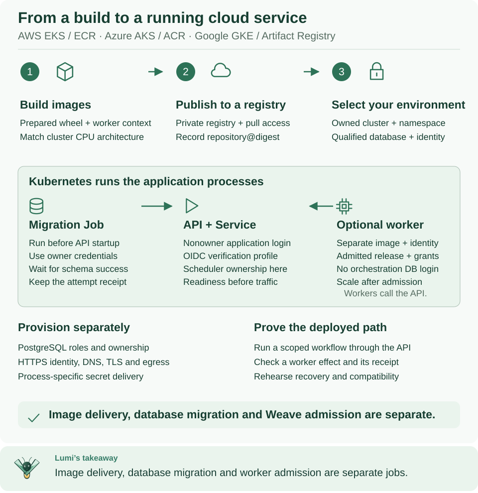

<!--
Copyright 2026 Firefly Software Foundation.

Licensed under the Apache License, Version 2.0 (the "License");
you may not use this file except in compliance with the License.
You may obtain a copy of the License at

    http://www.apache.org/licenses/LICENSE-2.0

Unless required by applicable law or agreed to in writing, software
distributed under the License is distributed on an "AS IS" BASIS,
WITHOUT WARRANTIES OR CONDITIONS OF ANY KIND, either express or implied.
See the License for the specific language governing permissions and
limitations under the License.
Author: Firefly Software Foundation
SPDX-License-Identifier: Apache-2.0
-->

# Deploy Weave on AWS, Azure, or Google Cloud

This guide moves the **same artifacts** you built and ran locally into a cloud
account your organization already operates. You build images for the cluster's
CPU architecture, push them to a private registry, and record their immutable
digests. The [Kubernetes walkthrough](kubernetes.md) then installs them on EKS
(AWS), AKS (Azure), or GKE (Google Cloud).

**Who this is for:** administrators and operators who can use the cloud account,
the cluster, and the registry. The guide prepares and ships images; it does not
create a cloud account, a cluster, or a production platform for you.

**What you need first:**

- A working local installation from the [platform CLI walkthrough](../guides/local-platform.md)
  or the [manual setup](../guides/standalone.md). Its private directory contains
  the prepared `release/images` build context that this guide reuses. To publish
  sign-in settings for people, set up that local installation from the 0.1.0a7
  release or later: an alpha6 or earlier installation builds a server image of
  that release, which has no `/api/v1/client-configuration`.
- For a remote worker only: the `worker-context` directory from
  [local worker packaging](deployment.md#prepare-a-worker-context).
- An understanding of publication, activation, and worker admission from the
  [CLI tutorial](../guides/cli-tutorial.md). The cloud does not change them.
- Docker, `kubectl`, Python 3, and your cloud's CLI, as listed in the provider chapter.



Read the top row as artifact delivery (build, publish, select the environment)
and the shaded panel as what Kubernetes runs. Pushing an image grants no Weave
authority: the API and workers still need verified identities, scoped grants,
and an admitted release.
[Open diagram at full size](../diagrams/cloud-deployment.svg)

## 1. Choose the infrastructure route

Each local building block has a cloud counterpart that your organization provides:

| Topic | Local tutorial | Cloud recipe |
| --- | --- | --- |
| Process manager | Compose and foreground Python | Kubernetes Deployments and explicit Jobs |
| Image location | Exact local Docker image ID | Private registry, pinned by registry digest |
| Durable state | Owned local PostgreSQL container | Qualified PostgreSQL installation with separate logins |
| Identity | Local Keycloak fixture | Your configured HTTPS OIDC/CIAM provider; Keycloak is optional |
| Runtime secrets | Private local files | Process-specific Kubernetes Secrets supplied by your secret-management system |
| Network | Selected local ports and host gateway | Private database access, cluster Service, controlled HTTPS ingress and egress |
| Deployment command | `weave worker deploy --target compose` | Cloud CLI setup, then `kubectl` |

**`weave worker deploy` supports local Compose only.** It accepts no `aws`,
`azure`, or `gcp` target and does not manage Kubernetes. Kubernetes runs the
containers; Weave decides which workflows and tasks they may handle.

First restore the local session so this terminal knows the build context and the
Docker engine you chose locally:

```sh
# Restore WEAVE_WORK_DIR, WEAVE_DOCKER_CONTEXT, and WEAVE_PYTHON from your local installation.
source /absolute/path/to/your-installation/session.env
# Confirm the prepared build context exists before you build cloud images.
test -f "$WEAVE_WORK_DIR/release/images/Dockerfile" && echo "Build context ready"
```

Expected: `Build context ready`. `weave platform setup` writes `session.env` to
its installation directory: `.local/platform/` under the directory where you ran
it, unless you passed another `--directory`. The manual setup printed the path in
its step 2. If the test prints nothing, finish the local setup first.

Then follow exactly one provider chapter and come back to step 2 of this page:

- [AWS: EKS and ECR](aws.md)
- [Azure: AKS and ACR](azure.md)
- [Google Cloud: GKE and Artifact Registry](gcp.md)

Each chapter selects the cluster context and namespace, signs Docker in to the
registry, and checks image-pull permissions. It ends with `KUBECONFIG`,
`WEAVE_KUBE_CONTEXT`, `WEAVE_KUBE_NAMESPACE`, and `WEAVE_REGISTRY_PREFIX` set in
this terminal. Cloud resources cost money; create or keep them only through your
organization's approved process.

## 2. Pass the infrastructure readiness gate

Check every item before you apply any application manifest. Each one is
something Weave needs but does not create:

1. **Cluster and namespace.** You have an owned cluster and namespace. Its nodes
   can pull from the registry and reach the database, the identity provider, and
   the systems your workflows call.
2. **Database rehearsal.** Your DBA has run the exact package's migrations against
   the chosen PostgreSQL service. Weave creates scoped roles and security-definer
   functions, and a managed service's administrator is not always an unrestricted
   superuser. Follow the [database qualification procedure](kubernetes.md#2-prove-the-database-authority-model).
   Never bypass a failed role or ownership check, and never treat a local
   migration as evidence for the cloud service.
3. **Three database credentials.** You have a migration owner, a nonowner
   application login, and a separate catalog/scheduler login, each in its own
   secret bundle.
4. **Token verification.** You have an HTTPS identity issuer, its JWKS endpoint,
   the API audience, the client allowlist, and a verified subject for bootstrap;
   see [identity setup](identity-and-secrets.md#use-your-own-identity-provider).
   Permission to pull an image is not permission to call Weave.
5. **Sign-in for people (optional).** To let people connect by typing only the
   server address, register a [public login client](identity-and-secrets.md#4-register-the-public-login-client)
   and plan the [published sign-in settings](identity-and-secrets.md#3-publish-sign-in-settings-for-people).
6. **HTTPS address.** You have chosen the API's HTTPS origin and route. The
   manifests create only an internal Service; they create no public DNS, TLS
   certificate, or load balancer. A loopback `kubectl port-forward` is enough
   for the operator's first checks, but people sign in through HTTPS.
7. **Operations.** You have set resource requests and limits, backup and
   restore, logging, and egress policy. The sample runs one API replica that
   owns scheduling; test capacity and availability before you scale.

**A Kubernetes Secret delivers a credential; it does not protect it.** Your cloud
secret store still provides access control, encryption, and rotation. This
release does not synchronize AWS Secrets Manager, Azure Key Vault, or Google
Secret Manager automatically: your infrastructure must place each process's
values into its Secret.

## 3. Build images for the target architecture

**Why:** an image runs only on nodes with the CPU architecture it was built for,
and your laptop's architecture says nothing about the cluster's. Read the nodes'
architecture first:

```sh
# Read the node CPU architecture; the image must match the nodes that will run it.
kubectl --context "$WEAVE_KUBE_CONTEXT" get nodes \
  -o custom-columns=NAME:.metadata.name,ARCH:.status.nodeInfo.architecture
```

Expected: one row per node with `amd64` or `arm64`. If your role cannot list
nodes, ask the operator for the node pool's architecture and placement rules. In
a cluster with mixed architectures, use matching node placement.

Build the API image. Set `WEAVE_TARGET_PLATFORM` to `linux/amd64` or
`linux/arm64` to match the nodes. The command builds a single-platform image, not
a multi-architecture index:

```sh
# Pick the platform that matches the nodes and a new, unique tag for this build.
export WEAVE_TARGET_PLATFORM=linux/amd64
export WEAVE_IMAGE_TAG="weave-$(date -u +%Y%m%dT%H%M%SZ)"
# Build the API image from the prepared release and keep its local image ID.
docker --context "$WEAVE_DOCKER_CONTEXT" build \
  --platform "$WEAVE_TARGET_PLATFORM" --target server \
  --iidfile "$WEAVE_WORK_DIR/cloud-server-image.id" \
  "$WEAVE_WORK_DIR/release/images"
```

Expected: the build finishes and `cloud-server-image.id` holds a `sha256:` image
ID. Use the `teams-server` or `kafka-server` target instead of `server` when you
need those optional runtime dependencies. Keep the package's build receipts.

**Only if you deploy a remote worker,** build its image for the same platform:

```sh
# Build the example worker image from the packaged worker context.
docker --context "$WEAVE_DOCKER_CONTEXT" build \
  --platform "$WEAVE_TARGET_PLATFORM" \
  --iidfile "$WEAVE_WORK_DIR/cloud-worker-image.id" \
  "$WEAVE_WORK_DIR/worker-context"
```

Expected: `cloud-worker-image.id` holds the worker's `sha256:` image ID. Building
the example worker does not implement your business integration: its manifest and
handler still need the effect-receiver contract explained in
[the local worker exercise](deployment.md#prepare-a-worker-context). For a new
build, use a new tag rather than overwrite an earlier build's identity files.

## 4. Push and record registry identities

**Why:** Kubernetes should pull an image by its registry digest, which never
changes, rather than by a tag, which can be moved. After the provider chapter's
registry sign-in, push the API image with the same local Docker context that
built it, then save the digest the registry recorded:

```sh
# Tag and push the API image so cluster nodes can download it.
export WEAVE_SERVER_TAG="$WEAVE_REGISTRY_PREFIX/server:$WEAVE_IMAGE_TAG"
docker --context "$WEAVE_DOCKER_CONTEXT" tag \
  "$(cat "$WEAVE_WORK_DIR/cloud-server-image.id")" "$WEAVE_SERVER_TAG"
docker --context "$WEAVE_DOCKER_CONTEXT" push "$WEAVE_SERVER_TAG"
# Save the registry digests Docker now knows for this tag.
docker --context "$WEAVE_DOCKER_CONTEXT" image inspect \
  --format '{{json .RepoDigests}}' "$WEAVE_SERVER_TAG" \
  > "$WEAVE_WORK_DIR/cloud-server-digests.json"
```

Expected: the push ends with a `digest: sha256:…` line and the JSON file lists a
`repository@sha256:…` value. **Only if you built a worker image,** push it the
same way:

```sh
# Tag, push, and record the worker image; skip this block for an API-only rollout.
export WEAVE_WORKER_TAG="$WEAVE_REGISTRY_PREFIX/worker:$WEAVE_IMAGE_TAG"
docker --context "$WEAVE_DOCKER_CONTEXT" tag \
  "$(cat "$WEAVE_WORK_DIR/cloud-worker-image.id")" "$WEAVE_WORKER_TAG"
docker --context "$WEAVE_DOCKER_CONTEXT" push "$WEAVE_WORKER_TAG"
docker --context "$WEAVE_DOCKER_CONTEXT" image inspect \
  --format '{{json .RepoDigests}}' "$WEAVE_WORKER_TAG" \
  > "$WEAVE_WORK_DIR/cloud-worker-digests.json"
```

Now select exactly one digest per pushed image and save the references for the
Kubernetes walkthrough. The helper skips the worker when you pushed none:

```sh
# Keep only digests from the selected repositories and save them as shell exports.
python3 - <<'PY'
import json, os, re, shlex
from pathlib import Path
root = Path(os.environ['WEAVE_WORK_DIR'])
lines = []
for kind in ('server', 'worker'):
    receipt = root / f'cloud-{kind}-digests.json'
    if kind == 'worker' and not receipt.exists():
        continue  # API-only rollout: no worker image was pushed.
    repository = os.environ['WEAVE_REGISTRY_PREFIX'] + '/' + kind
    candidates = json.loads(receipt.read_text())
    matches = [value for value in candidates if value.startswith(repository + '@sha256:')]
    assert len(matches) == 1, 'Inspect registry results before selecting an image'
    assert re.fullmatch(r'.+@sha256:[a-f0-9]{64}', matches[0])
    lines.append(f'export WEAVE_{kind.upper()}_IMAGE_REF={shlex.quote(matches[0])}')
with (root / 'cloud-images.env').open('x') as stream:
    stream.write('\n'.join(lines) + '\n')
print('Saved registry-pinned image references in cloud-images.env')
PY
source "$WEAVE_WORK_DIR/cloud-images.env"
```

Expected: `Saved registry-pinned image references in cloud-images.env`, and
`WEAVE_SERVER_IMAGE_REF` (plus `WEAVE_WORKER_IMAGE_REF` when you pushed a worker)
set in this terminal. If the helper stops, inspect the registry and select the
real `repository@sha256:…` reference yourself; never substitute a local image ID.
The helper refuses to overwrite an existing `cloud-images.env`, so a new build
keeps the earlier build's record intact.

**Two different SHA-256 values describe one image.** Record both:

| Identity | Used by | Where it comes from |
| --- | --- | --- |
| Registry manifest digest | Kubernetes `image:`, to pull immutable content | The push, saved in `cloud-images.env` |
| Image configuration ID | Release admission: the build identity a worker or native release is bound to | `cloud-server-image.id` or `cloud-worker-image.id` for that exact build |

They usually differ. A registry push is neither release admission nor runtime
attestation. Admit the final cloud-platform build, not an earlier laptop build
with the same handler name.

## 5. Deploy the application and prove an execution

Continue with [the Kubernetes walkthrough](kubernetes.md) and its
[checked-in manifest templates](../../deploy/kubernetes/README.md). In order, it:

1. Renders the templates with your pinned image references into a private directory.
2. Rehearses the database model and supplies separate migration and runtime Secrets.
3. Runs the explicit migration Job and checks its result.
4. Bootstraps a verified host identity and starts the API.
5. Checks readiness, runs one public workflow, and lets people connect.
6. Admits and authorizes a remote-worker release before it scales the worker up.

Then reuse the [CLI workflow lifecycle](../guides/cli-tutorial.md#use-these-commands-with-a-cloud-installation)
with the cloud API address, a current token, and the cloud's own scope IDs. Never
reuse a local tenant, activation, or worker ID because an environment has the
same name.

## 6. Operate the deployment

Use [observability](observability.md) for telemetry and durable evidence,
[backup and restore](backup-restore.md) for ownership and fencing, and
[upgrades](upgrades.md) for schema and artifact acceptance. The local restore
helper protects a local installation only; it does not automate a managed
database restore.

**Images, schemas, and external effects change independently.** Rolling out a new
image does not migrate the schema, and reverting an image does not undo a
migration or an external effect. Keep database recovery points and test a
compatible recovery path before you change a shared environment. When a
readiness, identity, or admission check fails, stop at that stage and use its
evidence; adding replicas does not fix it.

## If something goes wrong

| What you see | Why | What to do |
| --- | --- | --- |
| `Build context ready` does not appear | `session.env` was not loaded, or the local setup did not finish | Load the right `session.env`, or finish the [local setup](../guides/local-platform.md) |
| A pod exits at once with `exec format error` | The image architecture differs from the node's | Rebuild with the `WEAVE_TARGET_PLATFORM` that matches the nodes, then push and record the new digest |
| A pod stays in `ImagePullBackOff` | The nodes' pull identity cannot read the repository, or the reference is wrong | Check the pull permission in your provider chapter and the reference in `cloud-images.env` |
| The digest helper stops with `Inspect registry results before selecting an image` | No digest, or several, match the selected repository | Inspect the pushed image in the registry and select its `repository@sha256:…` reference |
| The digest helper stops with `FileExistsError` for `cloud-images.env` | An earlier build already recorded its references there | Keep that record: move the existing `cloud-images.env` to a folder named after the earlier build, then rerun the helper |
| `docker push` is refused | Docker is not signed in to this registry, or you lack push rights | Repeat the provider chapter's registry sign-in step |

For problems after the API starts, see the [Kubernetes troubleshooting table](kubernetes.md#if-something-goes-wrong)
and the general [troubleshooting guide](troubleshooting.md).

## What has been verified

These manifests and commands are reference material, checked against Weave's
code and against Kubernetes object shapes. They have not been run in customer
AWS, Azure, or Google Cloud accounts. Before you call an installation production,
pass the migration, identity, network, recovery, and real integration checks in
that environment.

## Next steps

- [AWS](aws.md), [Azure](azure.md), or [Google Cloud](gcp.md): prepare the cluster and registry.
- [Deploy on Kubernetes](kubernetes.md): migrate, start, and verify the API.
- [Remote deployment map](remote-deployment.md): see where you are in the whole route.
