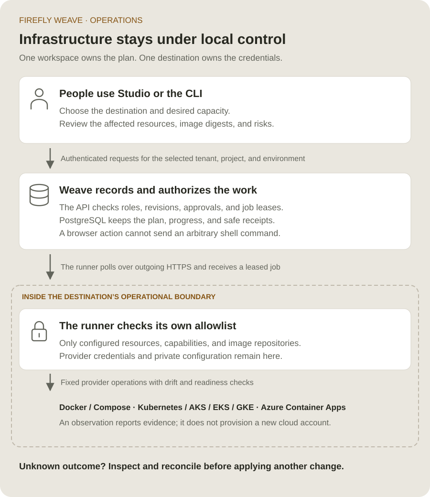
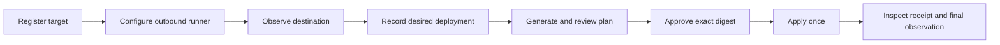
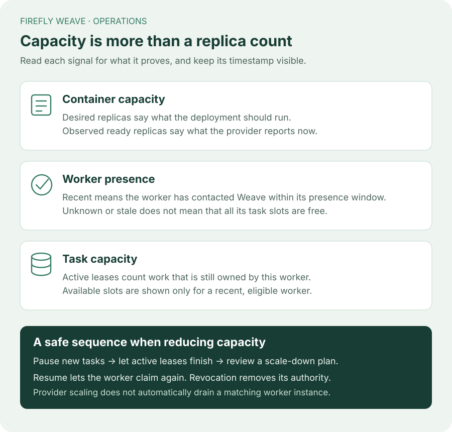
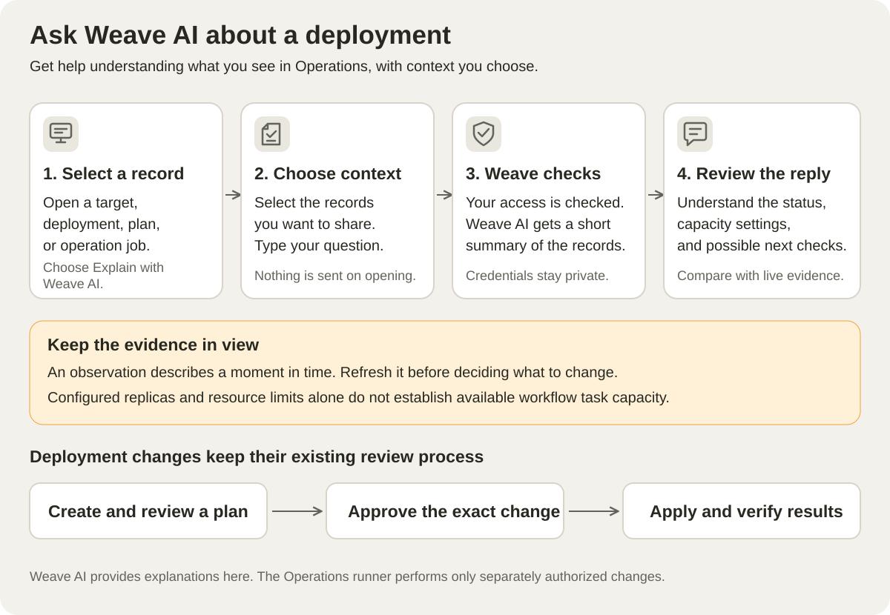

<!--
Copyright 2026 Firefly Software Foundation.

Licensed under the Apache License, Version 2.0 (the "License");
you may not use this file except in compliance with the License.
You may obtain a copy of the License at

    http://www.apache.org/licenses/LICENSE-2.0

Unless required by applicable law or agreed to in writing, software
distributed under the License is distributed on an "AS IS" BASIS,
WITHOUT WARRANTIES OR CONDITIONS OF ANY KIND, either express or implied.
See the License for the specific language governing permissions and
limitations under the License.
Author: Firefly Software Foundation
SPDX-License-Identifier: Apache-2.0
-->

# Manage container deployments

Operations connects an existing container destination to Weave, records what
is there, and sends reviewed changes to a runner beside that destination.
It does not create a cloud subscription, Kubernetes cluster, network, or
identity provider. Provision those foundations with your existing infrastructure
tools before registering a target.



This guide follows the same sequence in Studio and the CLI:



## 1. Prepare the destination and identities

Use a running Weave API, a saved CLI or Studio platform connection, and an
existing Docker Compose project, Kubernetes namespace, or supported cloud
container destination. The runner host needs the corresponding provider CLI,
network access to the destination and Weave API, and locally provisioned
provider credentials. The browser and Weave database do not receive those
credentials.

An administrator creates a dedicated **application** principal and links its
verified machine identity using the existing
[identity and membership commands](../guides/people-and-access.md).
Do not use a worker principal or copy a person's Studio token. Record this
application's ID when registering the target. After the target has an ID,
grant `deployment_runner` in its exact environment, with `resources` containing
only that target ID. The runner must authenticate as the same application.

Give people only the roles they need:

| Person or application | Role |
| --- | --- |
| Inventory reader | `deployment_reader` |
| Target registrar and desired-deployment editor | `deployment_planner` |
| Plan reviewer | `deployment_approver` |
| Operator applying or cancelling a reviewed change | `deployment_operator` |
| Dedicated runner application | `deployment_runner`, restricted to its target |

Target creation requires an environment-level planner grant because its target
ID does not exist yet. Subsequent work can use target-resource grants. The
approver and operator may be separate people; reconciliation requires both
roles. Signing in, being a workflow developer, or seeing a registered worker
does not grant deployment authority.

## 2. Register an existing target

In Studio, open **Operate › Clusters → Register target**. Choose the adapter, the
existing destination's pinned identity and boundary, the dedicated runner
application, and capabilities that its local policy will support. Administrators
can select active application accounts by their available display label. Other
planners can expand the administrator-provided application ID option. Use
**Settings → People and access** to create/link the application and assign roles;
provider credentials stay outside Studio. Kubernetes supports observation,
updates and worker scaling; only Compose offers deployment of its trusted local
template. For Azure Container Apps, start with observation only. After the
specific environment passes acceptance, limit its target and runner policy to
`observe` and `update`; keep `scale_workers` disabled. The
[Azure capacity boundary](operations-runner.md#azure-container-apps) explains why.
Registration records metadata; it does not verify provider access or deploy
anything.

The CLI equivalent uses a `TargetRequest` JSON file:

```sh
weave operations targets create --request target.json \
  --idempotency-key register-target-01
```

Example `target.json` for Docker Compose; replace the illustrative daemon
identity and principal ID with your actual non-secret identifiers:

```json
{
  "name": "team-runtime",
  "adapter": "docker-compose",
  "external_identity": "pinned-docker-daemon-id",
  "boundary": "team-weave",
  "runner_principal_id": "00000000-0000-0000-0000-000000000001",
  "capabilities": ["observe", "deploy", "update", "scale_workers"]
}
```

Save the returned target ID. Grant the runner role now, with that ID in the
binding's resource list. Configure only capabilities actually supported by the
chosen adapter; a backend enum is not proof a destination supports an action.

## 3. Configure and start the outbound runner

The target page shows setup steps and **Download setup template**, containing
its known API origin, workspace, pinned destination and target ID. Save it privately
on the runner host, then complete the local context, component allowlist, image
repositories and credential-file references there. It is an incomplete,
observation-only template, not a credential or installation bundle. Studio never
executes these commands or treats registration as provider readiness.

On the runner host, use the same package version as the platform:

```sh
weave operations runner setup --output /absolute/private/runner.json
weave operations runner check --config /absolute/private/runner.json
weave operations runner run --config /absolute/private/runner.json
```

Setup writes a new private local file. Supply the exact workspace and target
IDs, pinned provider identity, explicit provider context, allowed component
names and image repositories, and the path to the dedicated machine's OAuth
configuration. The OAuth file and cloud credentials remain local.

**Check** validates local policy and reads the destination; it does not register
the runner or apply a job. **Run** registers and polls for authorized work.
Operate it under your existing service supervisor. A runner's recent contact
shows presence, not container health or worker task capacity.

## 4. Observe, then record desired components

Open the target in Studio and select **Observe target**. Wait for its durable
operation to succeed. Inspect the dated observation, its completeness, and
resource ownership before choosing **Record desired deployment**. Select observed
components to copy their names, immutable images and replica counts into the draft.
Enter local configuration aliases, CPU and memory limits explicitly: observations
do not report them. Worker components offer admitted releases when you have
`catalog.read`; select the release paired with the image in your build receipt.
A release configuration digest and a registry manifest digest are different
identities; Studio does not verify that pairing. Without catalog access, ask an
administrator for that access or use the CLI. Selecting an observed component does not grant ownership or
apply any change.

The CLI starts the same read-only job using an `ObserveRequest`:

```json
{"target_id": "00000000-0000-0000-0000-000000000002"}
```

```sh
weave operations observations create --request observe.json \
  --idempotency-key observe-target-01
weave operations jobs read "$JOB_ID"
weave operations observations read "$OBSERVATION_ID"
weave operations deployments create --request deployment.json \
  --idempotency-key record-deployment-01
```

Use the actual returned IDs. `deployment.json` follows the canonical
`DeploymentRequest` schema: target ID, name, declared `imported` or `managed`
ownership, and bounded API, worker, or Weave AI components
(API, permission and role names use `lumi`). Each component has its role, an
immutable `repository@sha256:…` image, local configuration alias, replica
count, CPU and memory limits. Worker components additionally require an
admitted worker release ID. Configuration aliases must match the runner's
local allowlist; they are not environment-variable or secret payloads.

Database migrations are not executable deployment components. Run the release's
migration job separately using the destination's upgrade runbook, then verify
schema compatibility before resuming the API and workers. A deployment plan
does not perform or replace that migration step.

An API/scheduler component must have exactly one replica. Scaling workers to
zero stops containers; it does not perform graceful worker draining. Use the
separate worker-instance **Drain** control first when active work must settle.
Imported ownership is declared intent requiring explicit review before changes,
not an automatic ownership transition after applying a plan.

## 5. Generate and review the immutable plan

In the desired deployment, select **Create plan**, choose an intent and a fresh
complete observation, then **Generate reviewable plan**. Read every component,
image digest, replica count, expected external version, risk, and expiry.
Cost and duration estimates are not provided.

CLI `plan.json` uses the returned desired-deployment revision and observation:

```json
{
  "deployment_id": "00000000-0000-0000-0000-000000000003",
  "deployment_revision": 1,
  "observation_id": "00000000-0000-0000-0000-000000000004",
  "intent": "update",
  "ttl_seconds": 300
}
```

```sh
weave operations plans create --request plan.json --idempotency-key plan-01
weave operations plans read "$PLAN_ID"
```

Choose `deploy` only when the adapter supports deployment of its trusted local
template. `update` changes supported existing components; `scale_workers`
requires the same observed worker image. It cannot silently become an image
update. Desired-deployment edits use `deployments update` with the current
`--revision`; conflicts require reloading and reviewing the current intent.

Container Apps update plans may contain only worker and Weave AI components. If a
desired deployment includes an API component, record worker/Weave AI changes in a
separate desired deployment and upgrade the API with the
[Azure maintenance boundary](azure.md#container-apps-operations-and-maintenance).
Studio excludes unsupported update choices; the API rejects them before saving
a plan. Worker scaling can select worker components of a mixed desired deployment
only where the adapter, target and runner policy all permit it. Keep this
capability disabled for Azure Container Apps.

## 6. Approve and apply that exact plan

The reviewer chooses **Approve reviewed plan**. The operator chooses **Apply
approved plan**. Approval stores the exact digest. Applying rechecks revisions,
freshness, capabilities, and the approver's current role. A saved approval can
therefore become unusable after a revocation or change.

For the CLI, create `reviewed-digest.json` containing only `digest` with the
exact digest you reviewed:

```sh
weave operations plans approve "$PLAN_ID" --request reviewed-digest.json
weave operations plans approval "$PLAN_ID"
weave operations plans apply "$PLAN_ID" --request reviewed-digest.json \
  --idempotency-key apply-reviewed-plan-01
weave operations jobs read "$JOB_ID"
```

Retain each idempotency key for retries of that same request. A different key
does not permit applying one plan twice. Only one job is active per target.
The runner renews a fenced lease and checks authority before external writes.

## 7. Verify the receipt or reconcile uncertainty

A successful apply has a final complete, settled observation matching the
reviewed images, replicas, readiness, and managed resources. Read the job's
receipt and observation, rather than treating registration or an accepted job
as proof of deployment success.

If a lease expires or execution is interrupted after changes may have begun,
the job becomes **reconciliation required**. Cancelling is not rollback.
New mutations stay blocked, while a read-only observation can inspect the
destination. First establish that the external operation has stopped; then
request a new complete, settled observation. An operator holding both apply
and approve authority can close the ambiguous job with its exact original
plan digest and the new observation ID:

```sh
weave operations jobs reconcile "$JOB_ID" --request reconciliation.json
```

`reconciliation.json` contains `plan_digest`, `observation_id`, and
`external_operation_stopped: true`. This acknowledgement does not reverse
changes or trigger another apply. Review the new state and create a new plan
if further work is needed.

The [API inventory](../reference/api.md#deployment-operations-authority) lists
the same authority checks. Python applications use the canonical models with
[WeaveClient.invoke](../reference/sdk.md#deployment-operations-through-the-sdk).

## Current bounds

Each environment permits up to 100 targets, desired deployments, and runner
registrations; 1,000 observations, plans, approvals, and jobs per collection;
and 10,000 runner report records. Requests exceeding a collection limit return
an explicit capacity error. This first interface has no deletion or retention
command for those records. Restarting a runner with the same application,
target, adapter version, and capabilities reuses its non-revoked logical
registration. Revoked registrations are never revived. Keep the collection
limits in view when operating a long-lived environment.

Observations expire after 15 minutes. Plans last 30–900 seconds, bounded by
their observation's expiry. Jobs have a 15-minute deadline and renewable
60-second leases. A running operation may outlive its original observation's
freshness once external changes begin, but never its job deadline or current
lease authority.

## Read worker capacity correctly



For Azure Container Apps, the observation counts replicas reported for active
revisions. It does not inventory physical replicas of inactive or historical
revisions. A settled observation with zero active replicas therefore does not
prove that every old process has stopped. Confirm all revisions and their
replicas through the provider before a maintenance window or runner replacement.
Worker presence and available task slots are separate signals in
**Operate › Workers**. **Operate › Clusters › Runners** shows every runner's
last contact; a runner is online if it made contact in the last 90 seconds.

## Explain a saved record with Weave AI



When Weave AI is configured, **Explain with Weave AI** opens the assistant
from a selected Clusters record. Choose which saved records to include and send a
question; nothing is sent automatically. A target, desired deployment,
observation, plan, or operation can provide context. Both `lumi.use` and the
record's normal `deployment.read` permission are required.

The explanation uses bounded summaries with image digests, replica and resource
counts, freshness, ownership, risks, and safe receipt codes. It excludes provider
configuration, external identities, credentials, paths, and raw logs. It cannot
create or apply a deployment plan. Treat it as an explanation of saved evidence,
not proof of live cloud health or available worker task capacity. See the
[Weave AI guide](../guides/lumi.md#explain-operations-records) for the opt-in flow.

See [Install an Operations runner](operations-runner.md) for local configuration,
provider setup, capability limits, and recovery after an uncertain operation.
