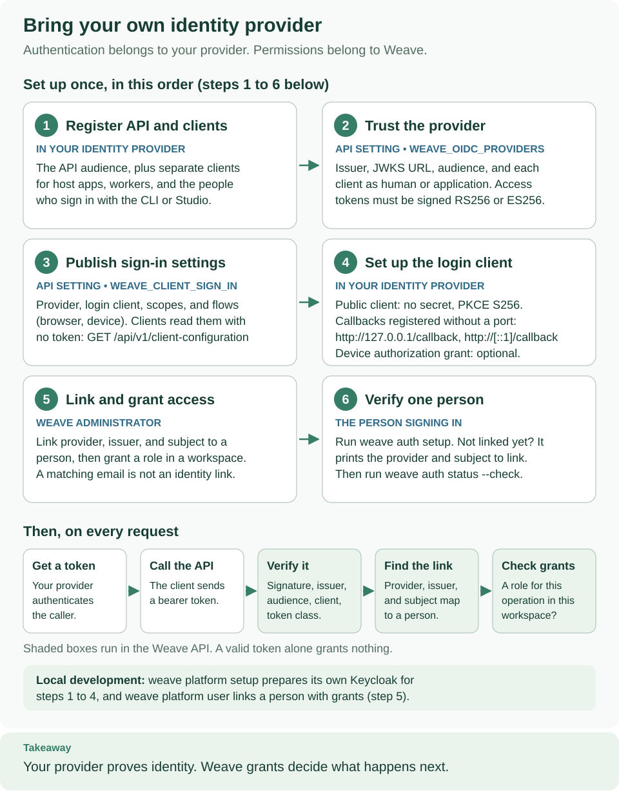

<!--
Copyright 2026 Firefly Software Foundation.

Licensed under the Apache License, Version 2.0 (the "License");
you may not use this file except in compliance with the License.
You may obtain a copy of the License at

    http://www.apache.org/licenses/LICENSE-2.0

Unless required by applicable law or agreed to in writing, software
distributed under the License is distributed on an "AS IS" BASIS,
WITHOUT WARRANTIES OR CONDITIONS OF ANY KIND, either express or implied.
See the License for the specific language governing permissions and
limitations under the License.
Author: Firefly Software Foundation
SPDX-License-Identifier: Apache-2.0
-->

# Identity, authorization and secrets

Weave uses your configured identity provider to authenticate callers. Keycloak
is included for **local development**, not required for production. Configure a
compatible OIDC/CIAM provider through `WEAVE_OIDC_PROVIDERS`; the API can trust
multiple explicit provider profiles. A verified external identity resolves
to an explicitly linked local principal; local role bindings grant capabilities
within tenant/project/environment/resource scope. External roles are claims, not
a replacement for these bindings. Workers cannot become workflow authors merely
because a provider token contains a role string.


[Open diagram at full size](../diagrams/security-boundaries.svg)

## Configure token verification

A successful request passes three checks in order: the token is valid for this
API, its verified identity is linked to an active Weave principal, and that
principal has a grant covering this operation and scope. These checks explain why
a valid provider token can still be denied by Weave.

| Term | Where it comes from | What it means |
| --- | --- | --- |
| Issuer | Trusted realm/provider configuration | Exact authority named in the signed token |
| Subject | Verified token `sub` or trusted provider administration | Stable identity within that issuer; not a username |
| Client | Verified client claim, `azp` by default | Application that requested the token, such as `weave-host` |
| Principal ID | Weave bootstrap or principal creation receipt | Local identity to which Weave grants are attached |
| Scope IDs | Tenant/project/environment creation responses | Resources within which a grant is valid |
| Release ID | Worker release admission response | Exact admitted implementation that a worker may execute |

For local development, `setup-runtime.py` writes the verification profile into
`runtime.env`; the standalone guide verifies the host token before bootstrap.
For another provider, establish the trusted values below from that provider's
administration before accepting tokens. Never derive trust from an unverified
token's URL claims.

Each `WEAVE_OIDC_PROVIDERS` entry supplies `provider_id`, exact `issuer`, trusted
`jwks_uri`, API `audience`, and an explicit client-to-actor-kind map. Defaults
allow RS256 and require the signed payload's `typ` to be `Bearer`, using `azp`
for client identity. Supported algorithms are explicitly allowed; JOSE header
`typ=JWT` alone does not establish an access token. A human and an application
are distinct actor kinds. HTTPS is required except explicitly enabled localhost
development endpoints.

JWKS retrieval uses configured trust, bounded responses/cache/refresh behavior
and no token-selected URL. Offline signature verification cannot instantly detect
an IdP-side revocation before token expiry. Local disable/grant removal is checked
on subsequent resolution. Do not retain a resolved principal indefinitely across
operations or share request tokens/state in singleton services.

The Keycloak realm template enables S256/device flows for the CLI and disables
password/implicit grants. Existing realm import skips retained realms; changing
a template does not reconcile existing clients or rotate secrets. Apply deliberate
additive administration to an owned realm. See [local runtime setup](../reference/local-runtime.md)
and [CLI login/storage](../reference/cli.md#login-and-secure-persistence).

## Use your own identity provider

You do not need to run Keycloak alongside your chosen CIAM. The local setup
commands provision Keycloak to make a laptop exercise repeatable; a deployed API
instead reads the provider profiles you supply. Your provider authenticates the
user or application. Weave verifies the resulting access token and applies its
own permissions.



Read from left to right: obtain an API access token, send it with a request, then
let Weave check identity and permission. The provider does not execute workflows
or store Weave grants. [Open the diagram at full size](../diagrams/identity-provider-setup.svg).

### 1. Register the API and its clients

In your provider's administration console, register the Weave API audience and
the applications that will call it. Use distinct client registrations for your
host application, remote workers, and interactive CLI where appropriate. Record
the exact issuer, trusted JWKS URL, audience, client identifiers, and signed
access-token claim names. Use the provider's documented access-token contract;
an ID token is not a substitute.

The built-in verifier accepts signed JWT access tokens using **RS256 or ES256**.
It requires `iss`, `sub`, `aud`, and `exp`, an allowed client claim, and a signed
payload claim/value that identifies the intended token class. The JWKS signing
key must declare an allowed `alg` and a matching `kid`. HTTPS endpoints are
required outside explicitly enabled localhost development.

### 2. Configure the API's trust profile

The following is an illustrative profile, not a preset for a named provider.
Replace every URL, audience, and client identifier. It assumes your provider
issues `client_id` and `token_use=access`; choose the actual claim names and
values from its verified access-token contract.

```json
[
  {
    "provider_id": "organization-ciam",
    "issuer": "https://identity.example/",
    "jwks_uri": "https://identity.example/.well-known/jwks.json",
    "audience": "weave-api",
    "clients": {
      "weave-host": "application",
      "weave-worker": "application",
      "weave-cli": "human"
    },
    "algorithms": ["RS256"],
    "client_claim": "client_id",
    "token_class_claim": "token_use",
    "token_class_value": "access",
    "local_development": false
  }
]
```

Save your completed array as `oidc-providers.json` in your private deployment
configuration directory. For a shell-launched API, load it before starting the
server:

```sh
# Point to the reviewed configuration; this file contains trust metadata, not tokens.
export WEAVE_OIDC_PROVIDERS="$(cat oidc-providers.json)"
# Start the API using the remaining database and runtime settings from your deployment guide.
```

For containers or Kubernetes, pass the same JSON as the `WEAVE_OIDC_PROVIDERS`
environment value through your deployment configuration. See the
[Kubernetes API setup](kubernetes.md#5-start-the-api-with-runtime-credentials).
The server loads profiles on startup; roll out a new configuration deliberately.
An empty array trusts no external provider. Add another explicit entry when you
need multiple issuers; do not derive endpoints from an incoming token.

| Setting | Why it matters |
| --- | --- |
| `provider_id` | Local name used by identity links and bootstrap; retain it consistently |
| `issuer`, `jwks_uri` | Whose tokens and signing keys the API trusts; use exact trusted values |
| `audience` | Identifies tokens intended for this API |
| `clients` and `client_claim` | Restrict callers and classify them as human or application |
| `token_class_claim`, `token_class_value` | Enforce the provider's signed token-purpose policy |
| `header_type` | Optional additional JOSE header check; it does not replace the payload policy |

### 3. Link identities and grant roles

Obtain a real access token through your provider's approved flow and verify it
against the profile before provisioning. Link the exact provider ID, issuer, and
verified subject to a local Weave principal. For a new installation, follow the
[bootstrap procedure](kubernetes.md#4-supply-only-migration-authority-and-run-the-job) in the deployment guide;
then provision tenant, project, environment, and scoped grants through the
administrative API. Reuse existing links on an existing installation.

Bootstrap links only the initial administrator. Each additional CLI user, host,
or worker needs its own deliberately provisioned principal and verified identity
link. The current public HTTP API manages scopes and grants; creating and linking
principals uses the authorized `AccessService.create_principal` and
`AccessService.link_identity` methods in a protected application composition.
Follow the [worker administration recipe](deployment.md#provision-authority-and-private-worker-configuration)
for that boundary. Its example creates a `worker` principal; an interactive human
identity needs a `human` principal and a matching `human` client classification.
Registering a client at your CIAM alone does not create a Weave identity link.

Changing providers does not automatically transfer identity links. An email
address shared by two providers is not proof that both subjects should inherit
the same authority. Provision the intended links and test access before retiring
the previous provider.

### 4. Configure clients and verify one request

Configure the CLI's issuer, registered public client, scopes, and API origin
using [CLI login](../reference/cli.md#login-and-secure-persistence).
Host applications and workers obtain access tokens through the provider's
approved flow and pass them as bearer tokens. The server trust profile does not
register clients or configure their login flows for them.

Use the [API playground](../guides/api-playground.md) or
[Python SDK tutorial](../guides/sdk-tutorial.md) to verify an allowed operation in
your intended scope. Also check that an unlinked identity is rejected and a
linked principal without the required grant cannot execute that operation.
A valid token establishes identity; it does not grant access to every project.

### If your provider uses a different token contract

Microsoft Entra ID and other CIAM products need a profile matched to their actual
tenant, access-token format, and application registration. Existing claim
normalizers do not automatically configure or certify those deployments.
Opaque tokens, introspection-only validation, or JWTs without a usable signed
payload token-class discriminator need a verifier integration; changing the
issuer URL alone is insufficient. The asynchronous `AccessTokenVerifier` port
allows a custom verifier in the application composition, with the same
verified-identity and local-grant boundaries. This is an integration task, not a
built-in environment switch. See [embedding](../reference/embedding.md) and the
[provider ports](../../src/firefly_weave/access/providers/base.py).

## Bootstrap and grant deliberately

Follow this order for a new local installation:

1. Start Keycloak and verify discovery using the standalone guide. A running
   container does not yet establish that the realm can issue the expected token.
2. Obtain and verify a `weave-host` token, then bootstrap its exact subject. Keep
   the private bootstrap receipt: it identifies the administrator created here.
3. Create the tenant, project, and environment and assign the host's scoped roles.
   The standalone first-run script records those IDs in `first-run.json`.
4. If adding remote workers, follow [worker deployment](deployment.md#provision-authority-and-private-worker-configuration).
   It verifies the separate `weave-worker` token, creates and links a worker
   principal through the authorized administration service, and admits/grants a
   specific release and task type.
5. Verify one allowed operation in the intended scope. Inspect denials using
   their safe error code and request ID; possession of a token is only step one.

Keep service identity credentials and receipts in the private work directory.
An existing identity link is retained state: do not rerun bootstrap or linking
with made-up subjects to work around an authorization failure.

The explicit bootstrap command requires migration-owner authority and the exact
verified provider subject, not an email, username or client ID. It links a platform
administrator; it does not mint a credential or grant business-data access.
Provision tenant/project/environment and host/worker grants through the existing
administrative API; creating/linking the separate worker principal currently uses
the explicit in-process administration recipe in the deployment guide. Services enforce authorization even when called in process.

The UoW sets transaction-local `weave.tenant_id` for PostgreSQL RLS. Scoped foreign
keys and service checks preserve finer boundaries. Migration authority owns DDL;
ordinary app sessions reject superuser/BYPASSRLS/table-owner credentials. Scheduler
authority is separately provisioned and does not imply unrestricted business-table
read access. Do not give remote workers either database login.

## Provider portability

| Boundary | Current support | What remains deployment-specific |
| --- | --- | --- |
| `AccessTokenVerifier` | Verified-identity port | Signature, issuer/audience/client and token-purpose policy |
| `ClaimsMapper` | Keycloak/generic/Entra claim profiles | Exact provider claim shape and allowed mapping |
| `PrincipalResolver` and identity links | Explicit local-principal mapping | Provisioning lifecycle and scope grants |
| Entra / other CIAM | Local profile/port support | Live provisioning and verification are not certified; no Entra group-overage expansion |

Embedding another verifier/resolver must retain these contracts. A generic mapper
is not proof that a provider's ID token is safe as an API access token or that its
roles should grant local administration. See [host integration](../guides/host-integration.md).

## Credentials and side effects


Read the first two cards to distinguish maintenance, API, native-executor, and
remote-worker credentials. Continue downward through identity and current-grant
checks. The final card follows a scoped secret handle to the executing process;
a bearer token is not a connector credential.

[Open diagram at full size](../diagrams/operations-authority.svg)

There are three different credential paths. The operator's migration credential
permits schema/bootstrap maintenance. A host or worker's identity-provider
credential obtains an API access token. A connector credential authenticates to
an external system. Keep these separate even when one person operates all three.

To connect a credentialed destination:

1. Follow that connector's guide to create a connection revision with destination
   policy and `secretRef` handles. A handle names a credential; it is not the
   credential value.
2. Configure the secret provider in the executing process and grant resolution
   only for the required scope/capability. `WEAVE_SECRET_ROOT` selects the mounted
   file root; `WEAVE_SECRET_GRANTS` describes allowed resolution.
3. Admit the executor release and its connection authority, then activate the
   workflow against those exact revisions.
4. Verify the connector's actual result contract. A configuration validation or
   connection check cannot establish eventual provider delivery.

Use connection `secretRef` handles and explicit scoped grants. Environment and
mounted-file secret providers resolve credentials only under the relevant authority;
provider standing-source requirements and worker lease-bound requirements differ.
Follow the exact connector guide rather than sharing one universal token.

Never place credential values in definitions, workflow literals, task results,
logs, metrics, trace labels, error messages or public examples. Secret-classified
ordinary durable payload values are rejected; this does not erase secret-bearing
historical rows in an older deployment. Read redaction is not storage encryption.
Explicit egress and destination policy still applies after credentials resolve.

Provider acceptance is not delivery. Lease fencing, current grants and reference
revocation protect admission/state; they cannot undo a remote effect already sent.
See [security reporting](../../SECURITY.md) and [capability limits](../capabilities.md).

## Diagnose identity failures by boundary

If token acquisition fails, check the owned provider's client flow and credential.
If Weave denies an acquired token, check exact issuer, audience, client mapping,
access-token purpose, and key freshness before inspecting the local identity
link. If identity resolution succeeds but an operation is forbidden, compare the
operation, scope IDs, and resource/release references to current grants. Keep
bearer tokens, provider response bodies, and credentials out of diagnostic reports.

Changing a local grant takes effect on the next identity resolution. Changing a
Keycloak template does not update an existing realm, and rotating a client secret
does not update an existing worker container's environment. Coordinate provider
changes with explicit process replacement and retain a way to verify the intended
identity before admitting new work.
