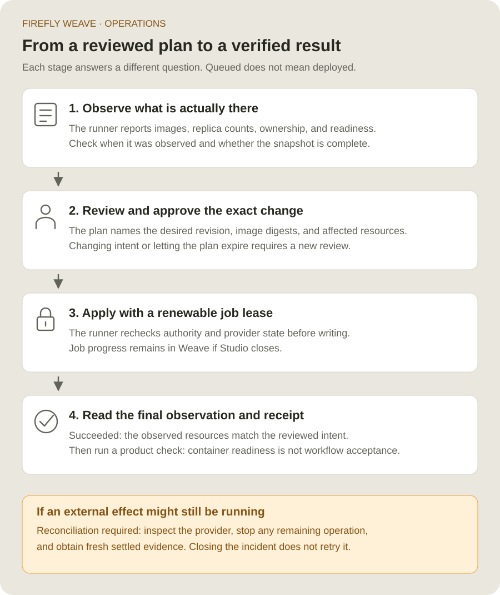

<!--
Copyright 2026 Firefly Software Foundation.

Licensed under the Apache License, Version 2.0 (the "License");
you may not use this file except in compliance with the License.
You may obtain a copy of the License at

    http://www.apache.org/licenses/LICENSE-2.0

Unless required by applicable law or agreed to in writing, software
distributed under the License is distributed on an "AS IS" BASIS,
WITHOUT WARRANTIES OR CONDITIONS OF ANY KIND, either express or implied.
See the License for the specific language governing permissions and
limitations under the License.
Author: Firefly Software Foundation
SPDX-License-Identifier: Apache-2.0
-->

# Install an Operations runner

An Operations runner is a small process beside a container destination. It asks
Weave for authorized work over an outgoing connection, checks its own local
policy, and calls the destination's existing tools. Studio never runs provider
commands or receives provider credentials.

Start with [Manage container deployments](cluster-management.md) to create the
target and grant its dedicated application identity access. This page explains
what to install on the runner host and how to configure each adapter.


## 1. Choose where the runner will live

Use a dedicated Linux or macOS host, VM, or container with network access to both
the Weave API and the destination. The runner uses POSIX process ownership and
file locks. Windows users can run it in a Linux VM or container; Studio and the
ordinary CLI remain available on Windows.

Install the **same Weave package version** as the API, including its client extra.
Follow the [CLI installation guide](../installation.md) first.
The `client` extra supplies the HTTP and OAuth client used by the runner.
Install and authenticate the appropriate provider tool on that host:

| Destination | Local tool | What the pinned identity means |
| --- | --- | --- |
| Docker Compose, including on-premises hosts | Docker CLI with Compose v2 | Docker daemon ID; boundary is a Compose project name |
| Kubernetes, including existing AKS, EKS, and GKE clusters | `kubectl` | Namespace UID; boundary is that namespace |
| Azure Container Apps | Azure CLI with Container Apps support | Managed environment ARM resource ID; boundary is a resource group |

The cloud's name does not change the Kubernetes adapter. A namespace in an
existing EKS or GKE cluster uses the same contracts and checks as another
Kubernetes namespace. Creating a cloud account, cluster, network, or database
remains an infrastructure provisioning step.

For Docker, use an explicitly named context. Access to a Docker socket grants
substantial host authority: isolate the runner and keep its provider permissions
within the destination it operates. For Kubernetes, grant only the namespace and
resource permissions needed by the allowed deployments. API-component updates
also require reading that namespace's horizontal pod autoscalers so the runner
can reject a conflicting scaling policy.

## 2. Copy the destination's actual identity

Run the relevant read-only command on the runner host. Replace the illustrative
names with your own context, namespace, subscription, and environment.

```sh
# Record the daemon identity, not just the context's display name.
docker --context team-runtime info --format '{{.ID}}'

# A namespace UID changes when someone deletes and recreates the namespace.
# That change must invalidate the old runner binding.
kubectl --context team-cluster get namespace weave \
  -o jsonpath='{.metadata.uid}'

# Register this environment resource ID as the ACA target's external identity.
az containerapp env show --subscription YOUR_SUBSCRIPTION_UUID \
  --resource-group team-weave --name team-environment --query id --output tsv
```

Register the target in **Studio → Operations → Register target** using that exact
identity. Keep the returned target ID for the local setup wizard. Target
registration records intent; an observation from the runner verifies access.

## 3. Prepare a dedicated Weave machine identity

The runner's Weave identity and provider identity serve different purposes.
The first authorizes jobs in one Weave workspace; the second authorizes the
local Docker, Kubernetes, or Azure command. Neither is a person's Studio login.

Create an application principal and link the verified machine identity using
[People and access](../guides/people-and-access.md). Grant `deployment_runner`
with the target ID in its resource list. Use your identity provider's OAuth
client-credentials endpoint; this is not tied to Keycloak.

A private OAuth configuration file looks like this:

```json
{
  "token_endpoint": "https://identity.example.com/oauth2/token",
  "client_id": "weave-operations-runner",
  "scope": "weave.operations",
  "client_secret_file": "/run/secrets/weave-runner-client-secret"
}
```

Use the actual scope accepted by your identity provider and Weave audience
configuration. Mount the secret at the referenced path. Do not put its value
in this file, a workflow, an image, or a Studio form. The client reads the secret
again when acquiring a new token and renews tokens before expiry.

For an operator-managed short-lived token, use `token_file` instead of
`oauth_file` in the runner configuration. It is read again for every API request,
so your credential agent can rotate it. Supply exactly one method. The runner
does not fall back to an interactive profile or keychain.

## 4. Run the setup wizard

```sh
# Create a new private file. Setup never overwrites an existing configuration.
weave operations runner setup --output /opt/weave/private/runner.json

# Verify the local policy and read the provider, without claiming any jobs.
weave operations runner check --config /opt/weave/private/runner.json

# Start outgoing polling. Only authorized jobs matching this policy can run.
weave operations runner run --config /opt/weave/private/runner.json
```

The wizard asks for four groups of information: the Weave workspace, the pinned
destination, allowed components and image repositories, and machine credentials.
It starts with observation only. Enable mutation capabilities only when that
host is ready to manage the specified resources.

Run the last command under your service supervisor or container restart policy.
Use a stable configuration and mount the required local files. Keep the process
in the foreground; the supervisor owns its lifecycle. `--once` is available for
diagnostics: it registers, claims at most one job, and exits. It does not wait
for a future job to arrive.

## 5. Understand the local policy

The API's approved plan is checked again against the runner's private policy.
A target grant alone cannot expand that local allowlist. This Kubernetes example
allows only one existing worker deployment:

```json
{
  "base_url": "https://weave.example.com",
  "scope": {
    "tenant_id": "00000000-0000-0000-0000-000000000001",
    "project_id": "00000000-0000-0000-0000-000000000002",
    "environment_id": "00000000-0000-0000-0000-000000000003"
  },
  "oauth_file": "/opt/weave/private/oauth.json",
  "poll_seconds": 2,
  "destination": {
    "target_id": "00000000-0000-0000-0000-000000000004",
    "adapter": "kubernetes",
    "external_identity": "YOUR_NAMESPACE_UID",
    "boundary": "weave",
    "executable": "/usr/local/bin/kubectl",
    "context": "team-cluster",
    "capabilities": ["observe", "update", "scale_workers"],
    "components": [
      {
        "name": "integration-worker",
        "kind": "worker",
        "container": "worker",
        "configuration": "production",
        "max_replicas": 10,
        "max_cpu_millis": 4000,
        "max_memory_mib": 8192
      }
    ],
    "image_repositories": ["registry.example.com/weave/integration-worker"]
  }
}
```

Replace every illustrative ID. Image repositories are exact repository names,
not wildcards; plans must use immutable `@sha256:` images. A component's
`configuration` is an operator-owned alias, not a file path from the browser.
The runner does not accept shell commands, arbitrary Kubernetes manifests, or
credential values from a plan.

The default local ceilings are ten replicas, 4,000 CPU millicores, and 8,192 MiB
per component. Lower them for smaller destinations. Raising desired capacity in
Studio cannot bypass these ceilings. They are separate from workflow quotas,
worker task slots, and provider account limits.

## 6. Prepare the selected adapter

### Docker Compose

Set `compose_file` to an absolute operator-owned Compose file and `lock_file` to
an absolute private path shared by every runner process for this destination.
The file must contain exactly the services listed in `components`. Define
networks, mounts, configuration, and secrets locally; the API cannot add them.
Provision dependencies before using a plan, since changes use `--no-deps`.

The runner keeps a private `<lock_file>.compose.json` override alongside the
lock. Preserve it across restarts: it records the accepted images, resources,
labels, and replica counts, including services scaled to zero. Back up this
file with the local deployment configuration. Keep those files out of Git.

Before a mutation, the runner validates the rendered configuration, runs a
Compose dry run, and rechecks the observation under the destination lock. It
then applies only the named services and waits for container readiness. Add
meaningful health checks to your Compose services; without one, a running
process is the only readiness evidence Docker provides.

### Kubernetes

The adapter manages **existing deployments**, not arbitrary resources. Each
allowed deployment must have the matching local configuration alias in its pod
template:

```yaml
# This is part of the operator-owned Deployment, not a workflow definition.
spec:
  template:
    metadata:
      annotations:
        firefly.weave/configuration: production
```

Every patch tests the deployment UID and resource version. The runner asks the
API server to dry-run all patches before applying them, then checks the
admission result and rollout. API components must keep one replica and
`Recreate`; a matching horizontal pod autoscaler blocks the update. Maintain
that singleton rule in your cluster admission and operator policies too.

The adapter changes only the selected container's image/resources, replicas,
and its ownership label. A worker scaling plan does not change the image.
Objects already labeled as belonging to another Weave target are rejected.

### Azure Container Apps

Set `context` to the subscription UUID, `boundary` to the resource group,
`external_identity` to the managed environment resource ID, `lock_file` to a
shared private path, and each component's `container` to its existing container
name. Use the Azure public cloud management endpoint.

Observation supports API, worker, and Weave AI components. Configure new Azure
targets and runner policies with `observe` only. After environment-specific
acceptance, enable `update` for existing **worker and Weave AI apps in Single
revision mode**. Keep `scale_workers` disabled in both policies for alpha12
Azure deployments. The implemented scaling path has not established an
all-revision physical shutdown guarantee.

The observation queries active revisions and sums their reported replicas;
`ready_replicas` counts replicas in healthy, provisioned active revisions. It
does not enumerate physical replicas belonging to inactive or historical
revisions. Even a settled `stopped` observation with zero replicas is therefore
an active-revision result, not proof that every previous process has exited.
Deactivating a revision and draining its replicas are separate checkpoints.

For updates, positive capacity sets both replica bounds to the reviewed value.
Apps with custom scale rules and image updates at zero replicas are rejected.
The adapter preserves the app's existing environment, mounts, and other template
configuration while updating the requested fields. This update behavior does
not make automatic scale-to-zero safe to enable.

API/scheduler upgrades and replacement of the runner itself require the
[Azure maintenance boundary](azure.md#container-apps-operations-and-maintenance).
Single revision mode alone does not prove that API revisions cannot overlap
during an upgrade.

Container Apps PATCH has no documented atomic resource-version precondition.
The runner serializes its own operations and checks for drift immediately before
writing, but external Azure operators still need to coordinate changes. See the
[official API contract](https://learn.microsoft.com/en-us/rest/api/resource-manager/containerapps/container-apps/update?view=rest-resource-manager-containerapps-2025-07-01).

## 7. Review a job's result



A queued job is not a completed deployment. Follow it until a terminal state and
read its final observation. Provider readiness does not prove a workflow or AI
model works: run the corresponding product acceptance check afterward.

If a runner loses authority or contact after an effect may have started, Weave
keeps the job in **Reconciliation required**. Inspect the destination, stop any
remaining external operation, request a fresh settled observation, and use the
explicit reconciliation flow. It records the resolution; it does not roll back
or automatically repeat the earlier change.

Pausing a worker and removing container replicas are different actions. Use
**Workers → Pause new tasks** to let existing leases finish. Reducing container
capacity can terminate tasks if those instances have not drained.
