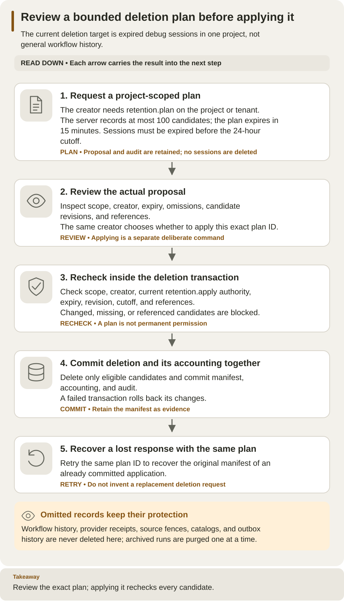

<!--
Copyright 2026 Firefly Software Foundation.

Licensed under the Apache License, Version 2.0 (the "License");
you may not use this file except in compliance with the License.
You may obtain a copy of the License at

    http://www.apache.org/licenses/LICENSE-2.0

Unless required by applicable law or agreed to in writing, software
distributed under the License is distributed on an "AS IS" BASIS,
WITHOUT WARRANTIES OR CONDITIONS OF ANY KIND, either express or implied.
See the License for the specific language governing permissions and
limitations under the License.
Author: Firefly Software Foundation
SPDX-License-Identifier: Apache-2.0
-->

# Retention and bounded maintenance

Weave retains workflow history, execution identities, and provider fences because
later retries and reconciliation depend on them. The maintenance API currently
supports one deletion target: **expired debug sessions**. It does not implement
automatic deletion of workflow history, deduplication receipts, provider sources,
Teams references, WhatsApp status facts, catalog versions, or outbox history.
Returned plans explicitly list those omitted resource classes and their reasons.



The left lane is the operator decision; the right lane is the server transaction boundary. Review and apply are separate steps. The result can contain both deleted and blocked candidates, and omitted resource classes remain retained.

[Open diagram at full size](../diagrams/operations-retention.svg)

## Choose the maintenance target

Use this procedure when you intend to remove eligible old debug sessions from
one project. It will not solve a quota exhausted by retained runs, provider
receipts, or other omitted data. First identify the constrained resource using
capabilities/usage and [operational policy](configuration.md#operational-policy).

The sequence is **plan → inspect → apply → inspect the result**. Planning writes
an immutable proposal; applying deletes only eligible candidates from that
proposal. Do not put the apply command in an unattended copy-and-paste block with
plan creation.

## Inspect a project and create a plan

Prerequisites: a running API, a linked active identity, project-scoped
`retention.plan` authority, and the `client` extra. Configure `WEAVE_BASE_URL`,
`WEAVE_TENANT_ID`, `WEAVE_PROJECT_ID`, and your protected authentication settings
as described in [CLI remote operations](../reference/cli.md#remote-authoring-and-operations).
Use a current `WEAVE_ACCESS_TOKEN` from the trusted provider or the CLI's configured
login/credential store. In a standalone installation, the tenant and project IDs
come from `first-run.json`; `WEAVE_BASE_URL` is the API origin selected there.
`WEAVE_PYTHON` below is the absolute path to your installed client-capable Python
environment, as set by the standalone guide. Retention uses
project scope, so omit the environment identifier. Creating a plan stores its
immutable metadata and an audit record; it does not delete debug sessions.

Write a request to a new file in your private working directory:

```json
{"target":"expired_debug","limit":100}
```

Save it as a new `retention-request.json` in your private working directory and
run the following from that directory. The path passed to `--request` names the
JSON file you just created; it is not the server's eventual plan ID:

```sh
env -u WEAVE_ENVIRONMENT_ID "$WEAVE_PYTHON" -I -m firefly_weave.cli.main retention plan \
  --request retention-request.json --output json
```

Inspect the returned `id`, `scope`, `principal_id`, `created_at`, `cutoff`,
`expires_at`, `candidates`, `omissions`, `complete`, and `next_cursor`.
An empty `candidates` list is a valid result, especially on a new installation;
there is nothing to delete. Confirm `scope` and `principal_id` identify the project
and operator you intended before proceeding.
Only sessions whose expiration predates the server's cutoff are selected.
The cutoff is 24 hours before plan creation; live sessions and recently expired
sessions are excluded. A selected session with a retained reference appears as
`referenced` and is not eligible for deletion.

Each plan contains at most 100 candidates and expires after 15 minutes. When
`complete` is false, request another page using its `next_cursor` as `after`:

```json
{"target":"expired_debug","limit":100,"after":"UUID_FROM_NEXT_CURSOR"}
```

Replace the placeholder with the actual returned UUID. Each page creates a
separate immutable plan with its own creation time, cutoff, and expiry; pages
are not one global database snapshot. The server also limits retained plans to
10,000 per project and unexpired plans to 100. Repeated planning consumes retained
metadata capacity, so create plans for maintenance you intend to review.

## Apply only a reviewed plan

Only the identity that created the plan can read or apply it. That identity must
still be active and have current `retention.plan` authority to read the plan and
`retention.apply` authority to apply it. Use the exact plan ID returned by the server:

```sh
env -u WEAVE_ENVIRONMENT_ID "$WEAVE_PYTHON" -I -m firefly_weave.cli.main \
  retention read PLAN_UUID --output json
```

After reviewing the stored plan and deciding to delete its eligible sessions,
run apply separately:

```sh
env -u WEAVE_ENVIRONMENT_ID "$WEAVE_PYTHON" -I -m firefly_weave.cli.main \
  retention apply --plan-id PLAN_UUID --output json
```

Replace `PLAN_UUID` with the real UUID. The apply command reads and displays the
stored plan as JSON on stderr before applying it, without another confirmation.
A failed plan read prevents apply; stdout contains only the final result or problem.
Applying the plan is destructive for the
eligible debug sessions. The server accepts a plan ID, not caller-selected
deletion IDs. It rechecks scope, creator, plan expiry, session revision, the
original cutoff, and retained references in the same transaction as deletion.
A changed, missing, or referenced candidate appears in `blocked`. Other eligible
candidates can be deleted in that transaction; the returned manifest records
`deleted` and `blocked` explicitly.

The manifest, accounting changes, and audit record commit atomically. A failure
rolls back the operation. Repeating application of a committed plan as its
original authorized creator returns the original manifest. It does not select
new candidates or repeat deletion. A new maintenance attempt needs a new plan.

Do not delete protected records directly with SQL to resolve a quota error.
The maintenance API's omissions are intentional: removing a receipt or fence
can make an old delivery appear new. Retained workflow and provider data require
a separately defined lifecycle; this release provides no general purge command.

## Read the result and handle interruptions

| Result or failure | Meaning | Operator action |
| --- | --- | --- |
| IDs in `deleted` | Those eligible sessions were deleted in the committed application | Retain the manifest as maintenance evidence |
| IDs in `blocked` | A candidate changed, is referenced, or is no longer eligible | Inspect the reason/state; do not remove the guard with SQL |
| Plan unavailable | Wrong scope/creator, expired plan, or unavailable ID | Check the original receipt and current identity; create a new reviewed plan if needed |
| Lost response after apply | The client cannot establish whether the transaction committed | Retry the same plan as the same authorized creator to recover the committed manifest |
| Capacity denial while planning | The project has reached a plan or operational bound | Inspect retained usage; repeated planning will not free capacity |

Keep the same project scope throughout. A pagination cursor selects the next
candidate page; it is not an authorization token or an apply plan ID.

## Capacity and storage

[Operational policy](configuration.md#operational-policy) bounds logical retained
usage and active work. Ending a run or expiring a debug session can release active
capacity while its retained bytes remain charged. Debug-session admission also
reserves its bounded session capacity. Expired reservations are released by the
server's admission checks; expired retained session data remains until eligible
maintenance removes it.

Logical accounting measures serialized data and allocation metadata. It is not
PostgreSQL disk usage and does not reclaim database files, indexes, WAL, or backups.
Manage physical storage and backup retention separately. Use
[observability](observability.md) for operational signals and
[backup and restore](backup-restore.md) before maintenance requiring a restorable
copy.

## API and SDK equivalents

All operations use `/api/v1/tenants/{tenant}/projects/{project}/operations/retention`:

| Action | Method and suffix | SDK method |
| --- | --- | --- |
| Create plan | `POST /plans` | `plan_retention(RetentionRequest(...))` |
| Read plan | `GET /plans/{id}` | `read_retention_plan(id)` |
| Apply plan | `POST /plans/{id}/apply` | `apply_retention(id)` |

Use the typed [SDK](../reference/sdk.md) with a project scope. CLI, SDK, and HTTP
share the same authorization and response contracts.
