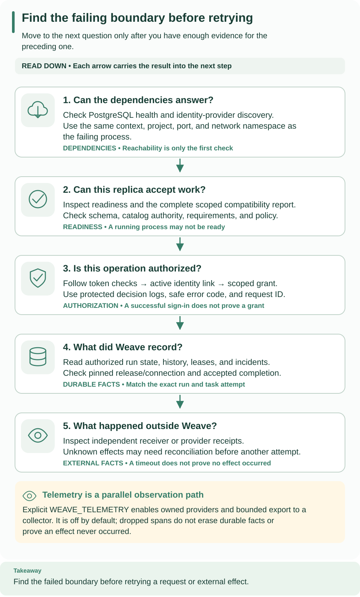

<!--
Copyright 2026 Firefly Software Foundation.

Licensed under the Apache License, Version 2.0 (the "License");
you may not use this file except in compliance with the License.
You may obtain a copy of the License at

    http://www.apache.org/licenses/LICENSE-2.0

Unless required by applicable law or agreed to in writing, software
distributed under the License is distributed on an "AS IS" BASIS,
WITHOUT WARRANTIES OR CONDITIONS OF ANY KIND, either express or implied.
See the License for the specific language governing permissions and
limitations under the License.
Author: Firefly Software Foundation
SPDX-License-Identifier: Apache-2.0
-->

# Troubleshoot a Weave platform

Use this page when something on a running platform does not work and you need to
find out where it fails before you change anything. It is written for operators
and administrators. You need access to the terminals or containers that run the
platform, and a saved platform or token to make authorized requests. Most
diagnoses take a few minutes once you know which stage failed.

**Diagnose with safe evidence.** Start from the safe support code, the
server-issued request ID, and the current scope. Never paste provider response
bodies, tokens, connection strings, or private environment files into logs or
reports. For durable evidence, use [history and replay](../reference/history-and-replay.md)
and [incident operations](../reference/incident-operations.md).

## Start with the right guide

Many problems have a dedicated troubleshooting section closer to the task:

| Where the problem shows up | Go to |
| --- | --- |
| Connecting or signing in from the CLI | [Connect the CLI: if something goes wrong](../guides/connect-to-api.md#if-something-goes-wrong) |
| Studio connection, pairing, or editor | [Fix a connection problem](../guides/studio.md#fix-a-connection-problem) and [when a step does not work](../guides/studio.md#when-a-step-does-not-work) |
| The desktop app | [Desktop: if something goes wrong](../guides/desktop.md#if-something-goes-wrong) |
| The local platform from `weave platform` | [Local platform troubleshooting](../guides/local-platform.md#troubleshoot) |
| Identity provider, sign-in settings, or access denials | [Troubleshoot sign-in and access](identity-and-secrets.md#troubleshoot-sign-in-and-access) |
| A REST API called without code | [Call a REST API without code: troubleshoot](../connectors/http-without-code.md#troubleshoot) |
| The API stops at startup with a configuration error | [Troubleshoot configuration](configuration.md#troubleshoot-configuration) |
| Metrics or traces are missing | [Observability](observability.md#disable-or-troubleshoot) |
| A run is stuck, failed, or has an uncertain external effect | [Incident operations](../reference/incident-operations.md) |

Use the rest of this page when you do not know yet which stage fails.

## Locate the failing stage first



Begin at the first card you have not verified and work down. The numbered stages
below follow the same order: card 1 is stage 1, card 2 covers stages 2 and 3,
and cards 3 to 5 are stages 4 to 6. A successful earlier stage does not prove a
later one: readiness does not establish authorization, task completion, or
provider delivery.

[Open diagram at full size](../diagrams/operations-evidence.svg)

Work through these stages in order, without rerunning provisioning:

1. **Dependencies.** PostgreSQL and the identity provider (Keycloak on a local
   installation) are running, under the expected Docker context and project when
   you started them with Docker, and answer their health and discovery checks.
2. **API startup.** The API terminal or container log shows no startup error. A
   schema rejection needs explicit migration diagnosis; a database authority
   rejection needs the correct nonowner runtime configuration.
3. **Readiness.** `/health/ready` answers on the port of the API you actually
   started. A reserved port is not evidence of a running API.
4. **Identity and scope.** Tell a failure to obtain a token apart from a Weave
   denial, then check the identity link and the grants for the exact scope IDs.
5. **Execution.** When admission succeeds but a run does not complete, inspect
   the run, its pinned release and connection, worker state, and incident
   history.
6. **External result.** Inspect independent receiver or provider receipts before
   you decide whether a timed-out effect is safe to retry.

### Check stages 1 to 3 on the local platform

```sh
# Read the saved stage and probe API and identity readiness; nothing is changed.
weave platform status
```

Expected: `Api ready: True` and `Identity ready: True`. Run it from the same
checkout; if you chose a custom installation directory, pass it before the
command, as in `weave platform --directory DIR status`.
`Api ready: False` means the API terminal stopped or is still starting; read that
terminal first. For other messages, see the
[local platform troubleshooting table](../guides/local-platform.md#troubleshoot).

### Check stages 1 to 3 on the standalone installation

From the repository root, in the standalone operator terminal, this read-only
command lists only the selected local supporting services. It needs the original
standalone environment and does not create a replacement project:

```sh
# List this installation's PostgreSQL and Keycloak containers and their state.
docker --context "$WEAVE_DOCKER_CONTEXT" compose --project-name "$WEAVE_LAUNCH_ID" \
  --env-file "$WEAVE_WORK_DIR/postgres.env" --env-file "$WEAVE_WORK_DIR/identity.env" \
  -f compose.yaml -f compose.identity.yaml ps
```

Expected: the `postgres` and `keycloak` services are running. Then repeat the
standalone PostgreSQL health and Keycloak discovery checks, and check readiness
from the same terminal:

```sh
# Probe readiness of the foreground API without sending credentials.
"$WEAVE_PYTHON" - <<'PY'
import os, httpx
url = "http://127.0.0.1:" + os.environ["WEAVE_API_PORT"] + "/health/ready"
try:
    response = httpx.get(url, timeout=5, trust_env=False)
except httpx.HTTPError:
    raise SystemExit("API readiness endpoint is unreachable; check the selected port and API process") from None
print("Readiness HTTP status:", response.status_code)
PY
```

Expected: `Readiness HTTP status: 200`. The foreground API uses
`WEAVE_API_PORT`; the optional container API uses `WEAVE_CONTAINER_API_PORT`. An
unreachable endpoint points first to startup or routing; a status other than 200
from the intended API calls for its startup and compatibility diagnostics. Do not
publish a full environment dump to explain either case.

## Match the symptom to its boundary

| What you see | Why | What to do |
| --- | --- | --- |
| Validation succeeds but no artifact exists | `partial` validation without a catalog is expected | Compile with the catalog input and read the compiler diagnostics |
| Native OpenAPI or remote client import fails | The base compiler intentionally omits runtime dependencies | Install the `openapi` or `client` extra from the locked framework provenance |
| The server rejects the schema | Startup never migrates or repairs an incompatible database | Install the packaged migrations and run them with explicit migration authority; see [upgrades](upgrades.md) |
| Readiness stays restricted | Scheduler catalog credentials, the compatibility report, the policy fingerprint, or retained requirements block it; disabling the scheduler does not bypass the startup inventory | Follow [start and inspect compatibility](upgrades.md#start-and-inspect-compatibility) |
| Work admission reaches capacity | Admission limits are separate from physical disk space | Inspect the authorized usage and capabilities response, retained records, and configured limits; read [retention](retention.md) before maintenance |
| The collector receives no telemetry | Export is disabled by default and needs an exact signal URL | Check `WEAVE_TELEMETRY`, the URL, collector TLS and authentication, and the network namespace; see [observability](observability.md) |
| A remote command prints `WV-CLI-CONFIG` | No saved platform is selected and no `--base-url` was given | Run `weave auth setup SERVER`; see [configuration](configuration.md#client-environment-variables) |
| A verified token receives a denial | Authentication and authorization are separate | Check the exact issuer, audience, client, and token purpose, then the identity link and active scope grants; see [identity](identity-and-secrets.md#troubleshoot-sign-in-and-access) |
| A Keycloak template change has no effect | Realm import skips retained realms | Apply the change additively to the existing realm; do not reset it |
| A workflow cannot activate | Compilation does not provision execution resources | Check the connection revisions, worker or connector releases, grants, and the pinned catalog |
| A worker completion is rejected as stale | The lease generation, heartbeat, or deadline moved on | Read the recovery history; never retry a completion with fabricated authority |
| A provider receipt is ignored or conflicting | Deduplication is source-local, and conflicting facts are not a new event | Compare the source identity, the recognized update class, and the receipt facts |
| A provider send times out | The effect may be unknown, and an automatic retry can duplicate it | Establish whether dispatch occurred and what the connector's outcome contract says; see [incident operations](../reference/incident-operations.md) |
| Replay reports incomplete evidence | Redacted or omitted historical payloads, or a retained event prefix | Keep the result as incomplete; never convert it into a successful replay |
| Setup says output already exists | Setup scripts refuse to replace earlier output | Reuse a complete existing configuration, or investigate the retained attempt |
| A worker container exits after a short successful run | The example has a finite invocation and no automatic restart policy | Check token lifetime, drain budget, and exit state; follow [restart](deployment.md#restart-a-stopped-local-deployment) |
| A worker cannot reach the API or receiver | Host loopback is not container loopback; the generated worker deployment adds no Linux host-gateway mapping | Check the API bind address, the receiver terminal, and the container-visible host address |
| A container runs but no task completes | Container liveness is not worker readiness | Check the admitted release, the current scoped worker grant, the activation pin, and the actual run state |
| A restart ignores a changed env file | Docker restart and `up --no-recreate` do not load changed env files | Replace the container deliberately; see [apply a configuration change](configuration.md#apply-a-configuration-change) |
| A restored installation rejects old source connections | The restore helper deliberately leaves the source fenced | Check `trial.json` and `restore.json`, and select only the intended restored target; see [backup and restore](backup-restore.md) |
| A local test backend is missing | Requested backend gates fail instead of silently skipping | Check the fixture prerequisites and the explicit context, ports, and owned resources |

For connector-specific admission and outcome rules, read
[Teams](../connectors/teams.md), [WhatsApp](../connectors/whatsapp.md),
[Telegram](../connectors/telegram.md), [Kafka](../connectors/kafka.md),
[PostgreSQL](../connectors/postgresql.md), and
[HTTP and webhooks](../reference/http-and-webhooks.md). For fenced recovery into
a separate database, use [backup and restore](backup-restore.md), and keep the
original database and private recovery evidence until the restored service has
been verified.

## Collect a useful incident report

Record:

- the installed artifact version or hash;
- the safe support code and the server-issued request ID;
- the operation, the affected scope and run IDs, and the approximate time;
- which stage failed, whether the request was accepted, whether an external
  effect may have happened, and which durable evidence you inspected.

Keep detailed receipts and logs in protected storage, and share only what the
authorized scope may see.

**Do not turn uncertainty into a destructive reset.** Recreating a realm,
deleting a volume, editing schema markers, or fabricating a successful completion
removes evidence without establishing the cause. Use the procedure for the failed
boundary, preserve partial state, and repeat the smallest relevant verification
after the correction.

## Next steps

- Resolve uncertain runs deliberately with [incident operations](../reference/incident-operations.md).
- Turn on metrics and traces with [observability](observability.md).
- Check compatibility after a change with [upgrades](upgrades.md).
