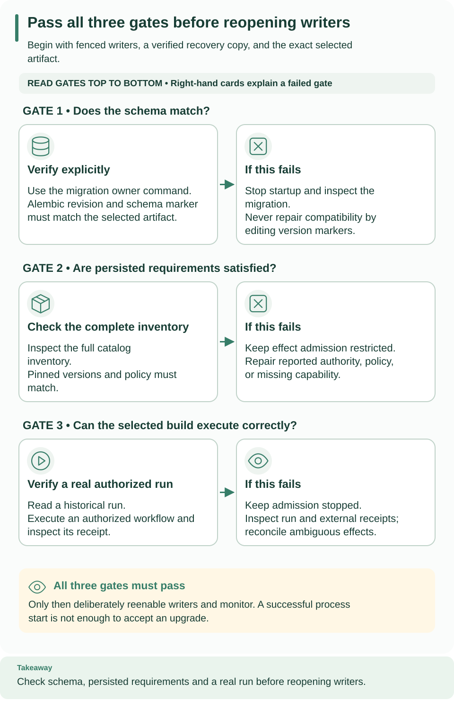

<!--
Copyright 2026 Firefly Software Foundation.

Licensed under the Apache License, Version 2.0 (the "License");
you may not use this file except in compliance with the License.
You may obtain a copy of the License at

    http://www.apache.org/licenses/LICENSE-2.0

Unless required by applicable law or agreed to in writing, software
distributed under the License is distributed on an "AS IS" BASIS,
WITHOUT WARRANTIES OR CONDITIONS OF ANY KIND, either express or implied.
See the License for the specific language governing permissions and
limitations under the License.
Author: Firefly Software Foundation
SPDX-License-Identifier: Apache-2.0
-->

# Upgrade a platform safely

Use this page to move a running Weave platform to a new server artifact: migrate
its database, check that retained work is still supported, and reopen traffic
only after a real run succeeds. It is written for operators. You need a
maintenance window, a verified recovery copy of the database, explicit migration
credentials, and the exact new artifact. Plan for the downtime of your slowest
step, usually the backup.

**Starting an API never migrates its database.** Weave uses explicit forward
migrations, and it checks persisted requirements before it admits
effect-producing work. Both Alembic's revision and Weave's own schema marker
must match the installed artifact. Installing or upgrading the CLI, Studio, or
the desktop app never migrates a platform.

| Version | Schema revision | What the upgrade involves |
| --- | --- | --- |
| alpha4 | `0021_operations` | Earlier baseline |
| alpha5 | `0025_run_lifecycle` | New migrations for human tasks, email, run filters, and execution lifecycle state |
| alpha6 | `0025_run_lifecycle` | macOS packaging correction; no new migration |
| alpha7 | `0025_run_lifecycle` | No new migration; adds optional server settings for [published sign-in](#after-the-upgrade-clients-and-sign-in) and the executor `build` field, whose default `image` keeps existing executor configuration valid |
| alpha8 | `0028_files` | Adds decision-table artifacts, separate Weave AI configuration, file metadata/chunks/retention, and new scoped file and assistant roles. Existing grants do not automatically gain these roles. |
| alpha9 | `0028_files` | No new schema migration. Adds guided AI configuration and renewable worker OAuth2 authentication. |
| alpha10 | `0028_files` | No new schema migration. Restores Weave AI access through the Studio host; explicit selection supersedes pending canvas fitting, and initial empty fields no longer steal focus. |
| alpha11 | `0028_files` | Studio AI setup wizards and explicit same-execution shared AI context; no server behavior or schema change. Updating the local Studio host and assets does not require redeploying an alpha10 server. |
| alpha12 | `0030_worker_presence` | Adds scoped deployment Operations persistence, runner fencing and reconciliation, and worker presence/drain state. Explicitly migrate the server before using Operations; new roles are never granted automatically. Provider credentials stay on separately operated runners. |
| alpha13 | `0030_worker_presence` | No new schema migration. Workers retry explicit capacity rejections while they read task context or credentials, and an Agentic preparation timeout before provider execution counts as not started. Upgrade the Agentic and Files workers to 0.1.5 together with the server. |
| alpha14 | `0030_worker_presence` | No new schema migration. Adds the detached Docker development platform (`weave platform up`); existing foreground installations keep working and are never converted. The Agentic and Files workers 0.1.6 pin this server version. |
| alpha15 | `0030_worker_presence` | No new schema migration and no role change. Upgrade CLIs and SDKs together with the server, review native executor `capacity` and the legacy private-network settings before restarting, and finish runs that use text templates before any rollback to alpha14; see [what changes in alpha15](#what-changes-in-alpha15). The Agentic and Files workers 0.1.7 pin this server version. |
| Unreleased | `0031_operations_facts` | Adds [scoped operational fact storage](#operational-fact-storage), a bounded historical backfill, and reserved capacity for terminal fact updates. |



Read the three gates from top to bottom. Each left card says what to verify; the
card on its right says what to do when it fails. A completed migration passes
only the first gate: retained requirements and a real authorized run still need
evidence before you reopen writers.

[Open diagram at full size](../diagrams/operations-upgrade.svg)

### A local platform has no in-place upgrade

**A local platform from `weave platform` has no in-place upgrade.** It records
the CLI version and the checkout that created it. Every `weave platform`
command refuses another version with `Use this installation's original
directory and matching CLI version.`, and a modified checkout with `The source
checkout has changed. Restore its original content before resuming this
installation.` Keep using the CLI and checkout that created it, or clone the new
release into a new directory and run `weave platform setup` there. That creates
a separate installation with its own data. The rest of this page applies to the
[manual local installation](../guides/standalone.md) and to deployments.

## Understand the upgrade boundary

An upgrade has three independent checks:

1. **Schema.** The new artifact can read the database schema.
2. **Retained requirements.** Its installed capabilities satisfy every retained
   execution requirement. Workflows may still reference an older admitted worker
   release or connector version that the new deployment must keep supporting.
3. **Execution.** Real work runs successfully after the restart.

A completed migration proves only the first. Use a maintenance window for the
whole procedure. The local walkthrough can rehearse these steps, but its guarded
restore helper is not a production backup system. For production, use a verified
environment-specific backup and restore procedure, and account for external
effects that happened after the backup.

## Prepare the upgrade

1. **Record what runs today.** Note the running wheel hash, dependency lock,
   image identities, schema revision, and private configuration locations. Keep
   the previous artifact.
2. **Stop every writer.** Inventory APIs with schedulers, native executors,
   remote workers, provider dispatchers, broker consumers, and outbox
   dispatchers. Stop admission and fence them before database maintenance. For
   the manual local installation, follow
   [step 1 of backup and restore](backup-restore.md#1-stop-and-fence-all-source-writers);
   on Kubernetes, [maintain the deployment deliberately](kubernetes.md#8-maintain-the-deployment-deliberately).
3. **Make a recoverable copy.** For the owned standalone installation, follow
   [backup and restore](backup-restore.md). For other deployments, use the
   environment-specific verified recovery procedure. Preserve the source database
   and external effect receipts.
4. **Rehearse.** Install the exact new artifact in a separate environment and
   rehearse the migration against a restored copy, with the same connector
   packages and operational policy as the target deployment.
5. **Provide explicit migration authority.** Runtime application and scheduler
   credentials are separate nonowner identities and cannot replace it. The
   operations migration provisions narrowly privileged function ownership and
   rejects an unrecognized or privileged existing owner role.

Never run mixed schema versions against the same mutable database. The server
performs exact schema checks, not rolling schema negotiation.

## Apply packaged migrations

Run this stage in the operator terminal while writers are stopped. Select the new
installed interpreter, not whichever `python` or source checkout happens to be on
`PATH`. On a restored local rehearsal, the target URLs are in that attempt's
`target.env`; the original `runtime.env` still refers to the fenced source.
Confirm which database you selected before you migrate.

Load `WEAVE_MIGRATION_DATABASE_URL` from protected deployment configuration;
never print it or pass it to runtime containers. Then run:

```sh
# Apply the packaged migrations with the new artifact's own interpreter.
"$WEAVE_PYTHON" -I -m firefly_weave.persistence.migrations
```

Expected: `Weave schema is current`, printed only after both schema markers were
checked. `WEAVE_PYTHON` is the Python executable of the new installed
environment; `"$WEAVE_PYTHON" -I -m firefly_weave.cli.main admin migrate` runs
the same migration. Without `WEAVE_MIGRATION_DATABASE_URL`, or on any failure,
the command stops with `Migration failed; verify PostgreSQL connectivity and
schema compatibility`.

If you lower operational quotas at the initial migration, supply the same
`WEAVE_OPERATIONS_POLICY` JSON to the migration and to every runtime process.

**Migrations are transactional and serialized.** Investigate a failure against
the retained database and protected logs; never change version rows to bypass
it. Destructive downgrades are unsupported. Returning to an older runtime needs a
compatible, separately restored database and reconciliation of any external
effects since its backup.

**The operational policy has a persisted fingerprint.** Every replica must use
the same policy as the database. Rerunning an already-current migration is not a
policy update, and this release has no in-place policy-change operation: a
mismatch leaves the runtime restricted. Never rewrite the fingerprint or counters
by hand to force readiness.

## Run list and timeline compatibility

The server now serves run summaries and step timelines. `runs.list` changes its
default to `started_desc`, with `started_asc` and `updated_desc` also available.
Clients that continue a legacy v1 cursor must send `order=id` and retain its
original filters. New filters bind ID cursors to the normalized query; time
orders use v2 cursors. Restart pagination after changing filters or order.

The update-time order is a live view: a later update can move an item between
pages. Refresh from the first page to see the latest ordering. Unknown historical
times sort last and are never replaced by the fact projection's creation date.
Restored runs reappear even though their archive lifecycle record is retained.

Old runs may have incomplete timelines. The server reads their missing author
step metadata in batches of 500, retaining only the requested page candidates.
A request stops after 100,000 keys or two seconds with `429 WV-RUNTIME-LIMIT`;
the time budget can be reached first. Synthetic control instances do not count
toward completeness or the key cap. Step outputs remain optional and classified.
`runs.logs` still answers authorized requests with `501 WV-UNAVAILABLE`.

## Operational fact storage

The `0031_operations_facts` migration adds five scoped operational projections
and two bounded traversal cursors. It does not add columns to stored runs or
events. Apply it explicitly with all writers stopped, using the procedure above.

The migration holds schema locks in one transaction and reads retained runs in
UUID order, at most 10,000 IDs per batch. Its history work is proportional to the
number of runs and events. Classification fetches one bounded run at a time;
event timestamps are aggregated per batch. Allow temporary disk space for all
five projections, their indexes, and transaction/WAL overhead. Rehearse against a
restored copy to measure the maintenance window: measured 10,000-, 200,000- and
1,000,000-run deployment durations are not yet available.

Historical run times come from accepted events. Missing, malformed or oversized
evidence remains unavailable, and malformed lifecycle values remain unknown
instead of being labeled as queued. A run requiring an unsupported IR version or
language feature keeps that separate classification. Historical origins remain
unknown unless an explicit start, retry or matching start receipt proves them.
Signal delivery receipts do not establish how a run started. Historical step
and task times are not invented, and older workers have an unknown registration
time and empty identity until observed. Each run projection records when its
coverage began.

The new facts count toward ordinary storage usage. Active executions reserve
additional capacity for bounded terminal fact updates, including allocation
provenance. Backfill inventories retained data without granting extra admission
capacity: a platform already above a quota can still migrate, but new work must
satisfy the unchanged quotas. Purging an authorized archived run also removes
its run, step, task and incident facts; deleting a worker removes its facts.
The two cursor tables hold only one row per tenant or environment and have no
business payload or retained history.

## Start and inspect compatibility

Remove the migration credentials from the runtime environment, then start the
new artifact with its application and execute-only catalog and scheduler
identities. The startup inventory needs catalog authority even when
`WEAVE_SCHEDULER_ENABLED=false`.

**The application and catalog URLs must name the same database.** They need the
same driver, host, port, database, and query options; only their credentials
differ. Use the same host spelling in both, even when several DNS aliases reach
the same server. The catalog login keeps its execute-only scheduler authority,
without business-table or column grants.

Compatibility checks examine retained runs, activations, worker releases,
connector requirements, provider requirements, and the operational policy. Exact
persisted versions and pins matter: an online worker is not a substitute for a
compatible admitted release. Missing authority or an incomplete inventory never
counts as a successful check.

**Read the report from the CLI.** Compatibility is a project-level operation, so
it uses the tenant and project of your [saved platform's](../guides/connect-to-api.md)
workspace and ignores the environment. Reading needs `status.read` (the `viewer`
role) and a fresh scan needs `compatibility.check` (the `operator` role), granted
on the project or tenant; an environment-level grant does not cover them. The
`viewer` and `operator` grants that `weave platform user` and the first-run
helper create are on the environment, so ask a
[tenant administrator](../guides/people-and-access.md) for a project grant
first.

```sh
# Read the current report for the project of your saved workspace.
weave compatibility read --output json
# Ask the server for a fresh scan of the same project.
weave compatibility check --output json
```

Expected: one JSON report with `policy`, `mode`, `complete`, `inspected`,
`checked_at`, `findings`, and `findings_truncated`. A healthy upgrade reports
`"mode": "ready"`, `"complete": true`, and no findings. In a script, use
[explicit mode](../guides/connect-to-api.md#scripts-and-ci-explicit-mode)
instead: `--base-url` with the restarted API origin, `--tenant` and `--project`,
and a current `WEAVE_ACCESS_TOKEN`. For a standalone rehearsal, take the scope
IDs from `first-run.json`; never invent IDs or reuse an expired token.

Findings are filtered to the authorized project, with safe global inventory
conditions retained; no other project's resource identifiers appear. A
truncated or incomplete report is not evidence of full compatibility.

**The server also rescans by itself.** Each process requests a compatibility
rescan every 60 seconds. Automatic and explicit scans share one reservation, so
an automatic scan that would overlap is skipped instead of queued. A scan
classifies retained items in its own reserved execution slot, so a burst of API
requests cannot make it fail. A failed scan leaves the process restricted until
a later scan succeeds, and catalog cleanup must succeed before readiness
returns. A rescan that confirms a ready process keeps it ready while it releases
its catalog connection; if that cleanup fails, readiness is withdrawn. While the
process is restricted, refused changes answer HTTP 503 `WV-COMPATIBILITY` with
`Retry-After` set to the seconds until the next automatic rescan.

When a rescan withdraws readiness, the server logs the warning `Compatibility
rescan withdrew readiness` with the finding kinds and codes and the class of
any error the scan caught, such as `CatalogError WV-OPERATION-CAPACITY`. The
warning never includes error messages or connection details.

The capabilities response also reports the effective policy, fixed server
ceilings, the supported worker convention, and a small readiness projection. An
older server may omit this declaration; omission does not imply readiness.

| Finding | What to do |
| --- | --- |
| `authority_missing`, `inventory_incomplete` | Repair catalog connectivity or authority and rerun the scan |
| `policy_mismatch` | Restore the policy matching the database; never edit counters or fingerprints |
| `ir_unsupported`, `artifact_invalid` | Inspect the pinned definition and select a compatible artifact; preserve historical bytes. `ir_unsupported` also covers language features the server does not list in `language_features`, for example `text.concat` after a rollback: upgrade the server instead of editing the artifact. Runs in progress that use such a feature [wait for a server that runs it](#runs-that-need-a-newer-server), unless the server predates language features. |
| `action_unavailable`, `connector_unsupported`, `provider_requirement_unsupported` | Restore the exact required release or package, or use an explicit supported migration |
| `worker_protocol_unsupported` | Use a compatible worker and server convention; never relabel an existing release |
| `legacy_policy_blocked` | Inspect historical classification limits; preserve withheld evidence instead of bypassing policy |
| `operational_capacity_blocked`, `capacity_absent` | Inspect retained usage and admission requirements; use authorized maintenance where supported |

**Restricted mode keeps the platform inspectable.** Health and authorized
inspection stay available while new effect-producing work is blocked. Issued
terminal controls remain available within their reserved authority and capacity.
Restricted mode never permits arbitrary execution, and you must not rewrite
retained definitions to silence findings. See
[incident operations](../reference/incident-operations.md) and
[retention](retention.md) for the supported controls.

### Runs that need a newer server

A server that lists `language_features` in its capabilities, but not a feature
that a run in progress uses, cannot run that run. This happens, for example,
after you roll back from a release that added `flow.forEach` to one that did
not. The server leaves the run waiting and records nothing about it:

- It never offers the run's tasks to workers, applies its deadlines, or retries
  its attempts, and it never blocks the run. The run does not hold back the
  deadlines of other runs.
- Compatibility reports the run as `ir_unsupported`, so the server stays
  restricted while the run is in progress. Other runs then advance only through
  cancellation and terminal deadlines, such as overall timeouts, and workers
  cannot claim tasks, renew leases, or report results.
- Reading the run, sending it a signal, or reporting a task result for it
  answers HTTP 422 `WV-IR-UNSUPPORTED` with `result.missing_features`, and run
  lists show it, and incident lists its incidents, as unavailable. Reading its
  pinned definition version answers the same way, and catalog lists show that
  version as an unavailable item with `reason: ir_unsupported` and the same
  `missing_features`. Runs with unavailable legacy evidence still answer HTTP
  409 `WV-LEGACY-UNAVAILABLE`.

Upgrade the server again to resume the run. Deadlines that passed in the
meantime apply then, and an expired lease is recovered like any lost attempt:
an action that is safe to repeat is retried while it has attempts and time
left, and otherwise an incident opens for you to reconcile. Cancelling the run
on the older server records only the cancellation, as for
[runs with unavailable legacy evidence](../reference/incident-operations.md#runs-with-unavailable-legacy-evidence),
and its state stays withheld after you upgrade. To keep a run's full record,
let it finish or cancel it before you roll back.

**A server whose capabilities do not list `language_features` predates
language features.** It cannot recognize such a run, treats it as legacy
evidence, and can block it permanently; a blocked run's tasks are never offered
to workers again, even after you upgrade. Before you roll back to such a
server, let every run that uses a language feature finish, or cancel it.

## Verify before admitting traffic

Perform these checks in order for each project and execution path:

1. **Readiness.** `/health/ready` answers HTTP 200 on the replica that receives
   traffic. If it fails, keep effect-producing admission stopped and read the
   compatibility findings.
2. **Compatibility.** A complete report with `"mode": "ready"`, and a policy in
   the capabilities response that matches the intended deployment. A report
   truncated for response size cannot prove that every requirement was reviewed.
3. **History.** A known historical run and its durable output can still be read.
4. **Execution.** Start the required admitted executor or worker and run a small
   authorized workflow. The [deployment exercises](deployment.md) show concrete
   remote and native checks for the local installation.
5. **External effects.** Verify receiver or provider receipts and telemetry
   through their own interfaces, then reenable the remaining writers deliberately
   and watch recovery.

Do not infer provider delivery from API readiness alone. Keep the prior artifact,
the source database, the backup, and protected migration evidence until the
upgraded deployment and its recovery procedure have been verified.

## What changes in alpha15

Alpha15 adds no schema migration: the head stays `0030_worker_presence`, as in
alpha12 to alpha14, and no role is added or changed. Follow the procedure above
as usual; the migration command reports the schema as current. Then check these
changes before you reopen traffic:

- **Upgrade CLIs and SDKs with the server.** Connection test answers carry a new
  `encrypted` field, `false` for an `http://` connection. CLIs and SDKs from
  alpha14 or earlier cannot read `weave connections test` answers for HTTP
  connections from an alpha15 server. Catalog list pages can also contain a new
  item for a version the server does not run (`unavailable: true`,
  `reason: ir_unsupported`, `missing_features`), and older SDKs and CLIs reject
  such a page.
- **Reads of versions and runs the server cannot run answer 422.** Reading a
  definition version that needs a language feature the server does not list, or
  repeating the publish request that created it, answers HTTP 422
  `WV-IR-UNSUPPORTED` with `result.missing_features` instead of HTTP 409
  `WV-LEGACY-UNAVAILABLE`. Reading a run that waits for an upgrade, sending it a
  signal, or reporting a task result for it answers the same way. Runs with
  unavailable legacy evidence still answer HTTP 409 `WV-LEGACY-UNAVAILABLE`.
  Treat the 422 as "this server is too old", not as lost data.
- **`email_receipts.dispatch` can answer 429.** When Weave refuses the dispatch
  for capacity, the operation answers HTTP 429 (`WV-OPERATION-CAPACITY` or
  `WV-REQUEST-CAPACITY`) with `Retry-After`, where it used to answer HTTP 200
  with state `blocked`. The receipt keeps its state, and the next pending scan
  dispatches it. A script that read `blocked` from that answer should retry the
  429 instead.
- **Native executors run up to their configured capacity.** In-process native
  connector calls no longer share the two execution work slots of API requests.
  Each `WEAVE_NATIVE_EXECUTORS` entry now runs up to its `capacity` at once,
  where before a third concurrent call failed. Before you restart, check that
  each entry's `capacity` is what the connector's destinations can take.
- **Runs wait after a rollback instead of being blocked.** An alpha15 server that
  does not list a language feature that a run in progress uses leaves the run
  waiting until a server that runs it takes over; see
  [runs that need a newer server](#runs-that-need-a-newer-server). Alpha14 and
  earlier predate language features and block such runs permanently. Before you
  roll back from alpha15 to alpha14, let every run that uses `concat` or `join`
  finish, or cancel it.
- **Legacy private-network settings map into the private-origin policy.**
  `WEAVE_HTTP_PRIVATE_NETWORKS`, `WEAVE_MAIL_PRIVATE_NETWORKS`, and
  `WEAVE_POSTGRES_PRIVATE_NETWORKS` (with `WEAVE_POSTGRES_PLAINTEXT_NETWORKS`)
  keep their reach. At startup the API maps each one that is set to "Legacy
  setting" entries of the same policy that a `WEAVE_PRIVATE_ORIGINS_FILE` feeds,
  and logs a `private_origins.legacy` warning that names the setting. Keep using
  these settings in deployments; the private-origin file is what
  `weave platform up --allow-private-origin` writes for the Docker development
  platform. All four are now parsed strictly: a CIDR with host bits set, such as
  `10.0.0.1/8` instead of `10.0.0.0/8`, or more than 128 networks stops the API
  at startup, so check their values before you restart.
- **IR `weave/ir-v1alpha4` appears only with text operators.** A workflow that
  uses `concat` or `join` compiles to `weave/ir-v1alpha4` with a `features`
  list. Every other workflow keeps its IR version and digest, so existing
  activations and pinned artifacts are unaffected. Alpha14 and earlier servers
  refuse v1alpha4 artifacts: publish and activate such workflows only once every
  server that runs them is on alpha15. The capabilities response lists
  `weave/ir-v1alpha4` in `ir_versions` and the features in `language_features`.
- **Compatibility refusals say when to retry.** `503 WV-COMPATIBILITY` answers
  now carry `Retry-After` with the seconds until the next automatic rescan.
- **Workers and local platforms.** The Agentic and Files workers 0.1.7 pin core
  0.1.0a15. A local platform still has [no in-place upgrade](#a-local-platform-has-no-in-place-upgrade):
  set up alpha15 from its own checkout in a new directory.

## After the upgrade: clients and sign-in

Saved platforms, `weave auth setup`, and published sign-in settings arrived in
0.1.0a7. Upgrading a server from alpha5 or alpha6 to 0.1.0a7 adds no migration:
the schema stays at `0025_run_lifecycle`. After the upgrade, check these points:

- **Publish sign-in settings** with `WEAVE_CLIENT_SIGN_IN` and, optionally,
  `WEAVE_DISPLAY_NAME`, so people can connect by typing the server address; see
  [publish sign-in settings](identity-and-secrets.md#3-publish-sign-in-settings-for-people).
  Without them, clients report `WV-CONNECT-NO-SIGN-IN`.
- **Older connection files keep working.** `--auth-config FILE` still works for
  sign-in and remote commands, and `weave auth setup --auth-config FILE` turns a
  file into a saved platform; see
  [older connection files](configuration.md#older-connection-files).
- **A server that predates published sign-in settings** is reported to current
  clients as `WV-CONNECT-INCOMPATIBLE` when someone connects by address; people
  can still use a connection file until you upgrade it.
- **Saved platforms keep what each person reviewed.** If you change the issuer
  or login client, people review the platform again, as described in
  [What clients read from the server](identity-and-secrets.md#what-clients-read-from-the-server).
- **Signing keys without `alg` are now accepted by key type.** The built-in
  verifier uses a JWKS key that omits `alg`, as Microsoft Entra ID publishes
  them, only for the allowed algorithm of its key type: an RSA key for `RS256`,
  a P-256 key for `ES256`. Keys that declare `alg` are checked as before. Unit
  tests cover Entra-shaped keys, and Azure preproduction checks have verified
  real Entra application tokens. Human sign-in remains unverified, as
  [Microsoft Entra ID](identity-and-secrets.md#microsoft-entra-id-human-sign-in-not-verified)
  explains.
- **Local Keycloak realms accept any loopback port.** A local platform still has
  [no in-place upgrade](#a-local-platform-has-no-in-place-upgrade), so set up
  alpha7 from its own checkout. Its realm registers the port-free loopback
  callbacks, and `weave platform start` adds them to a retained realm that lacks
  them, printing `Updated the local Keycloak login client so browser sign-in
  accepts any loopback port.`; see
  [Browser sign-in is refused](../guides/local-platform.md#browser-sign-in-is-refused).

Upgrading the CLI or Studio never rewrites saved platforms it cannot read; such a
file is reported as `WV-PROFILE-STORE`.

## If the upgrade fails

Keep the failed deployment's evidence and stop its writers before you choose a
recovery path. A schema failure belongs to migration diagnosis; a compatibility
finding belongs to the missing authority, policy, or pinned capability that the
report names. Neither is repaired by editing version rows or weakening grants.

**Starting the old wheel against a newly migrated database is not a supported
rollback.** Recover the old artifact with a separately restored compatible
database, choose one active deployment, and reconcile effects that occurred after
that backup before you resume work. See
[incident operations](../reference/incident-operations.md) for ambiguous effects
and [backup and restore](backup-restore.md) for the local source fencing
behavior.

## Next steps

- Make the recovery copy first with [backup and restore](backup-restore.md).
- Check the server variables in [configuration](configuration.md).
- Watch the upgraded platform with [observability](observability.md).
