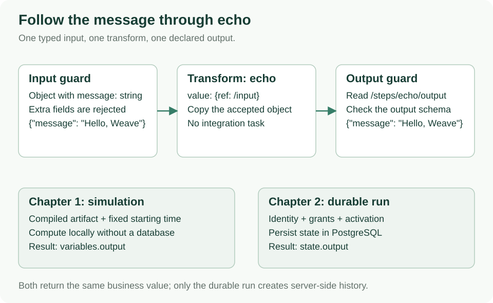

<!--
Copyright 2026 Firefly Software Foundation.

Licensed under the Apache License, Version 2.0 (the "License");
you may not use this file except in compliance with the License.
You may obtain a copy of the License at

    http://www.apache.org/licenses/LICENSE-2.0

Unless required by applicable law or agreed to in writing, software
distributed under the License is distributed on an "AS IS" BASIS,
WITHOUT WARRANTIES OR CONDITIONS OF ANY KIND, either express or implied.
See the License for the specific language governing permissions and
limitations under the License.
Author: Firefly Software Foundation
SPDX-License-Identifier: Apache-2.0
-->

# 1. Write and simulate your first workflow

In this chapter, you will create a workflow that receives a message and returns
that same message. You will see how Weave checks a definition and how to run it in
the local simulator. No API server, Docker, database, or credentials are needed.

**Result:** a successful simulation with `{"message": "Hello, Weave"}` as its
output. This is a local simulation; chapter 2 will create a durable run in PostgreSQL.



Follow the upper row to understand the YAML you will write. The lower row
distinguishes this local simulation from the durable execution in chapter 2.

[Open diagram at full size](diagrams/echo-data-flow.svg)

## Before you start

Use a Bash or Zsh terminal, Git, Python 3.12 or later, and `uv`. Check that the
commands are available:

```sh
git --version
python3 --version
uv --version
```

If a command is missing, follow the official [Git installation](https://git-scm.com/downloads/)
or [uv installation](https://docs.astral.sh/uv/getting-started/installation/) instructions.
`uv sync --python 3.12` can select or download Python 3.12 for the project.
On Windows, use a
Linux shell such as WSL for the shell examples in this tutorial.

Clone the project and install its locked dependencies:

```sh
git clone https://github.com/fireflyframework/firefly-weave.git
cd firefly-weave
uv sync --locked --python 3.12
uv run weave version --output json
```

If you already cloned the repository, enter that directory and run only the
`uv` commands. Every command below runs from this repository's root.
`uv sync` creates the local Python environment; `uv run` runs a command in it.
You do not need to activate a virtual environment or install the sibling PyFly
repository. The final command prints the Weave, language, and intermediate
representation versions as JSON.

## What the CLI does in this chapter

`weave` is the command-line entry point. `uv run` selects the project environment;
`workflow` selects the command family; `validate`, `compile`, and `simulate` select
the operation. File paths are local to your current directory.

```sh
uv run weave --help
uv run weave workflow --help
uv run weave workflow compile --help
```

This chapter uses local authoring commands. After [chapter 2](guides/standalone.md),
follow the [complete CLI tutorial](guides/cli-tutorial.md) to publish, activate,
start, and inspect a real workflow. [Local worker deployment](operations/deployment.md)
and [AWS/Azure/GCP deployment](operations/cloud-deployment.md) explain the separate
process and infrastructure steps. A successful compilation alone deploys nothing.

## Create the definition

A **workflow definition** describes input, ordered steps, and output. Save the
following file by copying the entire command into your terminal:

```sh
mkdir -p .local/tutorial
cat > .local/tutorial/echo.workflow.yaml <<'YAML'
apiVersion: weave/v1alpha1
kind: Workflow
metadata:
  name: echo
  version: 1.0.0
spec:
  inputSchema:
    type: object
    properties:
      message: {type: string}
    required: [message]
    additionalProperties: false
  outputSchema:
    type: object
    properties:
      message: {type: string}
    required: [message]
    additionalProperties: false
  steps:
    - id: echo
      kind: transform
      value: {ref: /input}
  output: {ref: /steps/echo/output}
YAML
```

`.local/` is an ignored directory for your own tutorial files. Repeating the
command above replaces only this tutorial definition, so save personal edits
before repeating it.

Read the definition from top to bottom:

| Field | What it means in this example |
| --- | --- |
| `apiVersion` | The workflow language being used, not the installed package version |
| `kind` | This document defines a workflow |
| `metadata.name` and `version` | A name and immutable published version for the definition |
| `inputSchema` | The input must be an object with one string field named `message` |
| `outputSchema` | The final output must have that same shape |
| `steps` | One step, with the local ID `echo` |
| `kind: transform` | Compute a value inside Weave; no external worker is needed |
| `value: {ref: /input}` | Read the entire workflow input |
| `output: {ref: /steps/echo/output}` | Return the value produced by the `echo` step |

`ref` is a reference to workflow data, not Python code or a filesystem path.
`/input` means the input object; `/input/message` would mean just its message.
The latter is a string and would not satisfy the object output schema above.

## Validate the file

```sh
uv run weave workflow validate .local/tutorial/echo.workflow.yaml --output json
```

The command succeeds and reports `validationOk: true`. It also reports
`partial: true` and `ok: false`. That combination is expected: **validation checks
what it can without a dependency catalog; it does not yet produce executable code**.
This applies even to this small workflow with no external dependencies.

A **catalog** is the set of versioned actions, connectors, schemas, and worker task
contracts available to the compiler. This workflow uses only a built-in transform,
so its complete catalog is empty. Make that explicit:

```sh
cat > .local/tutorial/empty-catalog.json <<'JSON'
{"definitions": [], "tasks": [], "adapters": [], "schemas": {}}
JSON
```

## Compile it into an artifact

Compilation checks the complete definition and its dependencies, then produces an
**artifact**: the validated representation that the runtime or simulator consumes.

```sh
uv run weave workflow compile .local/tutorial/echo.workflow.yaml \
  --catalog .local/tutorial/empty-catalog.json --strict \
  --directory .local/tutorial/compiled --output json
```

Expected: `ok: true`, `partial: false`, and three files:

| File | Purpose |
| --- | --- |
| `.local/tutorial/compiled/compiled-artifact.json` | The compiled workflow with its identity and source information |
| `.local/tutorial/compiled/executable.json` | The executable part of the artifact |
| `.local/tutorial/compiled/catalog.lock.json` | The exact dependencies used for this compilation |

The digest identifies executable content; do not edit the generated artifact to
change behavior. Edit the YAML and compile again. The exporter refuses to replace
existing files by default. On an intentional repeat of this tutorial, add
`--force` to the compile command to replace these three local generated files.

## Simulate one execution

The simulator needs the compiled artifact, an input value, and a starting time.
The example has no integration tasks, so there are no external responses to mock.
Create its request:

```sh
uv run python - <<'PYCODE'
import json
from pathlib import Path

root = Path('.local/tutorial')
request = {
    'artifact': json.loads((root / 'compiled/compiled-artifact.json').read_text()),
    'input': {'message': 'Hello, Weave'},
    'mocks': {},
    'now': '2026-01-01T00:00:00Z',
}
(root / 'simulation.json').write_text(json.dumps(request, indent=2) + '\n')
PYCODE
uv run weave workflow simulate .local/tutorial/simulation.json --output json
```

Expected: `status: "succeeded"`. The JSON includes the accepted events and
variables for the run; `variables.output` is `{"message": "Hello, Weave"}`.
The fixed timestamp makes local simulations reproducible. It does not change your
computer's clock or schedule a live workflow.

Change `Hello, Weave` in the request-generation command and rerun it, then run
`weave workflow simulate` again. The output changes without changing the definition:
you are executing the same workflow with different input.

## Check what you learned

You now have a definition, a compiled artifact, and a successful simulated
execution. They are different things: the YAML describes behavior, the artifact
records the compiled behavior, and an execution applies it to one input.

| If you see… | What to check |
| --- | --- |
| `weave: command not found` | Use `uv run weave` from the checkout root |
| `WV-CLI-READ` | Check the filename and your current directory |
| `partial: true` during validation | Expected without a catalog; use the compile command with the empty catalog |
| An export error on your second compilation | Use a new output directory, or `--force` for these tutorial-generated files |
| A schema/type diagnostic | Check the expected object/string shape and the diagnostic's file, line, and path |

**Next:** [chapter 2 — run a workflow through the API](guides/standalone.md).
It starts real services and stores execution state. To practice a deliberate
validation failure, fix it, and step through a simulation first, follow
[the workflow authoring lab](guides/workflow-authoring.md).
