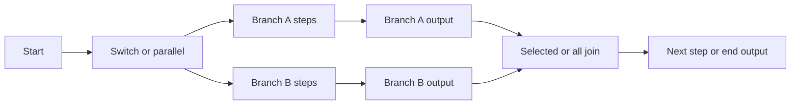

<!--
Copyright 2026 Firefly Software Foundation.

Licensed under the Apache License, Version 2.0 (the "License");
you may not use this file except in compliance with the License.
You may obtain a copy of the License at

    http://www.apache.org/licenses/LICENSE-2.0

Unless required by applicable law or agreed to in writing, software
distributed under the License is distributed on an "AS IS" BASIS,
WITHOUT WARRANTIES OR CONDITIONS OF ANY KIND, either express or implied.
See the License for the specific language governing permissions and
limitations under the License.
Author: Firefly Software Foundation
SPDX-License-Identifier: Apache-2.0
-->

# Pure compiler and artifact boundary

This reference is for editor and runtime integrators. A **compiler** checks a
workflow and turns it into a fixed execution plan, called an **artifact**. It
does not run the workflow. Start with [workflow authoring](../guides/workflow-authoring.md)
for the echo file used below; use the [standalone tutorial](../guides/standalone.md)
when you want a durable run.


Start at the editable source. The left branch checks only part of the contract; the right branch can produce an executable. An error code, semantic path, and source span lead back to a concrete edit. [Open the diagram at full size](../diagrams/authoring-diagnostic-loop.svg).

## Compile the tutorial file in Python

Run this from the checkout root in the installed Weave environment:

```python
from pathlib import Path
from firefly_weave.compiler.api import compile_source, validate_source
from firefly_weave.compiler.catalog import CatalogSnapshot

path = Path(".local/tutorial/echo.workflow.yaml")
source = path.read_text()
partial = validate_source(source, format="yaml", filename=str(path))
print(partial.validation_ok, partial.partial, partial.ok)

result = compile_source(source, format="yaml", filename=str(path),
                        catalog=CatalogSnapshot.empty(), strict=True)
for diagnostic in result.diagnostics:
    print(diagnostic.code, diagnostic.path, diagnostic.source)
assert result.ok and result.artifact is not None
print(result.artifact.digest)
```

The first line prints `True True False`: source checks succeeded, but they did
not produce an executable. Complete compilation prints a 64-character digest
identifying the executable. An empty catalog works because echo uses only a
transform. An Action reference needs its exact declared contracts in the catalog.

| Result | What an authoring tool should do |
| --- | --- |
| `validation_ok=True`, `partial=True` | Show source checks passed; compilation is still required |
| `ok=True`, artifact present | Allow local simulation or submission for server publication |
| Error diagnostics | Show `code`, semantic `path`, and `source` location; keep the user's source editable |
| `truncated=True` | Tell the user additional diagnostics were omitted; do not claim an exhaustive error list |

A diagnostic path points into the parsed definition, such as `/spec/output`.
A source span points to the corresponding file line/column. Preserve both:
editors need source spans, while JSON-based authoring tools need paths. Strict
mode turns complete-analysis warnings into errors; it does not expand the work
performed by partial validation.

## Entry points and result contract

`compile_source(source, *, format, catalog, filename=None, strict=False)` compiles
`str | bytes | JsonObject` in `yaml`, `json`, or `object` format. The explicit
immutable `CatalogSnapshot` supplies exact dependencies. Workflow, Action, and
Connector definitions use the same entry point. No application startup, provider
lookup, credential access, database, network, or worker discovery is performed.

`CompileResult` exposes copied `diagnostics`, `artifact`, `ok`, `validation_ok`,
`partial`, `error_count`, `omitted_count`, `schema_truncated`, and `truncated`.
`ok` means complete compilation produced an executable artifact without errors.
It does not establish live worker availability, connection readiness, release
compatibility, or deployment authorization. Strict mode promotes analysis
warnings to errors. Serialization through `to_bytes()` includes all retained
diagnostics and truncation metadata, even when no artifact is produced.

`validate_source(source, *, format, filename=None)` shares parser, strict outer
contract, embedded schema, and workflow preflight validation with full analysis.
It is the no-catalog authoring entry point for the CLI. It always returns
`partial=True`, `artifact=None`, and `ok=False`; inspect `validation_ok` to show
whether those partial checks passed. Dependency resolution and workflow type,
operand, and dominance analysis require complete compilation. Local schema
references requiring an absent catalog cannot be established in partial mode.
Neither missing dependencies nor a successful partial result produces an artifact.

## Executable and source envelope

`CompiledArtifact` owns canonical immutable bytes. Its `executable` and
`source_map` accessors return fresh copies. `digest` is SHA-256 of RFC 8785 bytes
for the executable alone. `source_hash` identifies original parsed source bytes
(or canonical object input); comments, filename changes, and formatting never
enter executable identity. The source map retains JSON Pointer to source-span
mappings. Diagnostics and their original locations also live in this envelope.

The version is `irVersion: weave/ir-v1alpha1`. `ir.py` defines every node, edge,
control, join, guard, dependency, and executable field as a strict Pydantic model.
`export_schemas()` adds `executable` and `compiled-artifact` to the existing
published contracts. JSON/schema/literal fields retain their intended JSON
containers; graph control fields never use untyped object dictionaries.

Every executable carries kind, source-free metadata, API/IR versions, guards,
a schema table indexed by canonical SHA-256, and sorted exact dependency locks.
Each lock carries kind, reference, digest, and one canonical normalized document.
Action nodes refer to the Action digest; task/connector implementation, retry,
timeout, routing, connection, and side-effect policies remain in that document.
Every resolved identity is retained, including TaskCapability, Adapter, and all
bundled Schema resources. Adapter locks identify declarations, not installed code.
Schema guards and signal nodes reference interned schemas rather than copying
them into each step. Action and Connector executables retain their strict typed
manifest spec and dependencies; they have no invented workflow graph.

## Workflow graph contract for runtime consumers



* `@start` enters the first step, or `@end` for an empty workflow. End evaluates
  the workflow output. Sequential edges have `kind: next` and `branch: null`.
* User step IDs remain stable. Synthetic IDs use the reserved `@` prefix, which
  author step names cannot contain: `@join:<id>` and `@branch:<id>:<index>`.
* Switch case arrays retain declared order; the first true case wins, otherwise
  default runs. Explicit case/default edges name the corresponding branch.
  A switch join uses `mode: selected` and forwards that branch's output.
* Parallel branches sort by name, independent of mapping order. Fork edges name
  branches, `concurrency` carries the declared cap, and `mode: all` collects
  every successful named output into the step's output object.
* Every branch has a `branch-output` node, including empty branches. Its output
  expression runs in the branch's lexical scope. Empty branches enter it directly.
* A scope is an ordered list of owner/branch pairs. Branch-private step values
  remain private; a join publishes only the enclosing step's output.
* Fail nodes have no success edge. A noncompleting branch has no output-to-join
  edge; a noncompleting join has no successor. Unreachable author tail nodes can
  remain present. Consumers must follow edges, not execute the node array order.
* Wait nodes carry timer duration. Signal nodes carry name, timeout, and schema
  reference. Transform/action nodes carry strict existing expression contracts.
* Guards retain semantic pointer and purpose. Consumers match node `path`, input,
  branch-output, or workflow-output paths and validate against `schemaRef` using
  locked Schema resources as the local schema bundle.

`import_artifact(bytes_or_text_or_object, *, limits=ArtifactLimits())` bounds input,
checks supported IR version, strict model/schema invariants, executable/dependency/
schema hashes, unique IDs, referenced nodes, edge kinds, joins, lexical scopes,
branch completion, and acyclic control flow. Joins accept only their own matching
branch-output completion edges; other nodes cannot merge predecessors. Zero
predecessors remain legal for unreachable author tails after failures. Import also
checks direct/transitive TaskCapability, Connector, Adapter, connection-slot,
connector-descriptor, and named Schema-resource reference closure against the
supplied locks. Schema traversal uses the published schema vocabulary, leaving
reference-shaped const/default/enum/example data alone. This checks declared
reference closure without discovering providers or claiming activation readiness;
publication still performs full source/schema/semantic recompilation.
Malformed imports raise `ValueError`
(including `ParseFailure`/Pydantic validation subclasses). It does not authenticate
an artifact or prove source-envelope truth. Publication must recompile submitted
source against server-owned catalog data; a recomputed hash is not authorization.

## Independent resource policies

Source/expression/runtime limits remain `Limits`; embedded author schemas use
`SchemaLimits`; generated outer contracts retain `DEFAULT_CONTRACT_LIMITS`.
Compiler entry points expose these as separate keyword overrides. Complete
compilation also accepts `max_parallel_concurrency` and `artifact_limits`.

`ArtifactLimits` defaults to 33,554,432 bytes (32 MiB), 2,000,000 JSON value nodes,
and depth 128. Limits are strict positive integers and cannot be raised by source.
Construction charges distinct fragments before adding them to aggregate tables,
then measures the entire envelope before canonical serialization. Shared schemas
are interned, and resolved dependency documents appear once per identity. Storage
limits include source maps and diagnostics. These bounds do not promise that every
source fitting 1 MiB fits every downstream policy.

Import uses the same artifact policy, independently of the 1 MiB source/payload
limits. A generated multi-megabyte source map therefore remains importable.
Supplying larger artifact policy overrides requires using those overrides at import
as well. Default 1,000-step and distributed 9,991-expression workflows compile and
round-trip. Canonical fixture bytes live in `tests/fixtures/canonical/`.

## CLI and published catalog contract

[Offline commands](cli.md) call these entry points directly. `CatalogLock` in
`compiler.catalog` publishes the strict lock shape and retains snapshot identity
and digest validation; `export_schemas()` now also includes `catalog-lock`.
Workflow command JSON is the canonical `CompileResult` envelope, including
partial/validationOk/ok distinctions. It is not a second compiler implementation.

The supported expression forms are literal, ref, object, array and op. Operators
are eq/ne/lt/lte/gt/gte, and/or/not, exists and coalesce; arbitrary function calls,
code, imports, secret/environment access and remote references are unsupported.
Comparisons have two operands; not/exists have one (exists requires a direct
reference); and/or/coalesce have at least one. Lazy Boolean/coalesce evaluation
retains missing-vs-null semantics; exhausted coalesce produces null. Numeric
values must be finite IEEE-754, and integer values remain within the inclusive
safe range ±9,007,199,254,740,991. Numeric comparisons do not coerce strings or
Booleans. Exact decimal business amounts should be validated strings. Embedded
schema numeric semantics and the strict-model boundary are detailed in the
[schema profile](schema-profile.md).

## Classified literals and incomplete editing

Publication and imported artifacts enforce the shared secret policy in the
[schema profile](schema-profile.md). Complete compilation remains offline.
Drafts still permit incomplete graph/metadata edits, declaration-only
unresolved schema references, and reference-only bindings that would fail executable
compilation. Mixed bindings containing concrete literals still require classification. A concrete literal/config binding requiring an
unresolved target is rejected with `WV-DRAFT-CLASSIFICATION`; edit that binding
locally until its authorized catalog contract is available. Known marked
schema literals and bindings are rejected through the same classifier used
by execution. This does not require every saved draft to be executable and
does not classify arbitrary unannotated prose. Safe ordinary artifacts retain
their existing canonical digests.

Mixed operator bindings retain visible literal alternatives/operands for
classification, including `coalesce` fallbacks nested in objects or arrays.
The bounded authoring check does not evaluate references or execute operators;
it conservatively checks visible operands at the governed binding location.
A reference-only incomplete draft remains editable, while an embedded known
classified literal cannot be saved, published or imported in an artifact.
