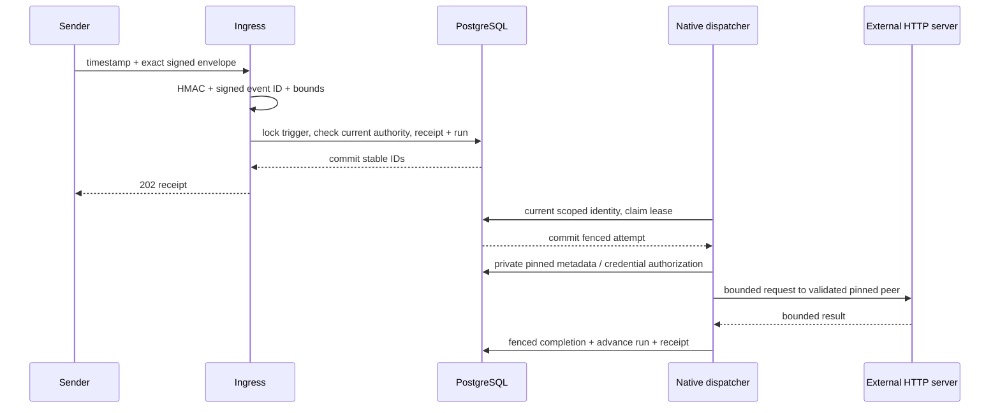

<!--
Copyright 2026 Firefly Software Foundation.

Licensed under the Apache License, Version 2.0 (the "License");
you may not use this file except in compliance with the License.
You may obtain a copy of the License at

    http://www.apache.org/licenses/LICENSE-2.0

Unless required by applicable law or agreed to in writing, software
distributed under the License is distributed on an "AS IS" BASIS,
WITHOUT WARRANTIES OR CONDITIONS OF ANY KIND, either express or implied.
See the License for the specific language governing permissions and
limitations under the License.
Author: Firefly Software Foundation
SPDX-License-Identifier: Apache-2.0
-->

# HTTP connectors and signed webhooks

## Pick the direction you need

An **HTTP connector Action** calls another system while a Workflow runs. A
**signed webhook trigger** accepts an external event that starts a Workflow or
signals an existing run. You can use either independently. Teams, WhatsApp and
Telegram use their own [provider-source ingress](provider-sources.md), not this
Weave HMAC envelope. Generated HTTP APIs use [HTTP profiles v2](../connectors/http-profiles.md);
the installed contract below describes the original v1 adapter.

Before configuring either direction, complete [standalone setup](../guides/standalone.md).
For outbound execution also follow [worker admission](../guides/workers.md) and
[Connector publication/activation](../connectors/authoring.md#from-package-to-an-executable-workflow).
That sequence yields the activation `id` required below.

## Create a signed run trigger

1. Activate a Workflow whose input accepts `{"customerId":"123"}`. Retain the
   activation response's `id` and the full scoped environment URL.
2. Have the operator grant a signing-secret handle, here `customer-events-key`,
   to this scope. Give the sender access to the same signing material through
   its own secure configuration. The handle string is not the signing key.
3. Submit this complete body to `POST /api/v1/tenants/{tenant}/projects/{project}/environments/{environment}/triggers`
   with the scoped bearer credential:

```json
{
  "name": "customer-events", "kind": "run",
  "activation_id": "00000000-0000-4000-8000-000000000001",
  "secret_ref": "customer-events-key",
  "payload_schema": {
    "type": "object", "properties": {"customerId": {"type": "string"}},
    "required": ["customerId"], "additionalProperties": false
  },
  "max_body_bytes": 1048576, "tolerance_seconds": 300
}
```

Replace the activation UUID. Creation returns HTTP 201 with the request fields
plus server-assigned `id`, `principal_id`, and `disabled: false`. Save `id` as the
trigger ID. For a signal route, use `kind: signal`, omit `activation_id`, and
supply the existing `run_id` and declared `signal` name.

4. The sender serializes the envelope below once, computes the signature over
   those exact bytes and its timestamp, and posts them to `/webhooks/TRIGGER_ID`
   with the required headers. This ingress URL is outside `/api/v1`.
5. Expect HTTP 202 and a receipt with `id`, `trigger_id`, `event_id`, `run_id`, and
   optional `signal_id`. Read the linked run's state/history to learn whether
   execution completed; the ingress receipt alone does not establish completion.

For authentication failure, check the granted key, timestamp window, and exact
body bytes before changing the Workflow. A 409 on a repeated event ID means the
bytes conflict with its original delivery; preserve the original body on retry.
A queued downstream Action needs an admitted native worker; a suspended run needs
[incident inspection](incident-operations.md), not another webhook with a new ID.


The installed HTTP adapter uses the existing durable worker lease and recovery engine.
External I/O occurs after a claim transaction commits. Delivery remains at least once;
a timeout after a write is ambiguous. There are no HTTP-library retries.



## Installed HTTP contract

`firefly_weave.connectors.manifest.HTTP_DESCRIPTOR` exports the immutable
`weave-http@1.0.0` Connector manifest, `weave-http` adapter identity, implementation
version, capabilities and release bindings. Publish that exact manifest through the
normal Connector publication API. A tenant cannot replace its schema or acquire the
reserved `weave-connector-*` namespace with an ordinary custom-worker release.

The `read` action permits GET/HEAD and declares `read_only`; `write` permits
POST/PUT/PATCH/DELETE and declares `non_idempotent`. An Action implementation supplies
immutable `config`: `method`, fixed `path`, accepted 2xx `statuses`, and optional
`maxRedirects` (0–5; default 3). Paths use slash-separated ASCII letters, digits,
underscore or hyphen, with an optional trailing slash. Workflow input has only
`query` (string values) and optional JSON `body`; reads reject a body. Input cannot
supply a URL, method or headers. Output is `{status, body}`; response headers are
never returned. Decoded JSON keys and string values are checked for credential echoes;
detected echoes fail without persisting the response.

Connection config is `{baseUrl, auth}`. `baseUrl` is an HTTP(S) origin with no
userinfo, query or path selector; `auth` is `none` or `bearer`. Bearer connections
require exactly `secretRef.token`; anonymous connections have no secret slots. Tokens
must match `[A-Za-z0-9._~+/-]+=*` and contain at most 8192 characters; invalid values
fail before network I/O.
`allowed_destinations` contains explicit origins. Port 0, nonnumeric ports and
out-of-range ports are invalid. Hostnames with a trailing root dot are rejected
consistently in origins and redirects; accepted names retain their HTTP/TLS identity. The Connection administrator can narrow destinations;
only operator `WEAVE_HTTP_PRIVATE_NETWORKS` permits private network CIDRs.
Link-local/metadata addresses, multicast, unspecified/reserved destinations and
Kubernetes service hostnames remain denied even under broad CIDRs.

Each request owns its connection pool. DNS resolves once into validated literals;
actual peers are checked before HTTP writes and TLS verifies the original hostname.
HTTPX uses `trust_env=False`; ambient proxies are ignored. Only identity content
encoding is accepted. The PyFly bounded port caps retained responses; transport reads
are at most 16 KiB, initial headers at most 32 KiB, and the underlying HTTP/1 parser
also has its own bound. Total task deadlines include provider, DNS and network work.
GET/HEAD redirects remain same-origin and revalidate DNS/peers on every hop; writes
never redirect. Cross-origin redirects are rejected even if both origins are allowed,
so credentials cannot migrate to another origin. Trust-store configuration uses the
image's normal CA store; there is no tenant TLS-disable option.

## Release and activation pins

Register an immutable image release with the descriptor's exact capabilities and
`connector_bindings`. Credential access additionally needs the task reference in
`credential_capabilities`, an administrator release/capability/connection grant and
an operator ScopedSecrets grant. The dispatcher does not create these grants.

Activation requests add `connector_release_ids`, mapping Connector version UUIDs
to release UUIDs. Worker-only `worker_release_ids` remain unchanged. The server
snapshots `connector_execution_pins` including Action and Connector digests, version,
adapter implementation, capability digest/reference and release. Scoped SQL foreign
keys back connector/release associations. Runtime task projection resolves only saved
pins; the pure compiler event remains unchanged. Missing/extraneous pins or incompatible
installed bindings fail readiness. Connector Actions must declare their Connection.

Private invocation metadata is available only after a live lease proof and current
worker authority check. It carries the named schema bundle from the saved run artifact
for input and output validation, without catalog re-resolution or external retrieval.
Claim DTOs, history and receipts contain no secret material.
Credential resolution checks live lease/release/admin/provider authority before and
after provider I/O, outside database transactions. The same SDK watchdog cancels work
when renewal fails. Source-only API instances can operate with the dispatcher disabled.

## Built native dispatcher setup

Build using `docker --context colima build -t firefly-weave:local .`, then obtain the
actual image identity with `docker --context colima image inspect ... --format '{{.Id}}'`.
The local Docker image ID is an immutable local identity, not a published registry
manifest digest or cryptographic runtime attestation. Register that actual identity;
do not substitute a source hash. Deploy the image without a mutable source mount.

Operator configuration:

| Variable | Meaning |
| --- | --- |
| `WEAVE_NATIVE_EXECUTORS` | JSON array of `{scope, principal_id, release_id, task_types, capacity}`; empty disables dispatch |
| `WEAVE_NATIVE_IMAGE_DIGEST` | Actual immutable image identity matching each configured release |
| `WEAVE_HTTP_PRIVATE_NETWORKS` | JSON array of operator-approved private CIDRs |
| `WEAVE_SECRET_GRANTS` | JSON array of `{scope, handle, provider, locator}`; provider is `env` or `file` |
| `WEAVE_SECRET_ROOT` | Root for mounted-file secret provider, when enabled |

The image records installed Python source hashes in `/opt/weave/build.json`; enabled
startup rejects missing or changed build contents. It loads each explicitly configured
principal and checks current registration/claim/heartbeat/completion/credential grants
for the release and every task reference before registering its instance. Each replica
has its own instance. Dispatcher failure makes readiness unavailable; shutdown stops
claiming, drains to the configured bound, then cancels remaining I/O. Recovery remains
a separate scheduler with limited database privileges. API-only replicas may
disable dispatch while a compatible peer executes connectors. Keep a
scheduler-enabled replica for lease recovery, waits, timers, and schedules.

## Signed ingress

Create an immutable trigger through authenticated
`POST /api/v1/tenants/{tenant}/projects/{project}/environments/{environment}/triggers`.
The caller needs `trigger.manage` (deployer) plus `run.start` or `run.signal` for the
chosen target. The server pins the creator as execution principal; there is no
principal selector or delegation endpoint. A run trigger pins `activation_id`; a
signal trigger pins `run_id` and one declared `signal`. Configuration includes
`secret_ref`, `payload_schema`, `max_body_bytes` (≤1 MiB), and `tolerance_seconds`
(1–300). Replacing a route means creating a new immutable trigger; its creator must
have the target authority. `POST .../triggers/{id}/disable` requires trigger.manage.

Send exact UTF-8 JSON bytes to `POST /webhooks/{id}`:

```json
{"eventId":"customer-event-123","payload":{"customerId":"123"}}
```

Required headers are `X-Weave-Timestamp` (Unix seconds) and `X-Weave-Signature`
(lowercase hex HMAC-SHA256). `X-Weave-Event-ID` is optional; if supplied, it must
exactly match the signed envelope. The signed `eventId` must match
`[A-Za-z0-9_.:-]{1,128}`. Calculate the signature as:

```python
hmac.new(secret_bytes, timestamp.encode("ascii") + b"." + raw_body, hashlib.sha256).hexdigest()
```

The event ID is inside signed bytes. Changing just its header fails authentication.
Duplicate envelope/header keys, extra envelope keys, unsafe numbers, invalid Unicode,
excessive nesting, modified bytes and stale timestamps are rejected. Parsing happens
after HMAC validation. Forwarding headers never select tenant, trigger or signing identity.

The only bearer exception is the exact POST ingress route with a UUID. A dedicated
NOLOGIN/NOBYPASSRLS function owner performs a minimal UUID lookup for signature scope
and policy; the app has EXECUTE only, without cross-scope table reads. After signature
validation, the service locks the immutable trigger, checks it is enabled/unchanged,
reloads the creator's current principal/grants and atomically writes the receipt and
run/signal. Success is returned after commit. Disabled/revoked routes fail closed.

Identical event ID and exact raw body return the same receipt/run/signal IDs, including
retry after a lost response or terminal signal. A conflicting body returns 409; a
new properly signed event ID remains a distinct delivery. Re-sign the same bytes with
a fresh timestamp when retrying outside the tolerance. Body formatting changes count
as changed bytes even when their JSON meaning is equivalent.

Schemas are available from `weave schema export`, including trigger request/view/receipt,
Action config schema, connector release binding and resolved activation pin contracts.
Optional fields omitted by older definitions retain their original canonical form;
IR version stays `weave/ir-v1alpha1`. The current [native OpenAPI](native-openapi.md)
exports the product surface; remote custom-worker wire DTOs use the shared contract.

The owned local webhook → HTTP → remote worker → approval-signal journey has
separate end-to-end coverage. See [deployment](../operations/deployment.md) for
launch commands and the [capability matrix](../capabilities.md) for verification
boundaries. This connector does not
launch arbitrary tenant images or expose an unscoped execute-adapter API.
