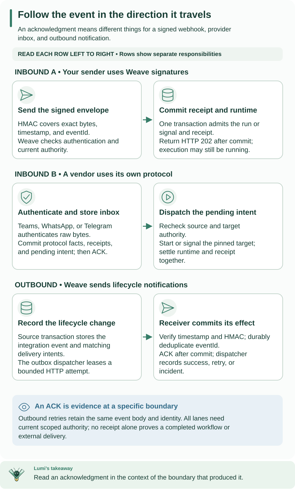

<!--
Copyright 2026 Firefly Software Foundation.

Licensed under the Apache License, Version 2.0 (the "License");
you may not use this file except in compliance with the License.
You may obtain a copy of the License at

    http://www.apache.org/licenses/LICENSE-2.0

Unless required by applicable law or agreed to in writing, software
distributed under the License is distributed on an "AS IS" BASIS,
WITHOUT WARRANTIES OR CONDITIONS OF ANY KIND, either express or implied.
See the License for the specific language governing permissions and
limitations under the License.
Author: Firefly Software Foundation
SPDX-License-Identifier: Apache-2.0
-->

# Call HTTP APIs and accept signed webhooks

HTTP traffic crosses Weave in two directions. Outbound, an **HTTP connector
action** calls another system while a run executes. Inbound, a **signed webhook
trigger** lets your system start a run, or signal a waiting one, by posting a
signed JSON envelope. You can use either one without the other.

**Who it is for.** Integration developers who connect a system to Weave, and
operators who run the executor that makes outbound calls. **What you need.** A
platform you can use: the [local platform](../guides/local-platform.md) or a
[standalone setup](../guides/standalone.md), and an activated workflow (see
[workflow authoring](../guides/workflow-authoring.md)). A webhook trigger takes
about 15 minutes once a signing secret is granted.

## Choose the direction you need

| You want to | Use | Start here |
| --- | --- | --- |
| Call a REST API from a workflow step, without writing code | The built-in `weave-http@2.0.0` connector | [Call a REST API without code](../connectors/http-without-code.md) |
| Use the original minimal HTTP connector (fixed path, bearer or no auth) | `weave-http@1.0.0` | [The original HTTP connector](#the-original-http-connector-weave-http100) |
| Start or signal a run from your own system | A signed webhook trigger | [Create a signed run trigger](#create-a-signed-run-trigger) |
| Receive Teams, WhatsApp, or Telegram events | A provider source, with the vendor's own authentication | [Provider sources](provider-sources.md) |
| Notify your system when runs or definitions change | An event subscription | [Outbound integration events](integration-events.md) |
| Run connector actions on a shared platform | The native executor | [Built native dispatcher setup](#built-native-dispatcher-setup) |



Read one row at a time, left to right. A signed webhook commits its receipt
together with the run it starts; a provider event is stored in an inbox first and
dispatched later; the bottom row sends lifecycle notifications outward. An
acknowledgment means something different in each row.
[Open diagram at full size](../diagrams/integrations-directions.svg)

## Create a signed run trigger

A **trigger** is an immutable route that turns one signed HTTP request into a new
run of one activation, or into a signal for one waiting run. You need the
`trigger.manage` capability (the `deployer` role) plus `run.start` for a run
trigger or `run.signal` for a signal trigger (the `operator` role). Run the
commands with a saved platform and workspace, set up with `weave auth setup` (see
[how remote commands choose a platform](../guides/connect-to-api.md#how-remote-commands-choose-a-platform));
saved platforms are new in 0.1.0a7; with an alpha6 or earlier CLI, these
commands use [explicit mode](../guides/connect-to-api.md#scripts-and-ci-explicit-mode).

1. **Activate the target workflow.** Its input must accept the payload you will
   send, here `{"customerId": "123"}`. Keep the activation's `id`: it is not the
   workflow version ID.

2. **Ask your operator for a signing secret handle.** A **secret handle** is a
   name, such as `customer-events-key`, that the operator grants to your
   environment in `WEAVE_SECRET_GRANTS`; the value stays in the operator's secret
   store. Give the sender the same key through its own secure configuration. The
   handle string is not the key. On the [local platform](../guides/local-platform.md),
   store the value yourself with
   `weave platform secret set --handle customer-events-key`, then restart the
   API so the handle is granted to the demo environment.

3. **Create the trigger.** Save this as `trigger.json`, replacing the activation
   UUID:

    ```json
    {
      "name": "customer-events", "kind": "run",
      "activation_id": "00000000-0000-4000-8000-000000000001",
      "secret_ref": "customer-events-key",
      "payload_schema": {
        "type": "object", "properties": {"customerId": {"type": "string"}},
        "required": ["customerId"], "additionalProperties": false
      },
      "max_body_bytes": 1048576, "tolerance_seconds": 300
    }
    ```

    ```sh
    # Create the immutable trigger in your selected environment.
    weave triggers create --request trigger.json --output json
    ```

    Expected: the request fields plus a server-assigned `id`, your
    `principal_id`, and `"disabled": false`. Save `id` as the trigger ID. For a
    signal trigger, use `"kind": "signal"`, leave out `activation_id`, and supply
    the waiting run's `run_id` and the declared `signal` name.

4. **Send a signed event.** The sender serializes the envelope once, signs those
   exact bytes with a timestamp, and posts them to `/webhooks/TRIGGER_ID`. This
   route is outside `/api/v1` and uses the signature, not a bearer token. This
   complete Python sender reads the address from `WEBHOOK_URL` and the key from
   `SIGNING_KEY` in its own environment:

    ```python
    import hashlib
    import hmac
    import json
    import os
    import time
    import urllib.request

    url = os.environ["WEBHOOK_URL"]  # https://YOUR_WEAVE_HOST/webhooks/TRIGGER_ID
    secret = os.environ["SIGNING_KEY"].encode()  # the exact bytes behind the handle
    body = json.dumps({"eventId": "customer-event-123", "payload": {"customerId": "123"}},
                      separators=(",", ":")).encode()
    timestamp = str(int(time.time()))
    signature = hmac.new(secret, timestamp.encode("ascii") + b"." + body, hashlib.sha256).hexdigest()
    request = urllib.request.Request(url, data=body, method="POST", headers={
        "Content-Type": "application/json",
        "X-Weave-Timestamp": timestamp,
        "X-Weave-Signature": signature,
    })
    with urllib.request.urlopen(request, timeout=30) as response:
        print(response.status, response.read().decode())
    ```

    Expected: `202` and a receipt with `id`, `trigger_id`, `event_id`, `run_id`,
    and, for a signal trigger, `signal_id`.

5. **Check what happened.** The receipt proves admission, not completion. Read
   the run:

    ```sh
    # Read the run the webhook started; replace RUN_ID with the receipt's run_id.
    weave runs read RUN_ID --output json
    ```

    Expected: the run with its current `status`; reading runs needs `run.read`
    (the `viewer` role). If it waits on an action, that action needs an admitted
    worker or executor; if it is suspended, follow
    [incident operations](incident-operations.md) instead of sending a new event.

The sender's signature was checked against the server's verifier code when this
page was written. The full webhook journey is covered by the project's
end-to-end tests and was not run again for this page.

## Signed ingress

**Creating and disabling triggers.** `POST /api/v1/tenants/{tenant}/projects/{project}/environments/{environment}/triggers`
creates a trigger (`weave triggers create`). The creator becomes the trigger's
execution principal; there is no principal selector or delegation. A run trigger
pins `activation_id`; a signal trigger pins `run_id` and one declared `signal`.
`max_body_bytes` is at most 1 MiB and `tolerance_seconds` is 1 to 300. Triggers
are immutable: to change a route, create a new trigger. `weave triggers disable
ID` (`POST .../triggers/{id}/disable`) needs `trigger.manage`; `weave triggers
list` and `read` show existing ones.

**The envelope.** Send exact UTF-8 JSON bytes to `POST /webhooks/{id}`:

```json
{"eventId":"customer-event-123","payload":{"customerId":"123"}}
```

The envelope has exactly these two keys. `eventId` must match
`[A-Za-z0-9_.:-]{1,128}`, and `payload` must satisfy the trigger's
`payload_schema`.

**The headers.** `X-Weave-Timestamp` is Unix seconds and `X-Weave-Signature` is
the lowercase hexadecimal HMAC-SHA256 of the ASCII timestamp, a period, and the
exact body bytes:

```python
hmac.new(secret_bytes, timestamp.encode("ascii") + b"." + raw_body, hashlib.sha256).hexdigest()
```

`X-Weave-Event-ID` is optional; when present it must equal the signed `eventId`.
The key is the exact bytes of the secret value, including any trailing newline
in a mounted file.

**What is rejected.** A bad or stale signature, a timestamp outside the
tolerance, modified bytes, a changed event ID header, duplicate or extra keys,
unsafe numbers, invalid Unicode, and excessive nesting. The body is parsed only
after the signature is valid. Forwarding headers never select the tenant,
trigger, or signing identity.

**How authority is checked.** The ingress route is the only exception to bearer
authentication, and only for an exact POST with a UUID. A dedicated database
function owner, without login or row-security bypass, looks up just enough of the
route to check the signature; the application cannot read across scopes. After
the signature is valid, the service locks the trigger, checks that it is enabled
and unchanged, reloads its creator's current grants, and writes the receipt and
the run or signal in one transaction. The `202` is returned after commit. A
disabled trigger or a revoked creator fails closed.

**Retries and duplicates.** The same event ID with the exact same body returns
the same receipt, run, and signal IDs, including after a lost response. The same
event ID with different bytes returns HTTP 409, even when the JSON means the same
thing. A new, properly signed event ID is a new delivery. To retry outside the
tolerance window, re-sign the same bytes with a fresh timestamp.

## What happens to a webhook and an outbound call

1. The sender posts the timestamp and the exact signed envelope.
2. Ingress checks the HMAC, the signed event ID, and the size limits.
3. In PostgreSQL, the service locks the trigger, checks current authority, and
   commits the receipt and the run together, with stable IDs.
4. Ingress returns `202` with the receipt.
5. Later, the native dispatcher confirms its scoped identity and claims the
   action's task under a lease.
6. It reads the private pinned metadata and, when needed, authorizes the
   credential.
7. It sends one bounded request to the validated, pinned peer.
8. It records a fenced completion, advances the run, and stores the receipt.

Delivery of the outbound call is **at least once**: external I/O happens after
the claim commits, and a timeout after a write is ambiguous. There are no
HTTP-library retries; retries follow the action's declared policy.

## The original HTTP connector (weave-http@1.0.0)

For new integrations, prefer the built-in `weave-http@2.0.0`: it supports path,
query, and header parameters, API key, basic, bearer, and machine-token
authentication, and the no-code builders in the CLI and Studio. See
[Call a REST API without code](../connectors/http-without-code.md) and
[HTTP profiles](../connectors/http-profiles.md). The original v1 connector stays
installed, and existing activations keep their behavior. It is also the
connector [event subscriptions](integration-events.md) deliver through.

`firefly_weave.connectors.manifest.HTTP_DESCRIPTOR` holds the immutable
`weave-http@1.0.0` manifest, its `weave-http` adapter identity, implementation
version, capabilities, and release bindings. Publish that exact manifest through
normal connector publication. Since 0.1.0a7,
`weave connector descriptor weave-http --output json` asks your platform for its
installed copy; publish that copy's `source` field unchanged with
`weave definitions publish --collection connectors`, wrapped in the request file
as `{"format": "json", "source": ...}` and sent with an `--idempotency-key`. A
tenant cannot replace its
schema or take the reserved `weave-connector-*` task namespace with an ordinary
worker release.

**Actions.** `read` allows GET and HEAD and is `read_only`; `write` allows POST,
PUT, PATCH, and DELETE and is `non_idempotent`.

**Action configuration.** An action fixes its `config`: `method`, a fixed `path`,
the accepted 2xx `statuses`, and optional `maxRedirects` (0 to 5, default 3).
Paths use slash-separated ASCII letters, digits, underscores, or hyphens, with an
optional trailing slash.

**Input and output.** Workflow input has only `query` (string values) and an
optional JSON `body`; a read rejects a body. Input cannot set the URL, method, or
headers. The output is `{status, body}`; response headers are never returned.
Decoded JSON keys and string values are checked for echoed credentials, and a
detected echo fails without storing the response.

**Integration connection.** The connection config is `{baseUrl, auth}`.
`baseUrl` is an HTTP or HTTPS origin with no user information, query, or path.
`auth` is `none` or `bearer`. A bearer connection requires exactly
`secretRef.token`; an anonymous one has no secret slots. Tokens must match
`[A-Za-z0-9._~+/-]+=*` and have at most 8,192 characters; an invalid token fails
before any network I/O. `allowed_destinations` lists explicit origins and must
include the `baseUrl` origin.

### Network rules

These rules belong to the v1 adapter; v2 shares the same destination policy, and
[HTTP profiles](../connectors/http-profiles.md) lists its own request rules.

- **Destinations.** Port 0, non-numeric ports, and out-of-range ports are
  invalid. Hostnames with a trailing root dot are rejected in origins and
  redirects. The connection's administrator can narrow destinations; only the
  operator's `WEAVE_HTTP_PRIVATE_NETWORKS` permits private CIDRs. Link-local and
  metadata addresses, multicast, unspecified or reserved addresses, and
  Kubernetes service hostnames stay denied even under broad CIDRs.
- **Connections.** Each request has its own connection pool. DNS resolves once to
  validated addresses; the actual peer is checked before anything is written, and
  TLS verifies the original hostname. Ambient proxies are ignored
  (`trust_env=False`). There is no option to disable TLS checks; the image's CA
  store is used.
- **Size and time.** Only identity content encoding is accepted. Retained
  responses are capped, transport reads are at most 16 KiB, and initial headers at
  most 32 KiB. The task deadline covers provider, DNS, and network work.
- **Redirects.** GET and HEAD redirects stay on the same origin and revalidate DNS
  and the peer on every hop; writes never redirect. A cross-origin redirect is
  rejected even when both origins are allowed, so credentials cannot move to
  another origin.

## Release and activation pins

A connector action runs only through an admitted release. These rules apply to
both HTTP connectors.

- **Release.** Register an immutable image release with the descriptor's exact
  capabilities and `connector_bindings`. Credential access also needs the task
  reference in `credential_capabilities`, an administrator grant for the release,
  capability, and connection, and an operator `WEAVE_SECRET_GRANTS` entry. The
  dispatcher creates none of these grants.
- **Activation.** The activation request adds `connector_release_ids`, which maps
  each connector version UUID to a release UUID. Worker-only `worker_release_ids`
  are unchanged. The server snapshots `connector_execution_pins`: action and
  connector digests, version, adapter implementation, capability, and release.
  Missing or extra pins, or incompatible installed bindings, fail readiness.
  Connector actions must declare their connection.
- **At run time.** Private invocation metadata is available only after a live
  lease proof and a current worker authority check. It carries the schema bundle
  from the run's saved artifact, with no catalog re-resolution or external
  retrieval. Claims, history, and receipts contain no secret material. Credential
  resolution checks lease, release, administrator, and provider authority before
  and after provider I/O, outside database transactions, and the SDK watchdog
  cancels work when lease renewal fails.

## Built native dispatcher setup

The **native dispatcher** (also called the native executor) runs built-in
connector actions inside the API image instead of in a separate worker. On a
shared platform, the operator sets it up once per image:

1. **Build the server image** as described in
   [deployment](../operations/deployment.md), and read its actual image ID with
   `docker image inspect`. The local Docker image ID is an immutable local
   identity, not a registry manifest digest or a runtime attestation. Register
   that ID; never substitute a source hash, and deploy without a mutable source
   mount.
2. **Register the release** with that image identity, as in
   [Release and activation pins](#release-and-activation-pins).
3. **Configure the API** with these variables, then restart it:

| Variable | Meaning |
| --- | --- |
| `WEAVE_NATIVE_EXECUTORS` | JSON array of `{scope, principal_id, release_id, task_types, capacity, build}`; `build` is `image` (default) or `local-development`; an empty array disables dispatch |
| `WEAVE_NATIVE_IMAGE_DIGEST` | The actual image identity that matches each configured release |
| `WEAVE_HTTP_PRIVATE_NETWORKS` | JSON array of operator-approved private CIDRs |
| `WEAVE_SECRET_GRANTS` | JSON array of `{scope, handle, provider, locator}`; `provider` is `env` (the locator names a `WEAVE_CONNECTION_SECRET_*` variable) or `file` |
| `WEAVE_SECRET_ROOT` | Root directory for the mounted-file secret provider |

[Configuration](../operations/configuration.md) lists every server variable.

**What startup checks.** The image records its installed Python source hashes in
`/opt/weave/build.json`; startup refuses missing or changed build contents. For
each configured principal, it checks the current registration, claim, heartbeat,
completion, and credential grants for the release and every task reference before
registering an instance. Each replica has its own instance.

**Running.** A dispatcher failure makes readiness unavailable. Shutdown stops
claiming, drains up to the configured bound, then cancels remaining I/O. While
startup compatibility checks still report the runtime as restricted, an
in-process executor claims nothing and keeps polling; tasks queued in that window
are claimed once the API becomes operational.

**Replicas.** API-only replicas may disable dispatch while a compatible peer runs
connector actions. Lease recovery is a separate scheduler with limited database
privileges, so keep one scheduler-enabled replica for recovery, waits, timers, and
schedules.

### Local development build

`weave platform` runs the built-in HTTP connector on a laptop without a container
image. `weave platform integrations enable` registers the installed runtime as the
release, and `weave platform start` configures one executor with
`"build": "local-development"`. This mode exists only for loopback development
platforms; production images keep the `image` build. It is new in 0.1.0a7.

- **Build identity.** `sha256:` followed by a hash over every file of the
  installed `firefly_weave` package, excluding `__pycache__` directories and
  `*.pyc` files. Symbolic links are refused. The identity must equal both
  `WEAVE_NATIVE_IMAGE_DIGEST` and the release's `image_digest`.
- **Where it runs.** The package must run from a virtual environment and live
  under its `sys.prefix`. `start` recomputes the identity every time; when the
  runtime changed, it starts the API without the executor and prints a notice
  asking you to run `integrations enable` again.
- **Server guard.** If any executor uses `local-development`, all of them must.
  The application and scheduler database hosts must be loopback, at least one
  identity provider must be configured, and every configured identity provider
  must be a local development provider with loopback issuer and JWKS hosts.
  Otherwise startup fails with "Invalid local development native execution
  configuration".
- **Bindings.** A local development release may bind only the `weave-http-v2`
  adapter, so no connector package runs this way.
- **What start never sets.** `start` never forwards `WEAVE_HTTP_PRIVATE_NETWORKS`
  or `WEAVE_CONNECTOR_PACKAGES`, even from your shell, so local connector actions
  reach only public HTTPS destinations. Secret handles stored with `weave platform
  secret set` become `WEAVE_SECRET_GRANTS` entries with the `file` provider and
  `WEAVE_SECRET_ROOT` pointing at the installation's `secrets/` directory, scoped to
  the demo environment.

See the [local platform guide](../guides/local-platform.md#8-run-built-in-http-connector-actions)
for the commands and [Call a REST API without code](../connectors/http-without-code.md)
for a complete run.

## Schemas and verification

`weave schema export --directory DIR` writes the published schemas, including
`trigger-request`, `trigger`, `trigger-receipt`, `connector-descriptor`,
`worker-release-request` (with `connector_bindings`), and `activation` (with
`connector_execution_pins`). The [native OpenAPI](native-openapi.md) export
describes the same operations.

The project's end-to-end tests cover a local webhook → HTTP call → remote worker →
approval signal journey. See [deployment](../operations/deployment.md) for launch
commands and the [capability matrix](../capabilities.md) for what is verified.
These connectors never launch arbitrary tenant images or expose an unscoped
execute-adapter API.

## Next steps

- [Call a REST API without code](../connectors/http-without-code.md): build,
  publish, and run a `weave-http@2.0.0` action.
- [Provider sources](provider-sources.md): receive Teams, WhatsApp, and Telegram
  events.
- [Outbound integration events](integration-events.md): notify your system about
  runs and definitions.
- [Incident operations](incident-operations.md): decide what to do with an
  uncertain external call.

## Troubleshooting

| What you see | Why | What to do |
| --- | --- | --- |
| HTTP 401 `WV-WEBHOOK-AUTH` | Wrong key, a timestamp outside the tolerance, changed bytes, or a mismatched `X-Weave-Event-ID` | Check the granted key bytes (including any trailing newline), the sender's clock, and that you sign exactly the bytes you send |
| HTTP 409 `WV-WEBHOOK-CONFLICT` on a repeated event ID | The body differs from the original delivery | Resend the original bytes; use a new event ID only for a new event |
| HTTP 413 `WV-WEBHOOK-SIZE` | The body is larger than the trigger's `max_body_bytes` | Send a smaller payload, or create a trigger with a larger limit (at most 1 MiB) |
| HTTP 422 `WV-WEBHOOK-PAYLOAD` | The signature is valid, but `payload` does not satisfy the trigger's `payload_schema` | Fix the payload, sign the corrected bytes, and send them again; nothing was stored for the rejected request |
| `202`, but the run does not finish | The receipt proves admission only | Read the run; an action may be waiting for an admitted worker or executor |
| The run is `suspended` | An incident needs a decision | Follow [incident operations](incident-operations.md); do not send another webhook with a new ID |
| `weave triggers create` is denied | You lack `trigger.manage`, or `run.start` / `run.signal` for the target | Ask for the `deployer` and `operator` roles in that environment |
| Startup fails with "Invalid local development native execution configuration" | A `local-development` executor is combined with a non-loopback database, a non-local identity provider, or an `image` executor | Use local development builds only on a loopback platform |
| The API starts without the local executor | The installed runtime changed since `integrations enable` | Run `weave platform integrations enable` again, then restart |
