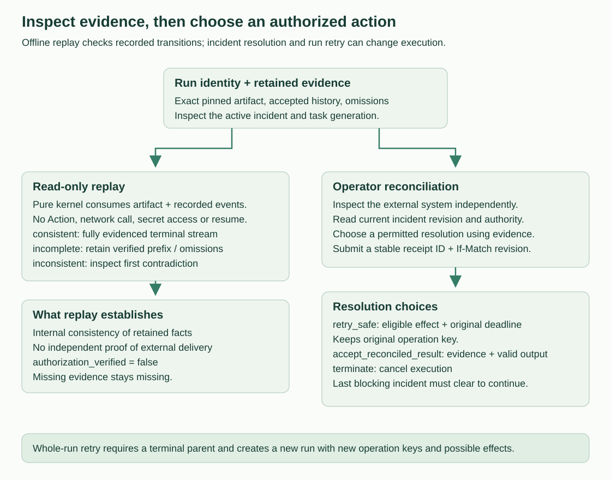

<!--
Copyright 2026 Firefly Software Foundation.

Licensed under the Apache License, Version 2.0 (the "License");
you may not use this file except in compliance with the License.
You may obtain a copy of the License at

    http://www.apache.org/licenses/LICENSE-2.0

Unless required by applicable law or agreed to in writing, software
distributed under the License is distributed on an "AS IS" BASIS,
WITHOUT WARRANTIES OR CONDITIONS OF ANY KIND, either express or implied.
See the License for the specific language governing permissions and
limitations under the License.
Author: Firefly Software Foundation
SPDX-License-Identifier: Apache-2.0
-->

# Incident operations



**How to read this diagram:** Follow the lower row left to right when changing execution. Reconciliation supplies external evidence; the current revision and receipt protect the decision. The upper replay row is useful inspection but cannot retry an Action or clear an incident.

## Resolve an uncertain run deliberately

An **incident** records a condition that needs a decision, often because Weave
cannot determine whether an external Action completed. **Suspended** means normal
continuation is blocked while that decision is outstanding. A retry of the whole
run is different: it creates a new execution with new operation keys.

Start with [standalone setup](../guides/standalone.md) and the scoped operator
credential. Obtain `RUN_UUID` from the run-start response or trigger/provider
receipt. Use [history](history-and-replay.md) and [worker recovery](../guides/workers.md)
to understand which Action and attempt are involved.

1. Run `weave incident list RUN_UUID` with the environment URL configured below.
   Record the active incident `id`, `revision`, `node_id`, `generation`, and `code`.
2. Consult the external system using its own authorized reconciliation procedure.
   Weave does not look up a payment, message, or database change for you.
3. Choose `retry_safe` only for an eligible declared effect, or
   `accept_reconciled_result` when independent evidence establishes the result.
   Use `terminate` when the execution should stop. The exact requirements follow.
4. Save the complete resolution body below as `resolution.json`; replace its
   receipt UUID with a newly generated UUID, evidence reference, and output with
   your verified result. The sample `42` is valid only for a pinned schema that
   accepts that number. Submit with the revision you just read.
5. Read the incident and run again. The resolution is audited, but another active
   incident or deadline may still prevent continuation. On a lost response, retry
   the same receipt/body/revision; on a competing revision conflict, reread first.

For a terminal run that needs a new business execution, `new-run.json` has this
complete shape (replace the activation UUID and use valid Workflow input):

```json
{"activation_id":"00000000-0000-4000-8000-000000000001","input":{}}
```

Send it with `weave run retry RUN_UUID --idempotency-key retry-123 --request new-run.json`.
The response is a new run whose `parent_run_id` points to the original. Reuse the
same idempotency key only for retrying that same start request. Inspect
`external_effects_may_continue` on cancellation: stopping Weave cannot retract
already-issued external work.

## Endpoint and decision contract


All paths below are under
`/api/v1/tenants/{tenant}/projects/{project}/environments/{environment}`. Authorization
uses current scoped capabilities, including on duplicate receipts. Scoped
operators are allowed; platform administration alone grants no execution rights.

| Request | Capability | Result |
| --- | --- | --- |
| `GET /runs/{run}/incidents` | `incident.read` | Read-only incident projections, including recorded closed history |
| `POST /incidents/{incident}/resolve` | `incident.resolve` | Revision-fenced immutable resolution receipt |
| `POST /runs/{run}/cancel` | `run.cancel` | Terminal cancellation and explicit external-effect caveat |
| `POST /runs/{run}/retry` | `run.retry` and normal start admission | A new execution linked by `parent_run_id` |

Resolve requires an `If-Match` header containing the positive numeric revision
returned by GET, and a JSON request with a stable UUID `receipt_id`, `kind`, and
nonblank `reason`. Only `accept_reconciled_result` consumes an `output` field;
`retry_safe` and `terminate` reject any explicitly supplied output, including null.
Reconciled output is checked against the 1 MiB JSON payload limit before request
fingerprinting or persistence. An exact same-actor retry with the original revision returns
the original receipt. A different request using that receipt conflicts. Two
competing receipts using the same revision cannot both resolve the incident.
Authority is checked before replay; removing a grant disables replay too.

```json
{
  "receipt_id": "8947c9df-8766-4df1-963f-87acf8627edf",
  "kind": "accept_reconciled_result",
  "reason": "Provider lookup confirmed completion",
  "evidence_reference": "provider:receipt:123",
  "output": 42
}
```

- `retry_safe` permits only declared `read_only`, `idempotent`, or
  `idempotency_key` Actions. It may authorize one attempt beyond the exhausted
  automatic budget, with the original operation key and remaining original
  Action/run deadlines. It does not reset the automatic budget or extend a
  deadline. Unsafe retry returns `WV-RUNTIME-RECONCILIATION_REQUIRED` (409).
- `accept_reconciled_result` requires explicit `output` and a nonblank evidence
  reference. An explicitly supplied JSON null is valid only if the pinned output
  schema allows it. The exact pinned schema and dependency bundle are validated;
  the service performs no external reconciliation or external effect itself.
- `terminate` cancels the execution. Cancellation stops scheduling and revokes
  leases atomically. Responses set `external_effects_may_continue=true`: work
  already issued to an external system may continue. Authentic late completions
  for explicitly control-revoked generations can receive an immutable `ignored`
  receipt; they do not advance the run.

Each resolution persists actor, reason, kind, evidence, timestamp and receipt.
Independent node/generation incidents preserve a run-wide suspension barrier.
Outstanding authenticated results are durable facts, and continuations advance
once only after the last blocking incident clears. An expired overall/wait deadline
can terminate a suspended run; reconciliation cannot bypass it.

Cancel takes `{"reason":"operator decision"}`. Repeated cancellation returns the
cancelled snapshot without another event; another terminal state cannot be
rewritten. Retry takes the normal `StartRunRequest` JSON and a required
`Idempotency-Key`. The parent must be terminal. Current definition/release/connection
admission is rechecked for the new execution. The parent's state, outputs and
accepted events are unchanged. A linked retry is a new business execution; it
uses new operation keys and may cause additional external effects.

## CLI

Provide `WEAVE_ENVIRONMENT_URL` with the full scoped environment URL and
`WEAVE_ACCESS_TOKEN` through the environment. TLS is required outside loopback;
HTTP redirects are rejected. Commands print JSON without printing bearer tokens.
Use the [CLI login commands](cli.md#login-and-secure-persistence) for the current
delegated authentication and secure persistence surface.

```sh
weave incident list RUN_UUID
weave incident resolve INCIDENT_UUID --revision 2 --request resolution.json
weave run cancel RUN_UUID --reason 'operator decision'
weave run retry RUN_UUID --idempotency-key retry-123 --request new-run.json
```

## Forward migration and compatibility

Revision `0010_incidents` adds scoped `incidents`, `incident_resolution_receipts`, and
`run_retry_links` tables. The kernel and accepted events remain authoritative;
projections synchronize in the same transaction. No public GET performs repair.
Existing active incident map entries are backfilled with deterministic run/key identities and
revision 1, preserving node/generation/code without fabricated actor/evidence.
Legacy suspended summaries lacking that map become `@legacy`, with unknown
node/generation, and support termination only. Previously closed incident history
remains in immutable `run_events`; it is not falsely reconstructed as audited
resolution rows. Existing run JSON and accepted event JSON are unchanged.

The migration identity must have its normal DDL/table privileges plus explicit
catalog-only enumeration authority. Before the forward migration, the function
owner or an administrator able to grant its privileges must execute:

```sql
GRANT EXECUTE ON FUNCTION public.weave_tenant_ids() TO your_migration_role;
```

Do not grant this to the application role. The migration fails clearly without
it, enumerates tenant IDs through the existing fixed-search-path SECURITY DEFINER
function, and performs backfill under each tenant's forced RLS scope. It never
changes role membership, membership options, RLS policies on business tables or
the function's owner/PUBLIC privileges. The migration and backfill are transactional;
no destructive downgrade or startup repair is provided. The new schema requires
a server build compatible with the migrated schema. Follow the
[upgrade procedure](../operations/upgrades.md) before changing the running version.

## Unavailable legacy evidence

Normal reads and mutation replay of uncertain legacy runs return HTTP409
`WV-LEGACY-UNAVAILABLE`, safe run ID/status and omission metadata for `/state`.
No fabricated redacted `RunState` is returned. New runs carry server-owned
`admission_policy: classified-v1`; this is policy provenance, never caller
identity or authorization. Pre-policy unmarked artifacts retain compatibility.

Current authorized cancellation remains possible: it replaces only the mutable
execution snapshot with an explicitly `unavailable` terminal control state and
uses the kernel's existing cancellation/revocation commands. The acknowledgment
contains ID, cancelled status, accepted sequence, unavailable/omissions and
`external_effects_may_continue`; it contains no activation/request/source/payload.
Repeating cancellation returns that same safe acknowledgment. Terminal control
does not parse or reconstruct legacy activation, request or artifact digest, so
malformed retained metadata cannot prevent authorized cancellation. Immutable earlier
history stays untouched, so replay reports incomplete evidence when its required
facts are unavailable.
An unavailable state cannot process any ordinary continuation or mappings.

Persisted overall timeouts remain enforceable using DB time and their issued
deadline. Structurally verified pinned signal deadlines can also terminate when
no receipt was accepted strictly before the deadline; an earlier receipt never
causes unsafe continuation. A bounded structural check supplies immutable
`terminal_signals_verified` metadata. Unverifiable artifacts support overall
timeout and cancellation only. Existing external effects may continue after
these cooperative controls. No historic payload migration/deletion is performed.

Every availability gate revalidates the pinned artifact against the current
bounded structural and classification policy before trusting the server-owned
provenance marker. The marker cannot bypass corrected literal-admission rules.
This adds bounded artifact validation per access; no cache or history rewrite is
introduced. Invalid retained artifacts follow the existing unavailable, policy
block and safe terminal-control paths even when an earlier build stamped them.
