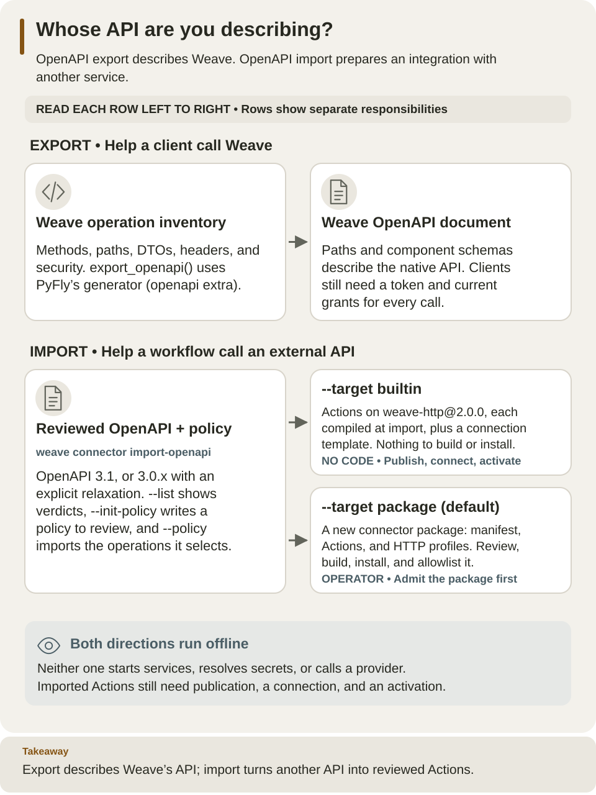

<!--
Copyright 2026 Firefly Software Foundation.

Licensed under the Apache License, Version 2.0 (the "License");
you may not use this file except in compliance with the License.
You may obtain a copy of the License at

    http://www.apache.org/licenses/LICENSE-2.0

Unless required by applicable law or agreed to in writing, software
distributed under the License is distributed on an "AS IS" BASIS,
WITHOUT WARRANTIES OR CONDITIONS OF ANY KIND, either express or implied.
See the License for the specific language governing permissions and
limitations under the License.
Author: Firefly Software Foundation
SPDX-License-Identifier: Apache-2.0
-->

# Native OpenAPI

An OpenAPI document describes HTTP paths, request bodies, responses, and security
requirements so client generators and API tools can understand the service. Use
this page to export **Weave's own API**. Start with the
[standalone tutorial](../guides/standalone.md) to run that API, or
[API contracts](api.md) to read its operations.

Weave derives its native API description from product-owned operation metadata
and PyFly's public OpenAPI generator. It does not run a second documentation-only
web stack or replace runtime authorization with OpenAPI security declarations.

The [operation inventory](../../src/firefly_weave/contracts/surface.py) supplies
method/path, request/success/error models, status, header and security metadata.
[The exporter](../../src/firefly_weave/contracts/openapi.py) constructs native
`RouteMetadata` and uses PyFly `OpenAPIGenerator`. Native startup checks route
coverage/collisions; canonical aliases share actual handlers and lifespan with
legacy routes. Administrative roots, health probes and provider/signed ingress
retain their explicit authentication boundaries.



Read down the left column for this page. The right column belongs to external connector authoring: it produces metadata for review and deployment, not a running integration. [Open the diagram at full size](../diagrams/authoring-openapi-directions.svg).

## Export locally

Install the optional `openapi` extra from the locked checkout. Export generation
needs no application startup, database, credentials or provider network call.

```sh
uv sync --locked --no-editable --extra openapi
uv run --locked --no-editable --extra openapi python -c 'import json; from firefly_weave.contracts.openapi import export_openapi; print(json.dumps(export_openapi(), sort_keys=True, indent=2))' > /tmp/weave-openapi.json
```

Expected: `/tmp/weave-openapi.json` contains an OpenAPI document with `paths`
and `components.schemas`. Inspect a specific operation before generating a client:

```sh
uv run --locked --no-editable --extra openapi python - <<'PYTHON'
import json
from pathlib import Path
api = json.loads(Path("/tmp/weave-openapi.json").read_text())
path = "/api/v1/tenants/{tenant}/projects/{project}/compiler/compile"
operation = api["paths"][path]["post"]
print(operation["operationId"])
print(sorted(operation["responses"]))
PYTHON
```

The operation ID identifies the compiler operation. Its request schema includes
`source` and `format`; response schemas describe both the compiler result and
errors. Use the declared aliases exactly. Generated clients still need a current
access token, local grants, revision headers, and idempotency keys where required.

## Versions and scope

The language/schema exporter and pure builder remain independent of PyFly. The
native document's API version is distinct from package version `0.1.0a1` and
language `weave/v1alpha1`. The current dependency is PyFly 26.9.15; exact URL,
SHA-256 and upstream provenance are in [project metadata](../../pyproject.toml)
and the lockfile.

Native contract tests check wire fixtures, schema/discriminator resolution,
operation coverage and route parity. Generation alone does not prove the API's
actual authorization or response behavior. See [API](api.md), [SDK](sdk.md), and
[CLI](cli.md) for public use.

Connection test, definition retirement, and activation retirement accept an
omitted request body; their native OpenAPI request bodies are optional. Other
operations use the requiredness declared in the operation inventory.

[External OpenAPI import](../connectors/metadata-import.md) is a separate offline
authoring capability. It converts a bounded OpenAPI 3.1 subset into reviewable
connector metadata and [HTTP profiles](../connectors/http-profiles.md). It does
not execute arbitrary OpenAPI documents.
