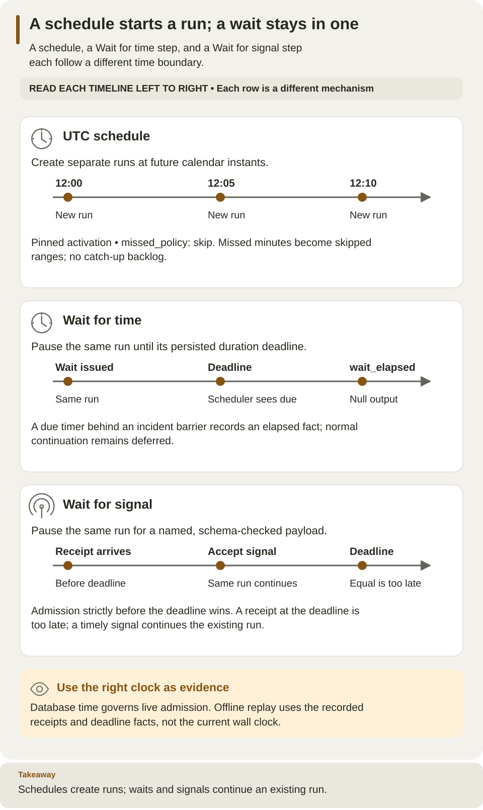

<!--
Copyright 2026 Firefly Software Foundation.

Licensed under the Apache License, Version 2.0 (the "License");
you may not use this file except in compliance with the License.
You may obtain a copy of the License at

    http://www.apache.org/licenses/LICENSE-2.0

Unless required by applicable law or agreed to in writing, software
distributed under the License is distributed on an "AS IS" BASIS,
WITHOUT WARRANTIES OR CONDITIONS OF ANY KIND, either express or implied.
See the License for the specific language governing permissions and
limitations under the License.
Author: Firefly Software Foundation
SPDX-License-Identifier: Apache-2.0
-->

# Start runs on a schedule and pause with timers

Weave has two time-based features that are easy to confuse:

- A **schedule** starts a **new run** of an activation at future UTC calendar
  times, like a cron job.
- A **Wait for time** step (`wait`) pauses an **existing run** until a stored
  deadline, then continues. **Wait for signal** steps and human tasks have
  deadlines too.

Both rely on the platform's scheduler, not on a timer in your worker or your
computer.

**Who it is for.** Process designers who add waits, and developers and operators
who create schedules. Schedules are managed with the CLI or the API; Studio does
not create them. **What you need.** A platform from the
[local platform guide](../guides/local-platform.md) or the
[standalone setup](../guides/standalone.md), an activated workflow, and, if the
workflow calls actions, [admitted workers](../guides/workers.md). Allow 15
minutes.



Read each timeline left to right. Calendar instants create separate runs, while
duration and signal waits continue the same run. A signal must be accepted
strictly before its deadline to win; arriving exactly at the deadline is too
late.
[Open diagram at full size](../diagrams/integrations-time-and-signals.svg)

## Create a schedule

Run the commands with a saved platform and workspace from `weave auth setup`
(see [how remote commands choose a platform](../guides/connect-to-api.md#how-remote-commands-choose-a-platform)).
Saved platforms are new in 0.1.0a7; with an alpha6 or earlier CLI, these
commands use [explicit mode](../guides/connect-to-api.md#scripts-and-ci-explicit-mode).
To save a schedule you need `trigger.manage` and `run.start` (the `deployer` and
`operator` roles); to read it and its history, `run.read` (the `viewer` role).

1. **Find the activation ID.** Use the `id` from the activation response, not the
   workflow version ID.

2. **Write the request.** Save this as `schedule.json`, replacing the activation
   UUID and `input` with input that the workflow's `inputSchema` accepts.
   `*/5 * * * *` means every five minutes on the UTC clock:

    ```json
    {"cron":"*/5 * * * *","timezone":"UTC","missed_policy":"skip","activation_id":"00000000-0000-4000-8000-000000000001","input":{}}
    ```

3. **Save the schedule:**

    ```sh
    # Create the schedule; the server checks the calendar, the input, and your grants.
    weave triggers schedules save --request schedule.json --output json
    ```

    Expected: a schedule with `id`, `revision` (1), `status`, `next_due_at`,
    `principal_id`, and `blocked_reason`. Check `status` and `next_due_at` before
    expecting a run. Save `id` as `SCHEDULE_ID`.

4. **Check its history after the next due time:**

    ```sh
    # Show occurrences: each started run, or each skipped range.
    weave triggers schedules history "$SCHEDULE_ID" --limit 100 --output json
    ```

    Expected: a `started` occurrence with its `run_id`, or a `skipped` range when
    work was missed. Read the run separately to see whether it finished; a
    started occurrence means only that the run was created.

## Change, disable, or delete a schedule

Every change needs the schedule's current revision, so two people cannot
overwrite each other. Read the schedule first, use the returned `revision`, and
after a conflict read it again and reconsider the change; never guess the next
revision.

```sh
# Read the current schedule and note its revision.
weave triggers schedules read "$SCHEDULE_ID" --output json
# Replace the schedule with an edited request that includes "id": SCHEDULE_ID.
weave triggers schedules save --request schedule-edit.json --revision "$SCHEDULE_REVISION" --output json
# Stop future firings; the schedule and its history are kept.
weave triggers schedules disable "$SCHEDULE_ID" --revision "$SCHEDULE_REVISION" --output json
# Resume from a fresh future time; missed occurrences are not replayed.
weave triggers schedules enable "$SCHEDULE_ID" --revision "$SCHEDULE_REVISION" --output json
# Delete the schedule; its revisions and history remain readable.
weave triggers schedules delete "$SCHEDULE_ID" --revision "$SCHEDULE_REVISION" --output json
```

These are separate operations, not a script: each successful change returns a
new revision, so read it again before the next one. List every schedule,
including deleted ones, with `weave triggers schedules list --limit 100`; pass
`--cursor` with the returned `next_cursor` for more.

## Calendar rules

Schedules use a strict five-field cron grammar, always in UTC:

| Field | Range | Notes |
| --- | --- | --- |
| Minute | 0–59 | |
| Hour | 0–23 | UTC |
| Day of month | 1–31 | At least one of day of month or day of week must be `*` |
| Month | 1–12 | |
| Day of week | 0–6 | Sunday is 0 |

**Allowed in each field:** `*`, numbers of at most two digits, ranges such as
`9-17` that do not wrap around, lists of at most 32 terms, and positive steps on
`*` or on a range (`*/15`, `9-17/2`). The whole expression has at most 256
characters.

**Rejected:** names (`MON`, `JAN`), macros (`@daily`), seconds or year fields,
`?`, `L`, `W`, `#`, random or hash syntax, time zones other than UTC, and
calendars that can never occur, such as `0 0 31 2 *`.

The pure `contracts.schedules.validate_calendar` function owns this grammar, and
both the request model and the runtime calendar call it. Calendar math uses
PyFly 26.9.15's `CronExpression`, backed by croniter 6.2.4 and its 50-year search
limit; a schedule whose date range runs out is blocked safely.

## Missed occurrences

The only `missed_policy` is `skip`. Schedules use the database's UTC clock. When
the scheduler looks at a schedule, it starts at most the occurrence in the current
minute, the half-open interval `[instant, instant + 60 seconds)`, and a final
database-time check prevents a stale start after a readiness wait.

Older occurrences become one immutable `skipped` range per observed revision and
span; Weave never builds a backlog of catch-up runs. A clock that moves backward
never moves the schedule backward. An overloaded platform may skip minutes by
policy: a schedule is not a promise of exactly-once external effects or of
catch-up.

A capacity refusal (`WV-OPERATION-CAPACITY` or `WV-REQUEST-CAPACITY`) starts
nothing and doesn't block the schedule: it stays `enabled`, and the next scan
tries the same occurrence again with the same occurrence key, so the occurrence
starts at most one run. An occurrence still refused when its minute ends becomes
part of a `skipped` range.

## Request, routes, and permissions

Save with `POST /api/v1/tenants/{tenant}/projects/{project}/environments/{environment}/schedules`.

| Field | Meaning |
| --- | --- |
| `cron` | The five-field UTC expression |
| `timezone` | Always `UTC` (the default) |
| `missed_policy` | Always `skip` (the default) |
| `activation_id` | The activation each run uses |
| `input` | The run input; checked against the workflow's input schema and secret rules |
| `id` | Optional; names the schedule to replace. When omitted, a new schedule is created |

| Route | Purpose | Needs |
| --- | --- | --- |
| `POST /schedules` | Create, or update with `If-Match: REVISION` | `trigger.manage`, `run.start`, a ready activation, valid input |
| `GET /schedules?cursor=…&limit=1..100` | List, including deleted ones | `run.read` |
| `GET /schedules/{id}` | Read one | `run.read` |
| `GET /schedules/{id}/occurrences?limit=100` | Started runs and skipped ranges, with observation times | `run.read` |
| `POST /schedules/{id}/disable`, `/enable`, `/delete` | Change state; each needs `If-Match` | `trigger.manage`; enable also `run.start` |

Lists return `items` and an opaque `next_cursor`; pass it back as `cursor`.
Cursors are bound to your scope and the collection. Delete keeps revisions and
history (a tombstone). Enable creates a new revision with a fresh future cursor.

**Whose authority runs the schedule.** The person who saves or enables a revision
becomes its execution principal; there is no principal selector. Every firing
reloads that person's status and grants. A revoked or disabled owner blocks the
schedule without consuming an occurrence; an authorized save or enable rebinds it
with a fresh future cursor. Run creation, the occurrence record, skipped ranges,
and cursor advancement commit together.

**Older commands.** The singular `weave schedule` family (`save`, `list`, `show`,
`occurrences`, `disable`, `enable`, `delete`) remains for the older unversioned
routes. It needs `--environment-url` (or `WEAVE_ENVIRONMENT_URL`) and
`WEAVE_ACCESS_TOKEN`, and uses `--after` instead of `--cursor`.

## How the scheduler finds due work

A single loop owned by the API process handles recovery and schedules. Each cycle
visits at most 16 tenants and one environment per tenant, using durable rotating
cursors. Each turn takes separate pages of up to 10 due deadlines, 10 expired
ready tasks, and 10 recoverable leases, then up to 10 due schedules. Each phase
has at most five seconds, including connection acquisition, plus a four-second
statement timeout and a one-second lock timeout, so one failure does not block the
others. After a failure or restart, traversal resumes, and a failed turn consumes
no occurrence.

How quickly a schedule fires depends on the number of tenants and environments
and the poll interval. Weave does not promise that every tenant runs within one
minute.

## Waits and deadlines inside a run

**Wait for time** (`wait`) stores a deadline and continues with a `null` step
output when it is due. It uses the same kernel and deadline scanner as signals,
including nested branch capacity, cancellation, restarts, and the incident
barrier. If a wait elapses while the run is suspended by an incident, its deadline
is consumed once and the continuation waits until the incident is resolved;
branch capacity is not released early. Recovery reports count elapsed waits
separately from timeouts.

**Order when several deadlines are due at once:**

1. The overall run timeout (`spec.timeoutSeconds`) wins.
2. Then signal timeouts.
3. Then elapsed duration waits, ordered by due time and node ID.

A signal accepted strictly before its deadline wins over that signal's timeout;
one accepted at exactly the deadline does not. Durations never wake early.

**What history records.** The `wait_elapsed` event records `node_id`, the issued
`deadline`, the durable `wait_id`, the database observation time, the event ID,
and the accepted sequence. Signal events record their acceptance time and issued
deadline. Replay uses these recorded facts, never a live clock, and the
[history and replay](history-and-replay.md) and [simulation](simulation.md)
APIs never contact external providers.

Delivery is at least once; external effects are not exactly once.
[Secret classification](schema-profile.md#durable-secret-classification) applies
to stored schedule input and to workflow data.

## Forward migration privileges

This section is for administrators who apply database migrations.

Revision `0011_schedules` follows `0010_incidents`; forward migrations keep
earlier history. Besides ordinary DDL, `REFERENCES`, and schema-version
permissions, this migration needs:

- Ownership, direct or inherited, of `wait_wakeups`.
- Permission to `SET ROLE weave_catalog_reader`.
- Schema `CREATE WITH GRANT OPTION`.

Grant these deliberately; `EXECUTE` on `weave_tenant_ids()` alone is not enough.
A database owner or superuser deployment identity also works. Never give these
privileges to the API or scheduler login roles. The migration checks them before
changing anything and never grants role membership.

It adds `weave_scheduler_tenants(integer)`, owned by the existing catalog reader
(not a superuser, no row-security bypass), with a fixed search path and pages 1 to
16. It returns tenant IDs and advances only its catalog cursor. Only
`weave_scheduler` can execute it, and that login has no direct access to tenant,
schedule, or run tables. The migration gives the function owner schema `CREATE`
only for the ownership transfer, then revokes it. Business tables keep forced
row-level security; environment rotation and every start use ordinary
tenant-bound transactions.

## Next steps

- [Choose and configure a workflow step](../guides/studio-step-reference.md#wait-for-time):
  add **Wait for time** and **Wait for signal** in Studio.
- [Simulate a workflow run](simulation.md): advance virtual time to test waits
  and timeouts without waiting.
- [Recorded history and offline replay](history-and-replay.md): read the facts a
  wait or schedule recorded.
- [Upgrades](../operations/upgrades.md): apply forward migrations safely.

## Troubleshooting

| What you see | Why | What to do |
| --- | --- | --- |
| `schedules save` rejects the calendar | The expression uses names, macros, a sixth field, `?`/`L`/`W`/`#`, sets both day fields, or can never occur | Rewrite it with numbers, ranges, lists, and steps; keep one day field `*` |
| Status `blocked` | The activation is not ready, the owner lost a grant, or the calendar ran out | Read `blocked_reason`, fix the cause, then save or enable again |
| A `skipped` range instead of a run | The scheduler did not observe the minute in time, or the platform refused the run for capacity until the minute ended | Expected under the `skip` policy; missed runs are never replayed |
| HTTP 409 `WV-SCHEDULE-REVISION` | Another change happened since you read the revision, you saved an existing `id` without `--revision` (or a new one with it), or the schedule is deleted | Read the schedule again, then decide whether your change still applies |
| HTTP 422 `WV-SCHEDULE-RANGE` | The calendar has no future occurrence the calendar library can represent | Choose a calendar that occurs again in the future |
| A run stays waiting after its duration | No scheduler-enabled replica, or an incident barrier | Check that a scheduler is running, then the run's incidents |
| A signal arriving at the deadline is ignored | Signals must arrive strictly before the deadline | Send it earlier, or lengthen `timeoutSeconds` |
