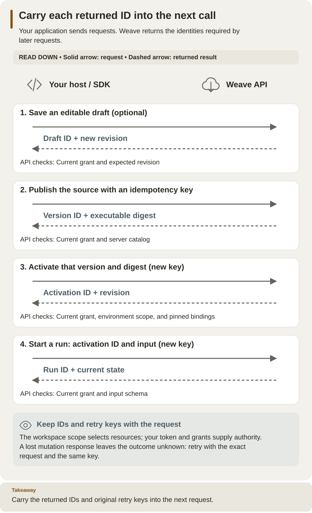

<!--
Copyright 2026 Firefly Software Foundation.

Licensed under the Apache License, Version 2.0 (the "License");
you may not use this file except in compliance with the License.
You may obtain a copy of the License at

    http://www.apache.org/licenses/LICENSE-2.0

Unless required by applicable law or agreed to in writing, software
distributed under the License is distributed on an "AS IS" BASIS,
WITHOUT WARRANTIES OR CONDITIONS OF ANY KIND, either express or implied.
See the License for the specific language governing permissions and
limitations under the License.
Author: Firefly Software Foundation
SPDX-License-Identifier: Apache-2.0
-->

# Python SDK

The Python package does three different jobs: it **describes** workflows and
Actions as data, **controls** a running platform over its HTTP API, and
**executes** your own business logic in a worker. This reference is for
integration developers who call Weave from a Python application. It explains
which entry point fits which job, how the client signs in and reports errors,
and which operations it offers.

**New to Weave?** Follow the [Python SDK tutorial](../guides/sdk-tutorial.md)
first: it has complete scripts and expected output, from a local simulation to
a durable run. Use this page afterward. For other languages, use the
[HTTP API](api.md); the [full API reference](api-explorer.md) describes the
same contracts.

You need Python 3.12 or later. Calls to a platform also need a running
platform, a way to sign in, and grants in a workspace; the sections below say
which.

## Choose the right Python tool

| Your job | Python entry point | Needs a running platform? | Start here |
| --- | --- | --- | --- |
| Build a workflow definition | `firefly_weave.sdk.builder.WorkflowBuilder` | No; it creates definition data | [Build the same workflow in YAML and Python](../guides/sdk-tutorial.md#4-build-the-equivalent-definition-in-python) |
| Check a definition | `firefly_weave.compiler.api.compile_source` | No; supply an explicit dependency catalog | [Compile and simulate locally](../guides/sdk-tutorial.md) |
| Describe an HTTP API call as an Action, without code | `firefly_weave.sdk.http_actions.author_http_action` (new in 0.1.0a7) | No; publishing the Action does | [Embedding: generate a no-code HTTP Action](embedding.md#generate-a-no-code-http-action) |
| Publish, activate, start, or read runs | `firefly_weave.sdk.client.WeaveClient` | Yes: its address, a sign-in, and a workspace | [Start with an existing API](#start-with-an-existing-api) |
| Reuse the sign-in and workspace of the CLI | `firefly_weave.sdk.profiles.ProfileStore` with `firefly_weave.sdk.sign_in.session_for` (new in 0.1.0a7) | Yes | [Reuse your saved platform](#reuse-your-saved-platform) |
| Manage people and roles | `firefly_weave.sdk.members.MembersClient` | Yes, as an administrator | [Give people the right access](../guides/people-and-access.md) |
| Assign and complete human work | `HumanTaskStep` and the `WeaveClient` human-task methods | Authoring is local; assignment and completion use the API | [Human tasks and approvals](../guides/human-tasks.md) |
| Send or reply to email | `firefly_weave.sdk.email.EmailClient` | Yes, with a scoped mail connection | [Email conversations and triggers](../connectors/email.md) |
| Run your business code for an Action | `firefly_weave.sdk.worker.Worker` with `WorkerTransport` | Yes; an operator admits the release and authorizes its worker | [Build and run a worker](../guides/workers.md) |
| Upload or download verified files | `firefly_weave.sdk.files.upload_file` and `download_file` | Yes; scoped file grants | [Files, step by step](../guides/files.md) |
| Transfer files inside a leased task | `upload_task_file` and `download_task_file`, with `WorkerTransport` | Yes; a current task lease | [Worker file transfers](../guides/files.md#5-use-a-file-inside-a-worker) |
| Author or evaluate reusable decision rules | `DecisionTableDefinition`, `DecisionTableStep`, `WeaveClient.evaluate_decision` | Author locally; published evaluation uses the API | [Decision tables](decision-tables.md) |
| Configure or ask Weave AI (API, permission and role names use `lumi`) | `WeaveClient.configure_lumi`, `lumi_status`, `ask_lumi` | Yes; a configured private gateway and explicit Weave AI roles | [Weave AI assistant](../guides/weave-ai.md) |
| Add a reusable connector | A connector package and its registration | Authoring is local; live calls need an installed executor and a connection | [Build a custom integration](../guides/custom-connectors-tutorial.md) |

**"New in 0.1.0a7" marks what alpha6 and earlier packages do not have:** saved
platforms and the no-code HTTP Action builder. The human-task, email,
membership, and run-lifecycle clients are also in alpha6; upgrade the client and
the server together.

**Python code never becomes a workflow step.** `WorkflowBuilder` produces the
same portable definition data you could write as YAML or JSON. Your own Python
function runs only in a worker handler, selected through an admitted Action.
`WeaveClient` sends HTTP requests; it never runs that handler inside your
product.

## Install in your application's environment

Install the SDK where your application runs. The [CLI installer](../installation.md)
puts the `weave` command in its own environment, so it does not add imports to
your application.

- The base `firefly-weave` wheel includes the compiler, the models, and
  `WorkflowBuilder`.
- Calls to a platform also need the `client` extra. Server and database
  dependencies are not needed.
- From this source checkout, run `uv sync --locked --no-editable --extra client`,
  then run scripts with
  `uv run --locked --no-editable --extra client python path/to/script.py`.
  `uv sync` removes packages that the extras you name do not need, so add
  every other extra this checkout uses (for example `--extra studio`) to the
  same command.
- For an application outside the checkout, install the matching release wheel
  with its `client` extra in that application's environment.

## Start with an existing API

`WeaveClient` needs three things: the platform's API origin, a **token
source** (a function or object that returns a current access token), and a
**scope** (the tenant, project, and environment UUIDs of your workspace). Choose
how to provide them:

| Your situation | Use |
| --- | --- |
| You already ran `weave auth setup` on this computer | [Reuse your saved platform](#reuse-your-saved-platform): no token or IDs to copy |
| A CI job or your operator supplies a token | [Use a supplied access token](#use-a-supplied-access-token) |
| Your application signs people in itself | [Device login, PKCE and stores](#device-login-pkce-and-stores) |

### Reuse your saved platform

Since 0.1.0a7, the SDK can use the same saved platform as the CLI,
Studio, and the desktop app: its server, its sign-in, and its workspace. First
connect once with [`weave auth setup`](../guides/connect-to-api.md#set-up-your-first-connection)
and choose a workspace. Then run this script in your application's environment:

```python
import asyncio

from firefly_weave.contracts.access import Scope
from firefly_weave.sdk.client import WeaveClient
from firefly_weave.sdk.profiles import ProfileStore
from firefly_weave.sdk.sign_in import session_for


async def main():
    # The active saved platform; pass a name to resolve() to pick another one.
    profile = ProfileStore().resolve()
    if profile.workspace is None:
        raise SystemExit("Choose a workspace first: weave auth workspace")
    workspace = profile.workspace
    scope = Scope(tenant_id=workspace.tenant_id, project_id=workspace.project_id,
                  environment_id=workspace.environment_id)
    # The session reads and renews the saved sign-in in the platform's credential store.
    async with WeaveClient(profile.server, session_for(profile), scope) as client:
        await client.catalog()
        print("Catalog read succeeded on", profile.name)

asyncio.run(main())
```

Expected: `Catalog read succeeded on NAME`, where `NAME` is your saved
platform. The script reads `profiles.json` from the folder described in
[What is saved, and where](../guides/connect-to-api.md#what-is-saved-and-where),
and uses the credential store that platform was saved with. It never prints a
token. When you are signed out, or the sign-in has expired and cannot renew,
the request raises `firefly_weave.sdk.auth.AuthError` with `code`
`WV-AUTH-REQUIRED`: run `weave auth login`, then retry. With no active
platform, `resolve()` raises `ProfileError` with `code` `WV-PROFILE-NONE`.

### Use a supplied access token

Use this in CI, or when your operator supplies a token. Keep `WEAVE_BASE_URL`,
the three scope IDs, and `WEAVE_ACCESS_TOKEN` in the same shell, as described in
[Use a supplied access token](../guides/connect-to-api.md#use-a-supplied-access-token):

```python
import asyncio
import os
from firefly_weave.contracts.access import Scope
from firefly_weave.sdk.client import WeaveClient

scope = Scope.model_validate({
    "tenant_id": os.environ["WEAVE_TENANT_ID"],
    "project_id": os.environ["WEAVE_PROJECT_ID"],
    "environment_id": os.environ["WEAVE_ENVIRONMENT_ID"],
})

def access_token():
    # Called once per request; supply a current token from your approved source.
    return os.environ["WEAVE_ACCESS_TOKEN"]

async def main():
    # The context manager closes the HTTP client after this read-only request.
    async with WeaveClient(os.environ["WEAVE_BASE_URL"], access_token, scope) as client:
        catalog = await client.catalog()
        print("Catalog read succeeded")

asyncio.run(main())
```

Expected: `Catalog read succeeded`. This callback rereads the environment but
never renews the token: when it expires, requests fail with HTTP 401 until you
supply a new one. Production hosts plug in their own acquisition and renewal,
as described in [client lifecycle](#client-lifecycle-and-errors).

**Publishing, activating, and starting runs need more grants.** The
[lifecycle example](#extend-the-host-to-publish-activate-and-run) lists them.
Do not copy local tutorial IDs to another platform.

## Compile the tutorial workflow through the API

This section continues the **manual standalone tutorial** and reuses its
private receipt and token file. If you used `weave platform setup`, follow the
shorter [SDK tutorial's local-platform option](../guides/sdk-tutorial.md#6-connect-your-python-application-to-an-api)
instead: it has the whole publish-to-result script. With an existing API, keep
the `scope` and token source from the previous section.

1. **Restore the standalone session.** Complete the
    [standalone tutorial](../guides/standalone.md) and keep its `WEAVE_WORK_DIR`
    and `WEAVE_API_URL` variables and a current `host-token.json`. In a new
    terminal, use its [resume steps](../guides/standalone.md#resume-this-installation-later)
    first. The host principal needs `catalog.read` and `compile` in the project.

2. **Refresh the token.** Run this in terminal 1, with the original identity
    and runtime configuration loaded:

    ```sh
    # Point at the host-facing API address, not the container address used by workers.
    export WEAVE_API_URL="http://127.0.0.1:${WEAVE_API_PORT:?Restore the standalone session}"
    # Acquire and verify a new weave-host token; it replaces host-token.json and prints no token.
    "$WEAVE_PYTHON" "$WEAVE_WORK_DIR/refresh-token.py"
    ```

    The helper from standalone step 3 changes no grants.

3. **Save and run the script.** Save this as `.local/tutorial/host-client.py`
    and run it with `"$WEAVE_PYTHON" .local/tutorial/host-client.py`, so it uses
    the same installed package as the local API. If you completed the
    [quickstart](../quickstart.md) elsewhere, copy its `echo.workflow.yaml` into
    `.local/tutorial/` first:

    ```python
    import asyncio
    import json
    import os
    from pathlib import Path
    from firefly_weave.contracts.access import Scope
    from firefly_weave.sdk.client import WeaveClient

    root = Path(os.environ["WEAVE_WORK_DIR"])
    receipt = json.loads((root / "first-run.json").read_text())
    scope = Scope.model_validate(receipt["scope"])

    def access_token():
        return json.loads((root / "host-token.json").read_text())["access_token"]

    async def main():
        source = Path(".local/tutorial/echo.workflow.yaml").read_text()
        async with WeaveClient(os.environ["WEAVE_API_URL"], access_token, scope) as client:
            catalog = await client.catalog()
            result = await client.compile(source=source, format="yaml", catalog=catalog,
                                          filename="echo.workflow.yaml", strict=True)
            for diagnostic in result.diagnostics:
                print(diagnostic.code, diagnostic.path)
            assert result.ok and result.artifact is not None
            print(result.artifact.digest)

    asyncio.run(main())
    ```

    Expected: a 64-character artifact digest. The server compiled the source;
    nothing was saved, published, or executed. The callback rereads the token
    file on every request but does not renew an expired token: refresh it as in
    step 2.



Read downward and carry each returned ID into the next request. Saving a draft
is optional; the example below starts at publication and uses a separate
idempotency key for each change.
[Open diagram at full size](../diagrams/authoring-host-sequence.svg).

## Extend the host to publish, activate, and run

Put this block inside the `async with` above, after a successful compilation.
It changes the platform and needs `definition.publish`, `release.activate`,
`run.start`, and `run.read`. Add `from firefly_weave.contracts.catalog import
ActivationRequest` and `from firefly_weave.contracts.runtime import
StartRunRequest` at the top of the script.

```python
version = await client.publish("workflows", source, "yaml",
                               idempotency_key="tutorial-echo-publish-1")
# Bind that exact immutable version to the selected environment.
activation = await client.activate(
    ActivationRequest(version_id=version.id, artifact_digest=version.digest,
                      scope=scope),
    idempotency_key="tutorial-echo-activate-1",
)
# Each intentional execution gets its own run request and idempotency key.
run = await client.start_run(
    StartRunRequest(activation_id=activation.id, input={"message": "Hello, Weave"}),
    idempotency_key="tutorial-echo-run-1",
)
# A start receipt is admission, so read the run to observe execution progress.
current = await client.read_run(run.id)
print(current.id, current.state.status, current.state.output)
```

Expected: the run ID, then `succeeded` and `{'message': 'Hello, Weave'}` once
the run has finished; read it again if it has not. The version identifies
immutable source, the activation selects it for this environment, and the run
records one execution. Echo needs no worker or connection.

**Reuse a key only to retry the same request.** Use a new run key for each new
run. If you change the published source, choose a new workflow version and new
publication and activation keys: a changed body with an old key conflicts. A
timeout does not prove that a change failed; keep its key and read the
resources before you decide to retry.

## Client lifecycle and errors

**Use it asynchronously.** `WeaveClient` is asynchronous: open it with
`async with` and `await` each operation. Using it as a synchronous context
manager fails with a clear error. On exit, it closes its HTTPX client and any
transport you supplied, and it cannot be reused.

**Token sources.** The client accepts either kind:

- a synchronous function, called once per request, so your host can rotate
  tokens without creating a new client (an `async` function is rejected here);
- an object with `async get_access_token(target)`, which receives the exact API
  origin. `OAuthSession` and the session of a saved platform are such objects.

**Scope.** Pass a `Scope` with your tenant, project, and environment. `None` is
allowed only for operations without a scope, such as
`await client.invoke("identity.read")`, which returns who you are and the
workspaces you can use.

**Network rules.**

- The base URL is an exact HTTPS origin; HTTP works only on loopback
  (`localhost`, `127.0.0.1`, `::1`) for local development.
- Requests have bounded timeouts and response sizes.
- The client never follows redirects, inherits proxy settings from the
  environment, accepts compressed responses, or retries on its own. A
  transport error during a change leaves its outcome unknown.
- It always uses the canonical `/api/v1` paths and quoted revisions, validates
  request and response models exactly, and rejects unsupported wire or
  artifact versions.

**Errors.**

| Exception | Meaning | What to do |
| --- | --- | --- |
| `WeaveError` | The platform answered with an error. It exposes `status`, `code`, `request_id`, `diagnostics`, and the safe `problem` | Read `code`; the [HTTP API failure table](api.md#when-a-request-fails) lists the common ones |
| `PreconditionFailed` | A `WeaveError` for HTTP 412: your revision is stale | Read the resource again and resend with the current revision |
| `TransportError` | The request may or may not have reached the platform | For a change, keep the key and check the resource before retrying |
| `ContractError` | The answer does not match the expected contract or version | Check that client and server versions match |

`PreconditionFailed`, `TransportError`, and `ContractError` are subclasses of
`WeaveError`, so catch them before it. Exception text never includes provider
or transport bodies. Results that can be
"unavailable" (some runs, tasks, and resources) stay typed instead of being
turned into successful payloads.

## Operation families

Every method is `async` and needs the matching capability in the client's
scope. The [operation inventory](api.md#operation-inventory) lists each
capability.

| Methods | Purpose |
| --- | --- |
| `compile`, `validate`, `catalog`, `schemas`, `capabilities`, `language` | Compile and validate; read the catalog, the supported language, limits, and connectors, and the language manifest (`language()` returns a `LanguageManifest`) |
| `list_connector_descriptors`, `read_connector_descriptor` | Installed connectors and the exact manifest to publish (new in 0.1.0a7) |
| `save_draft`, `read_draft`, `export_draft`, `delete_draft`, `list_definitions` | Append-only drafts, their retirement, and catalog discovery |
| `publish`, `read_definition`, `export_definition`, `retire_definition` | Immutable workflow, Action, and Connector versions |
| `activate`, `read_activation`, `export_activation`, `retire_activation`, `list_activations` | Pin versions to an environment |
| `create_connection`, `read_connection`, `test_connection`, `list_connections` | Immutable integration connections that hold only secret handles, and explicit checks |
| `start_run`, `read_run`, `signal`, `cancel`, `retry`, `list_runs` | Durable runs |
| `pause_run`, `resume_run`, `run_lifecycle`, `archive_run`, `restore_run`, `purge_run` | Run lifecycle management |
| `history`, `export_run`, `replay`, `run_incidents`, `list_incidents`, `resolve_incident` | Bounded evidence and audited recovery |
| `human_tasks`, `read_human_task`, `claim_human_task`, `release_human_task`, `complete_human_task`, `reassign_human_task` | Human task inbox and decisions |
| `assignment_bindings`, `put_assignment_binding`, `put_human_group` | Who may work on which human task |
| `register_release`, `read_release`, `list_releases`, `register_worker`, `read_worker`, `list_workers`, `revoke_worker`, `grant_connection` | Trusted worker releases and instances |
| `drain_worker`, `resume_worker` | Revision-checked worker controls; existing leases can settle while drained |
| `invoke("deployment_targets.…")`, `invoke("deployments.…")`, `invoke("deployment_observations.…")`, `invoke("deployment_plans.…")`, `invoke("deployment_jobs.…")`, `invoke("deployment_runners.…")` | Typed, environment-scoped Operations contracts; operation names and required authority are in the [API inventory](api.md#operation-inventory) |
| `claim_tasks`, `heartbeat`, `complete_task`, `fail_task`, `request_credentials` | The typed [worker protocol](worker-protocol.md); `WorkerTransport` remains supported |
| `create_trigger`, `read_trigger`, `list_triggers`, `disable_trigger` | Immutable signed webhook triggers |
| `save_schedule`, `read_schedule`, `list_schedules`, `schedule_history`, `change_schedule` | UTC schedules with revisions and occurrence pages |
| `create_broker_trigger`, `read_broker_trigger`, `list_broker_triggers`, `disable_broker_trigger`, `retry_broker_trigger`, `list_broker_incidents` | Start runs from broker (Kafka) messages |
| `save_subscription`, `read_subscription`, `list_subscriptions`, `disable_subscription`, `read_delivery`, `list_deliveries`, `retry_delivery`, `delivery_attempts` | Outgoing event subscriptions and deliveries |
| `list_source_bindings`, `read_source_binding`, `revoke_source_binding` | Connection source bindings |
| `create_provider_source`, `read_provider_source`, `list_provider_sources`, `disable_provider_source`, `read_provider_receipt`, `list_provider_receipts`, `retry_provider_receipt` | Incoming messaging-platform events |
| `read_teams_reference`, `list_teams_references`, `revoke_teams_reference`, `reactivate_teams_reference`, `whatsapp_delivery_state`, `list_whatsapp_status_facts` | Teams conversation references and WhatsApp delivery status |
| `read_compatibility`, `check_compatibility`, `plan_retention`, `read_retention_plan`, `apply_retention` | Compatibility reports and retention plans |
| `create_debug`, `inspect_debug`, `command_debug` | Effect-free debug sessions with virtual time |
| `create_tenant`, `create_project`, `create_environment`, `read_environment`, `grant` | Provisioning, separately authorized |

`MembersClient(client)` and `EmailClient(client)` wrap a `WeaveClient` for
people administration and email. `invoke(operation_id, ...)` is the
registry-checked adapter that the CLI uses; prefer the typed methods in your
code. Paginated methods return a typed `Page`, except run history, whose
`EventPage` also carries its high-water mark. Resource IDs and cursors must
belong to the client's scope. Secret leases use the `CredentialLease` model,
whose ordinary serialization leaves out the resolved value.

## Deployment Operations through the SDK

Use `WeaveClient.invoke` with models from
`firefly_weave.contracts.deployments`. It resolves only registered operations,
validates request and response contracts, and uses the client's existing
authentication and exact environment scope. For example, inside an active
client context:

```python
from uuid import UUID
from firefly_weave.contracts.deployments import ObserveRequest

job = await client.invoke(
    "deployment_observations.create",
    body=ObserveRequest(target_id=UUID(target_id)),
    idempotency_key=request_id,
)
```

Retain `request_id` when retrying that same request. Poll `deployment_jobs.read`
with `identifier=job.id`; successful observation jobs identify the persisted
snapshot. Build a plan using its observation ID and the desired deployment's
exact revision. Read and review the returned plan before approving its digest
and applying it with a separate retained idempotency key. Updates use
`revision=` for `If-Match`; lists accept bounded `query` filters and cursors.

Approval and apply require explicit grants. The outbound runner uses a
separate application identity and local provider configuration. Do not put
cloud credentials, command strings, or raw manifests in API bodies. See
[Operations authority and reconciliation](api.md#deployment-operations-authority)
for the checks that still apply after a plan was approved.

## Device login, PKCE and stores

Use this section when your own application signs people in, instead of
receiving a token or reusing a saved platform. Three terms:

- **Device sign-in** (also called device login) shows a code that the person
  approves in a browser, possibly on another device.
- **PKCE** (Proof Key for Code Exchange) binds a browser sign-in to the client
  that started it; **S256** is its SHA-256 challenge method.
- A **credential store** keeps the resulting tokens between runs of your
  program.

The [CLI sign-in commands](cli.md#login-and-secure-persistence) use these same
building blocks.

### Sign in from your application

`OAuthSession(LoginConfig(...), store)` signs in and supplies tokens to
`WeaveClient`. The [connection file fields](cli.md#connection-files) describe
every `LoginConfig` field.

```python
import asyncio

from firefly_weave.sdk.auth import LoginConfig, OAuthSession
from firefly_weave.sdk.client import WeaveClient
from firefly_weave.sdk.credentials import NativeCredentialStore

# Non-secret sign-in settings from your operator; "account" names this credential record.
login = LoginConfig(
    provider_id="corp-oidc",
    issuer="https://login.example.com/realms/weave",
    client_id="weave-cli",
    target="https://weave.example.com",
    account="my-app",
)
session = OAuthSession(login, NativeCredentialStore())


async def main():
    if session.status()["state"] != "signed_in":
        # Opens the browser on this computer; use flow="device" to show a code instead.
        await session.login(flow="browser")
    # No scope is needed to ask who you are; the session renews the token when needed.
    async with WeaveClient(login.target, session, None) as client:
        identity = await client.invoke("identity.read")
        print("Signed in as principal", identity.principal_id)


asyncio.run(main())
```

Expected: the browser opens your identity provider's sign-in page, then
`Signed in as principal` and a UUID. Replace every `LoginConfig` value with
your operator's; these are illustrative, not a preset for a named provider.

**What the session does.**

- It needs no server settings, database, or Weave authorization of its own.
  Discovery checks the exact issuer, and every provider endpoint must be on the
  issuer's origin or an explicitly trusted origin.
- The credential record is bound to the provider, issuer, client ID, API
  origin, and `account`. `account` is a local storage name, not a claim about
  who signed in.
- It sends access tokens only. ID tokens are never used to call the API.

**Flows.** `login(flow=...)` accepts:

| Flow | Behavior |
| --- | --- |
| `"auto"` (default) | Device sign-in when the provider advertises it, otherwise browser sign-in |
| `"browser"` or `"pkce"` | Browser sign-in with PKCE S256 and a callback on a random loopback port |
| `"device"` | Device authorization; it never falls back to another flow after a denial |

The CLI chooses differently for saved platforms: its `auto` prefers the browser
when one can open. Browser sign-in binds its loopback listener before opening
the browser, checks the exact callback host, path, `state`, and the issuer when
the provider advertises it, rejects repeated or ambiguous callbacks, and closes
everything on cancellation or timeout. Pass `browser=` or `instructions=` to
show the address or code in your own interface. For browser sign-in,
`prompt="login"` or `prompt="select_account"` makes the provider ask for an
account again. Every
wait is bounded by `login_timeout`; denial and expiry save no credentials. The
result also holds `identity`: an unverified display hint from the ID token, for
showing and linking only.

`status()` reads only local data and never contacts the provider. It returns
`state` (`signed_in`, `expired`, `signed_out`, or `in_progress`),
`authenticated`, `refresh_available`, `expires_at`, and
`reauthentication_required`. `logout(revoke=True)` removes the local record and
reports `remote_revocation` as `confirmed`, `unconfirmed`, or `not_requested`.

### Choose a credential store

**`NativeCredentialStore()` (default choice).** It uses the operating system's
store: macOS Keychain, Windows Credential Locker, Linux Secret Service, or
KWallet. It refuses an unknown or insecure backend, and it never falls back to
a plaintext file silently. The Windows and Linux stores are covered by unit
tests only.

**`FileCredentialStore(absolute_path)`, for macOS and Linux only.** Windows
refuses it. Its folder must already exist, belong to you, and have mode 0700.
The record and its lock files must be regular files you own, with mode 0600 and
a single link. Symbolic links are refused anywhere in the path. Each
replacement writes an exclusive temporary file, syncs it, renames it
atomically, and syncs the folder.

### How sign-in, renewal, and sign-out stay consistent

Several processes, or several tasks in one process, can share one credential
record. The session uses a lock per record and a fresh generation UUID for each
change, so that a late answer never overwrites newer state:

- **Sign-in** first saves a token-free `authenticating` record. Tokens are
  saved only if that exact attempt is still pending. A sign-out, a deletion, or
  a newer sign-in makes a late completion save nothing. A new sign-in replaces
  the previous credentials, so cancelling it can leave you signed out.
- **Renewal** holds the same lock. Before sending the refresh token, it saves a
  token-free `refreshing` fence; only memory keeps the old refresh token. If the
  fence cannot be saved, no request is sent. The new tokens must replace the
  record before an access token is returned. After a crash, an ambiguous
  answer, or a failed save, the fence remains and the next process asks for a
  new sign-in; old tokens are never restored. A renewal that provably never
  reached the provider keeps the previous sign-in and fails with
  `WV-AUTH-OFFLINE`. A wider scope or a missing rotation is rejected.
- **Sign-out** saves a token-free signed-out record and removes the local
  record under the lock. A failed removal is an error. Revocation cannot shorten
  an access token that was already issued, or undo its effects.

On POSIX, cooperating processes lock through a shared lock file that is never
replaced or deleted while in use. On Windows, the native store adds a
per-record in-process lock before the per-user named mutex, because the mutex
alone lets one thread enter twice. Both stages share one 60-second deadline.
"Durable" means the store acknowledged an atomic write; guarantees against
power loss depend on your operating system. Tokens and verifiers never appear
in `repr`, CLI JSON, lock files, or errors.

**Provider note.** The bundled local environment uses Keycloak, whose
stale-refresh check compares whole-second timestamps. This is an observation
about that local provider, not a requirement to deploy Keycloak: the client
fence stops cooperating processes from reusing an old record regardless of
the provider. A rotated token alone does not prove stronger replay protection
on the provider side. See [identity and secrets](../operations/identity-and-secrets.md)
for compatible OIDC settings.

## Next steps

- Run the complete flow from Python in the [SDK tutorial](../guides/sdk-tutorial.md).
- Execute your own code for an Action with a [worker](../guides/workers.md),
  and look up its contract in the [worker protocol](worker-protocol.md).
- Generate workflows or no-code HTTP Actions from your product with
  [embedding](embedding.md).
- Check any operation's request and response in the
  [full API reference](api-explorer.md).
