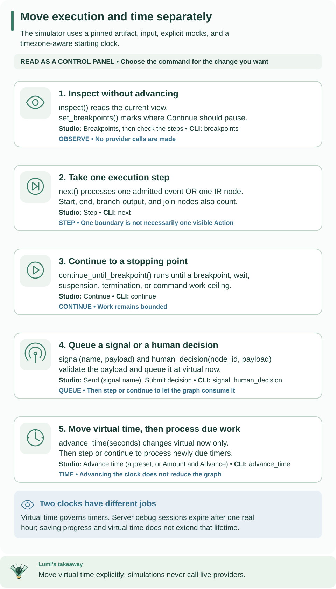

<!--
Copyright 2026 Firefly Software Foundation.

Licensed under the Apache License, Version 2.0 (the "License");
you may not use this file except in compliance with the License.
You may obtain a copy of the License at

    http://www.apache.org/licenses/LICENSE-2.0

Unless required by applicable law or agreed to in writing, software
distributed under the License is distributed on an "AS IS" BASIS,
WITHOUT WARRANTIES OR CONDITIONS OF ANY KIND, either express or implied.
See the License for the specific language governing permissions and
limitations under the License.
Author: Firefly Software Foundation
SPDX-License-Identifier: Apache-2.0
-->

# Mock-only simulation

The simulator executes the pinned compiled artifact through the same pure reducer
as production. It never calls a connector, secret provider, worker transport or
network. It verifies the current imported artifact and shared classified-value
policy before accepting inputs or mocks. It does not establish live readiness or
prove external behavior.



Read each command beside its state change. The lower two rows prepare facts or time; use next or continue afterward to advance execution. Virtual time and server expiration are independent. [Open the diagram at full size](../diagrams/authoring-simulation-controls.svg).

## Run the echo artifact

First complete [workflow authoring](../guides/workflow-authoring.md), which creates
`.local/tutorial/compiled/compiled-artifact.json`. You need only the base Python
installation. For durable execution with a database and history, use the
[standalone tutorial](../guides/standalone.md).

A **mock** is a fixed output supplied in place of an external Action. Echo needs
none. A **breakpoint** pauses before a named execution node so you can inspect
its input and the current variables. Run this from the checkout root:

```python
from datetime import UTC, datetime
from pathlib import Path
from firefly_weave.compiler.api import import_artifact
from firefly_weave.operations.debug.simulator import Simulator

artifact = import_artifact(
    Path(".local/tutorial/compiled/compiled-artifact.json").read_bytes()
)
sim = Simulator(artifact, mocks={}, input={"message": "Hello, Weave"},
                now=datetime(2026, 1, 1, tzinfo=UTC))
sim.set_breakpoints({"echo"})
paused = sim.continue_until_breakpoint()
assert paused.status == "paused" and paused.selected_node == "echo"
stepped = sim.next()
saved = sim.serialize()
sim = Simulator.restore(saved)
finished = sim.continue_until_breakpoint()
assert finished.status == "succeeded"
print(finished.variables["output"])
```

Expect `{'message': 'Hello, Weave'}`. `next()` executes one boundary, which can be
an internal start/end node or an admitted event as well as an author step.
Restoring the serialized session preserves that progress and virtual time; it
starts no worker and changes no production run.

## Mock Actions and control time

For the onboarding compiler fixture in the authoring guide, use
`{"action:onboarding.check-customer@1.0.0": {"eligible": true}}` as the JSON
`mocks` value. Supply `{"customerId": "demo"}` as input. Continuing stops at the
signal wait; send `customer-approved` with `{"approved": true}`, then continue
to get `{"accepted": true}`. This explores the declared contract without
installing the external implementation.

Mock keys are `action:<exact-reference>` or `node:<full-IR-node-id>` for Action
nodes. Node values override action values. Unknown keys and values violating any
pinned Action/implementation output schema are rejected. A JSON list is one
ordinary mocked result. There is no retry-outcome scripting or live fallback.
Missing mocks yield `WV-DEBUG-MISSING_MOCK` and a failed debugger view.

`weave workflow simulate REQUEST --output json` accepts a JSON object with
`artifact` (the exact compiled envelope), `mocks`, `input`, and timezone-aware
`now`. The authoring guide creates `.local/tutorial/simulation-request.json`
with those fields. By default the CLI continues until a breakpoint, quiescent
wait, suspension, or termination.

To control the echo session, save this as `.local/tutorial/commands.json`:

```json
[
  {"kind": "breakpoints", "node_ids": ["echo"]},
  {"kind": "continue"},
  {"kind": "next"},
  {"kind": "continue"}
]
```

```sh
weave workflow simulate .local/tutorial/simulation-request.json \
  --commands .local/tutorial/commands.json --output json
```

Expect the final view to be `succeeded`; the command array pauses, steps, and then
continues within one CLI invocation. For a signal-waiting onboarding session,
`{"kind": "signal", "name": "customer-approved", "payload": {"approved": true}}`
queues the approval. For a timer, `{"kind": "advance_time", "seconds": 30}` moves
virtual time forward. Follow either operation with `{"kind": "continue"}` to
process the queued fact or newly due timer.

The library exposes `next`, `continue_until_breakpoint`, `signal`, `advance_time`,
`inspect`, and `set_breakpoints`. Constructor and inspection execute no nodes.
Only `advance_time` moves time; signals and time movement return inspection
without reducing the graph. Signal schema checks happen before queuing a receipt.

## Reading the debugger view

| Field | How to use it |
| --- | --- |
| `status` | Distinguish a breakpoint pause, a wait, success, and failure |
| `selected_node` | The next ready node, or null when no node is ready |
| `active_nodes` | Outstanding waits and tasks |
| `variables` | Current run data, including input, step values, and final output |
| `diagnostics` | Debugger errors such as a missing mock |
| `now` | Virtual time; sleeping in your shell does not change it |

A wait is not a failure. Send the expected signal or advance virtual time, then
continue. An unknown breakpoint ID is an error; use IDs from `workflow explain`.

## Boundaries and state

Each `next` admits one synthetic runtime fact **or** reduces one IR node. Event
admission increments accepted sequence once; nodes never create extra production
receipts. Start, end, branch-output and join nodes are visible labeled boundaries.
Action reduction prepares an isolated task intent. Mock completion is a later
fact boundary, released only after that event's node queue has drained.

`selected_node` identifies the next ready node; `active_nodes` lists asynchronous
waits/tasks. `current_nodes` combines them. Breakpoints use complete IR IDs,
including synthetic IDs, and stop before effects. Continuing a paused breakpoint
consumes that stop once. Ordered ready queues, event IDs, virtual timestamps and
boundary history survive serialization. Server IDs and wall-clock metadata are
outside the comparable `view` trace.

A cursor retains the original event checkpoint separately from speculative local
steps. An evaluation or classified-output incident rolls back every partial node
change and command from that event while retaining its valid prepared `@run`
deadline. Production `transition` drains this exact reducer atomically. There is
no generator stack or second mapping/control-flow implementation.

Due overall timeout wins, followed by terminal signal timeouts, then duration
continuations ordered by due time/node ID. A signal receipt must strictly precede
its signal deadline; equality loses. Receipt selection uses acceptance time/ID.
Duration waits cannot wake early. Suspension preserves the same deferred-fact
barrier as production. Kernel incidents remain `suspended`; missing mocks are a
debugger failure and do not fabricate a production worker incident.

## Server sessions

Routes are project-scoped beneath `/api/v1/tenants/{tenant}/projects/{project}`:

- `POST /debug/sessions`: the same `{artifact,mocks,input,now}` request; returns
  `{id,revision,created_at,expires_at,view}`, initially revision 1.
- `GET /debug/sessions/{id}`: authorized inspection.
- `POST /debug/sessions/{id}/commands`: one command from the array above;
  requires `If-Match` with the current revision, for example `"1"`.

Every operation requires the creator and a current project `simulate` capability.
No environment, activation, connection grant or worker release is required.
Tenant RLS and project predicates are independent of creator checks. Each mutation
locks the session row, reloads current grants, checks database-time expiry and
revision, then atomically commits one new revision. A stale revision returns HTTP 409;
expired sessions return HTTP 410. The fixed one-hour expiry never moves with virtual
time or inspection, and the application role cannot update its columns.

Native services keep no mutable simulator singleton. A fresh process restores the
serialized row. The exact imported source envelope and its source map are pinned;
filenames are labels and never server filesystem access. Expired rows are retained;
this release does not automatically purge them.

## Resource and data policy

Operator-owned release defaults are 10,000 node reductions, 10,000 synthetic
facts, 10,000 mutation commands, 1,000 pending signal receipts, 10,000 boundaries
per continue command, 366 days of total virtual movement, 3,600 seconds of server
lifetime and 64 MiB per serialized session. The byte ceiling includes the artifact,
mocks, cursor/checkpoint, queues, state and histories. Existing source/compiler
and per-payload ceilings still apply. Authors cannot override limits through the
workflow or HTTP request. Local embedding can supply operator-owned `DebugLimits`.

These are additional debugger limits: a valid production workflow can exceed the
session budget. The measured 80-transform workflow copying a 900,002-byte JSON
input reached 65,767,814 serialized bytes after 37 boundaries; the next command
was rejected by the 67,108,864-byte ceiling. `WV-DEBUG-LIMIT` is a debugger capacity
error, not compiler invalidity. A rejected command preserves its entry checkpoint
and server revision; it never stores partial progress. Continue's internal work
ceiling returns its bounded progress so another command can resume.

Secret-marked ordinary values are rejected at shared admission boundaries; no
masked values are executed. Computed rejection uses the kernel rollback above.
Unannotated ingress/business values remain the author's classification and the
operator's storage/access responsibility. No new classifier, taint engine or
protected secret store exists in the debugger. Structured errors never include
rejected payloads or fingerprints.
