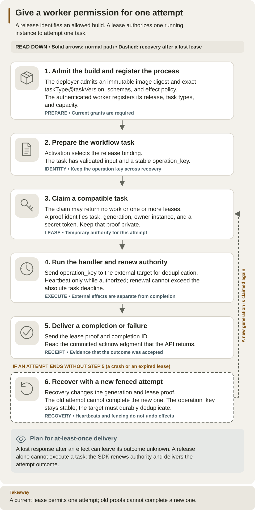

<!--
Copyright 2026 Firefly Software Foundation.

Licensed under the Apache License, Version 2.0 (the "License");
you may not use this file except in compliance with the License.
You may obtain a copy of the License at

    http://www.apache.org/licenses/LICENSE-2.0

Unless required by applicable law or agreed to in writing, software
distributed under the License is distributed on an "AS IS" BASIS,
WITHOUT WARRANTIES OR CONDITIONS OF ANY KIND, either express or implied.
See the License for the specific language governing permissions and
limitations under the License.
Author: Firefly Software Foundation
SPDX-License-Identifier: Apache-2.0
-->

# Remote worker protocol

Use this reference when implementing a task transport or diagnosing lease and
completion behavior. The [worker guide](../guides/workers.md) explains the example
handler and deployment order; the [standalone tutorial](../guides/standalone.md)
is the first-run prerequisite before adding workers.

## The task lifecycle

| Term | Meaning |
| --- | --- |
| Release | Immutable build identity and declared capabilities admitted by a deployer |
| Instance | A registered running process owned by the authenticated worker principal |
| Task | One external operation prepared by a workflow Action |
| Lease | Time-limited permission for an instance to attempt that task |
| Generation | Attempt number used to reject stale authority after recovery |
| Operation key | Stable external idempotency key across attempts of the same task |
| Completion ID | Identifier for one submitted outcome and its replayable receipt |
| Receipt | The server's durable acknowledgment of that outcome delivery |

The normal order is **admit release → register instance → claim → heartbeat while
working → complete or fail**. Registration does not create a task. A claim can
return an empty list while no eligible workflow work exists. Credentials, when
needed, use a separate authorized lease request.



Read down from admission and registration through claim, heartbeat, outcome, and recovery. Recovery changes attempt authority while preserving the operation key; the target must use that key to deduplicate effects. [Open the diagram at full size](../diagrams/authoring-worker-lifecycle.svg).

## Authentication and endpoints

The [worker example](../../examples/worker/main.py) imports only the worker SDK and
HTTP client. It receives no database or administrator credentials. A separately
provisioned identity-provider client obtains an access token for the configured
API audience (`weave-api` in the local tutorial); the API uses
its normal OIDC verifier and local identity link. The `worker` role grants no
authoring rights. Provider roles alone grant nothing.

Every endpoint below is relative to
`/api/v1/tenants/{tenant}/projects/{project}/environments/{environment}` and requires a
Bearer access token plus a current local scoped grant.

| Operation | POST path | Body / result |
| --- | --- | --- |
| Admit immutable release | `/worker-releases` | Deployer sends `image_digest`, exact `capabilities`, optional `credential_capabilities`/trusted `connector_bindings`; returns release ID |
| Register instance | `/workers` | `release_id`, exact `task_types`, `capacity`; returns worker ID owned by authenticated principal |
| Claim | `/tasks/claim` | `worker_id`, `limit`; returns zero or more `TaskLease` values |
| Renew | `/tasks/heartbeat` | Current `LeaseProof`; returns updated expiry |
| Complete | `/tasks/complete` | `lease`, unique `completion_id`, schema-valid `output`; returns committed receipt |
| Fail | `/tasks/fail` | `lease`, `error` with completion ID, bounded code and outcome |
| Credentials | `/tasks/credentials` | Live `lease`, bound `connection_revision_id`, `slot`; returns short lease with `Cache-Control: no-store` |

For example, after a deployer admits the example release, registration sends:

```json
{
  "release_id": "<the admitted release UUID>",
  "task_types": ["example-record@1.0.0"],
  "capacity": 1
}
```

Replace the UUID placeholder with the actual returned release ID. Save the
registration result's `id` as `worker_id`; a claim body is then
`{"worker_id": "<that instance UUID>", "limit": 1}`. Never fabricate a lease proof:
use the exact proof returned in the claim response for renewals and outcomes.

`LeaseProof` contains task ID, generation, owner instance ID and secret token.
Never log or persist it in ordinary telemetry. `TaskLease` also carries immutable
input, stable `operation_key`, capability, admitted release ID, expiry and absolute
deadline. Native connectors share these semantics; their invocation metadata is
private and unavailable to remote workers.

## SDK runner and token lifetime

Use `WorkerTransport` with an authenticated `httpx.AsyncClient` and `Worker` with
handlers keyed by exact `taskType@taskVersion`. The runner bounds concurrency,
renews leases and cancels execution on authority/deadline loss. SIGTERM requests
a drain; supervise the process with an outer shutdown bound. The example acquires
one token at startup and is explicitly finite. It stops claiming 210 seconds before
token expiry, reserving its 180-second task contract and a 30-second margin. A final
15-second expiry margin bounds the invocation. Tokens too short for that policy
fail before claims. A supervisor can start a new invocation with fresh credentials
after the previous invocation exits. `WorkerTransport` does not refresh tokens.
This policy applies to the example's declared task timeout, not arbitrary handlers.

## Retries and lost responses

Delivery is **at least once**. Pass `operation_key` to an external target that
stores its own durable idempotency receipt. The key stays stable when recovery
creates a new generation. A stale generation/proof cannot complete a newer
attempt. An identical accepted completion ID/body replays its receipt; changing
the output conflicts. A lost completion response is ambiguous: do not rerun the
handler to compensate. Only HTTP 429 with exact `WV-REQUEST-CAPACITY` or
`WV-OPERATION-CAPACITY` is explicit rejected admission: claim returns no leases,
letting the stop-aware worker poll again without canceling active handlers.
Heartbeat retries only those codes, with at most three total attempts, 50/100ms
backoff and a one-second window after the first rejection. Completion and failure
delivery allow at most 48 total attempts within ten seconds after the first
rejection, with 50/100/200ms backoff followed by a 250ms cap. The existing
lease/deadline watchdog can stop retries sooner. Each
attempt uses identical serialized proof, completion ID and payload bytes; handlers
are never rerun. Unknown 429, authorization errors, server errors, disconnects,
timeouts and malformed successful responses remain fatal without automatic retry.
Credential requests are unchanged. These bounded retries do not resolve an
ambiguous outcome or renew expired authority.

For example, suppose the target records a customer and the worker crashes before
Weave accepts completion. Recovery can issue generation 2 for the same task.
That handler must send the same `operation_key`, letting the target return its
original receipt. Lease fencing prevents generation 1 from advancing generation
2's graph; only target-side deduplication prevents a duplicate external record.

Only safe declared effects retry inside the pinned attempt/deadline policy.
Ambiguous non-idempotent effects raise incidents. Weave does not promise exactly-once
external effects. The local acceptance target's independent in-memory receipt map
survives API/worker restarts in the test; a production target must retain receipts
for its required replay window.

Credential access additionally requires explicit release opt-in, administrator
release/connection/capability grants, the activation's bound connection, current
live lease and operator handle-to-provider grant. Host/worker inputs cannot select
secret-provider locators, destination policy or native executor authority.

The crash acceptance launcher lives under `tests/e2e/support/` and is copied only
into its owned test container before startup. Production source and images have
no fault environment switch. The test launcher records a private lease proof after
the receiver accepts the effect, then exits before completion; ordinary SDK
handlers use no such hook.

## Cancellation and suspended branches

Structured branch failure cancels pending work and cooperatively revokes issued
sibling leases in the same run transaction. A valid proof for the exact still-live
generation revoked by that control failure can submit one immutable `ignored`
receipt. It records delivery without accepting graph output or advancing the run.
Identical retries replay that receipt; payload conflicts fail. Expired attempts,
forged proofs, unrelated stale generations and timeout revocations do not acquire
this exception. The SDK treats `ignored` as a committed receipt and never reruns
the handler. Heartbeat and credential operations remain denied after revocation.

Recoverable action failures suspend the entire run. Other already-issued, live
attempts can record authenticated completion receipts within their existing expiry
and deadline. Their outputs remain deferred until every blocking node/attempt
incident is resolved; joins, new branch starts and retry claims cannot cross this
barrier. Recovery of one branch never clears a sibling's incident. Parallel
concurrency counts started unfinished direct branches, including nested work,
signal waits and retries, and persists across restart.

## Classified output rejection

A fenced ordinary output containing a present `x-secret` or `writeOnly` value
opens one controlled incident and returns a `rejected` receipt. The receipt
retains task/generation/completion identity, time and `reason_code`; its
`accepted_output_hash` is null. No raw output, response repr, submitted key or
raw-output digest is persisted. Native connectors use this same completion
boundary. Classified late output gets the same safe rejection receipt without
advancing a terminal graph.

After current authority and original proof ownership are checked, every retry
of that rejected receipt returns the identical safe rejection, even if content
changes. It cannot become accepted. This does **not** claim payload-exact
comparison for rejected content. A new valid result requires a new operation
permitted by existing incident/lease rules. Accepted ordinary completed/failed/
ignored receipts keep exact fingerprint conflict checks. The SDK treats a
rejected receipt as a completed delivery acknowledgment and never reruns the
handler merely because output was rejected.

Legacy runs with uncertain classified derivation cannot issue new work, resume,
lease credentials or accept ordinary outcomes. Trusted bounded scanners record
only immutable `run_policy_blocks` metadata and fence eligible attempts as
`policy_blocked`, atomically. Candidate queries exclude these observations
before their limits, so later valid work can progress across restarts. Public
reads and rejected mutations never repair data. Blocks have no automatic clear;
future remediation requires a separate authorized design. They grant no
capability and do not prove historic data has been repaired. Later cancellation
cannot turn a policy fence into `control_revoked` ignored-receipt eligibility.

## Historical receipts with unavailable payload evidence

After policy blocking, current-authorized replay by the original proof owner
can still acknowledge an existing task/generation/completion receipt. An earlier
completed, failed or ignored receipt returns `UnavailableCompletionReceipt`: the
original identity, accepted time and status, `unavailable:true`,
`payload_match:"unavailable"`, and a typed `/accepted_output_hash` omission. It
contains no output or hash. This acknowledges the historical receipt only; it
does not accept or establish equality with the newly submitted body. Changed
bodies return the same safe historical fact without being hashed or persisted.

An earlier rejected receipt is already safe and returns unchanged with its
original reason. A new completion ID remains denied, and current grant revocation,
worker revocation or foreign ownership still denies replay. Immutable receipts
and events are not rewritten. Available ordinary receipts retain exact body
conflict semantics. `CompletionAcknowledgment` is the public result union; the
SDK preserves the concrete type and unavailable indicator and completes delivery
without rerunning a handler for that historical receipt acknowledgment.
