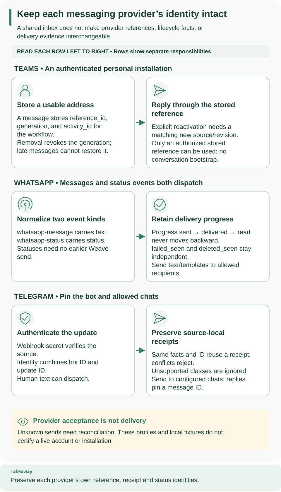

<!--
Copyright 2026 Firefly Software Foundation.

Licensed under the Apache License, Version 2.0 (the "License");
you may not use this file except in compliance with the License.
You may obtain a copy of the License at

    http://www.apache.org/licenses/LICENSE-2.0

Unless required by applicable law or agreed to in writing, software
distributed under the License is distributed on an "AS IS" BASIS,
WITHOUT WARRANTIES OR CONDITIONS OF ANY KIND, either express or implied.
See the License for the specific language governing permissions and
limitations under the License.
Author: Firefly Software Foundation
SPDX-License-Identifier: Apache-2.0
-->

# WhatsApp offline fixtures

**How to read this diagram:** Follow the middle WhatsApp row left to right.
Incoming text and status facts share a normalized envelope but carry different
data. Outbound acceptance and later delivery-status evidence remain separate.

These synthetic examples contain no credentials or live destination authorization.
They show the local profile's request and event shapes, not complete Meta onboarding.
`v26.0` is a provisional offline fixture, not a verified current WhatsApp version.
JSON files use protocol-required shapes and inherit this directory's license notice.

## Inspect the fixtures

| File | Purpose | What to check |
| --- | --- | --- |
| [connection.json](connection.json) | Complete connection creation-request shape | Published Connector version ID, provider asset mapping, recipient/template policy, and three distinct secret handles |
| [text.input.json](text.input.json) | `send-text` Action input | Only the allowed recipient and message text |
| [template.input.json](template.input.json) | `send-template` Action input | Configured template name, locale, and ordered body parameters |
| [status.webhook.json](status.webhook.json) | Synthetic raw provider status batch | The same message appears as read, sent, then delivered |
| [event-target.schema.json](event-target.schema.json) | Workflow target schema for normalized events | Both text and status envelopes are accepted; branch on `event_type` |

Read the status fixture in its listed order. It records three separate facts;
the projected progress remains `read` after the later `sent` and `delivered`
facts. `failed_seen` and `deleted_seen` are independent flags, not later rungs
on that progress sequence. The raw status fixture is not a normalized Workflow
input and has no authentication header: posting the file alone cannot establish
an authenticated admission.

## Continue from offline review

Use the [WhatsApp connector guide](../../../docs/connectors/whatsapp.md) for the
installed package identity, connection policy, provider assets, and Action setup.
Use [provider sources](../../../docs/reference/provider-sources.md) to create the
immutable inbound route after its connection and target activation exist.
The two Action input files do not start runs by themselves.

Replace placeholder asset and definition IDs only in an operator-reviewed working
configuration. Keep credential values in the secret provider and put only handles
in `secretRef`. A live check requires independently reviewed provider version and
account rules, an authorized installation, and explicit test recipients. Fixture
validation cannot prove template approval, token permissions, or delivery.
